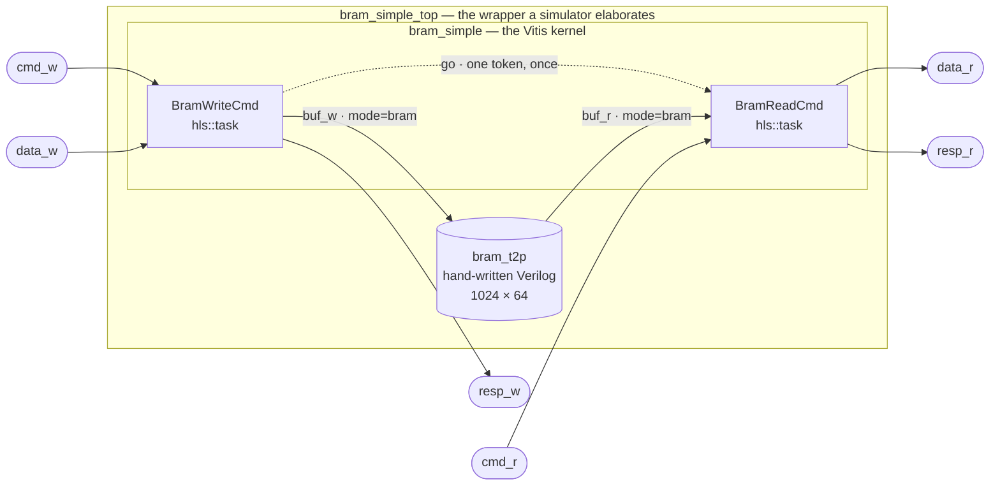

# Overview

This page covers *why* the memory is where it is, and *what* the design looks like. The
[Python model](python.md) covers how it is written.

## A BRAM here is not an array in a kernel

Waveflow's other memory examples put data in DRAM and reach it over an AXI4 memory-mapped master:
[`shared_mem`](../shared_mem/) hands the accelerator pointers, [`mem_copy`](../memcpy/) moves bulk
data between two of them. That is a **bus**, and the interesting parts of it are arbitration, bursts
and latency.

This example is the other storage category: **on-chip block RAM, shared between two modules of one
design**. There is no bus, no arbitration and no burst — one cycle, deterministic, unqueued. What
there *is* instead is a correctness problem the bus never has, because the two modules touch the same
words at the same time and nothing sequences them.

The uncomfortable fact is that this structure has no expression *inside* a Vitis kernel, and the
evidence is in [the interface guide](../../guide/interface/bram.md#why-a-shared-memory-cannot-live-inside-a-kernel):
a local array shared between two `hls::task` bodies compiles and means something else (a
synchronizing ping-pong whose handshake **stalls the writer**), and one `bram` port written by one
task and read by the other is a hard error. So the memory goes *outside*:



Three registrations make that picture, and each means something different:

| call | effect |
|---|---|
| `add_comp(wr)` / `add_comp(rd)` | children realized as `hls::task`s **inside** the generated kernel |
| `add_if(go_if)` | an internal channel → an `hls::stream` inside the kernel |
| `add_rtl_mod(mem)` | a module realized as hand-written Verilog **beside** the kernel |
| `add_rtl_if(w_if)` / `add_rtl_if(r_if)` | wrapper wires → the tasks' memory ports stay **boundary ports** |

The last row is the whole mechanism. `derive_boundary` reads the `add_if` registry and never sees a
`BramIF`, so `buf_w` and `buf_r` are simply child endpoints that are not bound to an internal
interface — which the existing rule already makes boundary ports of the kernel. A `BramIF` placed in
`add_if` instead would make the memory ports vanish into a FIFO that does not exist.

## The commands, and why both of them answer

Each side takes a `(pointer, count)` command as **two words** on its command stream, and answers with
one status word. That is more machinery than a buffer strictly needs, and both halves of it earn
their keep:

- A **write has no return path.** A command that does not fully land completes silently and leaves
  the memory half-written. `resp_w` is the only channel that can say otherwise.
- A **refused read returns zero words**, and zero words is indistinguishable from *"not yet"* on a
  stream. A consumer waiting for `n` words that will never arrive does not see an error; it sees a
  stream that has gone quiet. So the channel that reports the refusal has to be one that answers
  whether or not there is data — which is exactly what the data stream cannot be.

There are **two** statuses and no more: `ST_OK` and `ST_OUT_OF_RANGE`. A range that leaves the memory
(`p + n > depth`) is refused **whole** — not clipped, not wrapped — because a silent wrap hands back
plausible data from the wrong place. A refused *write* still consumes its payload, so the data stream
does not desynchronize behind it; the words are simply dropped.

> A third status — a legal range whose payload arrives short — has no scenario here and is
> deliberately absent. An unexercised branch in a teaching example is a branch the reader has to take
> on trust.

**The range check would not have caught the addressing bug**, and it is worth keeping the two apart.
The check is in **words**, the caller's units. The byte/word scaling defect lived *below* it, in the
wrapper: a command reading words 0…255 of 1024 passes the range check and still aliases. Two
different failures, two different guards — the range check is the caller's, and
`test_the_wrapper_undoes_the_shift_vitis_actually_emits` is the convention's.

## Ordering: one token, spent once

The witness got its ordering from a *testbench* — drive all 256 samples, then the addresses. A
concurrent BFM harness cannot do that, because every driver pushes from cycle 0. So the ordering
moves into the design, and it is one token on an ordinary internal stream: the writer emits it after
its first completed command, and the reader consumes it once before serving anything.

After that the reader is command-driven and the two tasks are **free to be live at the same time**.
That freedom is the point of a true-dual-port memory, and it is also what makes keeping the ranges
disjoint the *caller's* job rather than the design's.

## Overlap is legal here, and that is the interesting part

Scenario zero runs in two phases:

- **Phase 1 — no overlap.** The witness. Load 256 words, then read. Nothing else is live.
- **Phase 2 — deliberate overlap.** `write(64, 64)` runs *while* `read(0, 64)` is outstanding.
  Disjoint ranges, so it is legal.

Phase 2 is where "no hazard" stops being structural and becomes **conventional**. Compare
[`RfShotBuf`](../../guide/rf/), whose entire safety argument is that the reader and the writer are
*never* live at the same time; this design permits the overlap and hands the caller the obligation.

`bram_t2p.v` contains the guard for a caller who gets it wrong:

```verilog
if (a_en && |a_we && b_en && (a_addr[AW-1:0] == b_addr[AW-1:0]))
    $error("bram_t2p: read-during-write collision at addr %0d", a_addr[AW-1:0]);
```

**And in the XSI flow nothing can hear it.** That is measured, not suspected: `$display` from an
`always` block reaches neither stdout nor a file, an `initial $display` at time zero does not either,
and a non-null `logFileName` produces no log — only an `$fwrite` to a file the Verilog opens itself
works. Five shipped gates had been asserting the *absence* of that `$error` string, which could never
appear; all five are gone. The condition is checked in the waveform instead, and
[Reading the trace](timing.md#the-hazard-that-cannot-be-heard) is where.

## The geometry, and why 64 bits

| | value | why |
|---|---|---|
| word width | **64 bits** | Vitis's byte-address scaling is `>> 3` here, so the convention is exercised rather than assumed |
| depth | **1024 words** | a power of two: the Verilog indexes `mem[addr[AW-1:0]]`, and anything else aliases high addresses onto low ones |
| words written | **256** | fewer than the depth, so an off-by-one in the address arithmetic has somewhere to show — and *more* than `1024 / 8 = 128`, so a wrapper that does not undo the scaling aliases immediately |

That last row is the one `bram_toy` could not do. It is now retired into this example; its witness
survives as scenario zero.

## See also

- [BRAM — memory between modules](../../guide/interface/bram.md) — the interface itself, with the
  PIPO and dataflow-check evidence quoted in full.
- [Histogram with shared memory](../shared_mem/) — the *other* memory example: a bus, where
  arbitration and bursts are the point.
- [RF converter designs](../../guide/rf/) — where the same `BramIF` carries a sample buffer.
