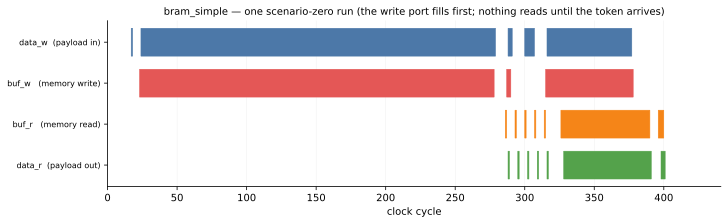
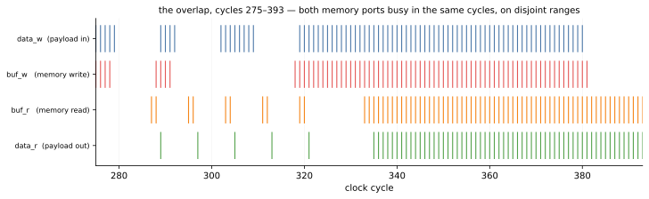

# Reading the trace

[RTL simulation](rtlsim.md) produced `bram_simple_top_trace.vcd`. This page reads it: what the design
did, whether it did anything it was not allowed to, how long the memory really takes to answer, and
how all of that compares with the Python model.

Unlike every other timing page in this tree, the lanes here are the **memory's own pins**. `buf_w`
and `buf_r` are wires of the *wrapper* — the join between the kernel's `mode=bram` ports and
`bram_t2p` — so a level-1 `$dumpvars` sees them, and the picture shows the memory being used rather
than inferring it from the streams at the boundary.

## One run, four lanes



Reading it left to right: the payload arrives, the write port is busy for 256 cycles, and **both read
lanes are empty the entire time**. That emptiness is the arming token doing its job — the reader is
blocked on `go` until the writer's first command completes. Then the answers start, and from roughly
cycle 320 the write and read lanes are busy *together*.

The event counts say the same thing more precisely, and one of them is a surprise:

```python
from pathlib import Path
from examples.bram_simple.bram_simple_build import hazard_manifest
from examples.bram_simple.bram_simple_figures import lanes

ll = lanes(Path("examples/bram_simple/xsi/bram_simple_top_trace.vcd"), hazard_manifest())
for label, ev, _colour in ll:
    print(f"{label:26s} {len(ev):4d} beats   first {ev[0]:3d}  last {ev[-1]:3d}")
```

```
data_w  (payload in)        332 beats   first  17  last 380
buf_w   (memory write)      324 beats   first  23  last 381
buf_r   (memory read)        80 beats   first 287  last 408
data_r  (payload out)        73 beats   first 289  last 409
```

**332 payload words in, 324 memory writes.** The eight missing writes are the refused command: its
payload was consumed off the stream — which is what keeps the stream in step — and then dropped. The
refusal is not just reported on `resp_w`; it is *visible in the waveform* as eight `data_w` beats
with nothing underneath them.

**80 read enables for 73 returned words.** Seven of the eight read commands return data, and each
presents one address past the end of its range as the pipeline drains. That extra enable is why the
read-latency measurement below skips addresses whose contents are unknown: word 256 was never
written, and at RTL a never-written word is `X`.

### The cycle numbers on this page are the waveform's

The figures and the scan count **rising edges from the start of the dump**, which includes the 16
reset cycles the harness holds before the run loop begins. The sinks' `cycles.bin` counts from the
first post-reset cycle instead. The two differ by a constant, and it is worth knowing which is which
before comparing a figure against a gate:

```python
import numpy as np
from pathlib import Path
from examples.bram_simple.bram_simple_build import hazard_manifest
from examples.bram_simple.bram_simple_figures import lanes

xsi = Path("examples/bram_simple/xsi")
vcd_beats = [ev for label, ev, _c in
             lanes(xsi / "bram_simple_top_trace.vcd", hazard_manifest())
             if label.startswith("data_r")][0]
sink = np.fromfile(xsi / "vectors" / "data_r" / "cycles.bin", dtype="<u8")
print("words:", len(vcd_beats), len(sink),
      "| offset:", sorted({int(d) for d in vcd_beats - sink}))
```

```
words: 73 73 | offset: [15]
```

Exactly 15 on every one of the 73 words. The gate's `394` and the figure's `409` are the same
instant.

## The overlap, beat by beat



The zoom is picked from the run rather than written down — the window is derived as the cycles in
which the read port is active inside the write port's span — so it cannot drift away from the thing
it is meant to show.

Three things are legible here that the whole-run view flattens:

- Around cycle 305 there is a group of `data_w` beats with **no** `buf_w` beat beneath them. That is
  the refused write, discarding its payload.
- Each single-word read is a *pair* of `buf_r` hairlines: the address it was asked for, and the one
  the pipeline presents behind it.
- From about cycle 326 onward, `buf_w` and `buf_r` fire in the **same cycles**, continuously. This is
  a true-dual-port memory doing the thing it exists for.

That overlap is asserted rather than admired, and in **cycles** — because the two ranges are
disjoint, so the returned words are identical whether the two overlapped or ran one after the other:

```python
import numpy as np
from pathlib import Path
from examples.bram_simple.bram_simple import WriteResp, resp_words, scenario_zero

sc = scenario_zero()
xsi = Path("examples/bram_simple/xsi")
data = np.fromfile(xsi / "vectors" / "data_r" / "cycles.bin", dtype="<u8")
resp_w = np.fromfile(xsi / "vectors" / "resp_w" / "cycles.bin", dtype="<u8")
lo, hi = sc.overlap_read
when = int(resp_w[resp_words(WriteResp, sc.overlap_write_resp + 1) - 1])
print(f"read window [{int(data[lo])}, {int(data[hi - 1])}], phase-2 write done at {when}")
print("overlapped:", int(data[lo]) <= when <= int(data[hi - 1]))
```

```
read window [320, 383], phase-2 write done at 370
overlapped: True
```

A sink timestamps every **word**, and a response is two of them — so the index goes through
`resp_words`, which asks the schema, rather than through a `2`. The response grew from one word to
two the day it gained a `tid`; a literal would not have noticed, and the index would have quietly
pointed into the middle of a message.

## The hazard that cannot be heard {#the-hazard-that-cannot-be-heard}

The design *permits* the overlap, so keeping the ranges disjoint is the caller's job. `bram_t2p.v`
carries the guard for a caller who gets it wrong — and **in this flow nothing can hear it**.

That is measured, not suspected. In the XSI shared-library flow (Vivado 2025.1, `xelab -dll` plus the
C++ loader), RTL text output is discarded: `$display` from an `always` block reaches neither stdout
nor a file, an `initial $display` at time zero does not either, and a non-null
`s_xsi_setup_info::logFileName` produces no log — although it *does* change the kernel's invocation
from `-nolog` to `-log <name>`, visible in `xsim.dir/<top>/xsimkernel.log`. Only an `$fwrite` to a
file the Verilog opens itself works, which is how the `$error`'s firings were counted in the first
place.

The cost was concrete: **five shipped XSI gates** asserted that the string
`"read-during-write collision"` was absent from a run's output — a string that could never appear —
and each read as positive evidence. All five have been removed.

So the **condition** is checked instead, from the waveform, using nets named by the emitter that made
them rather than matched by substring:

```python
from pathlib import Path
from examples.bram_simple.bram_simple_build import hazard_manifest
from waveflow.utils.bram_trace import describe, find_read_during_write

vcd = Path("examples/bram_simple/xsi/bram_simple_top_trace.vcd")
print(describe(find_read_during_write(vcd, hazard_manifest())))
```

```
no read-during-write collisions
```

### An empty scan is not a passing gate

No collisions is what a correct design looks like. It is *also* what a renamed net, a dump that never
ran, and a scan bound to the wrong scope look like. So the gate is a **pair**: scenario zero must come
back clean, and a scenario built to collide must come back dirty. `collision_scenario()` is the dirty
half, and on the run recorded here it produces **24** collisions on words 128–135.

Building that scenario turned out to be the interesting part, because **address overlap alone is not
a collision**. The memory's condition is `a_addr == b_addr` *in the same cycle*, and both tasks sweep
their range at one word per cycle — so two commands over the identical range are parallel lines in
(cycle, address) and never meet unless they happen to start in the same cycle. What makes them meet
is a relative phase that **moves**, so the scenario gives the writer and the reader command lengths
that differ by one word:

```python
from examples.bram_simple.bram_simple import collision_scenario

sc = collision_scenario()
w = [(int(c.waddr), int(c.nsamp)) for c in sc.cmd_w[1:]]
r = [(int(c.raddr), int(c.nsamp)) for c in sc.cmd_r]
print("writes:", w[0], "x", len(w), " reads:", r[0], "x", len(r))
print("ranges overlap:", max(w[0][0], r[0][0]) < min(w[0][0] + w[0][1], r[0][0] + r[0][1]))
print("lengths differ:", w[0][1] != r[0][1])
```

```
writes: (128, 8) x 48  reads: (128, 9) x 48
ranges overlap: True
lengths differ: True
```

Each round shifts the two by one cycle relative to each other, and within a few dozen rounds every
offset in the window has been visited. Both halves are gated in
`tests/examples/test_bram_simple_xsi.py`.

*The durable fix is neither a print nor a trace scan but a sticky `collision` output on the memory,
carried through the wrapper and readable in both backends by construction. That is a `BramIF`
interface change and is not done.*

## The read latency, measured off the memory's own pins

`bram_t2p.v` publishes `localparam READ_LATENCY = 1`, and Waveflow emits both the kernel's
`latency=1` pragma and the pysim model's delay from that one line. But that is two files agreeing,
not evidence about the hardware. The waveform can be asked directly: **at what distance from the
address does the answer appear?**

```python
from pathlib import Path
from examples.bram_simple.bram_simple import ADDRS, BASE, DEPTH, SENTINEL_BASE
from examples.bram_simple.bram_simple_build import hazard_manifest
from waveflow.utils.bram_trace import measured_read_latency, port_samples

def expected(addr):
    if addr < 64 or addr in ADDRS:
        return BASE + addr
    if DEPTH - 4 <= addr < DEPTH:
        return SENTINEL_BASE + (addr - (DEPTH - 4))
    return None                      # rewritten mid-run, or never written (X at RTL)

port = port_samples(Path("examples/bram_simple/xsi/bram_simple_top_trace.vcd"),
                    hazard_manifest(), "read")
print("offsets that explain every read:", sorted(measured_read_latency(port, expected)))
```

```
offsets that explain every read: [1]
```

A **set**, on purpose. One element is the number; more than one means the scenario cannot tell those
offsets apart; none means the answer never appears where the data says it should — a real defect
rather than an off-by-one in the measurement. And a single element is only *decidable* because the
payload is a ramp: with a constant payload every offset would fit, which is the same failure the ramp
prevents in the value check.

## And the pysim does **not** match — for free

A reader arriving from [`mem_copy`](../memcpy/timing.md) will expect a section called *"And the pysim
matches — for free."* That page can say it; this one cannot, and the difference is the whole of
objective 4.

**The throughputs match for free.** Both backends deliver the 64-word read at one word per cycle.
Nothing in the Python model was tuned to make that true — a `StreamIF` with a clock and an RTL loop at
II=1 simply agree.

**The first word does not.** It is off by exactly `READ_LATENCY` unless the model pays it:

```python
import numpy as np
from pathlib import Path
from examples.bram_simple.bram_simple import run_pysim, scenario_zero

sc = scenario_zero()
lo, hi = sc.cadence_read
rtl = np.fromfile(Path("examples/bram_simple/xsi/vectors/data_r/cycles.bin"), dtype="<u8")
off = run_pysim(sc=sc, model_read_latency=False)
on = run_pysim(sc=sc, model_read_latency=True)

def gaps(c):
    return sorted(set(np.diff(np.asarray(c)[lo:hi]).tolist()))

print("cycles per word   RTL", gaps(rtl), " pysim", gaps(on.data_r_snk.cycles))
print("first word moved by", int(on.data_r_snk.cycles[0]) - int(off.data_r_snk.cycles[0]),
      "when the model pays; the memory charges",
      int(on.dut.rd.buf_r.read_latency))
```

```
cycles per word   RTL [1]  pysim [1]
first word moved by 1 when the model pays; the memory charges 1
```

The correction is measured as the **cost of the model change**, not as absolute agreement between the
backends: pysim is a discrete-event model of the streams around the memory, not a cycle-accurate
model of the kernel, so its absolute cycle numbers are its own. What has to be exact is the *size* of
the correction.

**Why a memory is different from a bus.** `mem_copy`'s free match comes from calibrated models of an
`m_axi` bus and the mem-stream adaptors — components whose timing is a `(component, platform)`
property that ships with Waveflow. A BRAM has no such model and does not want one: its access is
deterministic, unarbitrated and one cycle, so a discrete-event model of it would add a SimPy timestep
and no fidelity. What that buys is a model with nothing to calibrate; what it costs is exactly one
cycle of pipeline fill, paid explicitly, once per command.

And it is a **fill**, not a per-word cost — which a first-word check alone would not catch. A model
paying the latency per *word* would match RTL on the first word and be 64 cycles late by the end of a
64-word read:

```python
import numpy as np
from examples.bram_simple.bram_simple import run_pysim, scenario_zero

sc = scenario_zero()
lo, hi = sc.cadence_read
for modelled in (False, True):
    c = np.asarray(run_pysim(sc=sc, model_read_latency=modelled).data_r_snk.cycles)
    print(modelled, sorted(set(np.diff(c[lo:hi]).tolist())))
```

```
False [1]
True [1]
```

## How the figures are committed and refreshed

Both SVGs on this page are **committed assets**, not rendered at build time. The workflow is the one
`mem_copy` and `shared_mem` use:

```bash
cd examples/bram_simple
python bram_simple_build.py --through rtl_trace          # the waveform
python bram_simple_build.py --through activity_figures   # -> results/ (gitignored)
python bram_simple_build.py --through sync_docs_figures  # -> docs/.../images/ (committed)
```

`SyncDocsFiguresStep` copies each figure named in an explicit manifest, so a docs figure only
changes when someone runs that step — and the change arrives as a reviewable `git diff` of the SVG
rather than as a silently different picture.

It also writes `images/sync_status.json` with each figure's source path and content hash. **That file
is not tracked** — a blanket `*.json` rule ignores it, here and for every other example that writes
one — so it is a *local* staleness signal you can check by hand, not a reviewable record. The
committed artifact is the SVG.

The SVGs are **deterministic**: `matplotlib.rcParams["svg.hashsalt"]` is fixed and the date metadata
is suppressed, so re-rendering an unchanged figure produces a byte-identical file. Without that, every
refresh would diff.

One caveat worth knowing: `rtl_trace` is *not* re-run just because the waveform on disk changed under
it. If you have run the `-m xsi` gate since — which leaves the **collision** vectors and the collision
waveform behind — force the step, or the figures will be of the wrong run:

```bash
python bram_simple_build.py --through sync_docs_figures --force-step rtl_trace
```

## See also

- [Python simulation](pysim.md) — the same measurements from the Python side.
- [BRAM — memory between modules](../../guide/interface/bram.md) — the interface, and the addressing
  convention the wrapper reconciles.
- [`mem_copy`'s timing page](../memcpy/timing.md) — the free match, and the calibration behind it.
- [Timing models](../../guide/timing_model/) — what a forward model is, and when a component needs
  one.
