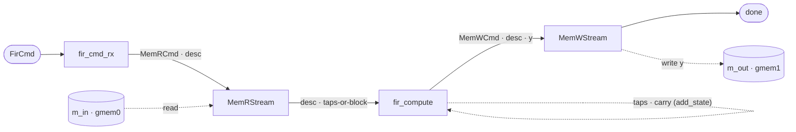

# Block FIR — a filter that remembers

`fir_block` computes an FIR filter over a stream of blocks:

```
y[i] = Σ h[k]·x[i−k]      k = 0 … T−1
```

Given `T` coefficients `h` and a block of `n` input samples, it produces `n` output samples. The host
issues commands; each command is one **firing** of the pipeline; each firing lands one completion on
`s_done`.

What makes it the next step after [`interleaver`](../interleaver/) is not the arithmetic — it is that a
firing is no longer self-contained.

## Why a filter needs memory between firings

Look at the first output of a block. `y[0]` needs `x[0], x[−1], x[−2], …, x[−(T−1)]` — and all but the
first of those arrived in the **previous** block. Nothing in the current firing's input contains them.

The same is true of the coefficients, for a different reason. `h` is not per-job data; it is
configuration, loaded once and used by every block after it. Re-sending `T` coefficients with every
block would work and would be absurd.

So a firing needs two things that outlive it:

| what | lifetime | written by | read by |
|---|---|---|---|
| `taps` — the `T` coefficients | **held** until replaced | a `LOAD_TAPS` firing | every `FILTER` firing |
| `carry` — the last `T−1` samples | **rewritten every firing** | every `FILTER` firing | the *next* `FILTER` firing |

Two flavours, two lifetimes, one module. That pairing is the reason this example is a filter and not
something smaller — a design with only one of them cannot show that the two are different, and
[`state_toy`](../../guide/memory/hwstate.md) (a running total) is exactly that single-flavour case.

Neither is a channel between components, and neither lives across a bus. Both are storage the module
owns, and both are declared with `add_state` — see [Cross-firing state](./state.md).

## The pipeline

Addresses mean `m_axi`, and a `hls::task` body cannot own an `m_axi` port
([the free-running rule](../../guide/comp_codegen/freerunning.md)). So `fir_block` is a **composite**,
in the same anatomy as `mem_copy` and `interleaver`:



Four stages, of which **two are framework components** — `MemRStream` and `MemWStream`, with their
shipped, XSI-verified timing — and two are the design's own:

- **`fir_cmd_rx`** reads one `FirCmd` off the plain host boundary and frames the reader's command
  stream as one read: `[MemRCmd | FirDesc]`, with the descriptor relayed as a header (`fwd_bursts=1`)
  so it arrives welded to its data and can never pair with the wrong burst.
- **`fir_compute`** is the whole custom design: it reads `[FirDesc | data]`, dispatches on the opcode,
  and frames the writer's stream. It is the only stage holding state.

Compared with the interleaver this is **shorter by two stages**, and the reason is worth noticing: the
interleaver needed `il_load` / `il_store` to land `X` in a block RAM, because a gather does *random*
access. A FIR is a **streaming** kernel — it touches each input once, in order — so there is nothing to
buffer and no stream-of-blocks anywhere in this design.

## One leaf, two opcodes

Both commands arrive over the same stream and are handled by the same task body, dispatched on
`FirDesc.op`:

| opcode | the `n` words are | state effect | writes back |
|---|---|---|---|
| `LOAD_TAPS` | coefficients | fills `taps` | **nothing** |
| `FILTER` | a block of samples | reads `taps`, rolls `carry` | `n` output samples |

Dispatch on an enum equality is inside the extractor's vocabulary (the same shape `poly` uses); ordering
comparisons are not. That is why the opcode is an `EnumField` reaching C++ as a real `enum` rather than
a bare integer.

Handling both in one leaf is a deliberate choice. The alternative — a separate tap-loader component —
buys nothing here and costs a second component plus a channel, because of the next point.

## The tap load does *not* overlap the compute

`LOAD_TAPS` and `FILTER` are separate firings of one task, strictly ordered by the command stream.
Job *n*'s coefficients are **not** staged while job *n−1* computes.

That is what keeps the taps *state* rather than a *channel*. The moment two firings overlap, the taps
stop being storage the module owns and become data handed between two components — which means a
[stream-of-blocks](../../guide/interface/sob.md), a second component, and a lock protocol whose
producer/consumer counts have to balance globally. A FIR gains very little from that overlap, and the
analysis (including why a conditionally-acquired lock passes C-sim and hangs in RTL) is written up in
`plans/add_state.md` rather than built.

## The firing that writes nothing

`LOAD_TAPS` consumes a block of coefficients and produces no output data. That sounds harmless and is
the single most dangerous shape in this design: a stage that reads without emitting has deadlocked this
codebase twice — once via the free-running pacing law, once via a relay that read a phantom word.

The resolution here is that the firing is **not silent**. It still frames a write command, with
`len = 0` and `fwd_bursts = 1`:

- the writer's store loop runs `for (w = 0; w < 0; …)` — it trips zero times, so no AXI transaction is
  issued at all;
- its echo loop still forwards the descriptor, so the job lands its completion on `s_done`.

Every job produces exactly one completion, and **the write side is uniform across both opcodes** —
there is no special path for the no-output case, which is precisely what makes it safe. The check in
the testbench asserts the completion *count and order*, not merely that the run finished, because a
deadlock here would look exactly like success.

{: .note }
> A zero-length write is a real command in this protocol, not a degenerate case. Making pysim agree
> with the RTL about it required a framework fix: the model drained its data stream unconditionally,
> and `get(nwords_max=0)` does **not** mean "read nothing" — it dequeues a whole burst and truncates
> the *result*, silently eating the next command.

## Samples, words, and packing

One more convention runs through the whole design. Commands and descriptors count **samples**; the
memory streams move **words**. At `LW = MEM_DW // W` samples per word those are different numbers, and
an `n`-sample block occupies `ceil(n / LW)` words.

Neither side hand-rolls that packing: the kernels use the generated
[`<stem>_array_utils`](../../guide/vectorization/hls/arrayutils.md) lane routines and the Python model
uses `DataArray.serialize`, which are one contract — so the numpy golden and the Vitis kernel agree
bit-for-bit at any `LW`. The packing factor is integer division, so an awkward width is not a problem:
`W = 18` gives `LW = 1`, `W = 16` gives 2, `W = 8` gives 4.

## Where to next

- [Cross-firing state](./state.md) — how `taps` and `carry` are declared, and where they land in the
  generated C++.
- [Fixed point](./fixedpoint.md) — the one format, and the accumulator the format algebra derives.
- [Python](./python.md) — the design in code.
