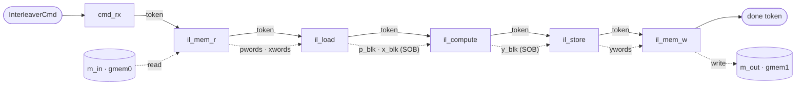

# Interleaver — a gather accelerator

`interleaver` computes a **gather**: `Y[i] = X[P[i]]`. Given an index vector `P` and a source vector
`X`, it produces `Y` by reading, for each output position `i`, the source element that `P[i]` points at.
It is the natural next step after [`mem_copy`](../memcpy/): where the data mover copies a buffer
unchanged, the interleaver *reorders* it under a permutation — so unlike `mem_copy` it has a real
**compute** stage, and that stage needs **random access** to `X`, which shapes the whole design.

A job names three buffers by word offset — `p_off` (the indices `P`), `x_off` (the source `X`), and
`y_off` (the output `Y`) — plus a length `n`, all carried in one `InterleaverCmd`. Coordinates are
**element/word indices**, not bytes: `LW` 32-bit elements pack into each `MEM_DW`-bit memory word
(`LW = 2` at `MEM_DW = 64`), so a run of `n` elements is `NW = n / LW` words.

## Why a gather is worth building

Reordering data by an index vector is one of the most common shapes in signal processing and
communications: the **bit-reversal** permutation of an FFT, the **interleaver** that spreads a codeword
across time in an error-correcting link (the design's namesake), a **matrix transpose**, or any
sparse/indexed lookup. The work is cheap arithmetically but murder on a CPU's cache — every `X[P[i]]` is
an unpredictable, cache-missing load. In fabric the picture flips: hold `X` in on-chip block RAM and the
random reads are single-cycle, so the gather runs at streaming throughput. That is the accelerator this
example builds — and the reason it makes a good vehicle for the parts `mem_copy` has no need of: a
custom compute kernel, on-chip random access, and **fitting that kernel's timing**.

## The six-stage structure

The design (`examples/interleaver/`) is a six-stage pipeline. Each stage is a **leaf `FreeRunComp`** — it
implements `run_iter` (one firing per job) and lowers to one `ap_ctrl_none` `hls::task`:

- **`cmd_rx`** — reads one `InterleaverCmd` off the boundary stream `s_cmd` and emits it as the per-job
  **token** (below). Owns no memory.
- **`il_mem_r`** — the `m_axi` **read** owner (`m_in`, bundle `gmem0`). Bursts `P` from `p_off` onto the
  `pwords` stream and `X` from `x_off` onto `xwords`. (It reads *two* regions per job — the seam that
  keeps it the interleaver's own adapter rather than a stock one-region reader; see *Building blocks*.)
- **`il_load`** — a stream→block bridge. Drains `pwords`/`xwords` and fills two on-chip blocks `p_blk`
  and `x_blk`, exposed as a [stream of blocks](../../guide/concurrency/python/sob.md).
- **`il_compute`** — the **gather** itself, and the design's only *custom compute* stage. Holds read
  locks on `p_blk` and `x_blk` and, for each output word, reads the packed index, does an
  index-driven **random** read of `x_blk`, and assembles the output word into `y_blk`. Block RAM makes
  the `X[P[i]]` reads single-cycle — the whole point of loading `X` into a block first.
- **`il_store`** — a block→stream bridge: reads `y_blk` and streams it out on `ywords`.
- **`il_mem_w`** — the `m_axi` **write** owner (`m_out`, bundle `gmem1`). Drains `ywords` and bursts `Y`
  to `y_off`, then emits the token on `s_done` **after** the write burst — a commit-timed completion.

The split of `n` into `NW = n / LW` words is a compile-time constant baked into every stage from one
`generate` parameter, so every block, burst, and loop bound is fixed at synthesis.

## Why a stream of blocks

This is the structural difference from `mem_copy`. A stream is consumed in order — you cannot reach back
into it — but the gather's defining move is `X[P[i]]`, an **arbitrary** index. So `X` cannot stay a
stream: `il_load` lands it in a block RAM, and `il_compute` reads that block at random. Exposing the
block as a **stream of blocks** (a ping-pong pair with a lock handshake) is what lets `il_load` fill the
next job's block while `il_compute` still reads this job's — overlap without a data race. `P` and `Y` ride
the same block mechanism so the stages share one uniform structure. (`mem_copy` needs none of this: a
copy touches every word once, in order, so it is pure streaming end to end.)

## Message forwarding: the per-job token

Every stage needs to know the job's coordinates, and the stages must stay in lock-step. Both fall out of
**forwarding one token**: `cmd_rx` emits the `InterleaverCmd`, and each stage **reads the token, then
writes it on to the next** before doing its work (five `cmd` hops in all). Three things ride on that:

- **Pacing.** A stage cannot start a job until the token reaches it, and it forwards the token as soon as
  it has read it. That holds exactly **one job in flight per stage** — which is what keeps a free-running
  (`ap_ctrl_none`) network of six tasks from filling to the depth at which such a pipeline deadlocks. It
  trades a little load/compute overlap for robustness at any job count (verified bit-exact at 8 and 16
  jobs).
- **Coordinates.** The token *is* the `InterleaverCmd`, so each stage simply reads the field it needs —
  `il_mem_r` uses `p_off`/`x_off`, `il_mem_w` uses `y_off`.
- **Completion.** `il_mem_w` emits the token on `s_done` after the store commits, so one done beat per job
  reports back to the host.

Note the contrast with `mem_copy`'s [in-band descriptor forwarding](../memcpy/memcpy.md#the-forwarding-chain):
there each stage *strips* the one descriptor addressed to it and relays the rest, an onion of typed
sub-commands. The interleaver forwards a **single token, whole**, through every stage — simpler, because
its stages are wired by dedicated data and block edges rather than one framed stream.

In all, eleven internal edges wire the six stages — **five** `cmd` token hops, **three** data streams
(`pwords`, `xwords`, `ywords`), and **three** stream-of-blocks (`p_blk`, `x_blk`, `y_blk`) — over **two**
`m_axi` bundles (`gmem0` read, `gmem1` write) and **two** boundary ports (`s_cmd` in, `s_done` out).

## Building blocks

The stage that matters for the rest of this section is **`il_compute`** — the gather is the interleaver's
**own** kernel, so unlike the framework mem-streams its timing does **not** ship: the design fits it. That
is the half of the [calibration story](../../guide/calib/) `mem_copy` has none of, and the through-line of
the later pages.

The two `m_axi` adapters, `il_mem_r` and `il_mem_w`, are at present the interleaver's **own** stream↔m_axi
owners rather than the framework [`MemRStream` / `MemWStream`](../../guide/calib/component_residual.md) that
`mem_copy` composes — because `il_mem_r` reads *two* regions (`P` and `X`) per job, where the stock reader
moves one. Adopting the framework mem-streams (so the interleaver inherits their shipped timing the way it
already reuses the platform bus law) is a planned refinement, noted where it lands.

**Source:** [`examples/interleaver/`](../../../examples/interleaver/).
