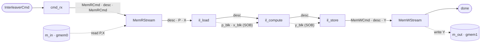

# Interleaver — a gather accelerator

`interleaver` computes a **gather**: `Y[i] = X[P[i]]`. Given an index vector `P` and a source vector
`X`, it produces `Y` by reading, for each output position `i`, the source element that `P[i]` points at.
It is the natural next step after [`mem_copy`](../memcpy/): where the data mover copies a buffer
unchanged, the interleaver *reorders* it under a permutation — so unlike `mem_copy` it has a real
**compute** stage, and that stage needs **random access** to `X`, which shapes the whole design.

A job names three buffers by word offset — `p_off` (the indices `P`), `x_off` (the source `X`), and
`y_off` (the output `Y`) — plus a length `n`, all carried in one `InterleaverCmd`. Coordinates are
**element/word indices**, not bytes: `LW` 32-bit elements pack into each `MEM_DW`-bit memory word
(`LW = 2` at `MEM_DW = 64`), so a run of `n` elements is `NW = n / LW` words.

## Why a gather is worth building

Reordering data by an index vector is one of the most common shapes in signal processing and
communications: the **bit-reversal** permutation of an FFT, the **interleaver** that spreads a codeword
across time in an error-correcting link (the design's namesake), a **matrix transpose**, or any
sparse/indexed lookup. The work is cheap arithmetically but murder on a CPU's cache — every `X[P[i]]` is
an unpredictable, cache-missing load. In fabric the picture flips: hold `X` in on-chip block RAM and the
random reads are single-cycle, so the gather runs at streaming throughput. That is the accelerator this
example builds — and the reason it makes a good vehicle for the parts `mem_copy` has no need of: a
custom compute kernel, on-chip random access, and **fitting that kernel's timing**.

## The six-stage structure

The design (`examples/interleaver/`) reuses the **framework** memory adaptors `mem_copy` composes — the
`MemRStream` / `MemWStream` in-band mem-streams — and adds only the stages a gather actually needs. Each
stage is a **leaf `FreeRunMod`** (one firing per job, one `ap_ctrl_none` `hls::task`):

- **`cmd_rx`** — the schema-aware **framer** (`mem_copy`'s `Sequencer` role). It reads one
  `InterleaverCmd` off the boundary stream `s_cmd` and frames the reader's command stream as **two
  reads**: `[MemRCmd(p_off, nw, fwd=1) | InterleaverCmd | MemRCmd(x_off, nw, fwd=0)]`.
- **`MemRStream`** (framework, in-band) — the `m_axi` **read** owner (bundle `gmem0`). It fires twice:
  the first read relays the `InterleaverCmd` as a header, then bursts `P`; the second bursts `X`. Its
  output is `[InterleaverCmd | P | X]`. (Issuing N reads per job through the one read owner is the
  **transactional-arbiter** model — see [Message forwarding](#message-forwarding-the-in-band-descriptor).)
- **`il_load`** — a stream→block bridge. Reads the descriptor (→ `nw`), lands `X` and `P` in two on-chip
  blocks `x_blk` / `p_blk` exposed as a [stream of blocks](../../guide/interface/sob.md), and
  forwards the descriptor.
- **`il_compute`** — the **gather** itself, the design's only *custom compute* stage. Holds read locks
  on `p_blk` / `x_blk` and, for each output word, reads the packed index and does an index-driven
  **random** read of `x_blk`, assembling the result into `y_blk`. Block RAM makes the `X[P[i]]` reads
  single-cycle — the whole reason for loading `X` into a block first.
- **`il_store`** — the second schema-aware stage. Reads `y_blk` and frames the writer's stream
  `[MemWCmd(y_off, nw, fwd=1) | InterleaverCmd | Y]`.
- **`MemWStream`** (framework, in-band) — the `m_axi` **write** owner (bundle `gmem1`). Drains the data,
  bursts `Y` to `y_off`, and echoes the `InterleaverCmd` on `s_done` **after** the write commits — the
  commit-timed completion.

`NW = n / LW` is a compile-time constant baked into every stage from one `generate` parameter, so every
block, burst, and loop bound is fixed at synthesis.

## Why a stream of blocks

This is the structural difference from `mem_copy`. A stream is consumed in order — you cannot reach back
into it — but the gather's defining move is `X[P[i]]`, an **arbitrary** index. So `X` cannot stay a
stream: `il_load` lands it in a block RAM, and `il_compute` reads that block at random. Exposing the
block as a **stream of blocks** (a ping-pong pair with a lock handshake) is what lets `il_load` fill the
next job's block while `il_compute` still reads this job's — overlap without a data race. `P` and `Y` ride
the same block mechanism so the stages share one uniform structure. (`mem_copy` needs none of this: a
copy touches every word once, in order, so it is pure streaming end to end.)

## Message forwarding: the in-band descriptor

The interleaver forwards its command exactly the way `mem_copy` does — **in-band**, so the *same*
framework mem-streams serve it with no change. `cmd_rx` and `il_store` are the only schema-aware stages;
`MemRStream` and `MemWStream` relay opaquely. Three properties ride on the descriptor flow:

- **The reader loads P *and* X with two reads.** `MemRStream` moves one region per firing, so `cmd_rx`
  frames **two** `MemRCmd`s and the reader fires twice — the transactional-arbiter model, where a
  consumer issues N reads per job through the single read owner. The header trick carries the descriptor:
  `MemRCmd(p_off, fwd_bursts=1)` tells the reader to relay the following burst — the `InterleaverCmd` —
  *before* it appends the P data, so the descriptor arrives welded to the front (`[descriptor | P | X]`);
  the second read uses `fwd_bursts=0` (relay nothing). `il_load` splits the two bursts by count (`nw` →
  `p_blk`, `nw` → `x_blk`). The `fwd_bursts=0` read relies on the reader's `if (nfwd > 0)` relay guard —
  without it a bare `do-while` relays one *phantom* word and the pipeline deadlocks or corrupts; the
  guard (which `MemWStream` always had) is what makes multi-read-per-job work. Nothing else in the
  framework changed.
- **Pacing, for free.** A free-running (`ap_ctrl_none`) pipeline deadlocks if nothing throttles it; the
  in-band descriptor is that throttle — each stage waits for its descriptor, one job in flight — exactly
  as in `mem_copy`. There is **no separate token**: the `InterleaverCmd` rides the reader's stream to
  `il_load`, then a short edge through `il_compute` to `il_store`, which reframes it for the writer.
- **Completion.** `MemWStream` buffers the echoed `InterleaverCmd` across the store and emits it on
  `s_done` afterward — one commit-timed done per job.

So the internal edges are: three **framed** mem-stream edges (framer→reader, reader→load, store→writer),
two plain descriptor edges through the middle (load→compute→store), and three **stream-of-blocks**
(`p_blk`, `x_blk`, `y_blk`) — over **two** `m_axi` bundles and **two** boundary ports (`s_cmd`, `s_done`),
the same framed-FIFO shape `mem_copy` generates.

## Building blocks

The stage that matters for the rest of this section is **`il_compute`** — the gather is the interleaver's
**own** kernel, so unlike the framework mem-streams its timing does **not** ship: the design fits it.
That is the half of the [calibration story](../../guide/calib/) `mem_copy` has none of, and the
through-line of the later pages.

Everything else is reuse. The `m_axi` adaptors are the framework
[`MemRStream` / `MemWStream`](../../guide/timing_model/component_residual.md) — so the interleaver inherits
their shipped, calibrated timing exactly as it already reuses the platform bus law, and *only* the
compute needs fitting. `cmd_rx` and `il_store` are thin schema-aware framers (`mem_copy`'s `Sequencer`
pattern); `il_load` is the one stream↔block bridge the gather's random access requires.

**Source:** [`examples/interleaver/`](../../../examples/interleaver/) — the in-band design is
`interleaver_inband.py`.
