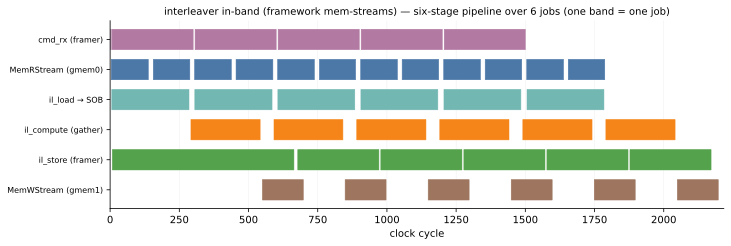

# Timing in the pysim

The interleaver's [loosely-timed pysim](./timing_model.md) charges **modeled** delays and lets
backpressure emerge from the bounded FIFOs between stages — fast, functional, no toolchain. This page is
what it measures and the pipeline-activity plot it produces; the [next page](./rtltiming.md) measures the
**actual RTL** timing and compares the two (they agree to ≈1%).

## What the pysim measures

The pysim never runs the RTL. Each stage's cost is a loaded model:

- the **bus law** — each `m_axi` transfer's cost, `nwords + (num_trans − 1)` cycles per read
  ([`BusCalib`](../../guide/timing_model/bus_model.md));
- the **mem-stream residuals** — the reader's ≈15-cycle and writer's ≈22-cycle own control cost, on top of
  the bus term ([the mem-stream residual](../../guide/timing_model/memstream.md));
- the **compute loop model** — the gather's `cycles = n` ([the timing model](./timing_model.md)).

Each free-running stage records a per-firing `fire_log`, and the whole run lands at **300 cyc/job**.

## The pipeline at a glance



Every stage on one cycle axis, six jobs, rendered straight from the pysim `fire_log`s. Reading it top to
bottom is reading the dataflow — one job descends the stack:

- **`cmd_rx`** receives the `InterleaverCmd` and frames **two** reads (P then X) for the reader.
- **`MemRStream` (gmem0)** — the **two bands per job** are those two reads; it is busy almost continuously,
  and it is the **bottleneck** (moving `P` and `X` over one bus).
- **`il_load`** lands `P` and `X` into the on-chip stream-of-blocks.
- **`il_compute`** runs the gather `Y[i] = X[P[i]]` — its band has visible **slack** (256 of the ≈300-cycle
  job), the one stage this design calibrates itself, *not* on the critical path.
- **`il_store`** frames the writer's stream `[MemWCmd | Y]`.
- **`MemWStream` (gmem1)** bursts `Y` to memory and echoes the done.

**The bands are occupancy, not work.** A band is a stage's firing window — from when it starts a firing to
when it commits — so for a free-running stage it includes time spent **stalled on backpressure**, not just
its own compute. `cmd_rx` is the clearest case: it does about **5 cycles** of real work (build two
commands), but its steady-state band fills the whole ≈300-cycle job — because it cannot dispatch the next
job's commands until `MemRStream` has taken this one. The long bar is *throttling*, not effort. The reader's
own two bands, by contrast, are close to solid work: it is the bottleneck, so nothing downstream throttles
it. (The thin seam between consecutive bands is only a legibility device, so you can count the jobs.)

## The build DAG

> **How to regenerate it.** The figure has a two-rung build DAG, run through the standard CLI:
>
> ```bash
> python examples/interleaver/interleaver_figures.py               # pysim -> timeline -> figure
> python examples/interleaver/interleaver_figures.py --list-steps  # interleaver_source, pysim, figures, rtl_timing
> ```
>
> `InterleaverPySimStep` runs the fully-calibrated pysim, checks the gather golden, and writes the per-stage
> timeline to `results/interleaver_pysim.json`; `InterleaverFiguresStep` **consumes** that artifact and
> renders the SVG — it does not re-run the sim. The source is the **pysim** timeline: deterministic and
> toolchain-free, so the committed SVG regenerates anywhere (including CI, where Vitis/`xsim` are absent) and
> a re-run is a no-op unless the timeline moved. Each stage's `fire_log` (its per-firing `(start, end)`
> windows) becomes one [`ActivityDiagram`](../../guide/timing/activity.md) lane:
>
> ```python
> lanes = []
> for stage, label, colour in stages:
>     # each firing window -> a run of active cycles (a small seam trimmed off the end, for legibility)
>     runs = [np.arange(round(s), round(e) - seam) for s, e in stage.fire_log]
>     lanes.append((label, np.concatenate(runs), colour))
>
> ad = ActivityDiagram(lanes, time_unit="cycle")
> fig, _ax, _ = ad.plot(mode="band", ...)              # activity bands, not per-transition value boxes
> ```

The same `ActivityDiagram` could instead be fed an RTL trace's `component_firings` (the ground-truth view
[`mem_copy`](../memcpy/timing.md) uses), but the committed figure stays on the pysim timeline for exactly
the reason above — and the RTL timing is where the [next page](./rtltiming.md) goes, to *check* it.

## Next: does it match the RTL?

The 300 cyc/job is the model's number. [RTL timing and the comparison](./rtltiming.md) measures the real
RTL cadence from a trace and puts the two side by side.

## See also

- [The timing model](./timing_model.md) — the per-stage models the pysim charges.
- [RTL timing and the comparison](./rtltiming.md) — the RTL measurement and the cadence table.
- [Activity Diagrams](../../guide/timing/activity.md) — the renderer behind the figure.
