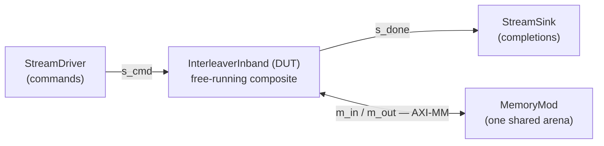

# Testbench (Python)

The testbench is the **graph that surrounds the design** and drives it in pysim — a fast SimPy
simulation, no toolchain. It puts a participant on every boundary port of the `InterleaverInband`
composite, wires them with the same `Interface` objects the design uses internally, runs the SimPy
model, and checks the gather golden `Y[i] = X[P[i]]` bit-exact. This is the **functional golden** —
the same scenario the [RTL simulation](./rtlsim.md) later drives through real RTL.

**Source:** [`examples/interleaver/interleaver_sim.py`](../../../examples/interleaver/interleaver_sim.py) —
the whole harness is one function, `run_interleaver`.

## The surrounding graph

`InterleaverInband` exposes four boundary ports (`s_cmd`, `m_in`, `m_out`, `s_done`), so the testbench
puts something on each: a source for commands, a sink for completions, and one shared memory behind the
two `m_axi` bundles.



All three participants are **framework** classes — you do not write them (see
[Stream drivers and sinks](../../guide/sim/stream_tb.md)):

| participant | what it does |
|---|---|
| [`StreamDriver`](../../guide/sim/stream_tb.md) | plays a burst bundle of `InterleaverCmd` words onto `s_cmd` |
| [`StreamSink`](../../guide/sim/stream_tb.md) | drains the echoed `IlDesc` completions off `s_done` |
| `MemoryMod` | the one arena **both** `m_axi` bundles reach — `m_in` reads `P` and `X`, `m_out` writes `Y` |

The memory being *one* component behind *two* bundles is what makes the read master (`m_in` → gmem0)
and the write master (`m_out` → gmem1) touch the same words. The two masters are joined onto the single
memory slave through a crossbar:

```python
    xbar = AXIMMCrossBarIF(sim=sim, clk=clk, nports_master=2, nports_slave=1, bitwidth=mem_dwidth)
    xbar.bind("master_0", il.m_in)          # MemRStream.m_mem (gmem0 read)
    xbar.bind("master_1", il.m_out)         # MemWStream.m_mem (gmem1 write)
    xbar.bind("slave_0", mem.s_mm)
    assign_address_ranges([mem.s_mm], [(0, arena * bpw)])
```

`assign_address_ranges` gives the slave its address window (`0 .. arena * bpw`), so a master's burst
address resolves to a word in the arena.

### The arena layout

The memory is a flat `MemoryMod`; the harness carves it into per-job `P` / `X` / `Y` buffers by
word offset. Each job gets three `nw`-word regions laid back to back — `nw = ceil(n / LW)`, `LW = 2` at
`MEM_DW = 64` — so job `j` starts at `base = j * 3 * nw`:

```python
    base = j * 3 * nw
    pw, xw, yj = base, base + nw, base + 2 * nw          # P, X, Y word offsets
```

The harness **seeds** the backing store directly (byte-addressed, `_pack`ing the 32-bit elements into
`MEM_DW` words): `P` is a fixed permutation `(arange(n) * 13 + 5) % n`, `X` a per-job hashed pattern
(`arange(n) * 2654435761 + 12345 + j * 7919`). `Y` is left for the DUT to write and is **checked**
afterward. The golden is `Y[i] = X[P[i]]`, held as `expected`:

```python
    P = ((np.arange(n) * 13 + 5) % n).astype(np.uint32)      # permutation (j-independent)
    mem._mem.write(pw * bpw, _pack(P, lw))                   # seed P
    mem._mem.write(xw * bpw, _pack(Xj.astype(np.uint32), lw))  # seed X
    cmds.append(InterleaverCmd(p_off=pw, x_off=xw, y_off=yj, n=n))
    expected.append((yj, _pack(Xj[P].astype(np.uint32), lw)))  # golden Y[i]=X[P[i]]
```

`P` a real permutation (not the identity) is what makes this a *gather* rather than a copy — a bug that
dropped the index math would still pass an identity `P`, so `expected` is computed as `Xj[P]`, exercising
the reorder.

## Driving it

Each `InterleaverCmd` is serialized to words and written as a **burst bundle**; the `StreamDriver` loads
that file in its `pre_sim` (the file-driven driver — one path both backends read):

```python
    words = [np.asarray(c.serialize(word_bw=mem_dwidth), dtype=np.uint64) for c in cmds]
    _vd = tempfile.TemporaryDirectory()
    write_burst_bundle(words, Path(_vd.name) / "cmd")
    driver = StreamDriver(sim=sim, bitwidth=mem_dwidth, in_bundle="cmd", root=Path(_vd.name))
```

Because the driver loads the bundle in `pre_sim`, the temp dir must **outlive `run_sim`** — that is why
`_vd` is held in a local rather than a `with` block.

The done stream is **framed** (`has_tlast`) because the in-band `MemWStream` echoes the descriptor: it
buffers the `IlDesc` across the store and emits it on `s_done` after the write commits. The sink is
matched to whatever the composite exposes, so it drains framed records:

```python
    done_sink = StreamSink(sim=sim, bitwidth=mem_dwidth,
                           has_tlast=bool(getattr(il.s_done, "has_tlast", False)))
```

The two streams are then wired with `StreamIF` (`driver → s_cmd`, `s_done → done_sink`), exactly as the
design wires its internal edges. Notice what is *not* here: no clock or reset driving, no handshake
logic, no per-cycle stepping. Those are the framework's job — you described *what* connects to *what*.

## Running and checking

`sim.run_sim()` drives every registered `SimObj` through `pre_sim` → `run_proc` → `post_sim`. Then each
job's `Y` region is read back and compared **bit-exact** against the golden, and the completion count is
asserted:

```python
    for j, (yj, exp_words) in enumerate(expected):
        got = mem._mem.read(yj * bpw, nw).astype(np.uint64)
        job_ok = np.array_equal(got, exp_words)          # every output word == X[P[i]]
        ...
    ndone = len(done_sink.words)
    assert ok, f"{comp_class.__name__} mismatch (Y != X[P])"
    assert ndone == nj, f"expected {nj} done tokens, got {ndone}"
```

Both checks matter. The region compare catches a wrong address, a short burst, a dropped word, or a
botched permutation. The done-token count catches what the compare cannot see: a job that gathered
correctly but never reported — which at the RTL rung would hang a host waiting on a completion that
never arrives.

The convenience entry `run_and_check` runs the canonical scenarios (`run_interleaver(nj=1)` then
`nj=3`, back-to-back jobs) and prints the pysim golden line.

## The timeline

`il.gather` is the `il_compute` stage, and `il.gather.job_end_cyc` is the per-job **completion
timeline** — the cycle each job's gather commits:

```python
    per_job = [round(c) for c in il.gather.job_end_cyc]
```

With the platform's calibrated models loaded (`platform_dir` puts the shipped bus law on the memory
slave; `compute_calib_dir` points the gather's loop model at a fitted `params.json`), the run settles at
a steady **≈300 cycles/job** — the reader moving `P` and `X` over one bus is the bottleneck, and the
gather itself has slack. That timing story — what each stage's model charges and how the number
decomposes — is the [Timing in the pysim](./pytiming.md) page; this page is only the correctness golden.
With both calibration dirs left `None` (the default), the timeline is still produced but uncalibrated —
the fast functional path.

## Mixed sizes

The same harness runs jobs of **different** lengths — `run_interleaver_sizes(sizes, ...)` takes a
per-job element count, lays each job's `P` / `X` / `Y` regions in the flat arena at its own `nw`, and
checks `Y[i] = X[P[i]]` for every job. This works because the length `n` rides the in-band `IlDesc`
descriptor, so the RTL is **scenario-independent** — `n` comes from the descriptor at runtime, not baked
into the design (the blocks are merely sized for `n_max`). That variable-length property is the whole
point of the in-band descriptor, and the mixed-size run is its proof.

## Next

- [DUT codegen](./codegen_dut.md) — how the `InterleaverInband` graph becomes the `ap_ctrl_none`
  `hls::task` top.
