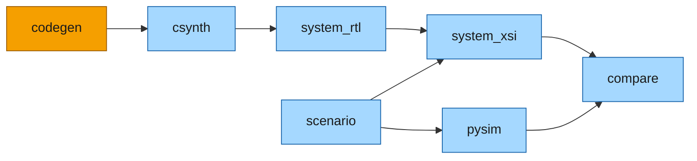

# Build flow

Everything after [The system](system.md) and [Python simulation](pysim.md) -- generating the C++,
synthesizing it to Verilog, and simulating the whole system at RTL against pysim -- is one
[`BuildDag`](../../guide/build/index.md), in
[`examples/markov/markov_build.py`](../../../examples/markov/markov_build.py). The point is how little
of it is the example's:



*Orange: the example's step. Blue: the framework's, added by one call. `scenario` is framework, but
what it writes -- the jobs -- comes from the example's `system()`.*

## Before you start

- **pysim works.** Everything here derives from `MarkovSystem(link="mm")`; if it does not run bit-exact
  in Python ([Python simulation](pysim.md)), nothing below will.
- **Vitis HLS** for csynth, **Vivado** for the crossbar IP (`create_ip`) and the simulation (`xsim`), and
  a C++ compiler -- the mingw `g++` that ships with Vivado on Windows, the system `g++` on Linux. The
  pysim side (`--through pysim`) needs none of them.

## The scenario and the system

```python
TOP, XBAR_NAME, WORK_DIR, WORKSPACE = "markov_top", "xbar_markov_4x3", "xsi_work", "markov"
NJOBS, NSTEPS = 4, 300

def scenario_jobs() -> list[dict]:
    return default_jobs(NJOBS, NSTEPS)

def system() -> MarkovSystem:
    return MarkovSystem(jobs=scenario_jobs(), link="mm")
```

`system()` is the **same object pysim runs**, on the gate's scenario: four jobs of 300 steps.
Everything below starts from it. Nothing names the synthesized modules or where their Verilog is: the
four HLS tops are derived from the system's cut. The top and crossbar names are given only so the
generated crossbar IP's cache holds.

## The DAG

```python
def build_dag(probes: bool = False, work_dir=WORK_DIR) -> BuildDag:
    sysm = system()
    dag = BuildDag()
    dag.add(MarkovCodegenStep(name="codegen"))
    add_system_steps(dag, sysm, work_dir=work_dir, top=TOP, xbar_name=XBAR_NAME, workspace=WORKSPACE,
                     probes=timing_probes(sysm) if probes else None)
    dag.add(MarkovFiguresStep(name="markov_figures"))
    dag.add(SyncDocsFiguresStep(name="sync_docs_figures"))
    return dag
```

`codegen` is the example's step: the headers, the two kernel tops and the two bus-writer tops, each
with its `.tcl` (`generate()`). [`add_system_steps`](../../../waveflow/build/system_dag.py) adds the rest
from the system object alone. Each step is described in general on
[XSI system simulation](../../guide/build/xsi_system.md#running-it); here is what each does for this
system, and the page that covers it:

| step | what it does here | page |
|---|---|---|
| `codegen` | the C++ sources: `gen/<top>.cpp` and `.tcl` for four tops, the schema headers, the lane routines | [Code generation](codegen.md) |
| [csynth](../../guide/build/xsi_system.md#csynth) | Vitis on each of the four tops, each re-run only when its source stamp no longer matches | [Synthesis](synth.md) |
| [system_rtl](../../guide/build/xsi_system.md#system-rtl) | the crossbar IP (`create_ip`, cached) and `markov_top.v`, walked from the graph | [Synthesis](synth.md) |
| [scenario](../../guide/build/xsi_system.md#scenario) | `MarkovHost` writes its four jobs as a burst bundle, the one file both hosts read | [XSI testbench](xsi.md) |
| [pysim](../../guide/build/xsi_system.md#pysim) | the same system in pysim, from that file: the host's traces and its cycle count | [XSI testbench](xsi.md) |
| [system_xsi](../../guide/build/xsi_system.md#system-xsi) | the harness around `MarkovHost`'s C++ twin, compiled with the RTL and run under XSI; `report.json` | [XSI testbench](xsi.md) |
| [compare](../../guide/build/xsi_system.md#compare) | every host endpoint's trace, RTL against pysim, file for file | [XSI testbench](xsi.md) |

The two figure steps beside them draw the docs figure from the golden model; nothing depends on them.

## Running it

```bash
python -m examples.markov.markov_build                       # everything, through compare
python -m examples.markov.markov_build --through pysim       # the software side only: no Vivado
python -m examples.markov.markov_build --through csynth      # the four tops' Verilog, stop there
python -m examples.markov.markov_build --through system_rtl  # all the system's RTL, not simulated
python -m examples.markov.markov_build --status              # what is stale, and why
python -m examples.markov.markov_build --synth check         # fail on a stale top, never synthesize
python -m examples.markov.markov_build --probes              # the top with timing probes
```

**What a second run skips.** `codegen` always runs (seconds) and rewrites `include/` and `gen/`, usually
with the same bytes. `csynth` does not go by those files' times: each top's stamp records the content of
the sources it was built from, so the same bytes mean nothing to synthesize, and `csynth` reports
UP-TO-DATE. The steps after it always run -- they read Python and C++ the DAG cannot see, and each is
seconds, or the simulation itself. The general rule is
[a hook each step answers late](../../guide/build/xsi_system.md#freshness).

**Where a run lands**: `xsi_work/markov/` (`xsi_work/markov_probes/` with probes) holds `markov_top.v`
and `rtl.json` (the RTL the top compiles), the scenario, `report.json` (the host's report: `DONE`, the
bus operations), `pysim.json`, `compare.json`, and both sets of traces. `system_xsi.load_run(...)` reads
them back as an `XsiRun`.

The next three pages follow the steps: [Code generation](codegen.md) turns the pysim objects into C++,
[Synthesis](synth.md) turns that C++ and the bus into Verilog, and [XSI testbench](xsi.md) puts the
Verilog under a testbench driven by the host's C++ twin.
