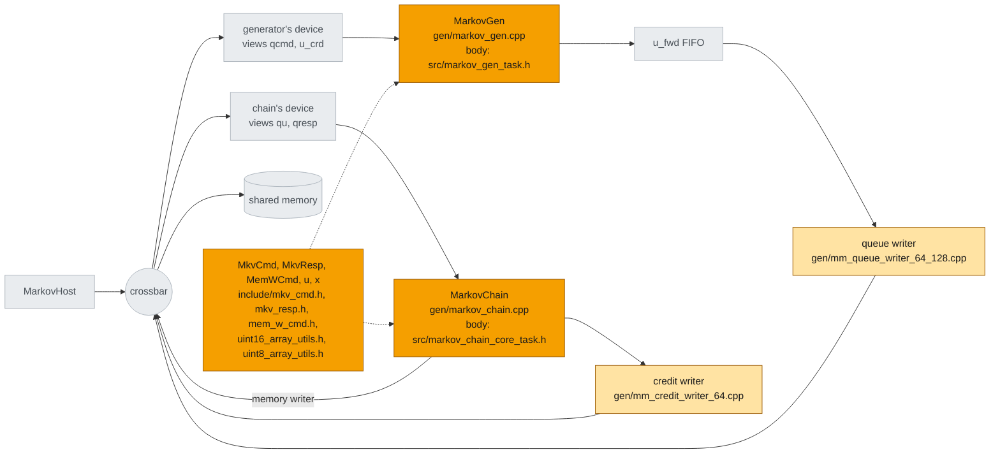

# Code generation

The first step of the [build flow](build.md), `codegen`, turns the pysim objects that become hardware
into C++ for Vitis HLS. It is Python only and takes seconds:
`python -m examples.markov.markov_build --through codegen`. Fig. 1 is the system's pysim graph (the
objects of [The system](system.md)), with what `codegen` generates for each object.



*Fig. 1 -- what `codegen` generates. Orange: from the example's own modules and schemas (only the two
kernel bodies are written by hand, in `src/`). Light orange: the credit link's two bus writers, framework
templates the routed link brings with it. Grey: nothing to generate here -- the crossbar, the devices,
the FIFO and the memory become Verilog in [Synthesis](synth.md), and the host becomes C++ in
[XSI testbench](xsi.md).*

Each `.cpp` comes with a `.tcl` beside it in `gen/`, the script csynth runs. `include/` and `gen/` are
build output, so deleting them makes a clean build. Four tops, then, which the next step
([csynth](synth.md#csynth)) synthesizes:

| top | what | written by hand | II | estimated clock (10 ns target) |
|---|---|---|---|---|
| `markov_gen` | the generator | its body, `src/markov_gen_task.h` | 1 | 6.8 ns |
| `markov_chain` | the chain core + the in-band memory writer | the core's body, `src/markov_chain_core_task.h` | 1 | 6.6 ns (core) |
| `mm_queue_writer_64_128` | the credit link's queue writer | nothing (framework) | -- | 7.3 ns |
| `mm_credit_writer_64` | the credit link's credit writer | nothing (framework) | -- | 7.3 ns |

Everything else is generated from the Python: the `MkvCmd` / `MkvResp` / `MemWCmd` structs from their
schemas, the `uint16` / `uint8` lane routines that pack draws four to a word and states eight, and each
free-running top from the module's ports. The chain's top instantiates two tasks -- the core and the
framework's `mem_w_stream_framed_done_task` -- joined by a framed FIFO, because `MarkovChain` is a
composite. The two writers' tops take their peer's address as a stable input wire (`target`), which
the system top drives.

## The bodies: one job per firing

Both bodies follow the [command-response pattern](../../guide/patterns/command_response.md) and read
like their Python `run_iter`: read the command, then per chunk a loop of one step per cycle, then the
answer. The generator:

```cpp
    MkvCmd cmd;
    cmd.read_stream<DW>(s_cmd);                                   // 1. the command
    ...
    crd.wait_room(m_u_crd, CW);                                 // 2. forward it, when it fits
    cmd.write_axi4_stream<DW>(m_u_fwd);
    crd.sent(CW);

CHUNKS: for (ap_uint<32> k0 = 0; k0 < n; k0 += CHUNK) {          // 3. the draws, a chunk per write
        const int c = (rem < CHUNK) ? (int)rem : CHUNK;
        const int cw = (c + PF - 1) / PF;
        crd.wait_room(m_u_crd, cw);                               //    admit the chunk
    GEN: for (int k = 0; k < c; ++k) {
#pragma HLS PIPELINE II=1
            s ^= s << 13;  s ^= s >> 17;  s ^= s << 5;             //    xorshift32
            const int j = k % PF;
            lane[j] = s(31, 16);                                   //    the top 16 bits
            if (j == PF - 1 || k == c - 1) {                       //    a word is full: send it
                uint16_array_utils::write_array_lane<DW>(lane, &w, j + 1);
                write_boundary_word(m_u_fwd, w, k == c - 1);       //    TLAST ends the chunk
            }
        }
        crd.sent(cw);
    }
```

**Credit is checked between chunks, never inside the loop.** `crd` is the framework's
`credit::Producer<QDEPTH>` (a `static`, so it survives the firings): `wait_room` waits until the chunk
fits -- room = `QDEPTH − 1 − (written − acked)`, masked at 16 bits -- reading the credit stream
(blocking, then a bounded drain to the newest value), and `sent` records the chunk. Once a chunk is
admitted, the loop runs to its end without looking again. The chain mirrors it with a
`credit::Consumer<32>`: `took` per word read, `offer` after each chunk. The pattern and the two types
are [Credit streams in HLS](../../guide/interface/axi_mm/credit_streams_hls.md).

**One step per cycle, despite the chain.** The chain's step loop is the
[lane loop, one element per iteration](../../guide/vectorization/hls/loop_optimization.md): a word of
draws is read every fourth step, a word of states written every eighth. Each step's two compares depend
only on `u`, so the dependency carried from step to step is the select `x ? t1 : t0` -- a 2:1 mux -- and
the loop closes at II=1.

## Why loops, and the timing they needed

The first versions of both bodies were **single-firing state machines** -- the whole kernel one II=1
pipeline, a `state` variable, every input read with `read_nb`. They worked, but they were hard to read
against the Python, and both missed the 10 ns clock by deciding and acting in one cycle:

| body | the chain in one cycle | clock |
|---|---|---|
| generator | is there credit -> the chunk's size -> the first draw -> "chunk done" | 17.4 ns, fixed to 9.9 |
| chain | read the header's last word -> decode `n` -> test `n != 0` -> next state | 10.3 ns, fixed to 6.8 |

The loops avoid that by construction -- admission happens before the loop, not in it -- and close at
6.8 and 6.6 ns. They also ran **4.7% faster** at RTL (2356 -> 2246 cycles): these firings are long, so
the drain at the end of each chunk costs little, and the state machines had paid for credit bookkeeping
every cycle. The general rules are in
[Design patterns for loop optimization](../../guide/vectorization/hls/loop_optimization.md).
