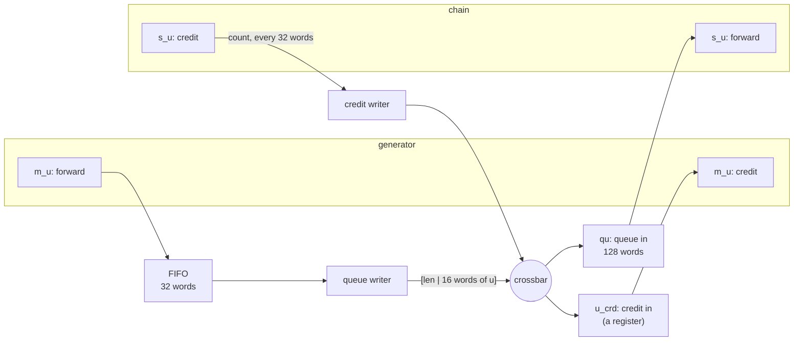

# The credit link

The generator writes the chain's input queue across the same crossbar the host and the memory use. A
write into a full queue there would stall the bus -- and could deadlock it -- so the link is an
**MM-stream with credit**: the generator writes only what it knows fits, and the chain returns how much
it has consumed. Why that is necessary, and the pattern in general, are on the guide page
[MM-streams with credit](../../guide/interface/axi_mm/credit_streams.md). This page is how this example
uses it.



## The kernels' ends

Each kernel holds one end of a credit stream and **declares** the view the other end reaches it through:

| | endpoint | view it declares | |
|---|---|---|---|
| generator | `m_u`: `FramedCreditStreamMasterIF` | `CreditIn("u_crd", port="m_u")` | where the chain's counts land |
| chain | `s_u`: `CreditStreamSlaveIF(crd_every=32)` | `QueueIn("qu", port="s_u", depth=128)` | where the generator's words land |

The generator's endpoint is the **framed** producer: its forward port has a `TLAST` pin, because the
queue writer turns each producer write into one queue-in packet `[len | data]` and only `TLAST` tells
it where a write ends.

Neither kernel's code mentions the bus. The generator calls `self.m_u.write(...)`, which waits for
credit; the chain calls `self.s_u.get_array(...)`, which counts what it consumed and reports it. The
same two kernels run joined by a plain `CreditStreamIF` in the direct wiring.

## Routing it

The system builds both kernels' memory-mapped devices from their declared views, then routes the link:

```python
self.gen_dev = build_mm_device(self.gen, sim=sim, clk=clk, mem_dwidth=DW, prefix="gen_")
self.chain_dev = build_mm_device(self.chain, sim=sim, clk=clk, mem_dwidth=DW, prefix="chain_")
self.u_link = MmCreditStreamIF(name="u", sim=sim, clk=clk, bitwidth=DW, fwd_depth=FWD_DEPTH)
self.u_link.bind("master", self.gen.m_u)
self.u_link.bind("slave", self.chain.s_u)
masters = [host.m, *self.u_link.bus_masters(), self.chain.m_mem]   # four bus masters
...                                                                  # the crossbar, the ranges
self.u_link.place(qin=cmap["qu"], crd_in=gmap["u_crd"])
```

`bus_masters()` is the link's two writers -- the queue writer on the generator's side, the credit writer
on the chain's. With the host and the chain's memory writer that is **four masters** on one crossbar.
`place` tells each writer its peer view's address; in RTL that address is a wire the system top
drives, so neither kernel's RTL depends on where the other sits.

## The numbers

| | value | why |
|---|---|---|
| chunk | 64 draws = **16 words** | one producer write, one queue-in packet |
| `qu` depth | **128 words** | the credit window -- must cover the link's round trip (below) |
| `crd_every` | **32 words** | one credit write per two chunks consumed |
| `max_write` | 128 − 1 − 31 = **96 words** | the longest write the generator may make and still never wait forever; a chunk is 16 |
| `fwd_depth` | **32 words** | two chunks: the generator fills one while the writer bursts the other |

Over the gate's scenario (four jobs of 300 steps) the chain consumes 312 words -- the draws and the
commands -- and returns credit **8 times**: 8 bus writes for the whole run. The generator waits for
credit twice, and the chain's queue never refuses a packet (`nstall = 0`): the bus is never stalled.

## What the RTL taught

The first RTL run was 21% slower than it needed to be, and the
[probes](rtlsim.md#finding-the-time) traced it to two sizes, not to the kernels:

- **No FIFO in front of the queue writer.** The writer is store-and-forward -- a packet starts with its
  length, so it gathers a whole chunk before bursting it -- and reads nothing while it bursts. Wired
  straight to it, the generator stalled for every burst: a chunk every 103 cycles instead of 64. The
  link's `fwd_depth` is that FIFO; the RTL top builds it at the same depth.
- **A credit window shorter than the round trip.** With a 64-word queue the generator could run only 63
  words ahead of what the chain had *reported* -- less than a word's round trip through the FIFO, the
  writer, the queue, up to 31 unreported words and the credit path back. So the generator ran out of
  credit at every job start and the chain starved behind it. 128 words covers the round trip.

Both are general: a store-and-forward stage needs a buffer in front of it the size of what it gathers,
and a credit window must cover the link's **bandwidth-delay product**.
