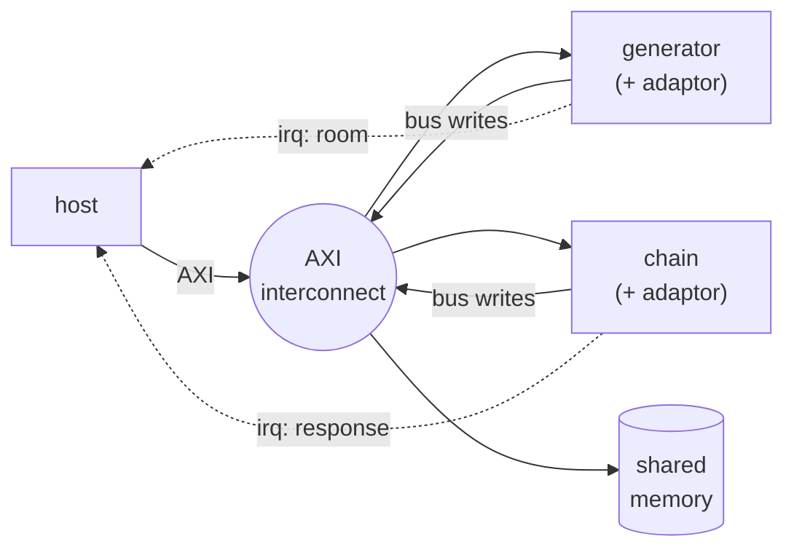
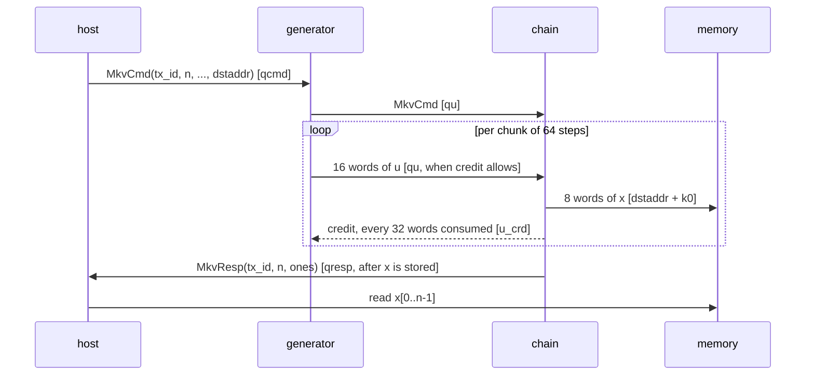

# Protocol

Four parties share one AXI interconnect: the **host**, the two kernels -- each with its own
[slave adaptor](../mm_fir/slave_adaptor.md) for the views a bus master writes to -- and a **shared
memory**. Unlike [mm_fir](../mm_fir/index.md), the kernels are bus **masters** too: the generator
writes the chain's input queue, and the chain writes the generator's credit register and the memory.

## The messages

| message | from -> to | carried on | what it says |
|---|---|---|---|
| `MkvCmd(tx_id, n, x0, seed, p01, p10, dstaddr)` | host -> generator | the generator's queue in `qcmd` | one job: how many steps, the start state, the seed, the chain's two probabilities, where to put the result |
| the same `MkvCmd`, then `u[0..n-1]` | generator -> chain | the chain's queue in `qu`, over the bus | the job, forwarded ahead of its uniforms (four 16-bit draws a word) |
| a cumulative count of words consumed | chain -> generator | the generator's credit-in view `u_crd`, over the bus | room in `qu` -- see [The credit link](credit_link.md) |
| `x[0..n-1]` | chain -> memory | bus writes to `dstaddr` | the states, eight a word |
| `MkvResp(tx_id, n, ones)` | chain -> host | the chain's queue out `qresp` | the job is done and its states are stored; how many were 1 |

## One job, in order

1. **The host sends the command** to the generator's queue in, waiting on that queue's room interrupt
   if it is full.
2. **The generator forwards the command** to the chain, then draws the job's `n` uniforms and sends
   them in chunks of 64 -- each chunk only once its **credit** says the chain's queue has room for it.
3. **The chain reads the command, then each chunk**, runs 64 steps, and writes the chunk's states to
   memory at `dstaddr`. Every 32 words it has consumed, it reports its cumulative count back to the
   generator's credit register.
4. **The chain answers**, after the last chunk: `MkvResp` echoes the job's `tx_id`, its `n`, and how
   many states were 1. It goes through the chain's memory writer, which sends it only **after the
   states are stored** -- so a response means "done", not just "seen".
5. **The host takes the response** when the response queue's interrupt fires, checks its `tx_id`, and
   reads the job's `x` from memory.

## The host's side

The host runs two processes, a **writer** that sends commands and a **reader** that takes responses,
and keeps **at most two jobs in flight**: the writer sends a command only while fewer than two are
outstanding, and the reader frees a slot per response. That bounds the response queue -- the one thing
credit between the kernels does not.

**Nothing polls.** The writer sleeps on the command queue's room interrupt, the reader on the response
queue's data interrupt. At RTL the testbench checks it: the host reads nothing but responses and
memory.

This is the [command-response pattern](../../guide/patterns/command_response.md) through a pipeline:
the command travels with the data from stage to stage, and the last stage answers once its work is
stored.
