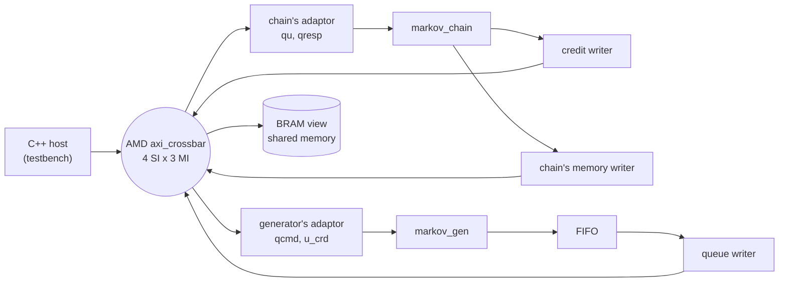

# RTL simulation

## The system at RTL

[`examples/markov/markov_xsi.py`](../../../examples/markov/markov_xsi.py) builds one Verilog top around
the four synthesized tops and runs it under XSI:



The whole top is **generated by walking the pysim system**
([`waveflow/build/system_top.py`](../../../waveflow/build/system_top.py)); the example names only the
cut -- `system_top_spec(sysm.xbar, [sysm.gen, sysm.chain, sysm.mem])` -- and everything below follows
from the graph:

- **The crossbar** is generated from the pysim system's own crossbar (`AxiXbarConfig.from_crossbar`):
  the same slaves at the same addresses, two ID bits so responses find their way back to four masters.
- **The adaptors** are the hand-written view leaves joined by generated wiring -- for the generator a
  queue in and a credit-in register, for the chain a queue in and a queue out.
- **The shared memory** is a BRAM view behind its own front. (The testbench's memory models do not echo
  AXI IDs, which a multi-master crossbar routes responses by; the front does.)
- **The kernels and writers** are wired from the same `TopSpec` each was synthesized from, not from a
  table or a parse of their Verilog: an `m_axi` pin the crossbar has is joined to its slot, one it lacks
  is tied off. The writers come with the routed credit link; each one's `target` -- its peer view's word
  address, from the address map -- is a constant the top drives.
- **The forward FIFO** sits between the generator and its queue writer, at the depth the pysim link
  declares (`fwd_depth`).

The **host** is the pysim `MarkovHost` written against the C++ endpoints of `xsi_mm_host.h`: a writer
sending commands on room interrupts and a reader taking responses on data interrupts, two jobs in
flight, and no address in the program but the memory regions it hands out. Its includes -- each kernel
type's layout and the system's bases -- come from a walk of the pysim crossbar
(`bus_address_headers`).

## Running it

```bash
python -m examples.markov.markov_build                      # headers, tops, csynth of all four
pytest tests/examples/test_markov_xsi.py -m xsi             # the gates (needs Vivado)
```

## Results

| | pysim | RTL |
|---|---|---|
| 4 jobs x 300 steps, 2 in flight | 1926 cycles | **1870 cycles** |
| `x` | bit-exact | **bit-exact** |
| host reads other than responses and `x` | 0 | **0** |

The gates ([`tests/examples/test_markov_xsi.py`](../../../tests/examples/test_markov_xsi.py)) check each
job's `x` and `ones` against the golden, that the host never reads a count, the cycle count, and that
pysim stays within 5% of it. The staleness guard refuses to run them against RTL that was not built from
the sources on disk.

## Finding the time

The first RTL run took 2356 cycles; pysim said 1700. Instead of guessing,
`run_xsi(work_dir, probes=True)` builds the top with one-bit **probes** on the handshake of every link
-- the generator's words to its writer, each writer's bursts and acknowledgements, the chain's reads,
credit offered and taken, responses -- and the testbench prints the cycles each fired. Lined up with the
same events from pysim, they showed where the time went:

| step | what the probes showed | the change | RTL cycles |
|---|---|---|---|
| -- | both bodies single-firing state machines | -- | 2356 |
| 1 | -- | both bodies rewritten as loops per job ([Code generation](codegen.md)) | 2246 |
| 2 | a chunk left the generator every **103 cycles** for 64 draws: the queue writer gathers a whole chunk before bursting it and reads nothing while it bursts, and nothing buffered the generator | a FIFO in front of the writer -- `fwd_depth`, two chunks | 2015 |
| 3 | at every job start the generator stalled 70--110 cycles for credit, then the chain starved for ~60: the 63-word credit window was shorter than the link's round trip | the chain's queue 64 -> **128** words | **1865** |
| 4 | the chain now the bottleneck at **79** cycles a chunk, the generator at **71**: 64 steps plus a fixed cost per chunk | pysim charges each kernel's measured `chunk_overhead` (15 and 7) | pysim 1700 -> 1926 |
| 5 | -- | the credit handling moved into the framework's `credit::Producer` / `credit::Consumer` -- equivalent logic, scheduled slightly differently | 1870 |

Steps 2 and 3 were defects in the **design** -- the RTL got faster -- and step 4 a gap in the
**model**. The design lessons are general, and are on the guide page
[MM-streams with credit](../../guide/interface/axi_mm/credit_streams.md#sizing-it): a store-and-forward
stage needs a buffer in front of it the size of what it gathers, and a credit window must cover the
link's bandwidth-delay product. Applied here they are [The credit link](credit_link.md)'s numbers.

The probes stay in the build: `run_xsi(..., probes=True)` reproduces the gate's cycle count exactly, so
they can be switched on whenever the timing moves.
