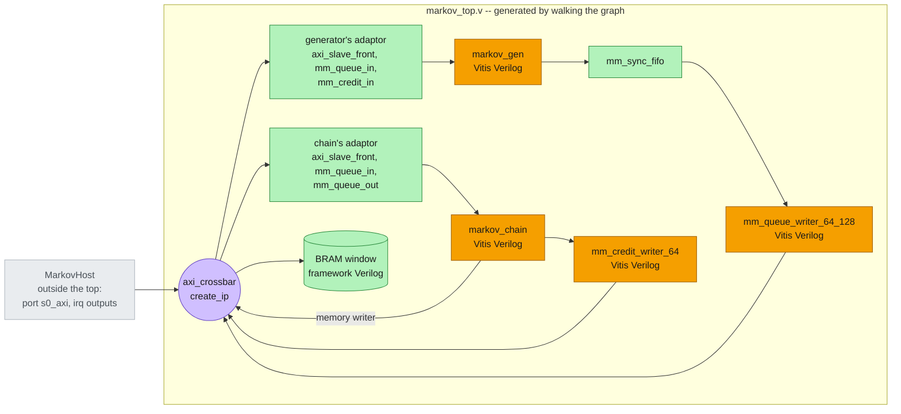

# Synthesis

Two steps of the [build flow](build.md) turn the system into Verilog. **csynth** runs Vitis HLS on the
four tops [Code generation](codegen.md) wrote. **system_rtl** generates the crossbar IP and walks the
pysim graph to the Verilog top that wires everything together. Fig. 2 is the same graph as
[Fig. 1](codegen.md), now with what each object becomes in RTL:



*Fig. 2 -- what each object becomes in RTL. Orange: csynth's Verilog for the four tops, by Vitis HLS.
Purple: AMD's crossbar IP, by Vivado's `create_ip`. Green: the framework's hand-written Verilog
(`waveflow/build/rtl/`) -- the adaptors' leaves, the memory's window, the FIFO. The box is
`markov_top.v`, generated. Grey: the host is not hardware; what it is bound to becomes a port of the
top, and it is driven by a testbench in [XSI testbench](xsi.md).*

```bash
python -m examples.markov.markov_build --through csynth       # the four tops' Verilog
python -m examples.markov.markov_build --through system_rtl   # and the crossbar IP and the top
```

## csynth: the four tops {#csynth}

The [csynth](../../guide/build/xsi_system.md#csynth) step has one inner step per HLS top the system's
cut instantiates. The set is derived from the system (`spec.modules`, below), not listed: the two
kernels, and the two writers the routed credit link brings with them. Each top is its own Vitis project,
the unit of rebuilding, since Vitis has no incremental csynth. Its Verilog lands in
`<top>_proj/solution1/syn/verilog/`.

A top is **fresh while its source stamp matches**. After csynth, `rtl_sources.json` beside the project
records a digest of every source it was built from -- `gen/<top>.cpp`, every header in `include/`,
everything in `src/`. A run compares those digests against the sources on disk. So the identical bytes
`codegen` rewrites every run re-synthesize nothing, and neither does a `git checkout` that restores
identical files. Change one top's `gen/<top>.cpp` and that top alone re-runs. Change a header or a
kernel body and **all four** re-run (about two minutes): the stamp covers the whole of `include/` and
`src/`, not just what each top includes.

Who may run Vitis is the `synth` parameter: `--synth build` (the default) synthesizes a stale or missing
top and stamps it; `--synth check` -- what the gates use -- fails on one instead, naming the top and the
source that changed, and never runs the toolchain. The timing each top closes at is on
[Code generation](codegen.md).

## system_rtl: the crossbar and the top {#system-rtl}

The [system_rtl](../../guide/build/xsi_system.md#system-rtl) step builds what csynth does not. It
starts from the system's cut:

```python
sysm = system()
spec = system_top_spec(sysm.xbar, [sysm.gen, sysm.chain, sysm.mem], top="markov_top",
                       xbar_name="xbar_markov_4x3")
```

`system_top_spec` ([`waveflow/build/system_top.py`](../../../waveflow/build/system_top.py)) walks the
pysim graph out from the crossbar. The list is **the cut**, what is built into the top: the two kernels
and the memory. What belongs to them comes along: each kernel's adaptor and views
([each kernel's memory-mapped device](system.md#step-4-each-kernels-memory-mapped-device)), and the
credit link's two writers ([the credit stream, routed](system.md#step-5-the-credit-stream-routed)).
Everything else -- the host -- stays outside, and what it was bound to becomes a port of the top. The
build does not need this call written out: `add_system_steps` takes the same cut by default (every
kernel whose device is a crossbar slave, then every memory on the crossbar). Writing it is for asking
about the top without building it.

**The crossbar IP.** `spec.xbar` is the crossbar's configuration -- four SI, three MI, at the ranges
`assign_address_ranges` set -- so the IP that AMD's `create_ip` generates decodes the same addresses
pysim did. It is cached by that configuration under `xsi_work/ip/`, so it is generated once.

**The top.** `render_system_top(spec)` emits `markov_top.v`:

| in the pysim graph | in `markov_top.v` |
|---|---|
| `host.m` on crossbar master 0 | the top's AXI4 slave port `s0_axi` |
| the writers' and the chain's masters (1, 2, 3) | crossbar SI slots on internal wires `si1_axi` .. `si3_axi` |
| each device's port, the memory | MI slots: two adaptors (`render_adaptor_slot`) and a BRAM window |
| each `StreamIF` | stream nets named after it (`gen_k_qcmd`, `u_fwd`, `chain_k_qu`, ...) |
| `u_fwd`, 32 deep, between two kernels | an `mm_sync_fifo` |
| the two writers | their csynth'd tops, each with its `target` (the peer view's word address) |
| the `IrqIF`s to the host | outputs `irq_gen_qcmd`, `irq_chain_qresp` |

Each kernel's pins come from the same `TopSpec` its csynth top was rendered from, and the tie-offs
(unused `s_axi_control` inputs low, ID widths, unframed ports' `TLAST`) are the framework's rules. The
spec can be asked before it is rendered -- `spec.si`, `spec.mi`, `spec.nets`, `spec.irqs`,
`spec.modules`.

**What it leaves.** `xsi_work/markov/markov_top.v`, and `rtl.json`: every Verilog file the top compiles
-- the crossbar IP's simulation files, the framework's leaves, each csynth'd module's files, the top --
and the IP's include directories. That list is all [XSI testbench](xsi.md) needs of this page.
