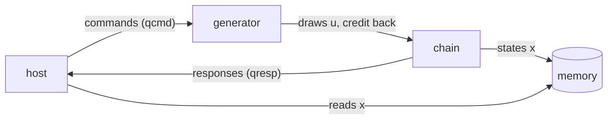

# The system

[`MarkovSystem`](../../../examples/markov/markov.py) is the object that holds everything: the two
kernels, the shared memory, the host, and the connections between them. It builds the same modules
two ways — joined **directly**, or **across one bus** — and the kernels and the host are the same code
in both; only the wiring differs. This page goes through it step by step, because the steps are the
general pattern for any system.

```python
sysm = MarkovSystem(jobs=default_jobs(4, 300), link="mm")     # or link="direct"
results = sysm.run()                                          # {job: {"x", "ones", "n", "t"}}
```



That picture is the same in both wirings. What changes is what each arrow *is*.

## Step 1: one simulation, and its modules

```python
    def __post_init__(self) -> None:
        sim = self.sim = Simulation()
        self.gen = MarkovGen(name="gen", sim=sim, clk=self.clk)
        self.chain = MarkovChain(name="chain", sim=sim, clk=self.clk)
        self.mem = MemoryMod(name="mem", sim=sim, word_size=DW, inline=False, clk=self.clk,
                             nwords_tot=MEM_SPAN // 8, addr_unit=AddrUnit.byte)
        self.host = MarkovHost(name="host", sim=sim, jobs=list(self.jobs), clk=self.clk)
        self.host.mem = self.mem
```

Every module is constructed with the **same `Simulation`** — constructing it registers it, so there is
no separate "add" step — and the same clock. The kernels are built bare: their ports exist, bound to
nothing yet. `MemoryMod` is the shared memory: 512 64-bit words (`MEM_SPAN = 4 KB`), byte-addressed,
as a bus sees it.

## Step 2: the memory regions the host hands out

```python
        for j in range(len(self.jobs)):
            a = self.mem.alloc(REGION_BYTES // 8)
            assert a == self.host._dst(j), (a, self.host._dst(j))
```

Each job's states go to their own region. The memory **allocates** them, and the assert checks the
host's arithmetic (`_dst(j) = j * REGION_BYTES`) names the same place — the host puts that address in
the command it sends, so the two must agree. A system that hands out buffers does this step; one whose
kernels only stream does not.

## Step 3: the direct wiring

The simplest form, and worth having: it checks the kernels and the host with no bus in the way.

```python
    def _stream(self, name, master, slave, depth):
        si = StreamIF(name=name, sim=self.sim, clk=self.clk, bitwidth=DW, depth=depth)
        si.bind(ep_name="master", endpoint=master)
        si.bind(ep_name="slave", endpoint=slave)

    def _wire_direct(self) -> None:
        sim, host = self.sim, self.host
        host.qcmd = StreamIFMaster(name="host_qcmd", sim=sim, bitwidth=DW, has_tlast=True)
        host.qresp = StreamIFSlave(name="host_qresp", sim=sim, bitwidth=DW, has_tlast=False)
        self._stream("k_cmd", host.qcmd, self.gen.s_cmd, CDEPTH)
        self._stream("k_resp", self.chain.m_resp, host.qresp, RDEPTH)
        self.u_link = CreditStreamIF(name="u", sim=sim, clk=self.clk, bitwidth=DW, depth=QDEPTH)
        self.u_link.bind("master", self.gen.m_u)
        self.u_link.bind("slave", self.chain.s_u)
        self.mem_link = DirectMMIF(name="k_mem", sim=sim, clk=self.clk)
        self.mem_link.bind("master", self.chain.m_mem)
        self.mem_link.bind("slave", self.mem.s_mm)
```

The pattern for every connection is **make the interface, bind its two sides**:

| connection | interface | sides |
|---|---|---|
| host → generator, chain → host | `StreamIF`, at the queue's depth | `"master"`, `"slave"` |
| generator → chain | `CreditStreamIF` — the stream and its credit, one object | the producer's `m_u`, the consumer's `s_u` |
| chain → memory | `DirectMMIF` | the chain's `m_mem`, the memory's `s_mm` |

The host gets **plain streams** for `qcmd` and `qresp`, which the system creates; `host.mem_bus_base`
stays `None`, so the host reads `x` from the memory object directly.

## The bus wiring

Now every arrow crosses one AXI crossbar. The host is a bus master, and so are three things inside the
system; the kernels' queues are reached through memory-mapped **views**. Steps 4 to 8 are the order
that works — several of them depend on the one before.

### Step 4: each kernel's memory-mapped device

```python
        self.gen_dev = build_mm_device(self.gen, sim=sim, clk=clk, mem_dwidth=DW, prefix="gen_")
        self.chain_dev = build_mm_device(self.chain, sim=sim, clk=clk, mem_dwidth=DW,
                                         prefix="chain_")
```

A kernel type **declares** how a bus reaches it, on its class, as its `mm_views`:

```python
class MarkovGen(FreeRunMod):
    mm_views = (QueueIn("qcmd", port="s_cmd", depth=CDEPTH),    # the host writes commands here
                CreditIn("u_crd", port="m_u"))                  # the chain writes credit here
class MarkovChain(FreeRunMod):
    mm_views = (QueueIn("qu", port="s_u", depth=QDEPTH),        # the generator writes draws here
                QueueOut("qresp", port="m_resp", depth=RDEPTH)) # the host reads responses here
```

`build_mm_device` builds those views, joins each to the kernel's named port, and puts them behind one
[slave adaptor](../../guide/interface/axi_mm/slave.md) — one bus port for the kernel. `prefix` names
the view modules (`gen_qcmd`, `chain_qresp`, ...), so two kernels' views never collide. The kernel's own
code is untouched: it still reads and writes streams.

### Step 5: the credit stream, routed

```python
        self.u_link = MmCreditStreamIF(name="u", sim=sim, clk=clk, bitwidth=DW, fwd_depth=FWD_DEPTH)
        self.u_link.bind("master", self.gen.m_u)
        self.u_link.bind("slave", self.chain.s_u)
```

The same two kernel endpoints as in the direct wiring, but the link now carries the stream across the
bus: it adds a **queue writer** (the generator's draws → the chain's `qu` view) and a **credit writer**
(the chain's credit → the generator's `u_crd` view), each a bus master, and a FIFO in front of the
queue writer (`fwd_depth`). **Build the devices first**: binding checks that each kernel's other half
is already joined to its view. Why the link must be credit-based, and how it is sized, are
[The credit link](credit_link.md).

### Step 6: the crossbar

```python
        masters = [host.m, *self.u_link.bus_masters(), self.chain.m_mem]
        gs, gr = self.gen_dev.ranges(GEN_BASE)
        cs, cr = self.chain_dev.ranges(CHAIN_BASE)
        slaves = gs + cs + [self.mem.s_mm]
        ranges = gr + cr + [(MEM_BASE, MEM_SPAN)]
        self.xbar = AXIMMCrossBarIF(name="xbar", sim=sim, clk=clk, nports_master=len(masters),
                                    nports_slave=len(slaves), bitwidth=DW,
                                    latency_init=self.xbar_latency,
                                    latency_travel=self.xbar_travel)
        for k, m in enumerate(masters):
            self.xbar.bind(f"master_{k}", m)
        for k, s in enumerate(slaves):
            self.xbar.bind(f"slave_{k}", s)
        assign_address_ranges(slaves, ranges)
```

Collect **every bus master** — the host's, the credit link's two writers, the chain's memory writer —
and **every bus slave** — each device's port, at the base you choose for it (`dev.ranges(base)` gives
the port and its span), and the memory. Bind them in order, then `assign_address_ranges` writes the
address map. This is the one place an address is chosen; everything else reads it back.

The order of the two lists is the crossbar's port order. In pysim it only names the ports; at RTL it is
the order of the crossbar's slots (the host is SI 0, the top's AXI port), so keep it stable.
`latency_init` / `latency_travel` are the crossbar's measured latency (4 cycles per request, 2 of them
in travel), part of pysim's timing model.

### Step 7: placing the credit link

```python
        gmap, cmap = GEN_LAYOUT.at(GEN_BASE), CHAIN_LAYOUT.at(CHAIN_BASE)
        self.u_link.place(qin=cmap["qu"], crd_in=gmap["u_crd"])
```

The two writers must know their **targets** — the bus address of the chain's `qu` view and of the
generator's `u_crd` view. A layout (`GEN_LAYOUT = MemSlaveLayout.of(MarkovGen)`, the view offsets of
the *type*) placed at an instance's base (`.at(GEN_BASE)`) gives every view's absolute address. **Place
after the address map exists** — that is why this is not part of Step 5.

### Step 8: interrupts, and the host endpoints

```python
        for dev, name in ((self.gen_dev, "qcmd"), (self.chain_dev, "qresp")):
            v = dev.views[name]
            line = IrqIF(name=f"{v.name}_irq", sim=sim)
            line.bind("source", v.m_irq)
            line.bind("sink", host.irq[name])
        poll = host.poll_cycles
        host.qcmd = BoundMemSlaveAdaptor(gmap, host.m, poll_cycles=poll).stream_master(
            "qcmd", irq=host.irq["qcmd"])
        host.qresp = BoundMemSlaveAdaptor(cmap, host.m, poll_cycles=poll).stream_slave(
            "qresp", irq=host.irq["qresp"])
        host.mem_bus_base = MEM_BASE
```

Two things the host needs, both by **view name**:

- **An interrupt line per queue it waits on.** Each queue view drives one (`m_irq`); an `IrqIF` joins it
  to the host's `IrqIFSink` (which the host owns — [The host](host.md#step-1-the-class-and-the-endpoints-it-owns)).
- **Its endpoints.** `BoundMemSlaveAdaptor(map, host.m)` is a kernel's views as its host sees them:
  ask for a view by name and get the same kind of endpoint the direct wiring handed over —
  `stream_master("qcmd")` a `StreamIFMaster`, `stream_slave("qresp")` a `StreamIFSlave` — whose calls
  turn into bus reads and writes. Given `irq=`, they sleep on the interrupt instead of polling. The
  host's code does not change.

Last, `mem_bus_base` tells the host the memory is on the bus, at `MEM_BASE`: it now reads `x` with bus
reads.

## Step 9: run it

```python
    def run(self) -> dict[int, dict]:
        self.sim.run_sim(until=self.host.done)
        return self.host.results
```

`run_sim` calls every module's `pre_sim`, starts every `run_proc`, and runs until the host says it is
done (the kernels never stop on their own). `demo(link)` wraps it and compares every job with the
golden; running both wirings and their results are [Python simulation](pysim.md).

## The pattern, in one list

1. One `Simulation`; construct every module on it, with one clock.
2. Allocate the data regions the host will hand out, where the memory says.
3. Wire **directly** first: a `StreamIF` per stream, a `CreditStreamIF` between kernels, a
   `DirectMMIF` to the memory; give the host plain stream endpoints.
4. For the bus: `build_mm_device` per kernel (views declared on the kernel class), then any routed
   credit link (`MmCreditStreamIF`), then the crossbar — every master, every slave at its base,
   `assign_address_ranges` — then `place` the link, then the interrupt lines, then the host's endpoints
   from `BoundMemSlaveAdaptor` by view name.
5. Run until the host's `done` event.

The same object is the input to the RTL simulation: the system top is walked from this graph and the
host's endpoints become the testbench's — [XSI testbench](xsi.md).
