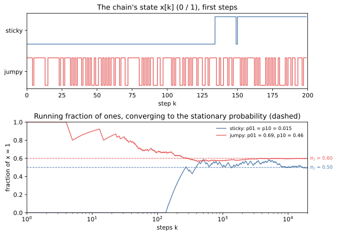
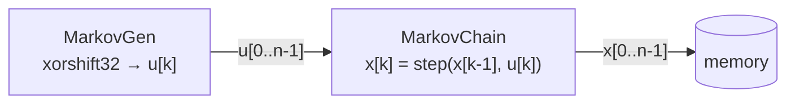

# Theory

## What a Markov chain is

A **Markov chain** is a system that moves between a set of states in steps, where the probability of
the next state depends **only on the current state** -- not on how the system got there. That one
property, "memoryless given the present", makes Markov chains the simplest model of anything with
*persistence*: a state that tends to last, then changes.

They are everywhere a system has modes:

- **Channels and networks.** The Gilbert--Elliott model treats a radio link as a two-state chain -- a
  *good* state with few errors and a *bad* state with many -- which is what makes errors arrive in
  bursts rather than independently. Packet traffic is modelled the same way: a source alternates
  between *on* (sending) and *off*.
- **Queueing.** The number of jobs in a queue is a chain; its stationary distribution says how long the
  queue usually is.
- **Monte Carlo methods.** Markov chain Monte Carlo draws samples from a distribution too complex to
  sample directly by running a chain whose stationary distribution is that distribution.

This example simulates the smallest interesting case, a chain with two states.

## The two-state chain

The state is a bit, `x[k]` in {0, 1}. Each step it either stays or flips:

| from | to 0 | to 1 |
|---|---|---|
| 0 | 1 − p01 | **p01** |
| 1 | **p10** | 1 − p10 |

so the whole chain is two numbers: `p01`, the probability of leaving state 0, and `p10`, of leaving
state 1. As a transition matrix,

$$
P = \begin{pmatrix} 1 - p_{01} & p_{01} \\ p_{10} & 1 - p_{10} \end{pmatrix}.
$$

**How long a state lasts.** Each step in state 0 leaves it with probability `p01`, so a run of 0s lasts
1/p01 steps on average, and a run of 1s 1/p10. Small probabilities make a *sticky* chain with long runs;
large ones a *jumpy* chain that flips often.

**Where it settles.** Run the chain long enough and the fraction of time it spends in state 1 converges
to the **stationary probability**

$$
\pi_1 = \frac{p_{01}}{p_{01} + p_{10}},
$$

whatever state it started in -- the balance where the flow 0 → 1 (π₀ · p01) equals the flow 1 → 0
(π₁ · p10). How *fast* it converges depends on how sticky it is: the further `p01 + p10` is from 1, the
longer the chain remembers where it started.



*Two chains from the example's golden model -- which the RTL reproduces bit for bit. The sticky one
(p01 = p10 = 0.015) holds a state for over a hundred steps and its fraction of ones wanders before it
settles at 0.50; the jumpy one flips constantly and settles at 0.60 within a few hundred. The figure is
a build step: `python -m examples.markov.markov_build --through sync_docs_figures`.*

## Simulating one step

A step needs one uniform random number `u` in [0, 1). From state 0 the chain moves to 1 if `u < p01`;
from state 1 it stays at 1 if `u ≥ p10`:

```
t0 = u <  p01        # from state 0: go to 1
t1 = u >= p10        # from state 1: stay at 1
x' = x ? t1 : t0
```

In hardware everything is an integer. `u` is a 16-bit number, uniform on 0 ... 65535, and `p01`, `p10`
are probabilities in **Q16** -- the probability times 65536 -- so the two tests are plain integer
compares, and the Python model and the RTL agree exactly.

**Each step depends on the last** -- `x'` is a function of `x` -- so steps cannot be computed in
parallel the way independent samples can. But look at what actually depends on `x`: only the final
select. The two compares depend only on `u`, so they can be done ahead; what is carried from one step
to the next is a 2:1 mux. That is why the hardware still runs one step per clock cycle.

## Where the random numbers come from

The uniforms come from **xorshift32**, a pseudo-random generator that updates a 32-bit state with three
shifts and XORs:

```
s ^= s << 13
s ^= s >> 17
s ^= s << 5
```

and `u` is the state's top 16 bits. It is not cryptographic, but it is fast, passes the statistical
tests that matter here, and is exactly reproducible from its seed -- so a job can be replayed, and the
RTL checked against Python bit for bit.

## The two modules

The example splits the simulation into two kernels, the way a real signal-processing pipeline splits a
source from the processing that consumes it:



- **`MarkovGen`** draws the uniforms `u[0] ... u[n-1]` from a seed.
- **`MarkovChain`** runs the chain on them and writes the states `x[0] ... x[n-1]` to memory.

The split is deliberate. Each kernel is trivial on its own, so the example can be about what joins
them: a stream between two kernels **across a shared bus**, which needs
[credit-based flow control](../../guide/interface/axi_mm/credit_streams.md). The [Protocol](protocol.md)
page is how the messages flow; [The credit link](credit_link.md) is how the stream between the kernels
works.
