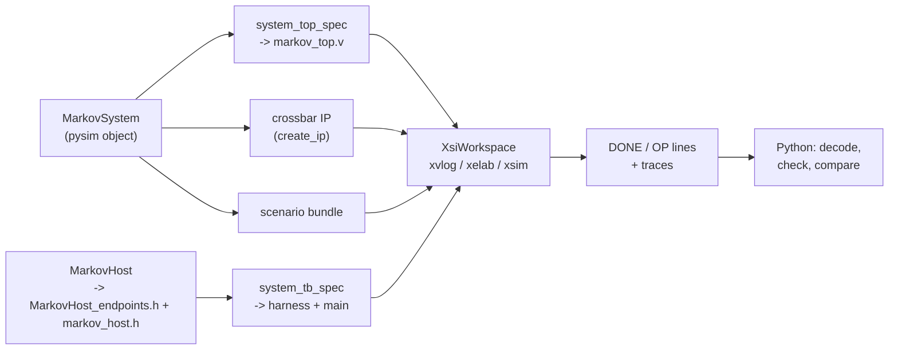

# XSI testbench

[`examples/markov/markov_build.py`](../../../examples/markov/markov_build.py) runs the whole system at
RTL: the csynth'd kernels, their adaptors, AMD's crossbar and a BRAM under one Verilog top, simulated by
Vivado's `xsim` through XSI, and driven by a C++ host. It is a build DAG, and the point is how little of
it is the example's: **`codegen`** (headers and tops) and **the scenario** (`system()`). Every step
after codegen is framework, added by one call, `add_system_steps`, from the same `MarkovSystem` pysim
runs ([The system](system.md)): it walks the system to the top, synthesizes what is stale, generates the
harness around `MarkovHost`'s C++ twin, runs it and checks the host against pysim. No Verilog and no C++
in Python strings, and no plumbing. This page goes through it in the order you need it. The results
and the timing story are on [RTL simulation](rtlsim.md); the general flow is the guide page
[XSI system simulation](../../guide/build/xsi_system.md#running-it).



## Before you start

- **pysim works.** Everything here derives from `MarkovSystem(link="mm")`; if it does not run bit-exact
  in Python ([Python simulation](pysim.md)), nothing below will.
- **The four tops are synthesized** -- or will be: the DAG's [csynth](../../guide/build/xsi_system.md#csynth)
  step runs csynth on `markov_gen`, `markov_chain` and the credit link's two writers when they are
  missing or stale, and skips them otherwise ([Code generation](codegen.md)).
  `python -m examples.markov.markov_build --through csynth` stops there. Their Verilog lands in
  `<top>_proj/solution1/syn/verilog/`.
- **Vivado** (`create_ip` for the crossbar, `xsim` for the simulation) and a C++ compiler — the mingw
  `g++` that ships with Vivado on Windows, the system `g++` on Linux.

## The scenario and the system

```python
TOP, XBAR_NAME, WORK_DIR, WORKSPACE = "markov_top", "xbar_markov_4x3", "xsi_work", "markov"
NJOBS, NSTEPS = 4, 300

def scenario_jobs() -> list[dict]:
    return default_jobs(NJOBS, NSTEPS)

def system() -> MarkovSystem:
    return MarkovSystem(jobs=scenario_jobs(), link="mm")
```

`system()` is the **same object pysim runs**, on the gate's scenario: four jobs of 300 steps.
Everything below starts from it. Nothing names the csynth'd modules or where their Verilog is: the
four tops are derived from the system's cut, and the top and crossbar names are only kept so the
generated IP's cache holds.

## The Verilog top: walked from the graph

```python
sysm = system()
spec = system_top_spec(sysm.xbar, [sysm.gen, sysm.chain, sysm.mem], top="markov_top",
                       xbar_name="xbar_markov_4x3")
```

`system_top_spec` ([`waveflow/build/system_top.py`](../../../waveflow/build/system_top.py)) walks the
pysim graph out from the crossbar. The list is **the cut** — what is synthesized into the top: the two
kernels and the memory. What belongs to them comes along: each kernel's adaptor and views
([each kernel's memory-mapped device](system.md#step-4-each-kernels-memory-mapped-device)), and the
credit link's two writers ([the credit stream, routed](system.md#step-5-the-credit-stream-routed)).
Everything else — the host — stays outside, and what it was bound to becomes a port of the
top:

| in the pysim graph | in `markov_top.v` |
|---|---|
| `host.m` on crossbar master 0 | the top's AXI4 slave port `s0_axi` |
| the writers' and the chain's masters (1, 2, 3) | crossbar SI slots on internal wires `si1_axi` .. `si3_axi` |
| each device's port, the memory | MI slots: two adaptors (`render_adaptor_slot`) and a BRAM window |
| each `StreamIF` | stream nets named after it (`gen_k_qcmd`, `u_fwd`, `chain_k_qu`, ...) |
| `u_fwd`, 32 deep, between two kernels | an `mm_sync_fifo` |
| the two writers | their csynth'd tops, each with its `target` (the peer view's word address) |
| the `IrqIF`s to the host | outputs `irq_gen_qcmd`, `irq_chain_qresp` |

Each kernel's pins come from the same `TopSpec` its csynth top was rendered from, and the tie-offs
(unused `s_axi_control` inputs low, ID widths, unframed ports' `TLAST`) are the framework's rules. The
spec can be asked before it is rendered — `spec.si`, `spec.mi`, `spec.nets`, `spec.irqs`,
`spec.modules` — and `render_system_top(spec)` emits the Verilog.

```python
spec.xbar          # the AxiXbarConfig the crossbar IP is generated from
```

The crossbar's configuration — four SI, three MI at the ranges `assign_address_ranges` set — is part of
the spec, so the IP AMD generates decodes the same addresses pysim did.

The build does not need this call written out: `add_system_steps` finds the crossbar and the host among
the simulation's objects and takes the same cut by default — every kernel whose device is a crossbar
slave, then every memory on the crossbar. Writing it is for asking about the top without running it.

## The host, in C++ {#the-host-in-c}

At RTL the host cannot be Python: it has to act on pins every clock cycle. So `MarkovHost` has a
**second realization**, `MarkovHostModel` in [`markov_host.h`](../../../examples/markov/markov_host.h)
beside `markov.py`, and names it with two class attributes:

```python
class MarkovHost(SwHost):
    max_in_flight: DynParam[int] = MAX_IN_FLIGHT
    cpp_model: ClassVar[str | None] = "MarkovHostModel"
    cpp_header: ClassVar[str | None] = "markov_host.h"
```

What you write in that header is **the program and nothing else** -- the same two threads as the Python
host, line for line ([software threads](../../../plans/host_runtime.md)):

```cpp
class MarkovHostModel : public MarkovHost_endpoints {
public:
    using MarkovHost_endpoints::MarkovHost_endpoints;
    long max_in_flight = 0;             // DynParam

    void main() override {              // ~ MarkovHost.main
        decode();
        slots_.reset(new SwSemaphore(sched_, max_in_flight));
        start("writer", [this] { writer(); });
        reader();
    }

private:
    void writer() {                     // ~ MarkovHost._writer
        for (const Job& j : jobs_) {
            slots_->acquire();
            qcmd.write(j.cmd);
        }
    }
    void reader() {                     // ~ MarkovHost._reader
        for (size_t k = 0; k < jobs_.size(); ++k) {
            const MkvResp r = qresp.get<MkvResp>();
            const Job& j = jobs_[(size_t)r.tx_id];
            mem_reader.read(j.xaddr, j.xwords);
            t_done_[(size_t)r.tx_id] = bus_.cycle();
            slots_->release();
        }
    }
    ...
};
```

Everything else is generated or framework:

- **`MarkovHost_endpoints.h`** (generated from the wired host, `waveflow/build/sw_host_gen.py`) declares
  `qcmd`, `qresp` and `mem_reader` -- named as in Python, each on its view at its absolute bus address,
  with its interrupt pin -- and the bus master. The C++ never names an address, a pin or a threshold.
- **The runtime** (`xsi_sw.h`, `xsi_fiber.h`) makes the calls block: each thread is a **fiber**, a call like
  `qresp.get<MkvResp>()` parks it until its bus transactions are done, and a scheduler resumes the threads
  once per cycle in a fixed order -- so the program has no state machine, and the run is deterministic.
- **Typed messages**: `qresp.get<MkvResp>()` returns the generated `MkvResp` struct (`xsi_sw_schema.h`),
  so `r.tx_id` is read by name, never by bit position.
- **Settings and files travel as DynParams** -- `max_in_flight`, and `SwHost`'s `scenario` (the bundle the
  Python host writes, so the jobs are never restated in C++) and `trace_dir` -- assigned by the harness.
- **Reports and traces**: the runtime prints `DONE done= cycles= polls= nops=` and one `OP` line per bus
  operation, and dumps what crossed each endpoint as a burst bundle; `report()` adds the job lines.

| Python (`MarkovHost`) | C++ (`MarkovHostModel`) |
|---|---|
| a SimPy process per thread | a fiber per thread |
| `yield from self.slots.acquire()` | `slots_->acquire()` |
| `yield from self.qcmd.write(cmd)` | `qcmd.write(j.cmd)` |
| `yield from self.qresp.get_schema(MkvResp)` | `qresp.get<MkvResp>()` |
| `yield from self.mem_reader.read(n, addr)` | `mem_reader.read(addr, n)` |

## Running it: the build DAG

```python
def build_dag(probes: bool = False, work_dir=WORK_DIR) -> BuildDag:
    sysm = system()
    dag = BuildDag()
    dag.add(MarkovCodegenStep(name="codegen"))
    add_system_steps(dag, sysm, work_dir=work_dir, top=TOP, xbar_name=XBAR_NAME, workspace=WORKSPACE,
                     probes=timing_probes(sysm) if probes else None)
    dag.add(MarkovFiguresStep(name="markov_figures"))
    dag.add(SyncDocsFiguresStep(name="sync_docs_figures"))
    return dag
```

`codegen` is the example's step: today's `generate()` -- the headers, the two kernel tops, the two
bus-writer tops, each with its `.tcl`. [`add_system_steps`](../../../waveflow/build/system_dag.py) adds
the rest, from the system object alone (each step is described on
[XSI system simulation](../../guide/build/xsi_system.md#running-it)):

| step | what it does here |
|---|---|
| [csynth](../../guide/build/xsi_system.md#csynth) | one inner step per top of the cut -- `markov_gen`, `markov_chain`, the queue writer, the credit writer -- each synthesized only when its source stamp no longer matches |
| [scenario](../../guide/build/xsi_system.md#scenario) | `MarkovHost` writes its four jobs as a burst bundle, the one file both hosts read |
| [pysim](../../guide/build/xsi_system.md#pysim) | the same system in pysim, from that file: the host's traces and its cycle count |
| [system_xsi](../../guide/build/xsi_system.md#system-xsi) | the crossbar IP (cached), `markov_top.v`, the harness with `MarkovHost_endpoints.h` and `markov_host.h`, the XSI run; `report.json` |
| [compare](../../guide/build/xsi_system.md#compare) | every host endpoint's trace, RTL against pysim, file for file |

The two figure steps beside them draw the docs figure from the golden model; nothing depends on them.

```bash
python -m examples.markov.markov_build                       # everything, through compare
python -m examples.markov.markov_build --through pysim       # the software side only: no Vivado
python -m examples.markov.markov_build --through csynth      # build the RTL, stop there
python -m examples.markov.markov_build --status              # what is stale, and why
python -m examples.markov.markov_build --synth check         # fail on a stale top, never synthesize
```

A second run synthesizes nothing: `codegen` rewrites `include/` and `gen/` with the same bytes, and each
top's stamp still matches, so `csynth` reports UP-TO-DATE. The run lands in `xsi_work/markov/`:
`report.json` (the host's report: `DONE`, the bus operations), `pysim.json`, `compare.json`, the
scenario and both sets of traces. `system_xsi.load_run("xsi_work/markov")` reads them back as an
`XsiRun` -- the output, `cycles`, `polls`, `nops`, the bus `ops`, `pysim_cycles` and `trace_mismatches`.

## Reading the results

The C++ host reports what the bus did; the data comes back as **traces**, which the gate test
([`test_markov_xsi.py`](../../../tests/examples/test_markov_xsi.py)) decodes with the schemas
themselves:

```python
def trace_report(out: str, traces) -> str:
    t = {int(m[1]): int(m[2]) for m in re.finditer(r"^JOBT (\d+) t=(\d+)", out, re.M)}
    resp = [MkvResp().deserialize(b, word_bw=DW)
            for b in read_burst_bundle(traces / "qresp")]
    xs = read_burst_bundle(traces / "mem_reader")
    ...                                          # one "JOB <tx> ones=<n> t=<cycle> X <words>" per job
```

The k-th region read follows the k-th response, so each response is paired with its `x` words.
`job_results(run.output)` turns the `JOB` lines into `{job: {"ones", "t", "x"}}`.

```python
run = load_run("examples/markov/xsi_work/markov")    # after python -m examples.markov.markov_build
run.output += trace_report(run.output, run.traces)
run.cycles, run.polls, run.trace_mismatches          # 1870, 0, []
job_results(run.output)[2]["ones"]                   # 257
```

## The gates

[`tests/examples/test_markov_xsi.py`](../../../tests/examples/test_markov_xsi.py) runs the example's DAG
once (a module fixture) through `compare`, with `synth="check"`, and checks what `load_run` reads back.
Its `codegen` regenerates the headers and tops first (seconds), so the stamp check compares the RTL
against this checkout's sources. In check mode a missing or stale top **fails** the gate, naming it --
a gate never synthesizes, and never runs against RTL that was not built from the sources on disk.

| gate | checks |
|---|---|
| `test_markov_rtl_bit_exact` | every job's `x` and `ones` against the golden |
| `test_markov_rtl_host_never_polls` | every host read is a response or an `x` read -- no queue count |
| `test_markov_rtl_cycles` | exactly **1870** cycles |
| `test_markov_pysim_tracks_rtl` | pysim's cycle count (`run.pysim_cycles`) within 5% of the RTL's |
| `test_markov_host_traces_match_pysim` | the host's three traces **byte-identical** between pysim and RTL |

The last one is what ties the two hosts together. Nothing static can show that `MarkovHostModel`
behaves like `MarkovHost`, so the DAG's `pysim` step runs the system **from the same scenario file** and
its `compare` step compares each endpoint's trace -- the commands, the responses, the `x` regions -- file for file. Per
endpoint, not as one log: the interleaving across endpoints is timing, and pysim is loosely timed.

```bash
pytest tests/examples/test_markov_xsi.py -m xsi
```

## After it works: timing probes

Only once the gates pass is the cycle count worth explaining.
`python -m examples.markov.markov_build --probes` (or `build_dag(probes=True)`) builds the top with
one-bit **probes** on the handshakes `timing_probes` names, in its own workspace
(`xsi_work/markov_probes/`). `timing_probes` lives in `markov.py`, beside `MarkovSystem`. You name each
probe by the **pysim object** you want to watch, never by a net:

```python
def timing_probes(sysm: MarkovSystem) -> dict:
    gen, chain, link = sysm.gen, sysm.chain, sysm.u_link
    return {
        "cmd": beat(gen.s_cmd),                          # host's command reaches the generator
        "ufwd": beat(gen.m_u.fwd_ep),                    # generator -> its queue writer, a word
        "ufwd_last": last(gen.m_u.fwd_ep),               # ... the last word of a chunk
        "wr1_aw": beat(link.fwd_writer.m_mem, "AW"),     # queue writer: a burst issued
        "wr1_b": beat(link.fwd_writer.m_mem, "B"),       # ... and acknowledged
        ...
        "resp": beat(chain.m_resp),                      # a response word into qresp
    }
```

| helper | on a stream endpoint | on a bus master, channel `"AW"`/`"W"`/`"B"`/`"AR"`/`"R"` |
|---|---|---|
| `beat(ep)` | a word moves: `TVALID && TREADY` | a transfer on that channel |
| `stall(ep)` | offered, not taken: `TVALID && !TREADY` | the same, on that channel |
| `last(ep)` | the word that ends a packet | `W` / `R` only: the burst's last beat |

The system top resolves each one: a stream endpoint to the net its `StreamIF` became (the producer's
side of a FIFO'd link for the producer, the consumer's side for the consumer), a bus master to its
crossbar slot. A probe on something that is not in the top is refused with the reason. (A raw Verilog
string over the top's nets still works, for anything the helpers do not cover.)

Each probe becomes an output `probe_<name>` of the top and a `ProbePin` in the harness, which prints
the cycles it fired (`PROBE <name> start+len ...`); the gate test's `probe_runs(out)` parses them. How the probes took
this system from 2356 cycles to 1870 is [Finding the time](rtlsim.md#finding-the-time).

## Doing this for another system

1. Get the system running bit-exact in pysim, with the host as a `SwHost` that creates its bus master
   and interrupt inputs (`add_bus_master`, `add_irq`; [The host](host.md)) and the bus wiring built as
   in [The system](system.md).
2. Write the `codegen` step: every kernel's headers and top, and each bus writer's top
   (`write_writer_project`), with their `.tcl`.
3. Give the host `scenario_bursts()` (its jobs as word messages) and `cpp_model` / `cpp_header`, and
   write that C++ class: derive it from the generated `<Host>_endpoints`, override `main()`, and write
   each Python thread as a C++ function on the same endpoints. Settings it needs are `DynParam`s.
4. Build the DAG -- `codegen`, then `add_system_steps(dag, system, work_dir=...)` -- and hand it to
   `run_dag_cli`. csynth, the scenario, pysim, the RTL run and the comparison come with that call.
5. Gate it: run the DAG with `synth="check"`, read the run back with `load_run`, decode the traces into
   whatever results your gates check, and require bit-exact results, the exact cycle count and
   `run.trace_mismatches == []`.
