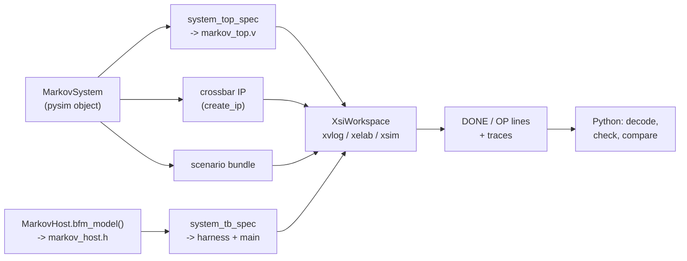

# XSI testbench

[`examples/markov/markov_xsi.py`](../../../examples/markov/markov_xsi.py) runs the whole system at RTL:
the csynth'd kernels, their adaptors, AMD's crossbar and a BRAM under one Verilog top, simulated by
Vivado's `xsim` through XSI, and driven by a C++ host. The point of the file is what it does **not**
contain: no Verilog and no C++ in Python strings. The top is walked from the same `MarkovSystem` pysim
runs ([The system](system.md)); the host is `MarkovHost`'s own C++ twin; the harness is generated. This
page goes through the file in the order you need it. The results and the timing story are on
[RTL simulation](rtlsim.md); the general flow is the guide page
[XSI system simulation](../../guide/build/xsi_system.md).



## Before you start

- **pysim works.** Everything here derives from `MarkovSystem(link="mm")`; if it does not run bit-exact
  in Python ([Python simulation](pysim.md)), nothing below will.
- **The four tops are synthesized:** `python -m examples.markov.markov_build` generates every header and
  top and runs csynth on `markov_gen`, `markov_chain` and the credit link's two writers
  ([Code generation](codegen.md)). Their Verilog lands in `<top>_proj/solution1/syn/verilog/`.
- **Vivado** (`create_ip` for the crossbar, `xsim` for the simulation) and a C++ compiler — the mingw
  `g++` that ships with Vivado on Windows, the system `g++` on Linux.

## The scenario and the system

```python
ROOT = Path(__file__).resolve().parent
QWRITER = writer_top_name("queue", DW, QDEPTH)
CWRITER = writer_top_name("credit", DW)
TOPS = ("markov_gen", "markov_chain", QWRITER, CWRITER)

def rtl_dir(top: str) -> Path:
    return ROOT / f"{top}_proj" / "solution1" / "syn" / "verilog"

XBAR_NAME = "xbar_markov_4x3"
NJOBS, NSTEPS = 4, 300

def scenario_jobs() -> list[dict]:
    return default_jobs(NJOBS, NSTEPS)

def system() -> MarkovSystem:
    return MarkovSystem(jobs=scenario_jobs(), link="mm")
```

`TOPS` names the csynth'd modules and `rtl_dir` where each one's Verilog is; the writers' names are
derived the way `markov_build` derives them, never typed. `system()` is the **same object pysim runs**,
on the gate's scenario: four jobs of 300 steps. Everything below starts from it.

## The Verilog top: walked from the graph

```python
def system_spec(sysm: MarkovSystem | None = None) -> SystemTopSpec:
    sysm = sysm or system()
    return system_top_spec(sysm.xbar, [sysm.gen, sysm.chain, sysm.mem], top="markov_top",
                           xbar_name=XBAR_NAME)
```

`system_top_spec` ([`waveflow/build/system_top.py`](../../../waveflow/build/system_top.py)) walks the
pysim graph out from the crossbar. The list is **the cut** — what is synthesized into the top: the two
kernels and the memory. What belongs to them comes along: each kernel's adaptor and views (Step 4 of
[The system](system.md#step-4-each-kernels-memory-mapped-device)), and the credit link's two writers
(Step 5). Everything else — the host — stays outside, and what it was bound to becomes a port of the
top:

| in the pysim graph | in `markov_top.v` |
|---|---|
| `host.m` on crossbar master 0 | the top's AXI4 slave port `s0_axi` |
| the writers' and the chain's masters (1, 2, 3) | crossbar SI slots on internal wires `si1_axi` .. `si3_axi` |
| each device's port, the memory | MI slots: two adaptors (`render_adaptor_slot`) and a BRAM window |
| each `StreamIF` | stream nets named after it (`gen_k_qcmd`, `u_fwd`, `chain_k_qu`, ...) |
| `u_fwd`, 32 deep, between two kernels | an `mm_sync_fifo` |
| the two writers | their csynth'd tops, each with its `target` (the peer view's word address) |
| the `IrqIF`s to the host | outputs `irq_gen_qcmd`, `irq_chain_qresp` |

Each kernel's pins come from the same `TopSpec` its csynth top was rendered from, and the tie-offs
(unused `s_axi_control` inputs low, ID widths, unframed ports' `TLAST`) are the framework's rules. The
spec can be asked before it is rendered — `spec.si`, `spec.mi`, `spec.nets`, `spec.irqs`,
`spec.modules` — and `render_system_top(spec)` emits the Verilog.

```python
def xbar_config() -> AxiXbarConfig:
    return system_spec().xbar
```

The crossbar's configuration — four SI, three MI at the ranges `assign_address_ranges` set — is part of
the spec, so the IP AMD generates decodes the same addresses pysim did.

## The host, in C++ {#the-host-in-c}

At RTL the host cannot be Python: it has to act on pins every clock cycle. So `MarkovHost` has a
**second realization** — `MarkovHostModel`, a C++ class in
[`markov_host.h`](../../../examples/markov/markov_host.h) beside `markov.py` — and names it with a hook,
the way a kernel names its HLS body with `kernel_task()`:

```python
    def bfm_model(self):
        word, bit, width = field_position(MkvResp, "tx_id", DW)
        return BfmModel("MarkovHostModel", ports=("m", "irq_qcmd", "irq_qresp"),
                        extra_args=(str(int(self.poll_cycles)), str(MAX_IN_FLIGHT),
                                    str(MkvResp.nwords_per_inst(DW)), str(word), str(bit), str(width)),
                        header="markov_host.h")
```

- **`ports`** are the host's own endpoints ([The host](host.md#step-1-the-class-and-the-endpoints-it-owns)),
  in the constructor's order. The generator binds each to the top port it faces: `m` → `s0_axi`,
  `irq_qcmd` → `irq_gen_qcmd`, `irq_qresp` → `irq_chain_qresp`.
- **`extra_args`** are the host's settings, passed after the ports: poll cycles, jobs in flight, words
  per response, and where `tx_id` sits in a response — read off `MkvResp`'s serializer
  (`field_position`), so the C++ never restates a bit position.
- **`header`** is relative to `markov.py`. `check(host, "xsi_bfm_model")` looks the class up there.

The C++ is the Python program again, on the C++ twins of the endpoints
([`xsi_mm_host.h`](../../../waveflow/build/xsi/xsi_mm_host.h)):

| Python (`MarkovHost`) | C++ (`MarkovHostModel`) |
|---|---|
| `host.m`, an `MMIFMaster` | `AxiMmMaster bus_` on the top's `s0_axi` pins |
| `IrqIFSink`s | `IrqPin`s sampling `irq_gen_qcmd`, `irq_chain_qresp` |
| `qcmd.write(cmd)` | `MmQueueWriter qcmd; qcmd.start(cmd)` |
| `qresp.get_schema(MkvResp)` | `MmQueueReader qresp; qresp.start(resp_words)` |
| `mem_reader.read(xwords, xaddr)` | `MmBusReader mem; mem.start(xaddr, xwords)` |
| two SimPy processes | two `XsiSimObj`s, `Writer` and `Reader` |

The difference is that **a C++ model cannot block**. An XSI participant is called once per cycle in
phases — `sample()` while the clock is low (read the pins), `update()` after the rising edge (act),
`drive()` (present the next values) — so each endpoint is a small state machine: `start(...)` once,
then `step()` every cycle until `busy()` is false. The `Reader` reads like the Python one:

```cpp
        void update() override {
            qresp.step(); mem.step();
            if (phase_ == RESP && !qresp.busy()) {                  // a response arrived:
                const uint64_t v = qresp.words[tx_.word] >> tx_.bit;
                j_ = (size_t)(tx_.width >= 64 ? v : (v & ((1ull << tx_.width) - 1)));
                mem.start(jobs_[j_].xaddr, jobs_[j_].xwords);       //   read that job's x
                phase_ = READX;
            } else if (phase_ == READX && !mem.busy()) {            // x is read:
                t_done[j_] = m_.cycle(); --in_flight_; ++n_;        //   free the slot
                phase_ = IDLE;
            }
            if (phase_ == IDLE) {
                if (n_ < jobs_.size()) { qresp.start(resp_words_); phase_ = RESP; }
                else phase_ = DONE;
            }
        }
```

`MarkovHostModel` owns the bus master, the two pins, the `Reader` and the `Writer`, and forwards each
phase to them in that order (pins, bus, reader, writer). Three more pieces make it checkable:

- **No jobs in the C++.** In `pre_sim` it reads the **scenario file** — the bundle
  `MarkovHost.write_scenario` writes from the same items the Python host walks
  ([The host, step 2](host.md#step-2-the-jobs)). Its path is the host's `scenario` field, a
  `DynParam` the harness assigns (`host.scenario = "..."`).
- **The run's length.** `done()` is true once both processes are; the model counts cycles in `update()`
  and records the cycle it first became done — the measured cycle count.
- **Reports and traces.** `post_sim()` prints `DONE done= cycles= polls= nops=`, a `JOBT j t=` line per
  job, and one `OP` line per bus operation; and, if `trace_dir` is set, dumps what crossed each
  endpoint — every command sent, every response taken, every `x` region read — one burst bundle each.
  The Python host records the same three; see [the gates](#the-gates).

## The address map, as headers

```python
def address_headers() -> dict[str, str]:
    return bus_address_headers(system().xbar, system="markov")
```

The C++ host builds every endpoint as `at(markov_gen_layout::qcmd, GEN)` — a view's offset within its
kernel's slave, plus where this system placed the kernel. Both halves are generated by walking the
crossbar: `markov_gen_layout.h` and `markov_chain_layout.h` (each kernel type's views) and
`markov_bases.h` (`GEN_BASE`, `CHAIN_BASE`, `MEM_BASE`). The host header `#include`s them by name.

## Running it: `run_xsi`

```python
def run_xsi(work_dir, timeout: int = 3600, probes: bool = False) -> str:
    for t in TOPS:                                                         # 1. the RTL exists
        if not rtl_dir(t).is_dir():
            raise FileNotFoundError(...)
    work_dir = Path(work_dir).resolve()
    sysm = system()                                                        # 2. the system and its top
    spec = system_spec(sysm)
    ip = generate_axi_xbar(spec.xbar, work_dir / "ip")                     # 3. the crossbar IP
    ws = XsiWorkspace(workspace(work_dir, probes), top=spec.top)           # 4. a workspace
    host = sysm.host                                                       # 5. the scenario, the traces
    host.scenario = scenario_path(work_dir, probes).as_posix()
    host.trace_dir = trace_dir(work_dir, probes).as_posix()
    host.write_scenario(host.scenario)
    shutil.rmtree(host.trace_dir, ignore_errors=True)
    tb = system_tb_spec(spec, sysm.xbar, [host], probes=...)               # 6. the harness
    main, tb_files = render_system_tb(spec, tb)
    rtl = [f for t in spec.modules for f in sorted(rtl_dir(t).glob("*.v"))]
    ws.prepare(rtl_files=ip.sim_files + leaf_sources() + rtl + [f"{spec.top}.v"],   # 7. the files
               include_dirs=ip.include_dirs, tb_name="markov_tb", tb_cpp=main,
               extra_files={f"{spec.top}.v": render_system_top(spec, ...),
                            **tb_files, **address_headers()})
    out = ws.run(timeout=timeout)                                          # 8. compile, run
    return out + trace_report(out, host.trace_dir)                         # 9. decode the traces
```

1. **The RTL exists** for all four tops — a clear error, not an `xelab` failure later.
2. **The system and its top**, from the same object pysim runs.
3. **The crossbar IP**: `create_ip` with the spec's configuration, cached under `work_dir/ip` by the
   configuration's digest, so it is generated once.
4. **A workspace**: a directory holding the framework's XSI sources and run scripts.
5. **The scenario and the traces.** Setting the host's two `DynParam`s is what tells the harness where
   they are; `write_scenario` writes the file the C++ host will read; a stale trace from a previous run is
   removed so it cannot be mistaken for this one.
6. **The harness.** `system_tb_spec` resolves `host.bfm_model()` against the top (and refuses a port that
   faces nothing); `render_system_tb` emits the ports header, the harness (`Harness::run_until`, which
   runs until the host is done) and a ten-line `main`, plus `markov_host.h` itself.
7. **The files**: the crossbar's simulation sources, the hand-written adaptor leaves (`leaf_sources()`),
   the four tops' Verilog, the generated top, and the C++ — written into the workspace.
8. **Compile and run**: `xvlog` / `xelab` build a simulation library of the top, `g++` builds the
   testbench, and it runs. A run that did not exit cleanly raises.
9. **Decode the traces** and append the result to the output.

## Reading the results

The C++ host reports only what the bus did. The data comes back as **traces**, and Python decodes them
with the schemas themselves:

```python
def trace_report(out: str, traces) -> str:
    t = {int(m[1]): int(m[2]) for m in re.finditer(r"^JOBT (\d+) t=(\d+)", out, re.M)}
    resp = [MkvResp().deserialize(np.asarray(b, dtype=np.uint64), word_bw=DW)
            for b in read_burst_bundle(traces / "qresp")]
    xs = read_burst_bundle(traces / "mem")
    ...                                          # one "JOB <tx> ones=<n> t=<cycle> X <words>" per job
```

The k-th region read follows the k-th response, so each response is paired with its `x` words. Then
`job_results(out)` turns the `JOB` lines into `{job: {"ones", "t", "x"}}`, decoding `x` with the
`uint8` array reader, and `parse_kv(out, "DONE")` gives `{"done", "cycles", "polls", "nops"}`.

```python
out = run_xsi("xsi_work")                        # or: python -m examples.markov.markov_xsi xsi_work
parse_kv(out, "DONE")                            # {'done': 1, 'cycles': 1870, 'polls': 0, 'nops': 14}
job_results(out)[2]["ones"]                      # 257
```

## The gates

[`tests/examples/test_markov_xsi.py`](../../../tests/examples/test_markov_xsi.py) runs `run_xsi` once
(a module fixture) and checks it. The fixture first regenerates the headers and tops
(`markov_build.generate`, seconds) and refuses to run against RTL that was not built from the sources on
disk — a skipped XSI test counts as a failure (`pytest -m xsi` requires every gate to run).

| gate | checks |
|---|---|
| `test_markov_rtl_bit_exact` | every job's `x` and `ones` against the golden |
| `test_markov_rtl_host_never_polls` | every host read is a response or an `x` read — no queue count |
| `test_markov_rtl_cycles` | exactly **1870** cycles |
| `test_markov_pysim_tracks_rtl` | pysim's cycle count within 5% of the RTL's |
| `test_markov_host_traces_match_pysim` | the host's three traces **byte-identical** between pysim and RTL |

The last one is what ties the two hosts together. Nothing static can show that `MarkovHostModel`
behaves like `MarkovHost`, so the gate runs the pysim system **from the same scenario file** with
`trace_dir` set, and compares each endpoint's trace — the commands, the responses, the `x` regions —
file for file. Per endpoint, not as one log: the interleaving across endpoints is timing, and pysim is
loosely timed.

```bash
pytest tests/examples/test_markov_xsi.py -m xsi
```

## After it works: timing probes

Only once the gates pass is the cycle count worth explaining. `run_xsi(work_dir, probes=True)` builds
the top with one-bit **probes** — named handshake expressions over the top's nets:

```python
PROBES = {
    "cmd": "gen_k_qcmd_TVALID && gen_k_qcmd_TREADY",        # host's command reaches the generator
    "ufwd": "u_fwd_TVALID && u_fwd_TREADY",                 # generator -> its queue writer, a word
    "wr1_aw": "si1_axi_AWVALID && si1_axi_AWREADY",          # queue writer: a burst issued
    ...
}
```

Each becomes an output `probe_<name>` of the top and a `ProbePin` in the harness, which prints the
cycles it fired (`PROBE <name> start+len ...`); `probe_runs(out)` parses them. The net names are the
pysim channels' (`spec.nets`), and the SI slots follow the crossbar's master order. How the probes took
this system from 2356 cycles to 1870 is [Finding the time](rtlsim.md#finding-the-time).

## Doing this for another system

1. Get the system running bit-exact in pysim, with the host as an `HwModule` that owns its bus master and
   interrupt sinks ([The host](host.md)) and the bus wiring built as in [The system](system.md).
2. Build and synthesize every kernel (the `*_build` script).
3. Write `system_spec`: `system_top_spec(sysm.xbar, [kernels..., on-chip memory], top=...)`.
4. Give the host `scenario_bursts` / `write_scenario` / `scenario` / `trace_dir`, and a `bfm_model()`
   naming a C++ class in a header beside it; write that class on `xsi_mm_host.h`'s endpoints, one
   state machine per Python process, reading the scenario in `pre_sim` and dumping traces in `post_sim`.
5. Write `run_xsi` as above — it is the same nine steps for any system.
6. Gate it: bit-exact, the exact cycle count, and the per-endpoint trace comparison.
