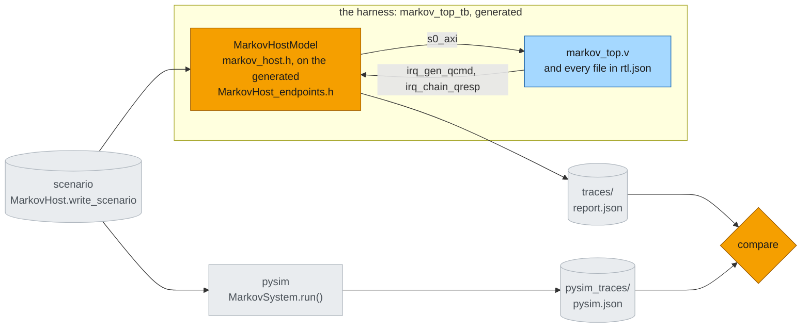

# XSI testbench

The last steps of the [build flow](build.md) put the Verilog from [Synthesis](synth.md) under a
testbench and check it against pysim. The testbench is not written: at RTL the host has to act on pins
every clock cycle, so `MarkovHost` has a C++ twin. The framework generates the harness that binds the
twin to the top's ports, compiles it with the RTL, and runs it in Vivado's `xsim` through XSI. pysim
runs the same system from the same scenario file, and the two hosts' traces must agree byte for byte.
The results and the timing story are on [RTL simulation](rtlsim.md); the general flow is the guide page
[XSI system simulation](../../guide/build/xsi_system.md#running-it).



*Fig. 3 -- the system under its testbench. Orange: what this page adds -- the host's C++ twin (the one
hand-written piece; its endpoints and the harness around it are generated), and the comparison. Blue:
the RTL from [Synthesis](synth.md), compiled as `rtl.json` lists it. Grey: the files the two runs share
and leave, and the pysim run they are checked against.*

| step | what it does |
|---|---|
| [scenario](../../guide/build/xsi_system.md#scenario) | `MarkovHost` writes its four jobs as a burst bundle: the one file both hosts read, so no job is restated in C++ |
| [pysim](../../guide/build/xsi_system.md#pysim) | the same system object in pysim, from that file: the host's traces and its cycle count |
| [system_xsi](../../guide/build/xsi_system.md#system-xsi) | the harness, compiled with the RTL (`xvlog` / `xelab` for the Verilog, `g++` for the testbench) and run; the host's report to `report.json` |
| [compare](../../guide/build/xsi_system.md#compare) | every host endpoint's trace, RTL against pysim, file for file; any difference fails the run |

## The host, in C++ {#the-host-in-c}

At RTL the host cannot be Python: it has to act on pins every clock cycle. So `MarkovHost` has a
**second realization**, `MarkovHostModel` in [`markov_host.h`](../../../examples/markov/markov_host.h)
beside `markov.py`, and names it with two class attributes:

```python
class MarkovHost(SwHost):
    max_in_flight: DynParam[int] = MAX_IN_FLIGHT
    cpp_model: ClassVar[str | None] = "MarkovHostModel"
    cpp_header: ClassVar[str | None] = "markov_host.h"
```

What you write in that header is **the program and nothing else** -- the same two threads as the Python
host, line for line ([software threads](../../../plans/host_runtime.md)):

```cpp
class MarkovHostModel : public MarkovHost_endpoints {
public:
    using MarkovHost_endpoints::MarkovHost_endpoints;
    long max_in_flight = 0;             // DynParam

    void main() override {              // ~ MarkovHost.main
        decode();
        slots_.reset(new SwSemaphore(sched_, max_in_flight));
        start("writer", [this] { writer(); });
        reader();
    }

private:
    void writer() {                     // ~ MarkovHost._writer
        for (const Job& j : jobs_) {
            slots_->acquire();
            qcmd.write(j.cmd);
        }
    }
    void reader() {                     // ~ MarkovHost._reader
        for (size_t k = 0; k < jobs_.size(); ++k) {
            const MkvResp r = qresp.get<MkvResp>();
            const Job& j = jobs_[(size_t)r.tx_id];
            mem_reader.read(j.xaddr, j.xwords);
            t_done_[(size_t)r.tx_id] = bus_.cycle();
            slots_->release();
        }
    }
    ...
};
```

Everything else is generated or framework:

- **`MarkovHost_endpoints.h`** (generated from the wired host, `waveflow/build/sw_host_gen.py`) declares
  `qcmd`, `qresp` and `mem_reader` -- named as in Python, each on its view at its absolute bus address,
  with its interrupt pin -- and the bus master. The C++ never names an address, a pin or a threshold.
- **The runtime** (`xsi_sw.h`, `xsi_fiber.h`) makes the calls block: each thread is a **fiber**, a call like
  `qresp.get<MkvResp>()` parks it until its bus transactions are done, and a scheduler resumes the threads
  once per cycle in a fixed order -- so the program has no state machine, and the run is deterministic.
- **Typed messages**: `qresp.get<MkvResp>()` returns the generated `MkvResp` struct (`xsi_sw_schema.h`),
  so `r.tx_id` is read by name, never by bit position.
- **Settings and files travel as DynParams** -- `max_in_flight`, and `SwHost`'s `scenario` (the bundle the
  Python host writes, so the jobs are never restated in C++) and `trace_dir` -- assigned by the harness.
- **Reports and traces**: the runtime prints `DONE done= cycles= polls= nops=` and one `OP` line per bus
  operation, and dumps what crossed each endpoint as a burst bundle; `report()` adds the job lines.

| Python (`MarkovHost`) | C++ (`MarkovHostModel`) |
|---|---|
| a SimPy process per thread | a fiber per thread |
| `yield from self.slots.acquire()` | `slots_->acquire()` |
| `yield from self.qcmd.write(cmd)` | `qcmd.write(j.cmd)` |
| `yield from self.qresp.get_schema(MkvResp)` | `qresp.get<MkvResp>()` |
| `yield from self.mem_reader.read(n, addr)` | `mem_reader.read(addr, n)` |

## Running it

```bash
python -m examples.markov.markov_build                     # the whole build flow, through compare
python -m examples.markov.markov_build --through pysim     # the pysim side alone (no Vivado)
```

The run lands in `xsi_work/markov/`: `report.json` (the host's report: `DONE`, the bus operations),
`pysim.json`, `compare.json`, the scenario and both sets of traces. `system_xsi.load_run(...)` reads them
back as an `XsiRun` -- the output, `cycles`, `polls`, `nops`, the bus `ops`, `pysim_cycles` and
`trace_mismatches`.

## Reading the results

The C++ host reports what the bus did; the data comes back as **traces**, which the gate test
([`test_markov_xsi.py`](../../../tests/examples/test_markov_xsi.py)) decodes with the schemas
themselves:

```python
def trace_report(out: str, traces) -> str:
    t = {int(m[1]): int(m[2]) for m in re.finditer(r"^JOBT (\d+) t=(\d+)", out, re.M)}
    resp = [MkvResp().deserialize(b, word_bw=DW)
            for b in read_burst_bundle(traces / "qresp")]
    xs = read_burst_bundle(traces / "mem_reader")
    ...                                          # one "JOB <tx> ones=<n> t=<cycle> X <words>" per job
```

The k-th region read follows the k-th response, so each response is paired with its `x` words.
`job_results(run.output)` turns the `JOB` lines into `{job: {"ones", "t", "x"}}`.

```python
run = load_run("examples/markov/xsi_work/markov")    # after python -m examples.markov.markov_build
run.output += trace_report(run.output, run.traces)
run.cycles, run.polls, run.trace_mismatches          # 1870, 0, []
job_results(run.output)[2]["ones"]                   # 257
```

## The gates

[`tests/examples/test_markov_xsi.py`](../../../tests/examples/test_markov_xsi.py) runs the example's DAG
once (a module fixture) through `compare`, with `synth="check"`, and checks what `load_run` reads back.
Its `codegen` regenerates the headers and tops first (seconds), so the stamp check compares the RTL
against this checkout's sources. In check mode a missing or stale top **fails** the gate, naming it --
a gate never synthesizes, and never runs against RTL that was not built from the sources on disk.

| gate | checks |
|---|---|
| `test_markov_rtl_bit_exact` | every job's `x` and `ones` against the golden |
| `test_markov_rtl_host_never_polls` | every host read is a response or an `x` read -- no queue count |
| `test_markov_rtl_cycles` | exactly **1870** cycles |
| `test_markov_pysim_tracks_rtl` | pysim's cycle count (`run.pysim_cycles`) within 5% of the RTL's |
| `test_markov_host_traces_match_pysim` | the host's three traces **byte-identical** between pysim and RTL |

The last one is what ties the two hosts together. Nothing static can show that `MarkovHostModel`
behaves like `MarkovHost`, so the DAG's `pysim` step runs the system **from the same scenario file** and
its `compare` step compares each endpoint's trace -- the commands, the responses, the `x` regions --
file for file. Per endpoint, not as one log: the interleaving across endpoints is timing, and pysim is loosely timed.

```bash
pytest tests/examples/test_markov_xsi.py -m xsi
```

## After it works: timing probes

Only once the gates pass is the cycle count worth explaining.
`python -m examples.markov.markov_build --probes` (or `build_dag(probes=True)`) builds the top with
one-bit **probes** on the handshakes `timing_probes` names, in its own workspace
(`xsi_work/markov_probes/`). `timing_probes` lives in `markov.py`, beside `MarkovSystem`. You name each
probe by the **pysim object** you want to watch, never by a net:

```python
def timing_probes(sysm: MarkovSystem) -> dict:
    gen, chain, link = sysm.gen, sysm.chain, sysm.u_link
    return {
        "cmd": beat(gen.s_cmd),                          # host's command reaches the generator
        "ufwd": beat(gen.m_u.fwd_ep),                    # generator -> its queue writer, a word
        "ufwd_last": last(gen.m_u.fwd_ep),               # ... the last word of a chunk
        "wr1_aw": beat(link.fwd_writer.m_mem, "AW"),     # queue writer: a burst issued
        "wr1_b": beat(link.fwd_writer.m_mem, "B"),       # ... and acknowledged
        ...
        "resp": beat(chain.m_resp),                      # a response word into qresp
    }
```

| helper | on a stream endpoint | on a bus master, channel `"AW"`/`"W"`/`"B"`/`"AR"`/`"R"` |
|---|---|---|
| `beat(ep)` | a word moves: `TVALID && TREADY` | a transfer on that channel |
| `stall(ep)` | offered, not taken: `TVALID && !TREADY` | the same, on that channel |
| `last(ep)` | the word that ends a packet | `W` / `R` only: the burst's last beat |

The system top resolves each one: a stream endpoint to the net its `StreamIF` became (the producer's
side of a FIFO'd link for the producer, the consumer's side for the consumer), a bus master to its
crossbar slot. A probe on something that is not in the top is refused with the reason. (A raw Verilog
string over the top's nets still works, for anything the helpers do not cover.)

Each probe becomes an output `probe_<name>` of the top and a `ProbePin` in the harness, which prints
the cycles it fired (`PROBE <name> start+len ...`); the gate test's `probe_runs(out)` parses them. How
the probes took this system from 2356 cycles to 1870 is [Finding the time](rtlsim.md#finding-the-time).

## Doing this for another system

1. Get the system running bit-exact in pysim, with the host as a `SwHost` that creates its bus master
   and interrupt inputs (`add_bus_master`, `add_irq`; [The host](host.md)) and the bus wiring built as
   in [The system](system.md).
2. Write the `codegen` step: every kernel's headers and top, and each bus writer's top
   (`write_writer_project`), with their `.tcl`.
3. Give the host `scenario_bursts()` (its jobs as word messages) and `cpp_model` / `cpp_header`, and
   write that C++ class: derive it from the generated `<Host>_endpoints`, override `main()`, and write
   each Python thread as a C++ function on the same endpoints. Settings it needs are `DynParam`s.
4. Build the DAG ([Build flow](build.md)) -- `codegen`, then `add_system_steps(dag, system,
   work_dir=...)` -- and hand it to `run_dag_cli`. csynth, the system's RTL, the scenario, pysim, the
   XSI run and the comparison come with that call.
5. Gate it: run the DAG with `synth="check"`, read the run back with `load_run`, decode the traces into
   whatever results your gates check, and require bit-exact results, the exact cycle count and
   `run.trace_mismatches == []`.
