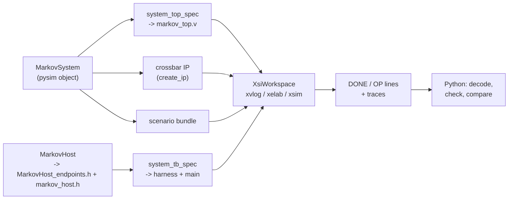

# XSI testbench

[`examples/markov/markov_xsi.py`](../../../examples/markov/markov_xsi.py) runs the whole system at RTL:
the csynth'd kernels, their adaptors, AMD's crossbar and a BRAM under one Verilog top, simulated by
Vivado's `xsim` through XSI, and driven by a C++ host. The point of the file is what it does **not**
contain: no Verilog and no C++ in Python strings, and no plumbing. It hands the same `MarkovSystem`
pysim runs ([The system](system.md)) to one framework call, `run_system_xsi`, which walks it to the top,
generates the harness around `MarkovHost`'s C++ twin, runs it and checks the host against pysim. This
page goes through the file in the order you need it. The results and the timing story are on
[RTL simulation](rtlsim.md); the general flow is the guide page
[XSI system simulation](../../guide/build/xsi_system.md).



## Before you start

- **pysim works.** Everything here derives from `MarkovSystem(link="mm")`; if it does not run bit-exact
  in Python ([Python simulation](pysim.md)), nothing below will.
- **The four tops are synthesized:** `python -m examples.markov.markov_build` generates every header and
  top and runs csynth on `markov_gen`, `markov_chain` and the credit link's two writers
  ([Code generation](codegen.md)). Their Verilog lands in `<top>_proj/solution1/syn/verilog/`.
- **Vivado** (`create_ip` for the crossbar, `xsim` for the simulation) and a C++ compiler — the mingw
  `g++` that ships with Vivado on Windows, the system `g++` on Linux.

## The scenario and the system

```python
ROOT = Path(__file__).resolve().parent
QWRITER = writer_top_name("queue", DW, QDEPTH)
CWRITER = writer_top_name("credit", DW)
TOPS = ("markov_gen", "markov_chain", QWRITER, CWRITER)

def rtl_dir(top: str) -> Path:
    return ROOT / f"{top}_proj" / "solution1" / "syn" / "verilog"

XBAR_NAME = "xbar_markov_4x3"
NJOBS, NSTEPS = 4, 300

def scenario_jobs() -> list[dict]:
    return default_jobs(NJOBS, NSTEPS)

def system() -> MarkovSystem:
    return MarkovSystem(jobs=scenario_jobs(), link="mm")
```

`TOPS` names the csynth'd modules and `rtl_dir` where each one's Verilog is; the writers' names are
derived the way `markov_build` derives them, never typed. `system()` is the **same object pysim runs**,
on the gate's scenario: four jobs of 300 steps. Everything below starts from it.

## The Verilog top: walked from the graph

```python
def system_spec(sysm: MarkovSystem | None = None) -> SystemTopSpec:
    sysm = sysm or system()
    return system_top_spec(sysm.xbar, [sysm.gen, sysm.chain, sysm.mem], top="markov_top",
                           xbar_name=XBAR_NAME)
```

`system_top_spec` ([`waveflow/build/system_top.py`](../../../waveflow/build/system_top.py)) walks the
pysim graph out from the crossbar. The list is **the cut** — what is synthesized into the top: the two
kernels and the memory. What belongs to them comes along: each kernel's adaptor and views (Step 4 of
[The system](system.md#step-4-each-kernels-memory-mapped-device)), and the credit link's two writers
(Step 5). Everything else — the host — stays outside, and what it was bound to becomes a port of the
top:

| in the pysim graph | in `markov_top.v` |
|---|---|
| `host.m` on crossbar master 0 | the top's AXI4 slave port `s0_axi` |
| the writers' and the chain's masters (1, 2, 3) | crossbar SI slots on internal wires `si1_axi` .. `si3_axi` |
| each device's port, the memory | MI slots: two adaptors (`render_adaptor_slot`) and a BRAM window |
| each `StreamIF` | stream nets named after it (`gen_k_qcmd`, `u_fwd`, `chain_k_qu`, ...) |
| `u_fwd`, 32 deep, between two kernels | an `mm_sync_fifo` |
| the two writers | their csynth'd tops, each with its `target` (the peer view's word address) |
| the `IrqIF`s to the host | outputs `irq_gen_qcmd`, `irq_chain_qresp` |

Each kernel's pins come from the same `TopSpec` its csynth top was rendered from, and the tie-offs
(unused `s_axi_control` inputs low, ID widths, unframed ports' `TLAST`) are the framework's rules. The
spec can be asked before it is rendered — `spec.si`, `spec.mi`, `spec.nets`, `spec.irqs`,
`spec.modules` — and `render_system_top(spec)` emits the Verilog.

```python
def xbar_config() -> AxiXbarConfig:
    return system_spec().xbar
```

The crossbar's configuration — four SI, three MI at the ranges `assign_address_ranges` set — is part of
the spec, so the IP AMD generates decodes the same addresses pysim did.

`run_xsi` does not even call `system_spec`: `run_system_xsi` finds the crossbar and the host among the
simulation's objects and takes the same cut by default — every kernel whose device is a crossbar slave,
then every memory on the crossbar. `system_spec` stays for asking about the top without running it.

## The host, in C++ {#the-host-in-c}

At RTL the host cannot be Python: it has to act on pins every clock cycle. So `MarkovHost` has a
**second realization**, `MarkovHostModel` in [`markov_host.h`](../../../examples/markov/markov_host.h)
beside `markov.py`, and names it with two class attributes:

```python
class MarkovHost(SwHost):
    max_in_flight: DynParam[int] = MAX_IN_FLIGHT
    cpp_model: ClassVar[str | None] = "MarkovHostModel"
    cpp_header: ClassVar[str | None] = "markov_host.h"
```

What you write in that header is **the program and nothing else** -- the same two threads as the Python
host, line for line ([software threads](../../../plans/host_runtime.md)):

```cpp
class MarkovHostModel : public MarkovHost_endpoints {
public:
    using MarkovHost_endpoints::MarkovHost_endpoints;
    long max_in_flight = 0;             // DynParam

    void main() override {              // ~ MarkovHost.main
        decode();
        slots_.reset(new SwSemaphore(sched_, max_in_flight));
        start("writer", [this] { writer(); });
        reader();
    }

private:
    void writer() {                     // ~ MarkovHost._writer
        for (const Job& j : jobs_) {
            slots_->acquire();
            qcmd.write(j.cmd);
        }
    }
    void reader() {                     // ~ MarkovHost._reader
        for (size_t k = 0; k < jobs_.size(); ++k) {
            const MkvResp r = qresp.get<MkvResp>();
            const Job& j = jobs_[(size_t)r.tx_id];
            mem_reader.read(j.xaddr, j.xwords);
            t_done_[(size_t)r.tx_id] = bus_.cycle();
            slots_->release();
        }
    }
    ...
};
```

Everything else is generated or framework:

- **`MarkovHost_endpoints.h`** (generated from the wired host, `waveflow/build/sw_host_gen.py`) declares
  `qcmd`, `qresp` and `mem_reader` -- named as in Python, each on its view at its absolute bus address,
  with its interrupt pin -- and the bus master. The C++ never names an address, a pin or a threshold.
- **The runtime** (`xsi_sw.h`, `xsi_fiber.h`) makes the calls block: each thread is a **fiber**, a call like
  `qresp.get<MkvResp>()` parks it until its bus transactions are done, and a scheduler resumes the threads
  once per cycle in a fixed order -- so the program has no state machine, and the run is deterministic.
- **Typed messages**: `qresp.get<MkvResp>()` returns the generated `MkvResp` struct (`xsi_sw_schema.h`),
  so `r.tx_id` is read by name, never by bit position.
- **Settings and files travel as DynParams** -- `max_in_flight`, and `SwHost`'s `scenario` (the bundle the
  Python host writes, so the jobs are never restated in C++) and `trace_dir` -- assigned by the harness.
- **Reports and traces**: the runtime prints `DONE done= cycles= polls= nops=` and one `OP` line per bus
  operation, and dumps what crossed each endpoint as a burst bundle; `report()` adds the job lines.

| Python (`MarkovHost`) | C++ (`MarkovHostModel`) |
|---|---|
| a SimPy process per thread | a fiber per thread |
| `yield from self.slots.acquire()` | `slots_->acquire()` |
| `yield from self.qcmd.write(cmd)` | `qcmd.write(j.cmd)` |
| `yield from self.qresp.get_schema(MkvResp)` | `qresp.get<MkvResp>()` |
| `yield from self.mem_reader.read(n, addr)` | `mem_reader.read(addr, n)` |

## Running it: `run_xsi`

```python
def run_xsi(work_dir, timeout: int = 3600, probes: bool = False) -> XsiRun:
    sysm = system()
    run = run_system_xsi(sysm, work_dir, top="markov_top", xbar_name=XBAR_NAME, workspace="markov",
                         probes=timing_probes(sysm) if probes else None, timeout=timeout)
    run.output += trace_report(run.output, run.traces)
    return run
```

[`run_system_xsi`](../../../waveflow/build/system_xsi.py) does the rest, from the system object alone:

1. **Discover** the crossbar, the software host and the cut among the simulation's objects.
2. **Check the RTL**: every module the top instantiates must be synthesized and not stale; if not, it
   says so and names the build to run.
3. **Generate** the crossbar IP (cached by its configuration), the top, the harness with
   `MarkovHost_endpoints.h` and `markov_host.h`, and the scenario the host writes.
4. **Run** under XSI (`xvlog` / `xelab` build the RTL, `g++` the testbench), and parse the host's report.
5. **Check the host**: run the same system in pysim from the same scenario file, and compare every
   endpoint's trace, file for file (`run.trace_mismatches`, empty when they agree).

The returned `XsiRun` carries the output, `cycles`, `polls`, `nops`, the bus `ops`, the paths of the
workspace, scenario and traces, and `pysim_cycles`.

## Reading the results

The C++ host reports what the bus did; the data comes back as **traces**, which the example decodes
with the schemas themselves:

```python
def trace_report(out: str, traces) -> str:
    t = {int(m[1]): int(m[2]) for m in re.finditer(r"^JOBT (\d+) t=(\d+)", out, re.M)}
    resp = [MkvResp().deserialize(np.asarray(b, dtype=np.uint64), word_bw=DW)
            for b in read_burst_bundle(traces / "qresp")]
    xs = read_burst_bundle(traces / "mem_reader")
    ...                                          # one "JOB <tx> ones=<n> t=<cycle> X <words>" per job
```

The k-th region read follows the k-th response, so each response is paired with its `x` words.
`job_results(run.output)` turns the `JOB` lines into `{job: {"ones", "t", "x"}}`.

```python
run = run_xsi("xsi_work")                        # or: python -m examples.markov.markov_xsi xsi_work
run.cycles, run.polls, run.trace_mismatches      # 1870, 0, []
job_results(run.output)[2]["ones"]               # 257
```

## The gates

[`tests/examples/test_markov_xsi.py`](../../../tests/examples/test_markov_xsi.py) runs `run_xsi` once
(a module fixture) and checks the `XsiRun`. The fixture first regenerates the headers and tops
(`markov_build.generate`, seconds) and refuses to run against RTL that was not built from the sources on
disk -- a skipped XSI test counts as a failure (`pytest -m xsi` requires every gate to run).

| gate | checks |
|---|---|
| `test_markov_rtl_bit_exact` | every job's `x` and `ones` against the golden |
| `test_markov_rtl_host_never_polls` | every host read is a response or an `x` read -- no queue count |
| `test_markov_rtl_cycles` | exactly **1870** cycles |
| `test_markov_pysim_tracks_rtl` | pysim's cycle count (`run.pysim_cycles`) within 5% of the RTL's |
| `test_markov_host_traces_match_pysim` | the host's three traces **byte-identical** between pysim and RTL |

The last one is what ties the two hosts together. Nothing static can show that `MarkovHostModel`
behaves like `MarkovHost`, so `run_system_xsi` runs the pysim system **from the same scenario file** and
compares each endpoint's trace -- the commands, the responses, the `x` regions -- file for file. Per
endpoint, not as one log: the interleaving across endpoints is timing, and pysim is loosely timed.

```bash
pytest tests/examples/test_markov_xsi.py -m xsi
```

## After it works: timing probes

Only once the gates pass is the cycle count worth explaining. `run_xsi(work_dir, probes=True)` builds
the top with one-bit **probes** on the handshakes you name. You name them by the **pysim object** you
want to watch, never by a net:

```python
def timing_probes(sysm: MarkovSystem) -> dict:
    gen, chain, link = sysm.gen, sysm.chain, sysm.u_link
    return {
        "cmd": beat(gen.s_cmd),                          # host's command reaches the generator
        "ufwd": beat(gen.m_u.fwd_ep),                    # generator -> its queue writer, a word
        "ufwd_last": last(gen.m_u.fwd_ep),               # ... the last word of a chunk
        "wr1_aw": beat(link.fwd_writer.m_mem, "AW"),     # queue writer: a burst issued
        "wr1_b": beat(link.fwd_writer.m_mem, "B"),       # ... and acknowledged
        ...
        "resp": beat(chain.m_resp),                      # a response word into qresp
    }
```

| helper | on a stream endpoint | on a bus master, channel `"AW"`/`"W"`/`"B"`/`"AR"`/`"R"` |
|---|---|---|
| `beat(ep)` | a word moves: `TVALID && TREADY` | a transfer on that channel |
| `stall(ep)` | offered, not taken: `TVALID && !TREADY` | the same, on that channel |
| `last(ep)` | the word that ends a packet | `W` / `R` only: the burst's last beat |

The system top resolves each one: a stream endpoint to the net its `StreamIF` became (the producer's
side of a FIFO'd link for the producer, the consumer's side for the consumer), a bus master to its
crossbar slot. A probe on something that is not in the top is refused with the reason. (A raw Verilog
string over the top's nets still works, for anything the helpers do not cover.)

Each probe becomes an output `probe_<name>` of the top and a `ProbePin` in the harness, which prints
the cycles it fired (`PROBE <name> start+len ...`); `probe_runs(out)` parses them. How the probes took
this system from 2356 cycles to 1870 is [Finding the time](rtlsim.md#finding-the-time).

## Doing this for another system

1. Get the system running bit-exact in pysim, with the host as a `SwHost` that creates its bus master
   and interrupt inputs (`add_bus_master`, `add_irq`; [The host](host.md)) and the bus wiring built as
   in [The system](system.md).
2. Build and synthesize every kernel (the `*_build` script).
3. Give the host `scenario_bursts()` (its jobs as word messages) and `cpp_model` / `cpp_header`, and
   write that C++ class: derive it from the generated `<Host>_endpoints`, override `main()`, and write
   each Python thread as a C++ function on the same endpoints. Settings it needs are `DynParam`s.
4. Call `run_system_xsi(system, work_dir, top=...)`, and decode the traces into whatever results your
   gates check.
5. Gate it: bit-exact, the exact cycle count, and `run.trace_mismatches == []`.
