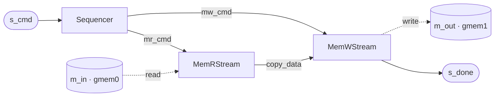

# Memory Copy

`mem_copy` copies a run of words from one memory region to another. It is deliberately the simplest
design that still exercises the whole [concurrent (free-running) flow](../../guide/flows/concurrent.md):
a **composite of free-running `hls::task`s** with two `m_axi` memory ports, internal streams between the
stages, and a completion signal back to the host. Nothing is computed — the payload is copied unchanged
— so the design's *structure* is the subject, not its math.

## Why a data mover is worth building

Even though it looks like a toy, a **data mover** is a genuinely useful hardware block. Moving a buffer
from one place in memory to another — or between memory and a peripheral — is work a CPU can do, but
doing it word-by-word burns cycles the CPU could spend on real computation. Offloading that copy to a
small piece of fabric frees the host: it issues one command and the accelerator performs the whole burst
transfer on its own. This is exactly what a **DMA engine** does in an SoC, and `mem_copy` is a minimal
version of that pattern — which is why it is also a natural first free-running example.

## The three-stage structure

The design (`examples/mem_copy/`) is a three-stage pipeline, driven by a command stream and reporting on
a done stream. Each stage is a **leaf `FreeRunComp`** — it implements `run_iter` (one firing per job)
and lowers to one `ap_ctrl_none` `hls::task`:

- **`Sequencer`** — a pure-stream stage that owns no memory. It reads one `CopyCmd` from the boundary
  stream `s_cmd` and turns it into two commands: an `MRCmd` (read) and an `MWCmd` (write). It stamps
  each with a per-job cookie (`xfer_msg`) so a completion can be traced back to the job that issued it.
- **`MemRStream`** — the `m_axi` **read** owner. Given an `MRCmd`, it bursts the source region from its
  memory port (`m_in`, bundle `gmem0`) onto an internal data stream.
- **`MemWStream`** — the `m_axi` **write** owner. Given an `MWCmd`, it drains that data stream into the
  destination region of its memory port (`m_out`, bundle `gmem1`), then emits a `MemComplete` on the
  boundary stream `s_done` — carrying the word count and the echoed `xfer_msg` cookie.

## The internal interconnect

The stages are wired by **internal FIFOs** — `mr_cmd` (Sequencer → MemRStream), `mw_cmd` (Sequencer →
MemWStream), and `copy_data` (MemRStream → MemWStream). These become `hls::stream`s inside the generated
top and never appear at the boundary. What *does* appear at the boundary is four ports: the command in
(`s_cmd`), the two `m_axi` masters (`m_in`/`gmem0`, `m_out`/`gmem1`), and the completion out (`s_done`).

Because the stages are free-running, they **overlap**: while `MemWStream` is still storing job *j*, the
`Sequencer` and `MemRStream` can already be working on job *j+1*. That pipelining is the whole reason the
stages are `ap_ctrl_none` tasks rather than host-launched — it is what makes the per-job cost
`max(read, write)` instead of `read + write`.

## Building blocks

`MemRStream` and `MemWStream` are **framework** components (`waveflow/hw/mem_stream.py`), not part of
this example — any accelerator can compose them as its load / store stage. They are documented in
[Streaming Memory Kernels](../../guide/memory/memstream.md), which also walks the generated composite top
and the generated XSI testbench in detail. Only the `Sequencer` and the composite wiring are specific to
`mem_copy`; the following pages build the example up from there.

**Source:** [`examples/mem_copy/`](../../../examples/mem_copy/).
