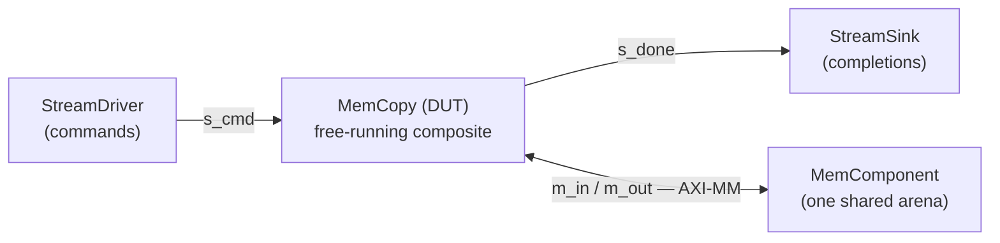

# Testbench (Python)

The testbench is **itself a component graph**. It is not a script that pokes the design — it is the
DUT plus the participants that surround it, wired with the same `Interface` objects the design uses
internally. That is the whole trick: **one graph drives two backends** — run it in Python for a fast
SimPy simulation, or walk it with the code generator for a cycle-accurate RTL harness
([Testbench codegen](./codegen_tb.md)). Neither can describe a different test, because there is only
one description.

The testbench is two classes in `examples/mem_copy/mem_copy_sim.py`:

- **`MemCopyTB`** — the **graph**. Pure structure: the participants and their wiring, nothing else. A
  generator walks it; a graph is *data*.
- **`MemCopySim`** — the **procedure**. The code that drives the graph: materialize a scenario, run
  the SimPy model, check the golden. A driver is *code*.

Keeping them apart is the point — `MemCopyTB.__post_init__` builds only structure, so nothing a
generator introspects is entangled with file I/O or the golden.

## The graph: `MemCopyTB`

`mem_copy` exposes four boundary ports, so the testbench puts something on each: a source for commands,
a sink for completions, and memory behind the two `m_axi` bundles.



All three participants are **framework** classes — you do not write them (see
[Stream drivers and sinks](../../guide/sim/stream_tb.md)):

| participant | what it does |
|---|---|
| [`StreamDriver`](../../guide/sim/stream_tb.md) | plays a burst bundle of commands onto `s_cmd` |
| [`StreamSink`](../../guide/sim/stream_tb.md) | collects the `CopyResp` records off `s_done` |
| `MemComponent` | the arena **both** `m_axi` bundles read and write |

The memory being *one* component behind *two* bundles matters: `m_in` reads and `m_out` writes the same
words, which is what makes this a copy rather than two unrelated transfers.

`__post_init__` instantiates those participants and the DUT and wires them — nothing more. It puts **no
data** in memory; it declares that the memory will load `vectors/mem_in` in `pre_sim` (a `load_segs`
entry), exactly like the RTL memory:

```python
        self.mem = MemComponent(name=f"{self.name}_mem", sim=self.sim, inline=False, clk=self.clk,
                                word_size=w, addr_size=32, nwords_tot=self.arena_words * 4)
        self.mem.alloc(int(self.mem.nwords_tot))         # full capacity: mem_in loads directly, no clip
        self.mem.load_segs = [MemSeg(0, 0, "vectors/mem_in")]

        self.dut = MemCopy(name=f"{self.name}_copier", sim=self.sim, mem_dwidth=w)
        self.driver = StreamDriver(sim=self.sim, bitwidth=w, in_bundle="vectors/s_cmd")   # names a PATH
        self.done_sink = StreamSink(sim=self.sim, bitwidth=w, out_bundle="vectors/s_done")
```

The driver and sink name a *path*, not bytes — `in_bundle` is the one path both backends read (pysim's
`StreamDriver` and the RTL `AxisMaster` both load `vectors/s_cmd` in their `pre_sim`). Then the graph
is wired: two streams with `StreamIF`, and the two `m_axi` bundles onto one arena with a crossbar:

```python
        cmd_if = StreamIF(...);  cmd_if.bind("master", self.driver.stream_ep); cmd_if.bind("slave", self.dut.s_cmd)
        done_if = StreamIF(...); done_if.bind("master", self.dut.s_done); done_if.bind("slave", self.done_sink.stream_ep)
        xbar = AXIMMCrossBarIF(sim=self.sim, clk=self.clk, nports_master=2, nports_slave=1, bitwidth=w)
        xbar.bind("master_0", self.dut.m_in)     # read  (gmem0)
        xbar.bind("master_1", self.dut.m_out)    # write (gmem1)
        xbar.bind("slave_0",  self.mem.s_mm)     # ... both onto the one arena
```

Notice what is *not* here: no clock or reset driving, no handshake logic, no per-cycle stepping, no
golden. Those are the framework's job — you described *what* connects to *what*, and the simulation
supplies the *how*. (One deliberate subtlety: the crossbar **models contention** between the two
bundles, whereas the RTL slave models do not — which is part of why pysim timing runs optimistic, see
[RTL simulation](./rtlsim.md).)

## The procedure: `MemCopySim`

`MemCopySim` owns a `MemCopyTB` and the three things you *do* with it.

**`write_scenario`** — the **single** scenario writer both backends share. It computes the source
patterns once (a seeded PRNG per job), stores `expected` for the check, writes the vectors, and points
the participants at the root:

```python
    def write_scenario(self, root) -> None:
        for j, job in enumerate(tb._jobs):
            known = np.random.default_rng(0xC0FFEE + j).integers(0, 1 << w, job.n_words, dtype=...)
            mem_in[job.src_off:job.src_off + job.n_words] = known
            golden[job.dst_off:job.dst_off + job.n_words] = known
            self.expected.append(known)
        write_burst_bundle(tb.cmd_words, root / "vectors" / "s_cmd")
        write_burst_bundle([mem_in],     root / "vectors" / "mem_in")
        write_burst_bundle([golden],     root / "vectors" / "golden")
        tb.driver.root = root;  tb.mem.root = root       # resolved in pre_sim
```

The seed lives here, not in the graph, and it matters twice over: a full-width **seeded** pattern
exercises **every** bit of the word (a low ramp like `arange(n)` leaves the top bits zero, so a bug
dropping the high half could pass unseen), and it stays **reproducible** — a failing run replays
exactly from `0xC0FFEE + j`. This same method is what the RTL rung calls to write *its* vectors
(`write_mem_copy_xsi_bundles` is a one-line wrapper), so the two runs can never start from different
bytes — one writer, two roots.

**`run`** materializes the scenario into a temp dir, runs the SimPy model, and checks. **`check`** is
the golden — a bit-exact region compare per job, plus a completion count:

```python
    got = tb.mem._mem.read(job.dst_off * bpw, job.n_words)
    assert np.array_equal(got, exp)               # every destination word
    assert len(tb.done_sink.words) == len(jobs)   # one CopyResp per job
```

Both matter. The region compare catches a wrong address, a short burst, or a dropped word. The token
count catches what the compare cannot see: a copy that happened but never reported, which at the RTL
rung would hang a host waiting on a completion that never arrives.

## Running the pysim step

The example uses the standard build CLI; `pysim` is the default target:

```bash
python examples/mem_copy/mem_copy_build.py --through pysim
```

> **Works from any directory.** The examples are an installed package (`pip install -e ".[dev]"`), so
> the imports and the build CLI resolve wherever you run them — no `PYTHONPATH` juggling.

```
pysim:
    results\pysim.json
    RUNNING...
[pysim] 16 jobs, all bit-exact, 16 done tokens, end=2256 cycles
    PASSED
```

That runs the canonical 16-job scenario and writes `results/pysim.json` (correctness + timing) — no
toolchain, seconds not minutes. To drive your own scenario, call `run_copy` (a thin wrapper over
`MemCopySim(jobs, mem_dwidth).run()`):

```python
from examples.mem_copy.mem_copy import CopyJob
from examples.mem_copy.mem_copy_sim import run_copy

dut = run_copy(jobs=(CopyJob(src_off=16, dst_off=600, n_words=128),
                     CopyJob(src_off=200, dst_off=900, n_words=64)), mem_dwidth=64)
```

Each job is a `CopyJob` — named fields in **word coordinates**, so you never memorize an offset order
(a bare `(src, dst, n)` tuple is coerced). `run_copy` builds the sim, runs it, checks it, and hands
back the DUT to inspect.

## The lifecycle

`run` ends in `sim.run_sim()`, which drives every registered `SimObj` through three phases:

1. `pre_sim()` on all objects, in registration order (the driver loads `s_cmd`, the memory loads
   `mem_in`);
2. each object's `run_proc()` scheduled as a SimPy process — passive participants (the memory) return
   `None` and are skipped;
3. `env.run()` until no events remain, then `post_sim()` (the sink dumps `s_done`).

This is the same shape as the C++ `XsiSimObj` lifecycle at the RTL rung — not a coincidence;
[the BFM models](../../guide/build/bfm.md) were built to mirror it. Two traps: **never call
`sim.add_obj()` yourself** (`SimObj.__init__` already registers — a second call double-steps the
object), and **`elaborate()` is not pysim** (it builds a simulation-free graph for codegen; for
behavior, build with a real `Simulation` and `run_sim()`).

## What the pysim run reports

pysim carries a timing model, so the run yields real numbers (simulated time × clock frequency = cycles):

| measure             | value                             |
| ------------------- | --------------------------------- |
| one job, end to end | 156 cycles                        |
| 16 jobs, end to end | 2256 cycles                       |
| per-transfer span   | read 137 cycles, write 140 cycles |

Those decompose exactly — `156 + 15 × 140 = 2256` — into a **fill latency** and a **steady-state
period** per job. The period is the interesting part: a job reads for 137 and writes for 140, so a
sequential design would need ~277 cycles/job. Getting ~140 means the read and the write **overlap** —
`max(read, write)`, not `read + write`. The pipeline works. Because the driver never waits for a
completion, jobs overlap across the whole run — the kernel reads job *j+1* while still writing job *j*,
the property the free-running design exists for. How close these numbers land to the real RTL is on the
[RTL simulation](./rtlsim.md) page.

## Next

- [DUT codegen](./codegen_dut.md) — how the `MemCopy` graph becomes the `ap_ctrl_none` `hls::task` top.
- [Testbench codegen](./codegen_tb.md) — how *this* graph becomes the XSI BFM harness.
