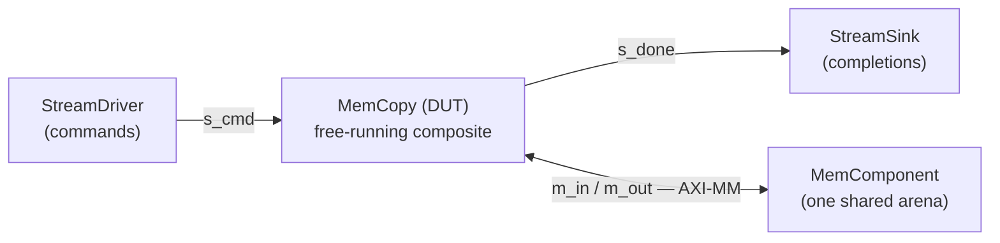

# Testbench

The testbench is **itself a composite component**. It is not a script that pokes the design — it is a
graph: the DUT, plus the participants that surround it, wired with the same `Interface` objects the
design uses internally. That is the whole trick of this flow, because **one graph drives two backends**:
run it in Python and you get a fast SimPy simulation; walk it with the code generator and you get a
cycle-accurate RTL testbench. Neither can describe a different test, because there is only one
description.

The whole testbench is `examples/mem_copy/mem_copy_sim.py` (`MemCopyTB`).

## Three participants around the DUT

`mem_copy` exposes four boundary ports, so the testbench needs something on each: a source for commands,
a sink for completions, and memory behind the two `m_axi` bundles.



All three are **framework** classes — you do not write them (see
[Stream drivers and sinks](../../guide/sim/stream_tb.md)):

| participant | what it does |
|---|---|
| [`StreamDriver`](../../guide/sim/stream_tb.md) | plays a burst bundle of commands onto `s_cmd` |
| [`StreamSink`](../../guide/sim/stream_tb.md) | collects the `CopyResp` records off `s_done` |
| `MemComponent` | the arena **both** `m_axi` bundles read and write |

The memory being *one* component behind *two* bundles matters: `m_in` reads and `m_out` writes the same
words, which is what makes this a copy rather than two unrelated transfers.

## Wiring the graph

Each participant is bound to a DUT port with an `Interface`, exactly as sub-components are wired inside
a design. The two streams use `StreamIF`; the two memory-mapped ports share one crossbar:

```python
cmd_if = StreamIF(name=f"{self.name}_cmd_if", sim=self.sim, clk=self.clk, bitwidth=w)
cmd_if.bind(ep_name="master", endpoint=self.driver.stream_ep)   # driver -> DUT command in
cmd_if.bind(ep_name="slave",  endpoint=self.dut.s_cmd)

done_if = StreamIF(name=f"{self.name}_done_if", sim=self.sim, clk=self.clk, bitwidth=w)
done_if.bind(ep_name="master", endpoint=self.dut.s_done)        # DUT completions -> sink
done_if.bind(ep_name="slave",  endpoint=self.done_sink.stream_ep)

xbar = AXIMMCrossBarIF(sim=self.sim, clk=self.clk, nports_master=2, nports_slave=1, bitwidth=w)
xbar.bind("master_0", self.dut.m_in)     # read bundle  (gmem0)
xbar.bind("master_1", self.dut.m_out)    # write bundle (gmem1)
xbar.bind("slave_0",  self.mem.s_mm)     # ... both onto the one arena
```

Because the driver never waits for a *response*, jobs overlap: it offers the next command the moment the
DUT accepts the last, so the kernel is already reading job *j+1* while still writing job *j*. That
non-blocking property is what the whole free-running design exists to exploit — a testbench that drove
one job and awaited it would produce a correct result and silently destroy the overlap.

## Running it in Python

Building the graph and calling `run_sim()` is the fast check — no toolchain, seconds not minutes:

```python
tb = MemCopyTB(name="tb", sim=Simulation(), mem_dwidth=64, jobs=jobs)
tb.sim.run_sim()
```

This is the *first* place the design is validated, and it catches most functional mistakes long before
any C++ exists. [Python simulation](./pysim.md) covers that rung in full — what it checks, the
lifecycle, and the timing it reports (including how close it lands to the RTL).

## The same graph at the RTL rung

To verify the *generated* RTL, each participant maps to its **BFM twin** — a cycle-accurate C++ model
that drives real handshakes through XSI. The mapping is the participant's own declaration
(`bfm_model()`), not a table someone maintains:

| pysim participant | XSI model | drives |
|---|---|---|
| `StreamDriver` | `AxisMaster` | the `s_cmd` AXI-Stream |
| `StreamSink` | `AxisSlave` | the `s_done` AXI-Stream |
| `MemComponent` | `FlatMemory` + `AxiMmReadSlave` / `AxiMmWriteSlave` | the two `m_axi` bundles |

Note the memory expands to **three** C++ objects: one arena plus a slave model per bundle. In pysim a
crossbar is one interface; at RTL there is no crossbar, so each bundle needs its own slave and both
serve the same `FlatMemory`. The generator works that out from the graph.

**Every line of that C++ is generated.** Walking `MemCopyTB` produces:

- `xsi/mem_copy_tb_harness.h` — the models, their wiring to RTL ports, the lifecycle phases, the run
  loop ([the harness walkthrough](./codegen.md));
- `xsi/mem_copy_bfm_tb.cpp` — the entire `main`:

```cpp
int main() {
    mem_copy_tb::Harness h("mem_copy_bfm.wdb");
    h.run(3400);
    h.close();
    return 0;
}
```

There is no golden in the C++, because the C++ does not check anything. It runs and it dumps.

## Data in, data out: bundles

Every value crossing into or out of the run is a **burst bundle** — a folder of `words.bin` +
`bounds.bin` + `meta.json` ([`burst_io`](../../guide/sim/stream_tb.md)). Written before the run:

| bundle | contents |
|---|---|
| `vectors/s_cmd` | the commands, packed by `CopyCmd.serialize()` — the driver plays these |
| `vectors/mem_in` | the source arena; the memory seeds itself from it in `pre_sim` |
| `vectors/golden` | the expected arena after the copy |

Written **by** the run, in `post_sim`:

| bundle | contents |
|---|---|
| `vectors/out` | the memory arena as it ended up |
| `vectors/s_done` | the completion words, **plus `cycles.bin`** — the cycle each word arrived |

That last file is what lets timing be checked off-line: the sink records *when* each completion landed;
nothing interprets it in C++.

## The golden lives in Python

`check_mem_copy_xsi_outputs` (in `examples/mem_copy/mem_copy.py`) reads those output bundles and asserts
the three things that make the run correct:

1. **the copy** — every destination region equals `vectors/golden`;
2. **completion** — one `CopyResp` per job, each echoing back the `tx_id` the host set;
3. **timing** — the cycle the *last* completion landed is exactly 2908.

That third one is worth understanding, because it is the check that catches silent regressions. It is
**time-to-last-completion**, not the loop bound: the run loops a fixed 3400 cycles with a drain tail, but
the *work* finishes at 2908 — `cycles.bin[n-1]` for the last completion word. Across 16 jobs that is
~183 cycles/job, against ~176 for a single write on its own: the reads hide behind the writes,
`max(read, write)` plus the small in-band descriptor beats rather than `read + write`. That number is a
direct fingerprint of the free-running pipeline, so if a change perturbs the schedule, this assertion
moves.

## What you actually write

For this testbench, the hand-written surface is **two Python functions, side by side**:

- `write_mem_copy_xsi_bundles` — the scenario (inputs + golden);
- `check_mem_copy_xsi_outputs` — the golden check.

Everything else — the harness, the `main`, the ports header, the models — is either generated from the
graph or framework code. And the shape that leaves is the *same* one the
[sequential flow](../../guide/flows/sequential.md) already has: Python writes the inputs, the kernel and
testbench are generated, the toolchain runs them, and Python checks the outputs. Two very different
execution models, one mental model.

## Next

[Kernel codegen](./codegen.md) — how the graph becomes the `ap_ctrl_none` top and the generated harness.
