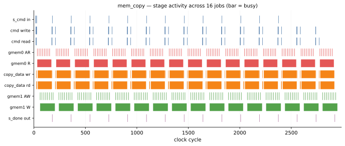
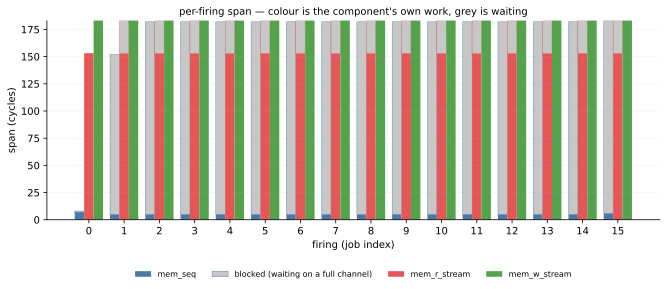
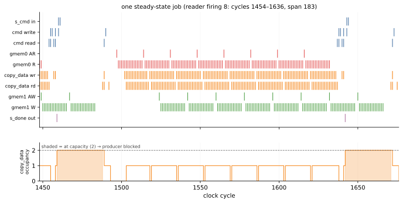

# Visualizing timing

The [pysim](./testbench.md) and [RTL](./rtlsim.md) rungs **agree** on the steady-state period — about
**183 cycles per job**. They agree because `mem_copy` composes two *calibrated* framework components —
`MemRStream` / `MemWStream` and the bus model — and Waveflow **ships their timing parameters for this
platform** (`zynq7020_bfm_100mhz`), so the loosely-timed pysim reproduces the RTL number with no manual
tuning. (Where those parameters come from is the [next page](./timing_model.md).)

This page is about *seeing* that timing — how the stages overlap, which one is the bottleneck, and
where every cycle of the period goes. That means tracing the RTL run and rendering it.

## Tracing the run

To see inside the kernel — the two internal `framed_word` FIFOs (`cmd` and `copy_data`) that wire the
three tasks, and both `m_axi` bundles — we pull those signals out of an RTL run by exact name. That is
general Waveflow machinery, the four [trace steps](../../guide/timing/trace_steps.md):

```bash
python examples/mem_copy/mem_copy_build.py --through extract_bursts
```

That produces `mem_copy_trace.vcd` (the waveform), `mem_copy_trace.json` (the net-name manifest), and
`mem_copy_timing.json` (a per-firing timing table). A fifth step, `timing_figures`, renders the pictures
below.

> **How these are drawn.** The two timeline figures below come from a reusable renderer,
> [`ActivityDiagram`](../../../waveflow/utils/timing.py) — a
> sibling of the `TimingDiagram` that swaps per-transition value boxes for activity *bands* and an
> optional occupancy sub-panel, so it stays legible across thousands of cycles. Any design can build
> the same views from its trace: `ActivityDiagram.from_trace(bt, spec)` walks a manifest's channels
> and ports into lanes; the example's `timing_figures` step supplies only mem_copy's own lane spec.
> The third figure (per-firing spans) is a bar chart off the timing table, not a lane-on-time-axis
> plot, so it stays example-specific.

## The run at a glance



Every stage of the pipeline on one cycle axis, 16 jobs. Three things are visible before any analysis:
the **183-cycle cadence**; that `gmem0 R` (reads) and `gmem1 W` (writes) are busy *simultaneously*
rather than in turn, so the design really is pipelined; and that the writer's green band is nearly
continuous while the command lanes at the top are almost entirely idle. The writer is doing something
close to all the work.

## The per-firing table

Each free-running stage fires once per job, and the
[`ExtractBurstsStep`](../../guide/timing/trace_steps.md) writes one row per **firing**:

```json
{"component": "mem_w_stream_framed_done_task", "index": 8,
 "start": 1488, "end": 1670, "span": 183,
 "nwords": 128, "num_trans": 8, "blocked": 0}
```

`span` is the firing's true occupancy — first input handshake to `ap_done`, *not* its last output beat,
because the writer's `m_axi` stores are posted and keep draining after `s_done`
([why](../../guide/timing/trace_pitfalls.md#2-a-firing-ends-at-ap_done-not-the-last-output-beat)).
`blocked` is cycles its output channel sat at capacity, read from the FIFO occupancy counters rather
than a write enable
([why](../../guide/timing/trace_pitfalls.md#3-read-backpressure-from-occupancy-not-the-write-enable)).



Colour is the component's own work, grey is waiting on a full channel — and the bottleneck needs no
arithmetic to spot. The **writer** is solid green at 183 on every firing: busy the entire period. The
**reader** is 153 on its first firing, then 153 + 30 grey. The **sequencer** is ~5 cycles of work
against ~175 of waiting — it finishes a command almost immediately, then sits behind everything
downstream. So the writer is the bottleneck, 100% utilised at 183 of a 183-cycle period; the reader's
30 grey cycles are it *waiting* on a writer still draining — **emergent** congestion, not a property of
the reader.

## Where the 30 cycles are



One steady-state firing. The lower panel is the `copy_data` FIFO's occupancy, and the shaded band is it
at **capacity** — the reader blocked, unable to hand over its descriptor words, because the writer has
not finished draining the *previous* job. The reader's `gmem0 AR` bursts (top panel) only begin after
that band clears. Look at the far right: `s_done out` fires, and `gmem1 W` **keeps going for another
~24 cycles** — the posted-write drain, the reason a firing ends at `ap_done`, not at `s_done`.

## And the pysim matches

Everything above is the **RTL**. Run the *pysim* with the same shipped calibration and it reproduces
the 183-cycle period to **0.0%** — the fast, toolchain-free model predicts the slow RTL, because the
two calibrated components carry the right timing. That accuracy is not free: it comes from **two timing
models** (a bus model and a mem-stream model), which the [next page](./timing_model.md) describes — and
whose parameters, for a new platform, you [fit from a sweep](./timing_fitting.md).

## See also

- [Timing models](./timing_model.md) — the two models behind the numbers above, and how they plug into
  the components.
- [Tracing a kernel run](../../guide/timing/trace_steps.md) — the trace steps, in general.
- [Trace pitfalls](../../guide/timing/trace_pitfalls.md) — the traps this relied on avoiding (the
  ap_done window, occupancy-not-write-enable).
