# CG massive-MIMO detector: what is built so far

The uplink base station has M antennas and serves K users. It must solve `(HᴴH + σ²I) x = Hᴴy` for
every received vector. Conjugate gradient (CG) is the low-complexity alternative to a direct solve,
and its iteration count is a natural accuracy-versus-latency knob. This study uses Waveflow to find
the cheapest hardware that meets an accuracy target. The bit-exact Python model answers the accuracy
side exactly and with no Vitis. Calibrated models will answer the cost side, with Vitis runs only
where they are needed.

**Status:** phases 0–4 are complete and reviewed (milestones M0–M4). Next are the performance models
(Phase 5) and the full design-space exploration (Phase 6). The plan, with every decision and its
evidence, is `plans/mimo_cg/mimo_cg_paper_sims.md` on branch `paper/mimo-cg`.

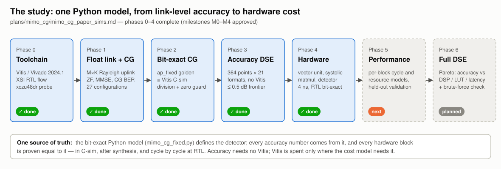

### Results at a glance

| Question | Result so far |
|---|---|
| How many CG iterations? | 2–4 when M/K ≥ 8, 3–6 at M/K = 4, 6–12 at M/K = 2 (float CG within 0.5 dB of exact MMSE) |
| How narrow can the datapath be? | 8–10 bits for QPSK, 10–12 for 16-QAM, 12–14 for 64-QAM, with 8 guard bits on two scalars |
| What do guard bits buy? | 2–6 bits (median 4) on every register; without them 64-QAM at 32×16 fails at every W ≤ 20 |
| Does quantization add iterations? | No: in all 27 configurations the narrowest W works at float CG's own iteration count |
| Does the hardware meet 4 ns? | Yes: every unit and the integrated detector at 3.35–3.39 ns (est.), K = 4, 8, 16 |
| What does it cost? | Detector: 112 / 176 / 304 DSP (2.6–7.1% of the xczu48dr) at K = 4 / 8 / 16 |
| How fast is it? | 1,193 / 1,449 / 1,969 cycles per CG iteration for a block of 32 vectors at K = 4 / 8 / 16 |
| Is it right? | The RTL output matches the Python golden bit for bit: K = 4, 8, 16 at every iteration count, and both frontier formats at K = 4 |

## 1. The algorithm, as hardware sees it

Multi-RHS CG solves for all N = 32 vectors of a coherence block at once, with a separate α and β per
column. In fixed point, every product and sum between registers is exact. The only rounding is the
assignment to a register (`ap_fixed`, round to nearest with saturation), so a Python model built on
integers reproduces Vitis bit for bit. The loop splits into two blocks: a matrix multiply (step 1)
and a vector unit (steps 2–9). The Python golden is split the same way (`mm_step`, `vec_step`).

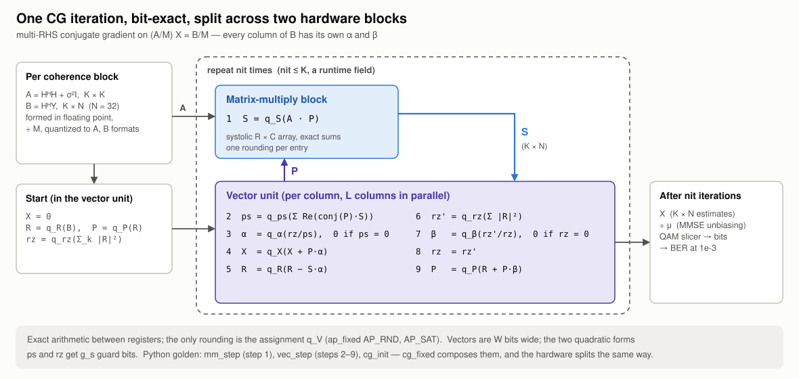

- **Division** is native `ap_fixed` division, modelled bit-exactly in `waveflow/utils/fixputils.py`,
  with a zero guard (α = 0 when pᴴAp = 0, β = 0 when rᴴr = 0).
- **Guard bits** (g_s) widen only the two quadratic forms, pᴴAp and rᴴr. Phase 3 showed that this is
  where precision runs out.

## 2. Accuracy, with no Vitis (phases 1–3)

Phase 1 swept the floating-point link: M ∈ {32, 64, 128} × K ∈ {4, 8, 16} × QPSK, 16-QAM and 64-QAM,
for ZF, exact MMSE and CG. Simulated ZF lands on its closed-form BER (the × marks), which checks
the simulator against theory. CG reaches exact MMSE in a few iterations when M/K is large. At
M/K = 2 it needs many more, and too few iterations leave an error floor.

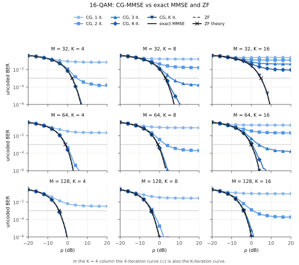

Phase 3 ran the bit-exact detector on every configuration: 364 points × 21 formats, with W from 8
to 20 bits and g_s ∈ {0, 4, 8}. Every format saw the same channels, symbols and noise as the
floating-point references. The decision points were refined to 1000 errors, which gives about 0.03 dB
of loss resolution. A design meets the budget if it loses at most 0.5 dB against floating-point exact
MMSE at BER 1e-3.

**One configuration in detail: 64×8 16-QAM.** At 8 iterations, W = 12 without guard bits loses
2.4 dB and flattens out near BER 2e-4. With 4 or 8 guard bits it tracks floating point (below). The loss map for every
(W, iterations) pair shows the cheapest design within budget: W = 10, g_s = 8, 3 iterations, which
loses 0.32 dB.

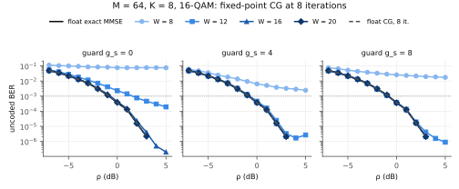

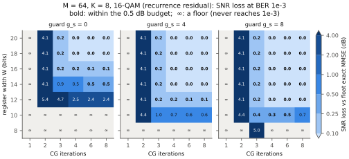

**The hardest configuration: 32×16 64-QAM.** No register width up to 20 bits meets the budget
without guard bits. With 8 guard bits, W = 14 works at 12 iterations.

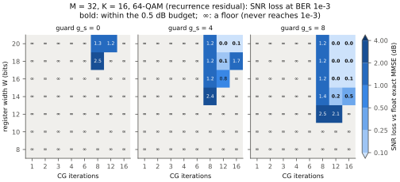

**All 27 configurations.** The narrowest width for each guard setting (first figure below), and
the narrowest design at each iteration count (second).

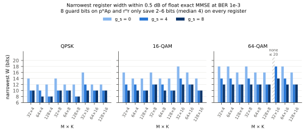

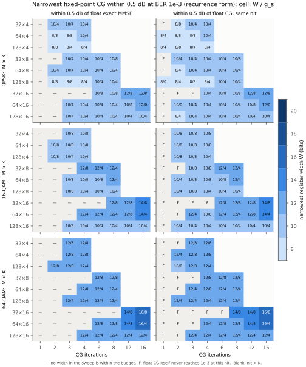

- **Guard bits pay most of the width.** With 8 guard bits on just the two quadratic forms, the
  narrowest register is 8–10 bits for QPSK, 10–12 for 16-QAM and 12–14 for 64-QAM. Without guard bits
  it is 12–16, 14–18 and 16–18 bits. That saves 2–6 bits (median 4) on every vector and matrix
  register.
- **Quantization does not add iterations.** The narrowest width always works at floating-point CG's
  own iteration count: 2–4 iterations when M/K ≥ 8, 3–6 at M/K = 4 and 6–12 at M/K = 2.
- **Extra iterations can hurt in fixed point.** 384 designs meet the budget at some iteration
  count. Running longer costs 23 of them more than 1 dB, or drives them into an error floor; 22 of
  the 23 are at K = 16. Guard bits do not prevent it, so hardware should stop at the frontier's count.
- **Implication for hardware:** a 12-bit datapath with 8 guard bits covers every configuration except
  64-QAM at 32×16, which needs 14 bits.

## 3. The hardware (Phase 4)

The detector is a free-running composite of `hls::task`s. It sits on the same framework memory
streams as the other examples, and its parts map onto the paper's fixed architecture:

- a **systolic matrix multiply**;
- a **vector unit**;
- **shared memory**: stream-of-blocks between the tasks;
- **queues**: command FIFOs from a separate **CG control** task.

All of these are Phase 5 design-space knobs, along with the lane count L, the array size R × C, the
complex-multiply form and the queue and block depths.

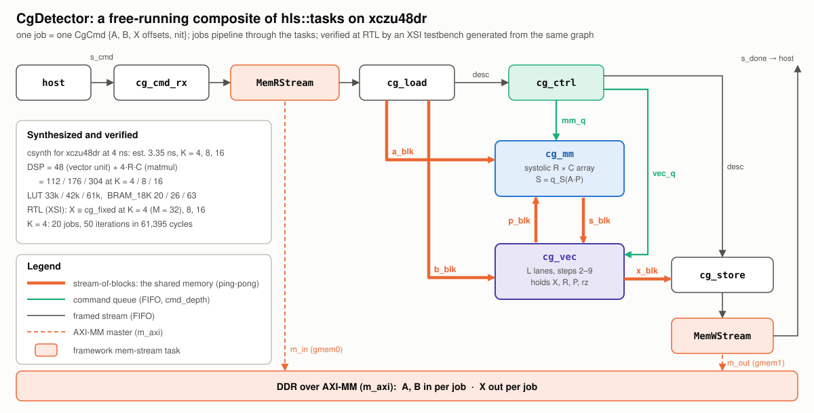

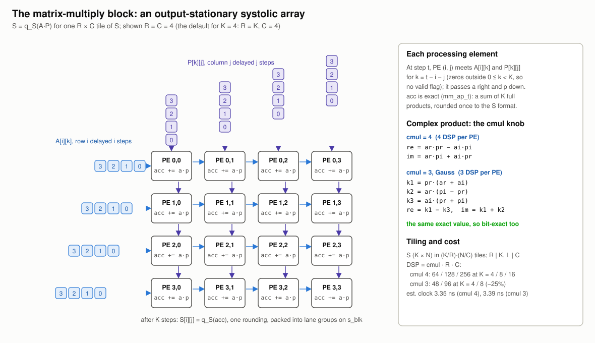

csynth on `xczu48dr-ffvg1517-2-e`, 4 ns target, W = 12 bits with 8 guard bits:

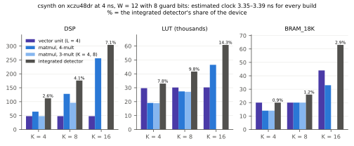

| Build | K | Est. clock | DSP | BRAM_18K | LUT |
|---|---|---|---|---|---|
| Vector unit (L = 4) | 4 / 8 / 16 | 3.35 ns | 48 | 20 / 20 / 44 | 29.7k / 30.2k / 30.2k |
| Matmul (R = K, C = 4), 4 multiplies | 4 / 8 / 16 | 3.35 ns | 64 / 128 / 256 | 14 / 20 / 33 | 19.1k / 27.4k / 46.5k |
| Matmul, 3 multiplies (Gauss) | 4 / 8 | 3.39 ns | 48 / 96 | 14 / 20 | 18.9k / 27.1k |
| Integrated detector | 4 / 8 / 16 | 3.35 ns | 112 / 176 / 304 | 20 / 26 / 63 | 33.0k / 41.6k / 60.8k |

The detector's DSPs are exactly the two blocks' sum. LUTs and BRAM are not, because each per-block
unit carries its own load and store tasks. Phase 5 will calibrate those from the per-task rows of
the report.

## 4. Verification: one golden, all bit-exact

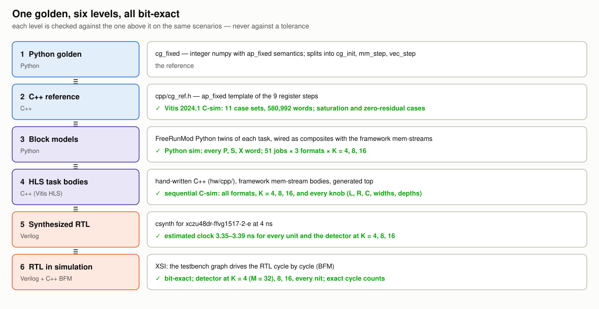

At RTL, the integrated detector reproduces `cg_fixed` word for word:

- at K = 4 on problems from M = 32 channels (AC4's check), for both W12g8 and W14g8;
- at K = 8 and 16;
- at every iteration count up to K.

The same RTL runs time the detector. Jobs were issued back to back, and the gap between
consecutive job completions grows linearly with the job's iteration count. The fitted lines below
match every measured point to within one cycle:

- each CG iteration on a block of N = 32 vectors costs 1,193, 1,449 and 1,969 cycles at
  K = 4, 8 and 16 (about 4.8, 5.8 and 7.9 µs at 250 MHz);
- the per-job overhead is 75–267 cycles.

For example, the 64×8 16-QAM headline design runs 3 iterations. On the K = 8 build that is
139 + 3 × 1,449 = 4,486 cycles, about 18 µs per block of 32 vectors.

The right panel shows the divider fix (section 5): the same 20-job run went from 161k to 61k
cycles.

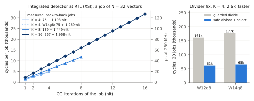

## 5. What the hardware work taught us

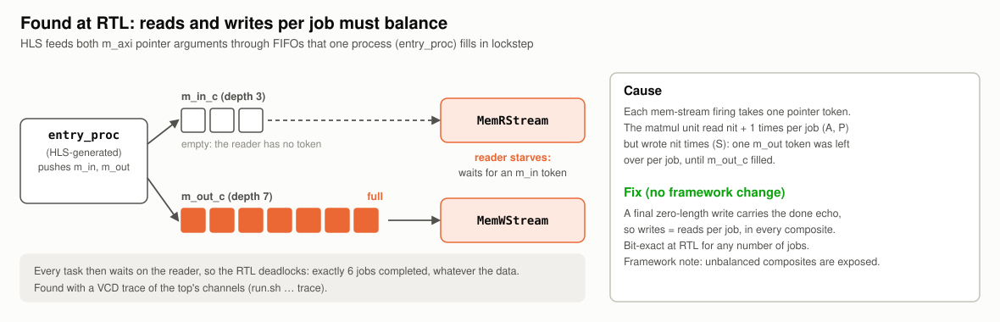

- **Reads and writes must balance per job** (above). The bug was invisible in the Python simulation
  and in C-sim, and appeared only at RTL after six jobs.
- **A guarded divide is a serial divide.** `(d == 0) ? 0 : n / d` in an unrolled loop made HLS
  run the vector unit's dividers one after another. Dividing by a safe divisor and then selecting is
  bit-exact, and made the detector 2.6× faster.
- **A threaded C-sim of stream-of-blocks races** in Vitis 2024.1: its model hands a block to the
  reader before the writer has filled it. C-sim here therefore fires the task bodies in dependency
  order; RTL has the real ping-pong semantics.

## 6. Next

- **Phase 5:** per-block cycle and resource models, calibrated from a small set of syntheses and
  XSI runs. A hold-out split is fixed before any fitting.
- **Phase 6:** sweep the whole cross-product in Python (accuracy, DSP, LUT, BRAM, latency) to get the
  Pareto frontier, and check it against a brute-force Vitis subset.

## Where things are

| What | Where |
|---|---|
| Link simulator, detectors, floating-point sweep | `examples/mimo_cg/mimo_link.py`, `detectors.py`, `mimo_cg.py` |
| Bit-exact golden | `examples/mimo_cg/mimo_cg_fixed.py` (C++ reference: `examples/mimo_cg/cpp/cg_ref.h`) |
| Accuracy sweep and analysis | `examples/mimo_cg/mimo_cg_accuracy_sweep.py`, `mimo_cg_accuracy_analysis.py` |
| Hardware blocks, codegen, C-sim | `examples/mimo_cg/hw/` (`vec.py`, `mm.py`, `detector.py`, `build.py`, `csim.py`, `cpp/`) |
| Tests | `tests/examples/test_mimo_cg_*.py`: no markers for the fast checks, `-m vitis` for C-sim and csynth, `-m xsi` for RTL |
| Paper data | `examples/mimo_cg/paper_data/*.csv` |

The concept diagrams come from `python docs/examples/mimo_cg/make_diagrams.py`. The `result_*`
plots come from `python docs/examples/mimo_cg/make_results.py`. That script reads the Phase 3
tables and the Phase 4 csynth reports and XSI cycle logs, and snapshots the hardware numbers to
`hw_csynth.csv` and `hw_rtl_cycles.csv` (next to the script) so the plots regenerate without
Vitis. The `float_*` and
`accuracy_*` figures come from the example's own build commands.
