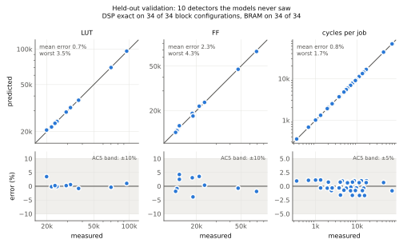
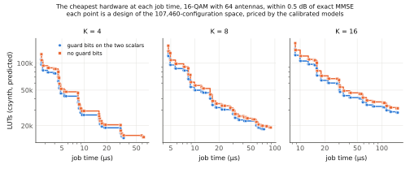
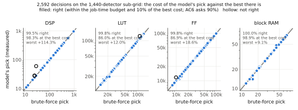
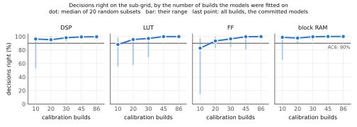

# CG massive-MIMO detector: what is built so far

The uplink base station has M antennas and serves K users. It must solve `(HᴴH + σ²I) x = Hᴴy` for
every received vector. Conjugate gradient (CG) is the low-complexity alternative to a direct solve,
and its iteration count is a natural accuracy-versus-latency knob. This study uses Waveflow to find
the cheapest hardware that meets an accuracy target. The bit-exact Python model answers the accuracy
side exactly and with no Vitis. Calibrated models answer the cost side, with Vitis runs only to
calibrate them and to check them.

**Status:** phases 0–5 are complete and reviewed (milestones M0–M5). Phase 6, the design-space
exploration and its brute-force check, is complete and awaits its review (M6). The plan, with every
decision and its evidence, is `plans/mimo_cg/mimo_cg_paper_sims.md` on branch `paper/mimo-cg`.


### Results at a glance

| Question | Result so far |
|---|---|
| How many CG iterations? | 2–4 when M/K ≥ 8, 3–6 at M/K = 4, 6–12 at M/K = 2 (float CG within 0.5 dB of exact MMSE) |
| How narrow can the datapath be? | 8–10 bits for QPSK, 10–12 for 16-QAM, 12–14 for 64-QAM, with 8 guard bits on two scalars |
| What do guard bits buy? | 2–6 bits (median 4) on every register; without them 64-QAM at 32×16 fails at every W ≤ 20 |
| Does quantization add iterations? | No: in all 27 configurations the narrowest W works at float CG's own iteration count |
| Does the hardware meet 4 ns? | Yes: every unit and the integrated detector at 3.35–3.39 ns (est.), K = 4, 8, 16 |
| What does it cost? | Detector: 112 / 176 / 304 DSP (2.6–7.1% of the xczu48dr) at K = 4 / 8 / 16 |
| How fast is it? | 1,193 / 1,449 / 1,969 cycles per CG iteration for a block of 32 vectors at K = 4 / 8 / 16 |
| Is it right? | The RTL output matches the Python golden bit for bit: K = 4, 8, 16 at every iteration count, and both frontier formats at K = 4 |
| Can models stand in for synthesis? | For design choices, yes: fitted on 86 builds, they pick a design within 10% of the best in 2,587 of 2,592 decisions that a 1,440-build brute force settles |
| How accurate are the models? | Over the 1,440 measured detectors: DSP and block RAM exact on every one; LUT 0.9%, FF 2.3%, job time 1.0% (mean errors) |
| What does that save? | Calibration took 2.1 tool-hours. The brute-force sub-grid took 57. The whole space would take about 4,000 (projected: 28 days on this machine); the models price it in 15 s |
| How many builds does calibration need? | About half: 45 builds give the same decisions in 19 of 20 random draws. With 30 or fewer it depends on the draw |
| What are guard bits worth in hardware? | Without them the cheapest design needs 8% more LUTs, 15% more flip-flops and 24% more block RAM (medians, csynth), and for 52 of 216 questions no design fits at all |

## 1. The algorithm, as hardware sees it

> **Files** (in `examples/mimo_cg/`): `mimo_cg_fixed.py` (the bit-exact golden), `cpp/cg_ref.h`
> (the C++ reference); `ap_fixed` arithmetic in `waveflow/utils/fixputils.py`.

Multi-RHS CG solves for all N = 32 vectors of a coherence block at once, with a separate α and β per
column. In fixed point, every product and sum between registers is exact. The only rounding is the
assignment to a register (`ap_fixed`, round to nearest with saturation), so a Python model built on
integers reproduces Vitis bit for bit. The loop splits into two blocks: a matrix multiply (step 1)
and a vector unit (steps 2–9). The Python golden is split the same way (`mm_step`, `vec_step`).


- **Division** is native `ap_fixed` division, modelled bit-exactly in `waveflow/utils/fixputils.py`,
  with a zero guard (α = 0 when pᴴAp = 0, β = 0 when rᴴr = 0).
- **Guard bits** (g_s) widen only the two quadratic forms, pᴴAp and rᴴr. Phase 3 showed that this is
  where precision runs out.

## 2. Accuracy, with no Vitis (phases 1–3)

> **Files** (in `examples/mimo_cg/`): `mimo_link.py` (link and BER), `detectors.py` (ZF, MMSE,
> float CG), `mimo_cg.py` and `mimo_cg_build.py` (Phase 1), `mimo_cg_accuracy_sweep.py`,
> `mimo_cg_accuracy_analysis.py` and `mimo_cg_accuracy_figures.py` (Phase 3); data in `paper_data/`.

Phase 1 swept the floating-point link: M ∈ {32, 64, 128} × K ∈ {4, 8, 16} × QPSK, 16-QAM and 64-QAM,
for ZF, exact MMSE and CG. Simulated ZF lands on its closed-form BER (the × marks), which checks
the simulator against theory. CG reaches exact MMSE in a few iterations when M/K is large. At
M/K = 2 it needs many more, and too few iterations leave an error floor.


Phase 3 ran the bit-exact detector on every configuration: 364 points × 21 formats, with W from 8
to 20 bits and g_s ∈ {0, 4, 8}. Every format saw the same channels, symbols and noise as the
floating-point references. The decision points were refined to 1000 errors, which gives about 0.03 dB
of loss resolution. A design meets the budget if it loses at most 0.5 dB against floating-point exact
MMSE at BER 1e-3.

**One configuration in detail: 64×8 16-QAM.** At 8 iterations, W = 12 without guard bits loses
2.4 dB and flattens out near BER 2e-4. With 4 or 8 guard bits it tracks floating point (below). The loss map for every
(W, iterations) pair shows the cheapest design within budget: W = 10, g_s = 8, 3 iterations, which
loses 0.32 dB.


**The hardest configuration: 32×16 64-QAM.** No register width up to 20 bits meets the budget
without guard bits. With 8 guard bits, W = 14 works at 12 iterations.


**All 27 configurations.** The narrowest width for each guard setting (first figure below), and
the narrowest design at each iteration count (second).


- **Guard bits pay most of the width.** With 8 guard bits on just the two quadratic forms, the
  narrowest register is 8–10 bits for QPSK, 10–12 for 16-QAM and 12–14 for 64-QAM. Without guard bits
  it is 12–16, 14–18 and 16–18 bits. That saves 2–6 bits (median 4) on every vector and matrix
  register.
- **Quantization does not add iterations.** The narrowest width always works at floating-point CG's
  own iteration count: 2–4 iterations when M/K ≥ 8, 3–6 at M/K = 4 and 6–12 at M/K = 2.
- **Extra iterations can hurt in fixed point.** 384 designs meet the budget at some iteration
  count. Running longer costs 23 of them more than 1 dB, or drives them into an error floor; 22 of
  the 23 are at K = 16. Guard bits do not prevent it, so hardware should stop at the frontier's count.
- **Implication for hardware:** a 12-bit datapath with 8 guard bits covers every configuration except
  64-QAM at 32×16, which needs 14 bits.

## 3. The hardware (Phase 4)

> **Files** (in `examples/mimo_cg/hw/`): `common.py` (types, commands, memory format), `vec.py`,
> `mm.py`, `detector.py` (the modules), `cpp/*.h` (the HLS bodies), `build.py` (codegen, csynth,
> XSI).

The detector is a free-running composite of `hls::task`s. It sits on the same framework memory
streams as the other examples, and its parts map onto the paper's fixed architecture:

- a **systolic matrix multiply**;
- a **vector unit**;
- **shared memory**: stream-of-blocks between the tasks;
- **queues**: command FIFOs from a separate **CG control** task.

All of these are Phase 5 design-space knobs, along with the lane count L, the array size R × C, the
complex-multiply form and the queue and block depths.


### How each module is built

Every module has two halves:

- **A Python model.** A `FreeRunMod` subclass declares the module's ports and parameters. Its
  body calls the bit-exact golden, so the Waveflow simulation checks how the modules connect,
  their commands and their memory layout. Its timing is a placeholder until Phase 5 calibrates it.
- **An HLS body.** A hand-written `hls::task` function in `examples/mimo_cg/hw/cpp/`. Each model's
  `kernel_task()` names its body and template arguments.

The top-level C++, the synthesis script and the RTL testbench are not written by hand. They are
generated from the Python graph (more under "Generated, not hand-written" below).

The detector's structure is not new. It follows the in-band interleaver
(`examples/interleaver/interleaver_inband.py`): a framer splits each host command into memory
reads, the framework memory reader fetches the data, a load task unpacks it into stream-of-blocks,
the compute runs, a store task packs the result, and the framework memory writer writes it and
signals done. The CG design keeps that skeleton and replaces the compute with the CG core. The
generated K = 4 top shows all eight tasks:

```cpp
hls_thread_local hls::task t0(cg_cmd_rx_task<64, 4, 32>, s_cmd, cmd_rd);
hls_thread_local hls::task t1(mem_r_stream_framed_task<64>, cmd_rd, m_in, rdata);
hls_thread_local hls::task t2(cg_load_task<64, 4, 32, 4, 2>, rdata, desc_lc, a_blk, b_blk);
hls_thread_local hls::task t3(cg_ctrl_task<64, 4>, desc_lc, vec_q, mm_q, desc_cs);
hls_thread_local hls::task t4(cg_vec_task<64, 4, 32, 4, 2>, vec_q, b_blk, s_blk, p_blk, x_blk);
hls_thread_local hls::task t5(cg_mm_task<64, 4, 32, 4, 4, 4, 4, 2>, mm_q, a_blk, p_blk, s_blk);
hls_thread_local hls::task t6(cg_store_task<64, 4, 32, 4, 2>, desc_cs, x_blk, wdata);
hls_thread_local hls::task t7(mem_w_stream_framed_done_task<64, 8>, wdata, m_out, s_done);
```

| Task | What it does | Python model | HLS body | New or reused |
|---|---|---|---|---|
| `cg_cmd_rx` | Turns one host command `CgCmd {a_off, b_off, x_off, nit}` into two framed reads, A then B. The A read carries the job's descriptor `CgDesc {nit, x_off}` ahead of its data. Clamps nit to 1…K. | `CgCmdRx`, `hw/detector.py` | `hw/cpp/cg_cmd_rx_task.h` | New; same role as the interleaver's `CmdRxInband` |
| `MemRStream` (in-band) | AXI-MM burst reader on `m_in` (`gmem0`): two reads per job | `waveflow/hw/mem_stream.py` | `waveflow/build/mem_r_stream_framed_task.h` | Reused unchanged: the framework reader used by `mem_copy` and the interleaver |
| `cg_load` | Converts memory words to registers. Lands A as K rows for the matmul (`a_blk`) and B as lane groups for the vector unit (`b_blk`), and passes the descriptor to control | `CgLoad`, `hw/detector.py` | `hw/cpp/cg_load_task.h`, `cg_io.h` | New; same role as `IlLoadInband` |
| `cg_ctrl` | **CG control.** For each job, puts INIT and then nit commands (ITER … LAST) into each block's queue, then passes the descriptor to the store | `CgCtrl`, `hw/detector.py` | `hw/cpp/cg_ctrl_task.h` | New |
| `cg_vec` | **Vector unit**, CG steps 2–9 and the start | `CgVec`, `hw/vec.py` | `hw/cpp/cg_vec_task.h` | New (see below) |
| `cg_mm` | **Systolic matrix multiply**, CG step 1: S = q_S(A·P) | `CgMm`, `hw/mm.py` | `hw/cpp/cg_mm_task.h` | New (see below) |
| `cg_store` | Writes X, then a zero-length write that carries the descriptor, so reads and writes balance (two of each per job, section 5) | `CgStore`, `hw/detector.py` | `hw/cpp/cg_store_task.h` | New; same role as `IlStoreInband`, plus the second write |
| `MemWStream` (in-band, done) | AXI-MM burst writer on `m_out` (`gmem1`); signals one done per job on `s_done` | `waveflow/hw/mem_stream.py` | `waveflow/build/mem_w_stream_framed_done_task.h` | Reused unchanged |

Notes on the two compute blocks:

- **Vector unit (`cg_vec`).** Its arithmetic is transcribed from the C++ reference
  `examples/mimo_cg/cpp/cg_ref.h`, which was already proven bit-exact against the Python golden in
  Phase 2.
  - **State.** It holds X, R, P and rᴴr for the whole job on chip. The arrays are split across L
    lanes (default 4), so L columns are processed side by side.
  - **One iteration.** For each group of L columns it makes three pipelined passes (one row per
    cycle) over the K rows:
    1. pᴴAp, then α from L dividers working in parallel;
    2. the X and R updates and the new rᴴr, then β;
    3. the P update.
  - **Rounding.** Every accumulator is declared at its exact width, so the only rounding happens
    when a value is stored in a register, just as in the golden.
  - **Why not the existing vector engine.** The repo's `examples/vmac/` was evaluated at gate 4.0
    and not reused. Its datapath has a single number format, scales one α per row instead of per
    column, and has no divider, so it does not match the golden.
- **Matrix multiply (`cg_mm`).** A new systolic array of R × C complex processing elements
  (default R = K, C = 4), sketched in the diagram above.
  - **Data flow.** A is held for the whole job, and a new P arrives each iteration. A values shift
    right and P values shift down, with the usual skew.
  - **Accumulation.** Each element accumulates its S entry exactly and rounds once, so the result
    is bit-exact. S is computed in (K/R)·(N/C) tiles.
  - **Complex multiply.** `cmul` = 4 uses the standard product; `cmul` = 3 uses the Gauss form,
    which needs one multiplier fewer per element and is still exact.
  - **Why not a library GEMV.** The Vitis library GEMV (`vitis_l1`) handles only real numbers, so
    it was not used.

Shared pieces:

- **Shared memory.** The blocks `a_blk`, `b_blk`, `p_blk`, `s_blk` and `x_blk` are
  `hls::stream_of_blocks` ping-pong buffers, `sob_depth` blocks deep (default 2). They are declared
  in Python as framework `StreamOfBlocksIF` connections. Each element is a **lane group**: L complex
  values packed into one `ap_uint<2·W·L>` word (`hw/cpp/cg_lanes.h`), for example 96 bits for
  W = 12, L = 4.
- **Queues.** These are framework `StreamIF` FIFOs, `cmd_depth` deep (default 2). They carry
  `CgIterCmd {op: INIT | ITER | LAST}`.
- **Command types.** `CgCmd`, `CgDesc` and `CgIterCmd` are Waveflow `DataSchema` types in
  `hw/common.py`, and their C++ headers are generated from them.
- **Memory format.** In memory, each value is widened to 16 bits per real or imaginary part, which
  is exact, so a complex element fills an aligned 32 bits. The packing uses the framework's
  `DataArray[ComplexField[FixedField]]` serialization and its generated C++ array utilities, so no
  task hand-codes shifts or masks.
- **Register types.** The `ap_fixed` register types in `cg_types.h` are generated from the Python
  formats by `render_typedefs` (`hw/common.py`). The Phase 2 conformance test uses the same
  function, so the hardware and the C++ reference always agree on types.

**Per-block test units.** `CgVecUnit` (`hw/vec.py`) and `CgMmUnit` (`hw/mm.py`) each wrap one block
with its own framer, load and store tasks (`hw/cpp/cg_vec_{rx,load,store}_task.h`,
`hw/cpp/cg_mm_{rx,load,store}_task.h`), so the block can run on its own from memory. They are used
for the per-block RTL checks, and in Phase 5 they will supply the per-block calibration. The extra
load and store tasks are also why the per-block LUT and BRAM counts do not add up to the
detector's.

**Generated, not hand-written.** For each configuration, `hw/build.py` uses the framework's
`waveflow/build/composite_gen.py` to write the build products into
`examples/mimo_cg/hw/build/<top>_<config>/` (gitignored):

- the `ap_ctrl_none` top-level C++, walked from the Python graph (`composite_top_spec`,
  `render_top`);
- the csynth script for xczu48dr at 4 ns (`render_tcl`);
- the XSI testbench harness (`tb_top_spec`, `render_tb_harness`), which drives the RTL with the same
  scenario as the Python simulation and runs through the repo's XSI runner (`xsi_runner_cmd`).

C-sim uses `hw/csim.py`, which calls the task bodies in order rather than as threads (section 5
explains why).

### Synthesis results

csynth on `xczu48dr-ffvg1517-2-e`, 4 ns target, W = 12 bits with 8 guard bits:


| Build | K | Est. clock | DSP | BRAM_18K | LUT |
|---|---|---|---|---|---|
| Vector unit (L = 4) | 4 / 8 / 16 | 3.35 ns | 48 | 20 / 20 / 44 | 29.7k / 30.2k / 30.2k |
| Matmul (R = K, C = 4), 4 multiplies | 4 / 8 / 16 | 3.35 ns | 64 / 128 / 256 | 14 / 20 / 33 | 19.1k / 27.4k / 46.5k |
| Matmul, 3 multiplies (Gauss) | 4 / 8 | 3.39 ns | 48 / 96 | 14 / 20 | 18.9k / 27.1k |
| Integrated detector | 4 / 8 / 16 | 3.35 ns | 112 / 176 / 304 | 20 / 26 / 63 | 33.0k / 41.6k / 60.8k |

The detector's DSPs are exactly the two blocks' sum. LUTs and BRAM are not, because each per-block
unit carries its own load and store tasks. Phase 5 calibrates those from the per-task rows of
the report (section 6).

## 4. Verification: one golden, all bit-exact

> **Files:** `examples/mimo_cg/mimo_cg_conformance.py` (golden vs C++ reference),
> `examples/mimo_cg/hw/csim.py` (C-sim), `examples/mimo_cg/hw/build.py` (XSI run and check); tests
> in `tests/examples/test_mimo_cg_*.py`.


At RTL, the integrated detector reproduces `cg_fixed` word for word:

- at K = 4 on problems from M = 32 channels (AC4's check), for both W12g8 and W14g8;
- at K = 8 and 16;
- at every iteration count up to K.

The same RTL runs time the detector. Jobs were issued back to back, and the gap between
consecutive job completions grows linearly with the job's iteration count. The fitted lines below
match every measured point to within one cycle:

- each CG iteration on a block of N = 32 vectors costs 1,193, 1,449 and 1,969 cycles at
  K = 4, 8 and 16 (about 4.8, 5.8 and 7.9 µs at 250 MHz);
- the per-job overhead is 75–267 cycles.

For example, the 64×8 16-QAM headline design runs 3 iterations. On the K = 8 build that is
139 + 3 × 1,449 = 4,486 cycles, about 18 µs per block of 32 vectors.

The right panel shows the divider fix (section 5): the same 20-job run went from 161k to 61k
cycles.


## 5. What the hardware work taught us

> **Files:** `examples/mimo_cg/hw/cpp/cg_store_task.h` (balanced writes),
> `examples/mimo_cg/hw/cpp/cg_vec_task.h` (safe divisor), `examples/mimo_cg/hw/csim.py` (sequential
> C-sim); write-ups in `plans/mimo_cg/mimo_cg_lessons.md`.


- **Reads and writes must balance per job** (above). The bug was invisible in the Python simulation
  and in C-sim, and appeared only at RTL after six jobs.
- **A guarded divide is a serial divide.** `(d == 0) ? 0 : n / d` in an unrolled loop made HLS
  run the vector unit's dividers one after another. Dividing by a safe divisor and then selecting is
  bit-exact, and made the detector 2.6× faster.
- **A threaded C-sim of stream-of-blocks races** in Vitis 2024.1: its model hands a block to the
  reader before the writer has filled it. C-sim here therefore fires the task bodies in dependency
  order; RTL has the real ping-pong semantics.

## 6. Performance models (Phase 5)

> **Files** (in `examples/mimo_cg/hw/`): `space.py` (the design space, the calibration and held-out
> builds), `measure.py` and `campaign.py` (one build: csynth, report attribution, RTL run),
> `models.py` (the models), `estimate.py` (price one configuration), `validate.py`, `impl_check.py`.
> The frozen model file is `examples/mimo_cg/calib/platforms/xczu48dr_250mhz/models/mimo_cg_hw.json`.

The hardware has ten synthesis-time knobs: K, the format (W and the guard), the vector unit's lanes,
the matmul's rows and columns, its multiplier form, the memory word width and two buffer depths.
That is 107,460 valid configurations. The models price any of them with no tool run:

- **Counted, with no fitted parameter:** DSPs and block RAM. A body declares how many multiplies
  and arrays it has, and a rule says how the tool binds each on this device (for example, a plain
  multiply uses a DSP only from 12 bits).
- **Fitted:** LUTs and flip-flops, as linear regressions per block on terms read off the block's
  structure.
- **Cycles:** a job of `nit` iterations takes `T0 + nit·T_iter`. Loops with a known trip count are
  counted; only the overhead per tile is fitted. `T_iter` is the matmul's span plus the vector
  unit's, exactly, because the two blocks wait for each other.

Each block is calibrated from builds of that block alone, and the detector's glue from detector
builds: 86 builds in all (35 minutes of wall time). The held-out builds were fixed, and committed,
before any calibration build ran, and were built only after the models were frozen.



| On 34 held-out builds (10 of them full detectors) | Result |
|---|---|
| DSP and block RAM | exact on all 34 |
| LUT, full detectors | 0.7% mean error, 3.5% worst |
| Flip-flops, full detectors | 2.3% mean, 4.3% worst |
| Cycles per job (50 jobs) | 0.8% mean, 1.7% worst |

Three things the calibration taught:

- **csynth is not the implemented design.** Five detectors were placed and routed. Timing closes
  at 4 ns on all five. csynth's LUT count is 2.9–4.4 times the implemented one, mostly because it
  over-estimates the matrix loader; flip-flops are 1.3–1.7 times. The models predict csynth, because
  that is what a sweep can afford to measure.
- **A model is only as wide as its calibration builds.** The first matmul design had 1, 4 and 8
  lanes, and its LUT model came out 15% low at 16. A second round of 19 builds fixed it (1.7% on
  fresh held-out builds), and the report's per-loop rows showed where the lane count acts.
- **The tool's loop merging is a threshold.** With one array row and as many lanes as columns, HLS
  merges the tile loops into the sweep at 4 and 8 columns and not at 16. One extra build found the
  boundary.

## 7. The design-space exploration (Phase 6)

> **Files** (in `examples/mimo_cg/hw/`): `dse.py` (the exploration), `fidelity.py` and
> `fidelity_figure.py` (the brute-force comparison and the learning curve), `finding.py` (the design
> finding), `finalists.py` (place and route of twelve designs); tables in
> `examples/mimo_cg/paper_data/`.

A **joint design** is a scenario (modulation, M, K), a hardware configuration and an iteration
count. Its SNR loss is measured (section 2). Its resources and job time are predicted (section 6).
There are 6,084,720 of them, and `python -m examples.mimo_cg.hw.dse` prices them all in 15 seconds.
Within 0.5 dB of exact MMSE, each scenario's frontier of DSP, LUT, flip-flops, block RAM and job
time has 107–330 designs.



### Do the models make the right choices?

A sub-grid of 1,440 detectors was built and measured in full: csynth, then an RTL run that checks
every output bit and times a steady stream of jobs. It took 57 tool-hours (9.7 hours on six
processes); all 1,440 builds passed. Because the sub-grid is a full cross-product, the best design
in it for any question is known.

The questions are **decisions**: for a scenario, a loss budget and a job-time budget, which design
is cheapest in one resource? The decision set (2,592 decisions, with the model's pick for each)
and the scoring rule were committed before the first of the 1,440 builds ran. A pick is *right* if,
measured, it meets the job-time budget within 2% and costs within 10% of the best.



| Resource | Decisions right | Pick has exactly the best cost |
|---|---|---|
| DSP | 99.5% | 98.3% |
| LUT | 99.8% | 86.0% |
| Flip-flops | 99.8% | 86.9% |
| Block RAM | 100% | 98.9% |

Five decisions of 2,592 are not right. Four are budgets that fall within 1% of a design's job
time, where a slightly slow prediction makes the model take a larger design. The fifth is a guard:
the models make no latency claim for a design whose job is short enough for memory traffic to bind,
so they pass over one that in fact measures fine.

The same builds test the models directly. DSP and block RAM are exact on all 1,440. The mean error
is 0.9% for LUTs, 2.3% for flip-flops and 1.0% for job time. One family is mispredicted: merged
single-row arrays in the 3-multiply form are 7.6% slow, a combination no calibration build had.
Elsewhere the worst job-time error is 2.5%.

### How many builds does the calibration need?

The models were refitted on random subsets of the 86 calibration builds and scored on the same
decisions. With 45 builds, 19 of 20 subsets pass the 90% bar on every resource. With 30 or fewer,
the outcome depends on which builds were drawn.



### What it costs

| | Builds | Tool-hours | Wall time |
|---|---|---|---|
| Calibration | 86 | 2.1 | 35 min |
| Held-out validation | 46 | 1.0 | 21 min |
| Exploring 6,084,720 joint designs in Python | 0 | 0 | 15 s |
| Brute force of the 1,440-detector sub-grid | 1,440 | 57 | 9.7 h |
| Brute force of the whole space (projected) | 107,460 | about 4,000 | about 28 days |

### What the exploration says about the design

- **Guard bits pay for themselves, mostly in registers.** For each scenario and job-time budget,
  compare the cheapest design with guard bits on the two scalar accumulators against the cheapest
  without. Leaving them out costs a median 8% in LUTs, 15% in flip-flops and 24% in block RAM, and
  nothing in DSPs, because a 12-bit and a 16-bit multiply both take one DSP. The datapath is 4 bits
  wider in most cases; in 28 of 164 the job also runs more iterations.
- **Without guard bits, a quarter of the questions have no answer.** For 52 of 216 (43 of them
  64-QAM) no design without guard reaches 0.5 dB within the 16-bit datapath.
- **Speed comes from lanes first.** The cheapest design goes from 1 lane and a 4-element array at
  the loosest job-time budget to 16 lanes at the tightest, with the array growing behind. The
  vector unit stays about two thirds of an iteration. That buys a 17 times shorter job for 5 times
  the LUTs and 24 times the DSPs.

### The same comparison in placed-and-routed hardware

Twelve designs were taken through Vivado: for 16-QAM with 64 antennas at each K, the cheapest
design at the loosest and at the second-tightest job-time budget, once with guard bits and once
without. The list was fixed before any of them was built. All twelve meet 4 ns (2.70–3.91 ns
achieved) and are bit-exact at RTL. The table gives what leaving the guard bits out costs, as
implemented:

| K, job-time budget | With guard | Without | LUTs | Flip-flops | DSPs | Job time |
|---|---|---|---|---|---|---|
| 4, loose | W12, 2 iterations | W14, 4 iterations | +3% | +3% | same | +85% |
| 4, tight | W12, 2 iterations | W16, 2 iterations | +2% | +15% | same | same |
| 8, loose | W10, 3 iterations | W14, 4 iterations | +13% | +10% | same | +22% |
| 8, tight | W12, 3 iterations | W14, 4 iterations | +18% | +18% | +27% | same |
| 16, loose | W12, 4 iterations | W16, 4 iterations | +12% | +15% | same | same |
| 16, tight | W12, 4 iterations | W16, 4 iterations | +8% | +17% | same | same |

- **The models' ranking survives place and route.** csynth counts about three times the LUTs of
  the implemented design, yet the order of the twelve designs by LUTs, and by flip-flops, is the
  same before and after.
- **Narrow formats save logic and registers, not DSPs.** Vivado uses four more DSPs per lane than
  csynth reports, and at 10 bits it moves back into DSPs the multiplies that csynth builds from
  LUTs. The 10-bit design has 28 DSPs, as many as its 14-bit counterpart, where csynth says 17
  against 24.
- **Without guard bits, small designs pay in time.** At K = 4 and K = 8 the cheapest design
  without guard runs more iterations, so its job takes 85% and 22% longer.


## 8. Limits

> **Files:** the decision records are in `plans/mimo_cg/mimo_cg_paper_sims.md` (section 14).

- Costs are csynth estimates, except for the placed-and-routed designs above.
- The link is uncoded, with i.i.d. Rayleigh fading and perfect channel knowledge; `HᴴH` and `Hᴴy`
  are formed in floating point, so the widths cover the CG only.
- The block is 32 vectors, and registers are at most 16 bits wide (the memory format).
- Job time is modelled where the CG loop is the bottleneck. Designs under twice the memory-transfer
  floor are flagged, and no latency is claimed for them.
- The brute force covers 1,440 of the 107,460 configurations: three lane counts, array rows of 1, 4
  and K, and the smallest buffer depths.

## Where things are

| What | Where |
|---|---|
| Link simulator, detectors, floating-point sweep | `examples/mimo_cg/mimo_link.py`, `detectors.py`, `mimo_cg.py` |
| Bit-exact golden | `examples/mimo_cg/mimo_cg_fixed.py` (C++ reference: `examples/mimo_cg/cpp/cg_ref.h`) |
| Accuracy sweep and analysis | `examples/mimo_cg/mimo_cg_accuracy_sweep.py`, `mimo_cg_accuracy_analysis.py` |
| Hardware blocks, codegen, C-sim | `examples/mimo_cg/hw/` (`vec.py`, `mm.py`, `detector.py`, `build.py`, `csim.py`, `cpp/`) |
| Design space, measurement, models | `examples/mimo_cg/hw/` (`space.py`, `measure.py`, `campaign.py`, `models.py`, `estimate.py`, `validate.py`) |
| Exploration, brute-force comparison, finding | `examples/mimo_cg/hw/` (`dse.py`, `fidelity.py`, `finding.py`, `finalists.py`) |
| Tests | `tests/examples/test_mimo_cg_*.py`: no markers for the fast checks, `-m vitis` for C-sim and csynth, `-m xsi` for RTL |
| Paper data | `examples/mimo_cg/paper_data/*.csv` |

The concept diagrams come from `python docs/examples/mimo_cg/make_diagrams.py`. The `result_*`
plots come from `python docs/examples/mimo_cg/make_results.py`. That script reads the Phase 3
tables and the Phase 4 csynth reports and XSI cycle logs, and snapshots the hardware numbers to
`hw_csynth.csv` and `hw_rtl_cycles.csv` (next to the script) so the plots regenerate without
Vitis. The `float_*` and
`accuracy_*` figures come from the example's own build commands. The figures of sections 6 and 7
come from `python -m examples.mimo_cg.hw.validate`, `python -m examples.mimo_cg.hw.fidelity`
(add `--learning-curve` for the learning curve) and `python -m examples.mimo_cg.hw.finding`; each
reads committed tables only, so none needs Vitis.
