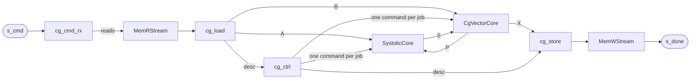

# CG massive-MIMO detector

The uplink base station has M antennas and serves K users. For every coherence block of N = 32
received vectors it must solve `(HᴴH + σ²I) X = HᴴY`. Conjugate gradient (CG) is the
low-complexity alternative to a direct solve, and its iteration count trades accuracy for latency.

This example shows:

- a **bit-exact fixed-point model** of multi-RHS CG in Python, which reproduces Vitis `ap_fixed`
  arithmetic exactly and runs without Vitis;
- a **free-running detector** composed from Waveflow's
  [linear-algebra components](../../guide/linalg/index.md): the
  [systolic matrix multiply](../../guide/linalg/systolic.md) and the
  [CG vector unit](../../guide/linalg/cg_vector.md);
- **verification** from the Python model through pysim and C-simulation to RTL, bit for bit.

Every measured number here is Vitis HLS / Vivado 2024.1 on `xczu48dr-ffvg1517-2-e` at 250 MHz.

## The algorithm

Multi-RHS CG solves for all N vectors of a block at once, with a separate α and β per column. In
fixed point, every product and sum between registers is exact. The only rounding is the assignment
to a register (`ap_fixed`, round to nearest with saturation), so a model built on integers
reproduces Vitis bit for bit. The loop splits into a matrix multiply (step 1) and a vector unit
(steps 2–9), and so does the model (`mm_step` and `vec_step` in `waveflow/linalg/cg.py`).


- **Division** is native `ap_fixed` division, modelled bit-exactly in `waveflow/utils/fixputils.py`,
  with a zero guard (α = 0 when pᴴAp = 0, β = 0 when rᴴr = 0).
- **Guard bits** (g_s) widen only the two quadratic forms, pᴴAp and rᴴr. That is where precision
  runs out first.

## Fixed point is enough

Because the model is exact and needs no Vitis, accuracy can be measured directly on simulated
links. Against floating-point exact MMSE at BER 1e-3, with a 0.5 dB budget:

- With 8 guard bits on the two quadratic forms, the narrowest register is 8–10 bits for QPSK,
  10–12 for 16-QAM and 12–14 for 64-QAM. Without guard bits it is 4 bits wider in the median.
- Quantization adds no iterations: the narrowest width works at floating-point CG's own iteration
  count, 2–4 when M/K ≥ 8 and up to 12 at M/K = 2.

At 64×8 16-QAM and 8 iterations, for example, W = 12 without guard bits flattens out near BER
2e-4, while 4 or 8 guard bits track floating point:


## The hardware

The detector is a free-running composite of `hls::task`s on the framework's memory streams, with
the same skeleton as the in-band [interleaver](../interleaver/index.md): a framer turns each host
command into memory reads, a loader unpacks them into stream-of-blocks, the compute runs, and a
store packs the result and signals done.



- **The host** sends one `CgCmd` per job: the word offsets of `A` (K × K), `B` (K × N) and `X`,
  and the iteration count `nit` (1 … K). Each finished job returns one word on `s_done`.
- **`cg_load`** lands `A` and `B` in blocks of L-lane groups (`wf_load_matrix`).
- **`cg_ctrl`** writes one command into each core's command queue per job: a matrix multiply of
  `nit` matrices for the systolic core and a CG job of `nit` iterations for the vector core.
- **The two cores** pass `P` and `S` back and forth once per iteration through stream-of-blocks;
  after the last iteration the vector core sends `X` to the store.
- **`cg_store`** writes `X`, then a zero-length write whose echo is the done word. A job must write
  as often as it reads (twice each): HLS couples the reader's and writer's firing counts through
  the `m_axi` pointer FIFOs, and an unbalanced design stalls after a few jobs, at RTL only.

The Python classes are in `examples/mimo_cg/hw/detector.py`; the hand-written glue tasks are in
`examples/mimo_cg/hw/cpp/`. The top-level C++, the synthesis script and the RTL testbench are
generated from the Python graph (`examples/mimo_cg/hw/build.py`).

### Parameters

| Parameter | Meaning | Default |
|---|---|---|
| `K` | users (matrix size K × K) | 4 |
| `N` | vectors per block | 32 |
| `L` | lanes: complex values per group | 4 |
| `R`, `C` | the systolic array's rows and columns (`R = 0` means K) | 0, 4 |
| `cmul` | complex multiply with 4 or 3 real multiplies | 4 |
| `fmt` | the register format set (for example W12g8: 12-bit registers, 8 guard bits) | 0 (W12g8) |
| `cmd_depth`, `sob_depth` | depth of the command queues and of the stream-of-blocks | 2, 2 |
| `mem_dwidth` | memory word width in bits | 64 |

### Resources and speed

The default detector at three sizes, from csynth and RTL runs:

| K | LUT | FF | DSP | BRAM | Clock (est.) | Cycles per CG iteration |
|---:|---:|---:|---:|---:|---:|---:|
| 4 | 30,033 | 20,520 | 115 | 20 | 3.35 ns | 1,222 |
| 8 | 36,131 | 25,131 | 179 | 23 | 3.35 ns | 1,486 |
| 16 | 44,355 | 31,750 | 307 | 55 | 3.35 ns | 2,014 |

A job of `nit` iterations takes about t0 + nit × (cycles per iteration), with t0 = 127 cycles at
K = 4. Jobs queue on `s_cmd`, and the next job's `A` and `B` load while the current job computes.
Within a job the two cores take turns, so only one job computes at a time.

## Verification

One golden, `cg_fixed` in `examples/mimo_cg/mimo_cg_fixed.py`, is checked at every level:

- **C++ reference:** `examples/mimo_cg/cpp/cg_ref.h` matches the golden in Vitis C-simulation.
- **pysim:** the detector's Python model matches the golden at K = 4, 8 and 16, at every iteration
  count.
- **csynth:** every size meets 4 ns.
- **RTL (XSI):** the generated detector matches the golden word for word at K = 4 (W12g8 and
  W14g8), 8 and 16, at every iteration count, on 20–32 jobs run back to back.

## Running it

```bash
pytest -m "not vitis and not xsi" tests/examples/test_mimo_cg_hw_detector.py   # pysim, no toolchain
pytest -m vitis -rs tests/examples/test_mimo_cg_conformance.py   # golden against the C++ reference
pytest -m vitis -rs tests/examples/test_mimo_cg_hw_detector.py   # csynth at 4 ns
pytest -m xsi -rs tests/examples/test_mimo_cg_hw_detector.py     # RTL, bit-exact (after csynth)
```

Builds go to `examples/mimo_cg/hw/build/` (not committed).

## Where things are

| What | Where |
|---|---|
| Bit-exact golden | `examples/mimo_cg/mimo_cg_fixed.py`; the CG model in `waveflow/linalg/cg.py`; C++ reference `examples/mimo_cg/cpp/cg_ref.h` |
| Link simulator and reference detectors | `examples/mimo_cg/mimo_link.py`, `detectors.py`, `mimo_cg.py` |
| The detector | `examples/mimo_cg/hw/detector.py`, `common.py`, `cpp/`, `build.py` |
| The components | `waveflow/linalg/`; guide in [linear algebra](../../guide/linalg/index.md) |
| Tests | `tests/examples/test_mimo_cg_*.py` |
| The design-space study | `examples/mimo_cg/hw/` and `examples/mimo_cg/tools/`; tables in `examples/mimo_cg/paper_data/` |

The example also carried a design-space study: an accuracy sweep, calibrated cost models, an
exploration checked against a 1,440-build brute force, and a re-measurement on the components. Its
plan, with every decision and result, is `plans/mimo_cg/mimo_cg_paper_sims.md`.

The CG iteration diagram comes from `python docs/examples/mimo_cg/make_diagrams.py`. The BER figure
is a copy of one the accuracy analysis renders (`python -m examples.mimo_cg.mimo_cg_accuracy_analysis`
writes all of them to `examples/mimo_cg/results/figures/`).
