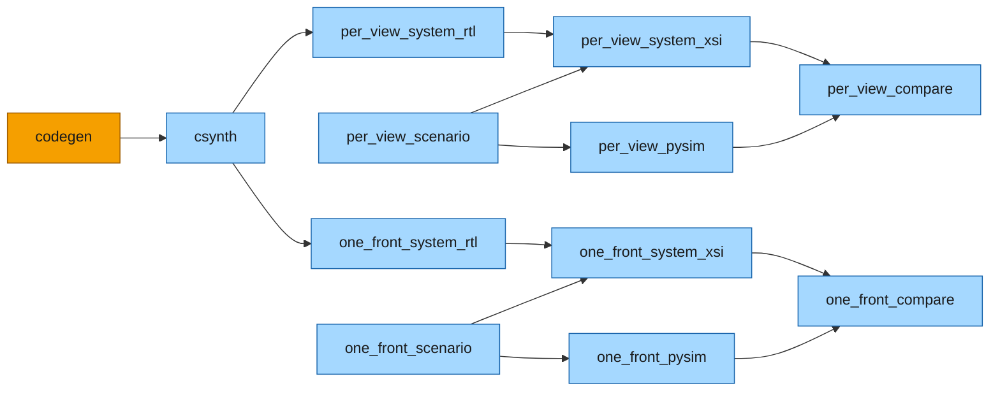

# Build flow

Everything after [Python simulation](pysim.md) -- generating the kernel's C++, synthesizing it and the
bus to Verilog, and simulating the whole system at RTL against pysim -- is one
[`BuildDag`](../../guide/build/index.md), in
[`examples/mm_fir/mm_fir_build.py`](../../../examples/mm_fir/mm_fir_build.py). It builds **two**
systems, the two adaptor topologies of [Synthesis](synth.md#two-topologies-one-address-map). They share
the kernel and differ only in the bus:



*Orange: the example's step. Blue: the framework's, added by one call per topology. The kernel's RTL
does not depend on the bus, so the two topologies share one `codegen` and one `csynth`.*

## Before you start

- **pysim works.** Everything here derives from `MmFirSystem`; if it does not run bit-exact in Python
  ([Python simulation](pysim.md)), nothing below will.
- **Vitis HLS** for csynth, **Vivado** for the crossbar IP (`create_ip`) and the simulation (`xsim`), and
  a C++ compiler -- the mingw `g++` that ships with Vivado on Windows, the system `g++` on Linux. The
  pysim side (`--through per_view_pysim`) needs none of them.

## The scenario and the systems

```python
XBAR_NAMES = {"per_view": "xbar_mm4_1x4", "one_front": "xbar_mm1_1x2"}
SYSTEM_TOP, WORK_DIR = "mm_fir_top", "xsi_work"

NSAMP, SWITCH_AT, PKT = 200, 101, 16
TAPS_A = [3, -1, 4, 1, -5]
TAPS_B = [2, 7, 1, -8, 2, 8, 1, -8]
PLAN = [(0, TAPS_A), (SWITCH_AT, TAPS_B)]

def scenario_x() -> np.ndarray:
    return np.random.default_rng(7).integers(-2000, 2000, size=NSAMP)

def system(topology: str) -> MmFirSystem:
    return MmFirSystem(x=list(scenario_x()), plan=PLAN, pkt=PKT, one_front=topology == "one_front")
```

`system(topology)` is the **same object pysim runs**, on the gate's scenario: 200 samples in packets of
16, the taps switching at sample 101. Everything below starts from it. Nothing names the synthesized
module or where its Verilog is: the HLS top is derived from the system's cut. The crossbar names are
given only so the generated IP's cache holds.

## The DAG

```python
def build_dag(probes: bool = False, work_dir=WORK_DIR) -> BuildDag:
    dag = BuildDag()
    dag.add(MmFirCodegenStep(name="codegen"))
    for topology, xbar_name in XBAR_NAMES.items():
        sysm = system(topology)
        add_system_steps(dag, sysm, work_dir=work_dir, top=SYSTEM_TOP, xbar_name=xbar_name,
                         prefix=f"{topology}_", workspace=f"mm_fir_{topology}",
                         tcls={TOP: Path(f"{TOP}.tcl")},
                         probes=timing_probes(sysm) if probes else None)
    return dag
```

`codegen` is the example's step: the headers, the kernel's top and its `.tcl` (`generate()`).
[`add_system_steps`](../../../waveflow/build/system_dag.py) adds the rest from each system object. The
prefix names the second system's steps, and a top the first system's `csynth` already builds is shared,
not built twice. Each step is described in general on
[XSI system simulation](../../guide/build/xsi_system.md#running-it); here is what each does for this
example, and the page that covers it:

| step | what it does here | page |
|---|---|---|
| `codegen` | the C++ sources: `gen/mm_fir.cpp`, `mm_fir.tcl`, the schema headers, the lane routines | [Code generation](codegen.md) |
| [csynth](../../guide/build/xsi_system.md#csynth) | Vitis on `mm_fir`, re-run only when its source stamp no longer matches; shared by both topologies | [Synthesis](synth.md) |
| [`<topology>_system_rtl`](../../guide/build/xsi_system.md#system-rtl) | the topology's crossbar IP (`create_ip`, cached) and `mm_fir_top.v`, walked from the graph | [Synthesis](synth.md) |
| [`<topology>_scenario`](../../guide/build/xsi_system.md#scenario) | `FirHost` writes its schedule as a burst bundle, the one file both hosts read | [XSI testbench](xsi.md) |
| [`<topology>_pysim`](../../guide/build/xsi_system.md#pysim) | the same system in pysim, from that file: the host's traces and its cycle count | [XSI testbench](xsi.md) |
| [`<topology>_system_xsi`](../../guide/build/xsi_system.md#system-xsi) | the harness around `FirHost`'s C++ twin, compiled with the RTL and run under XSI; `report.json` | [XSI testbench](xsi.md) |
| [`<topology>_compare`](../../guide/build/xsi_system.md#compare) | every host endpoint's trace, RTL against pysim, file for file | [XSI testbench](xsi.md) |

## Running it

```bash
python -m examples.mm_fir.mm_fir_build                                # both topologies, end to end
python -m examples.mm_fir.mm_fir_build --through one_front_compare    # one topology
python -m examples.mm_fir.mm_fir_build --through per_view_pysim       # the pysim side only: no Vivado
python -m examples.mm_fir.mm_fir_build --through csynth               # the kernel's Verilog, stop there
python -m examples.mm_fir.mm_fir_build --through per_view_system_rtl  # one topology's RTL, not simulated
python -m examples.mm_fir.mm_fir_build --status                       # what is stale, and why
python -m examples.mm_fir.mm_fir_build --synth check                  # fail on a stale top, never synthesize
python -m examples.mm_fir.mm_fir_build --probes                       # the tops with timing probes
```

**What a second run skips.** `codegen` always runs (seconds) and rewrites the headers and the top,
usually with the same bytes. `csynth` does not go by those files' times: the kernel's stamp records the
content of the sources it was built from, so the same bytes mean nothing to synthesize, and `csynth`
reports UP-TO-DATE. The steps after it always run -- they read Python and C++ the DAG cannot see, and
each is seconds, or the simulation itself. The general rule is
[a hook each step answers late](../../guide/build/xsi_system.md#freshness).

**Where a run lands**: `xsi_work/mm_fir_<topology>/` (`..._probes/` with probes) holds `mm_fir_top.v`
and `rtl.json` (the RTL the top compiles), the scenario, `report.json` (the host's report: `DONE`, the
bus operations), `pysim.json`, `compare.json`, and both sets of traces. `system_xsi.load_run(...)` reads
them back as an `XsiRun`.

The next three pages follow the steps: [Code generation](codegen.md) turns the kernel into C++,
[Synthesis](synth.md) turns that C++ and the bus into Verilog, and [XSI testbench](xsi.md) puts the
Verilog under a testbench driven by the host's C++ twin. The numbers are on
[RTL simulation](rtlsim.md).
