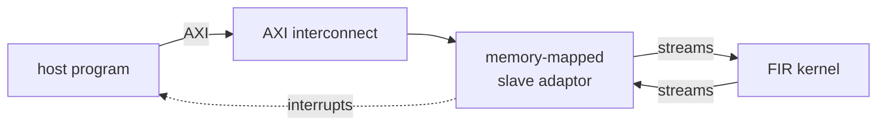

# Protocol



A **host program** talks to the **FIR kernel** through an AXI interconnect and a **memory-mapped slave
adaptor**. The adaptor turns the host's bus reads and writes into the streams the kernel reads and
writes, and raises interrupts when the host has room to write or data to read -- how it does that is
the [Slave adaptor](slave_adaptor.md) page. This page is what the two ends say to each other.

The filter is an exact integer FIR: int16 samples (packed four to a 64-bit word by the serializer),
up to 16 int16 taps, and the full sum as an int64. Nothing rounds, so the numpy golden is bit-exact by construction and any
mismatch is a real bug.

## The exchange

1. **The host commits a configuration** -- a `FirCfg`: the taps, how many are active, and a `cfg_id`,
   the host's name for this config (1, 2, ...; 0 means "no config yet") -- to the register bank.
2. **The host sends a command descriptor** for each packet to queue in -- a `FirCmdHdr`:
   - `nsamp`, the number of samples that follow;
   - `tx_id`, the host's id for the packet;
   - `cfg_id`, the id of the config the packet must be filtered with.
3. **The host sends the samples in-band**, on the same queue, right behind their header: `nsamp` int16
   samples, four to a 64-bit word.
4. **The kernel waits for the config the header names**, takes configs until the one in force has that
   id, then filters the samples, writing one result per sample to queue out.
5. **The kernel publishes its status** (samples filtered so far, the id of the config in force, configs
   taken) to the register bank, **then writes a response** -- a `FirRespHdr` -- to the response queue:
   the packet's `nsamp`, its `tx_id`, and the `cfg_id` it was *actually* filtered with.
6. **The host takes the results and the response** -- each when that queue's interrupt says it is
   there -- and checks the response's `tx_id` and `cfg_id` against what it sent. After the last response
   it reads the final status once.

```text
host -> regs     FirCfg(coeffs, ntaps, cfg_id)
host -> qin      FirCmdHdr(nsamp, tx_id, cfg_id) | x[0] ... x[nsamp-1]
kernel -> qout   y[0] ... y[nsamp-1]
kernel -> regs   FirStatus(nsamp, cfg_id, ncfg)            (latest value)
kernel -> qresp  FirRespHdr(nsamp, tx_id, cfg_id)
```

It is the [command-response pattern](../../guide/patterns/command_response.md), with one addition:
the configuration travels separately from the commands, so the commands say which one they need.

## Why a config id

A config travels on one stream and the samples on another. Even when the host sends the config
first, **nothing guarantees the kernel sees it first** — two streams have no order between them (the
slave page's [ordering statement 2](../../guide/interface/axi_mm/slave.md#ordering)). If the
protocol were "the new taps apply from whenever they arrive", the output would depend on timing.

So the order is carried **in the messages**: the host names every config, and every packet names the
config it needs.

**The kernel waits for that config.** Per packet it reads the header, then takes configs from the
register bank until the one in force has the id the header names, then filters the samples. That rules
out both ways the order could go wrong:

- **a packet cannot use an older config** than the one it names — the kernel waits until it has
  arrived;
- **a packet cannot use a newer one** — a config no packet has asked for yet stays where it is, in
  the stream from the register bank.

So the host commits a config and sends the packets that need it, in either order, and never asks
whether the config arrived. The test suite commits the second config 32 samples *after* the packets
that need it, and the output is still exact: those packets wait in queue in until it lands.

**Carried, not counted.** The id travels *in* the config, and the kernel's rule is equality -- "until
the config in force is this one" -- not a count of commits kept at both ends. A count lives in two
places and nothing checks them against each other: a host that restarts has lost its, and one commit
lost or doubled shifts every later packet onto the wrong taps for good. A carried id needs nothing to
be in step: a host that has lost its place commits a config with a fresh id and tags its packets with
it, and the kernel takes configs until it reaches that one. (The test suite does exactly that: configs
named 5 and 9 waiting, a packet asking for 9.)

**Waiting costs nothing on the bus.** The kernel waits on its own stream from the register bank,
which sits beside it; it never touches the bus. While it waits it takes no samples, so queue in fills
and the host's writer waits for room — asleep on queue in's interrupt, which fires when the kernel
has drained enough. Nothing polls.

**The response FIFO lets the host check.** After each packet the kernel writes a `FirRespHdr` to a
second queue out: the packet's `tx_id` and the `cfg_id` it was actually filtered with. The host
compares each response with the config it *meant* the packet to use. The wait makes a wrong config
impossible from the kernel's side; the echo catches the host's side — a packet tagged with the wrong
id. The negative control is exactly that: a host that tags every packet with config 1 while meaning
config 2 after the switch. The kernel obeys the tag, the output does not match the plan, and every
response after the switch is flagged.

**The limits, stated:**

- **One config outstanding.** The register bank holds one config the kernel has not taken; a second
  COMMIT waits on the bus until the first is taken. So the host commits the next config only after a
  packet asking for the current one has gone out.
- **Packets sent ahead of their config must fit in queue in.** Otherwise the host waits for room
  while the kernel waits for the config.
- **A config that is never sent is waited for forever.** The kernel stops, and the host can see it:
  the status's `nsamp` stops advancing.

Two earlier versions of this example carried the order differently. One numbered configs by commit
order, counted at both ends -- correct, but fragile in the ways above. Before that, each config named
the sample index it applied at, and the host polled the status until the config showed as received
before sending that sample -- a status round trip per config, and not the in-band header pattern the
other examples use.

## What it demonstrates

- A kernel reached through registers and queues, with **no** change to how a kernel is written.
- The adaptor's views behind the real AMD crossbar, gated bit-exact at RTL in two shapes: one view
  per crossbar slot (618 cycles), and all four views behind one front with a generated decoder
  (611 cycles).
- **No polling anywhere.** The host sleeps on the queue views' interrupts — queue in's for room, queue
  out's and the response FIFO's for data — and reads the final status once, because the kernel
  publishes it before each response. Tests check it at both levels: in pysim and at RTL, the host
  never reads a count.
- One host program, holding endpoints and never an address, run over the bus in pysim, joined
  directly to the kernel in pysim, and — written against the C++ twins of the same endpoints — over
  the bus at RTL.
- A cross-stream protocol made deterministic by carrying the order in the messages — a config id in
  each config and in each packet's header — and checked end to end by a response FIFO.
- A hand-written HLS body that had to be restructured to pipeline: from ~1 sample per 10 cycles to 1
  per cycle, by moving at most one word per stream per firing.

