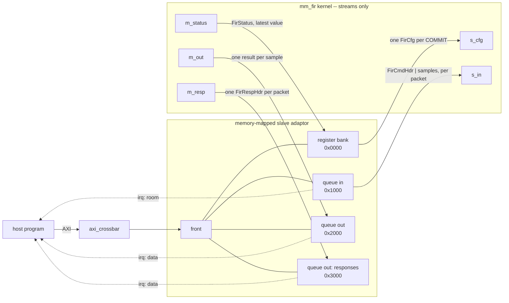

# Slave adaptor

## Why a slave adaptor?

Every kernel in this repo is **streams only**: a free-running Vitis kernel is an
`hls::task` whose ports are streams, and Vitis cannot generate the slave side of a memory-mapped bus for
it. A host, though, talks to a peripheral by reading and writing addresses. So something has to map
the host's memory-mapped accesses onto the kernel's streams -- that is the
[memory-mapped slave adaptor](../../guide/interface/axi_mm/slave.md). It sits beside the kernel in the
RTL top, and the kernel never sees an address.

## What is inside it

One AXI slave port, a front that serves one bus transaction at a time, and one
**view** per kind of traffic, each a 4 KB window of the slave's address range joined to one or two of
the kernel's streams:



| address | view | the host | the kernel |
|---|---|---|---|
| `0x0000` | register bank | sends each `FirCfg` (the shadow, then COMMIT); reads `FirStatus` | takes `FirCfg` messages when a packet asks for them; pushes a `FirStatus` |
| `0x1000` | queue in | sends each packet as a `FirCmdHdr`, then its samples | reads a header, then that many samples |
| `0x2000` | queue out | takes the results | writes one result per sample |
| `0x3000` | queue out (responses) | takes one `FirRespHdr` per packet and checks it | writes one `FirRespHdr` per packet |

**Choosing a view for each kind of traffic.** Taps, samples, responses and status have different
semantics, and each gets the view that matches:

- **Taps are configuration.** The kernel must never filter with half of an old tap set and half of a
  new one, so the register bank is **shadow-and-commit**: the host writes the whole `FirCfg` into a
  shadow, and a write to COMMIT sends it to the kernel as **one message**.
- **Samples are a stream.** They arrive continuously, in order, and the host must not overrun the
  kernel — a queue gives back-pressure, which the host's endpoint waits on through the queue's interrupt.
- **Responses are a stream too.** One per packet, in order, and none may be lost — so they are a
  second queue, not a register.
- **Status is latest-value.** The kernel publishes how many samples it has filtered and how many
  configs it has taken. The host reads the most recent; nothing queues up.

## Constructing the adaptor

The kernel **declares** its views on its class -- which of its stream ports a bus master reaches, as
what, in address order. This is the kernel *type's* memory-mapped side; the kernel's code does not
change:

```python
class MmFir(FreeRunMod):
    mm_views: ClassVar[tuple] = (
        RegBank("regs", cfg_port="s_cfg", status_port="m_status",
                cfg_type=FirCfg, status_type=FirStatus),
        QueueIn("qin", port="s_in", depth=QDEPTH),
        QueueOut("qout", port="m_out", depth=QDEPTH),
        QueueOut("qresp", port="m_resp", depth=RDEPTH),
    )
```

The system builds an instance's adaptor from that declaration -- the view modules, the stream
channels joining each to the kernel's port, and either one front in front of all four
(`one_front=True`) or one crossbar slot per view:

```python
self.device = build_mm_device(self.fir, sim=sim, clk=clk, mem_dwidth=DW,
                              one_front=self.one_front)
```

## Setting the local memory map

Each view gets a 4 KB window, in declaration order. That **layout** -- every view's offset within the
slave, with no base -- belongs to the kernel *type*, so it is read off the class with no simulation:

```python
MM_LAYOUT = MemSlaveLayout.of(MmFir, mem_dwidth=DW)
```

Where the slave sits on the bus is the **system's** choice, its global base. The system gives the
crossbar the slave's ranges at that base, and every view's bus address is the base plus its offset:

```python
MM_BASE = 0x0000
...
slaves, ranges = self.device.ranges(MM_BASE)
assign_address_ranges(slaves, ranges)
self.slave_map = self.device.layout.at(MM_BASE)      # every view at base + offset
```

| view | kind | offset in the slave | bus address (`MM_BASE = 0x0000`) |
|---|---|---|---|
| `regs` | register bank | `0x0000` | `0x0000` |
| `qin` | queue in | `0x1000` | `0x1000` |
| `qout` | queue out | `0x2000` | `0x2000` |
| `qresp` | queue out | `0x3000` | `0x3000` |

At RTL the same two halves become two C++ headers -- the type's layout and the system's bases -- that
the testbench host combines as `at(mm_fir_layout::qin, FIR)`
([RTL simulation](rtlsim.md)). A second FIR at another base would share the layout and differ only in
its base.

## Reaching the views from the host

The host never names an address. It asks for each view **by name** and gets the endpoint a direct
connection would give it, and each queue view's interrupt line is wired to it so the endpoints wait
instead of polling:

```python
mm = BoundMemSlaveAdaptor(self.slave_map, self.host.m)
self.host.cfg = mm.stream_master("regs")                           # write() = shadow + COMMIT
for v in (self.qin, self.qout, self.qresp):                       # each queue's interrupt line
    line = IrqIF(name=f"{v.name}_irq", sim=sim)
    line.bind("source", v.m_irq)
    self.host.irq[v.name] = IrqIFSink(name=f"host_{v.name}_irq", sim=sim)
    line.bind("sink", self.host.irq[v.name])
self.host.qin = mm.stream_master("qin", irq=self.host.irq["qin"])     # waits for room
self.host.qout = mm.stream_slave("qout", irq=self.host.irq["qout"])   # waits for data
self.host.qresp = mm.stream_slave("qresp", irq=self.host.irq["qresp"])
self.host.status = mm.status("regs")                               # read() = the latest status
```

So the same host class runs over the bus or joined straight to the kernel (`link="direct"`); only this
wiring differs. The endpoints are described in the
[slave adaptor guide](../../guide/interface/axi_mm/slave.md#reaching-the-views-from-a-bus-master).
