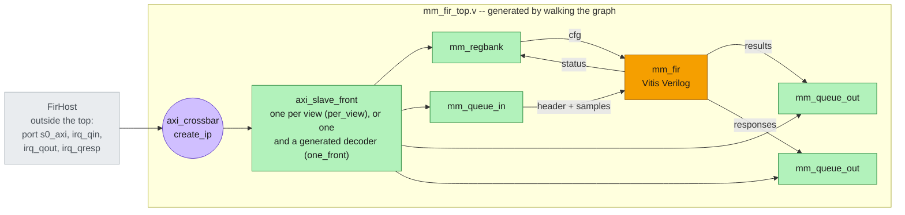

# Synthesis

Two steps of the [build flow](build.md) turn the system into Verilog. **csynth** runs Vitis HLS on the
kernel [Code generation](codegen.md) wrote. **system_rtl**, once per topology, generates the crossbar IP
and walks the pysim graph to the Verilog top that wires everything together. Fig. 2 is the same graph
as [Fig. 1](codegen.md), now with what each object becomes in RTL:



*Fig. 2 -- what each object becomes in RTL. Orange: csynth's Verilog for the kernel, by Vitis HLS.
Purple: AMD's crossbar IP, by Vivado's `create_ip`. Green: the framework's hand-written Verilog
(`waveflow/build/rtl/`) -- the front and the view leaves. The box is `mm_fir_top.v`, generated. Grey:
the host is not hardware; what it is bound to becomes a port of the top, and it is driven by a
testbench in [XSI testbench](xsi.md).*

```bash
python -m examples.mm_fir.mm_fir_build --through csynth                 # the kernel's Verilog
python -m examples.mm_fir.mm_fir_build --through per_view_system_rtl    # and one topology's IP and top
```

## csynth: the kernel {#csynth}

The [csynth](../../guide/build/xsi_system.md#csynth) step has one inner step per HLS top the system's
cut instantiates -- here one, `mm_fir`, shared by both topologies. Its Verilog lands in
`mm_fir_proj/solution1/syn/verilog/`.

The build targets `xc7z020clg484-1` at 100 MHz (the default `render_tcl` emits). The sample loop
pipelines at II = 1 with latency 11; the kernel uses 16 DSP, 2190 LUT and 2690 FF, and closes timing at
an estimated 6.8 ns.

**Is this the RTL I think it is?** After csynth, `rtl_sources.json` beside the project records a digest
of every source it was built from -- `gen/mm_fir.cpp` and every header in `include/`, the hand-written
body among them. A run compares those digests against the sources on disk, so the identical bytes
`codegen` rewrites every run re-synthesize nothing, and a changed header or body re-runs csynth. Who may
run Vitis is the `synth` parameter: `--synth build` (the default) synthesizes a stale or missing top;
`--synth check` -- what the gates use -- fails on one instead, naming the source that changed, and never
runs the toolchain. A cycle count measured against someone else's build is worse than no count, because
it invites re-recording a number on the strength of an artifact nobody produced on purpose.

## system_rtl: the crossbar and the top {#system-rtl}

The [system_rtl](../../guide/build/xsi_system.md#system-rtl) step builds what csynth does not, once per
topology. The pieces:

| component | here | produced by |
|---|---|---|
| Vitis kernel | `mm_fir` — csynth's Verilog for the [generated top-level function](codegen.md) | [csynth](#csynth) |
| vendor IP | `axi_crossbar`, 1 SI, 4 or 2 MI | `create_ip`, from `spec.xbar` |
| hand-written RTL | `axi_slave_front`, `mm_regbank`, `mm_queue_in`, `mm_queue_out` | `waveflow/build/rtl/` |
| RTL top | `mm_fir_top`: the three above, wired | `render_system_top(system_top_spec(...))` |

The RTL top is **generated by walking the pysim system**
([`waveflow/build/system_top.py`](../../../waveflow/build/system_top.py)): the example names the cut and
nothing else. The run's `xsi_work/mm_fir_<topology>/` gets `mm_fir_top.v` and `rtl.json`, the list of
every Verilog file the top compiles -- all [XSI testbench](xsi.md) needs of this page.

## Two topologies, one address map

```python
sysm = system(topology)
spec = system_top_spec(sysm.xbar, [sysm.fir], top="mm_fir_top", xbar_name=XBAR_NAMES[topology])
```

`[sysm.fir]` is the cut: the kernel is inside, and with it the device `build_mm_device` built for it
— its views, and its adaptor when there is one. The host is outside, so its bus master becomes the
top's AXI4 slave port `s0_axi` and the interrupt lines it waits on become outputs. The crossbar is not
written here either: it comes from the pysim system's own crossbar, so its slots are the ranges
`assign_address_ranges` set — `MM_BASE` plus the FIR type's layout — and it is the same IP the
hand-written configs used to produce, down to its cache digest.

- **`per_view`** — each view is its own crossbar slave, with its own front (`render_view_slot`). Four
  4 KB windows at `0x0000`, `0x1000`, `0x2000`, `0x3000`.
- **`one_front`** — all four views behind **one** front and a generated decoder
  (`render_adaptor_slot`), in one 16 KB window at `0x0000`. The views land at the same addresses, so
  the host program is identical. The crossbar's second slot is a stub nothing addresses: a 1×1
  `axi_crossbar` is degenerate — `create_ip` silently generates an inconsistent two-slave IP for it
  whose simulation crashes — so `AxiXbarConfig` refuses one.

The RTL views are the pysim views, read off the device either way: a queue's depth is its
`MemSlaveWStream`'s, and the register bank's shadow and status sizes are its `MemSlaveRegBank`'s —
which read them off the schemas — so neither can drift from the messages the kernel exchanges.

### The generated decoder

In the `one_front` top, this is all the decoding there is — a table from address bits to views:

```verilog
  axi_slave_front #(.DW(64), .AW(32), .IDW(1), .LAW(14)) u_mm_front ( ... );
  wire [1:0] mm_sel = mm_req_addr[13:12];
  wire mm_hole = 1'b0;                           // four views fill all four windows
  ...
  assign regs_req_valid = mm_req_valid && (mm_sel == 0);
  assign regs_req_addr  = mm_req_addr[11:0];
  mm_regbank #(.DW(64), .LAW(12), .NCFG(5), .NSTAT(1)) u_regs ( ... );
  assign qin_req_valid = mm_req_valid && (mm_sel == 1);
  mm_queue_in #(.DW(64), .LAW(12), .DEPTH(64)) u_qin ( ... );
  ...
  assign qresp_req_valid = mm_req_valid && (mm_sel == 3);
  ...
  assign mm_rsp_rdata = mm_hole_rsp ? {64{1'b0}} :
                        ((mm_rsel == 0) ? regs_rsp_rdata : (mm_rsel == 1) ? qin_rsp_rdata : ...);
```

A request goes to the view its address selects; a read response comes from the view selected when the
read was accepted (`mm_rsel`, latched — the front has one read outstanding). With four views every
window is used; with three, the decoder would answer the unused fourth with SLVERR so a stray read
cannot hang the bus.

### Joining the kernel

The kernel's five streams meet the views on nets named after the pysim channels `build_mm_device`
made: `k_regs_cfg`, `k_regs_stat`, `k_qin`, `k_qout`, `k_qresp`. The kernel's pins come from the same
`TopSpec` its csynth top was rendered from. It has no TLAST pins, so the TLASTs the leaves *drive* go
nowhere, and the three they *read* are tied low — the framework's rule for a stream input nothing
drives (the status bank completes a message on its last word, and a queue out ignores TLAST):

```verilog
  assign k_qout_TLAST = 1'b0;
  assign k_qresp_TLAST = 1'b0;
  assign k_regs_stat_TLAST = 1'b0;
  mm_fir u_fir (
    .ap_clk(ap_clk),
    .ap_rst_n(ap_rst_n),
    .s_cfg_TDATA(k_regs_cfg_TDATA),
    .s_cfg_TVALID(k_regs_cfg_TVALID),
    .s_cfg_TREADY(k_regs_cfg_TREADY),
    ...
    .m_status_TREADY(k_regs_stat_TREADY)
  );
```

Next: [XSI testbench](xsi.md).
