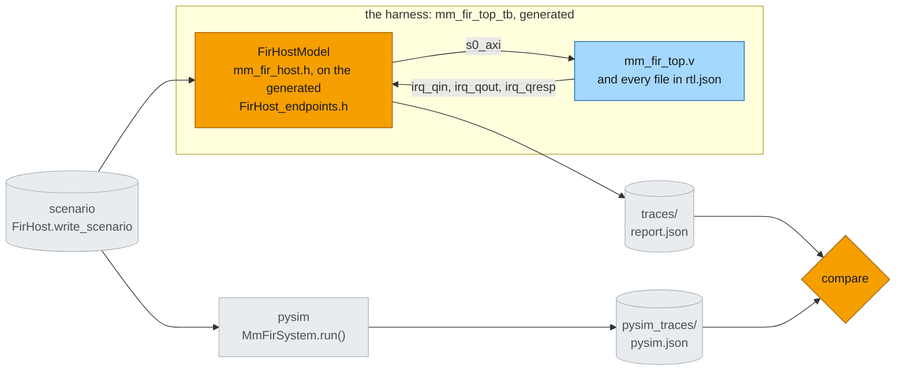

# XSI testbench

The last steps of the [build flow](build.md) put the Verilog from [Synthesis](synth.md) under a
testbench and check it against pysim. The testbench is not written: at RTL the host has to act on pins
every clock cycle, so `FirHost` has a C++ twin. The framework generates the harness that binds the twin
to the top's ports, compiles it with the RTL, and runs it in Vivado's `xsim` through XSI. pysim runs
the same system from the same scenario file, and the two hosts' traces must agree byte for byte. The
numbers are on [RTL simulation](rtlsim.md); the general flow is the guide page
[XSI system simulation](../../guide/build/xsi_system.md#running-it).



*Fig. 3 -- the system under its testbench, for either topology. Orange: what this page adds -- the
host's C++ twin (the one hand-written piece; its endpoints and the harness around it are generated),
and the comparison. Blue: the RTL from [Synthesis](synth.md), compiled as `rtl.json` lists it. Grey:
the files the two runs share and leave, and the pysim run they are checked against.*

| step (per topology) | what it does |
|---|---|
| [scenario](../../guide/build/xsi_system.md#scenario) | `FirHost` writes its schedule -- configs, packets -- as a burst bundle: the one file both hosts read |
| [pysim](../../guide/build/xsi_system.md#pysim) | the same system object in pysim, from that file: the host's traces and its cycle count |
| [system_xsi](../../guide/build/xsi_system.md#system-xsi) | the harness, compiled with the RTL (`xvlog` / `xelab` for the Verilog, `g++` for the testbench) and run; the host's report to `report.json` |
| [compare](../../guide/build/xsi_system.md#compare) | every host endpoint's trace, RTL against pysim, file for file; any difference fails the run |

```bash
python -m examples.mm_fir.mm_fir_build --through one_front_compare    # one topology, end to end
pytest tests/examples/test_mm_fir_xsi.py -m xsi                        # the gates, both topologies
```

The gates ([`tests/examples/test_mm_fir_xsi.py`](../../../tests/examples/test_mm_fir_xsi.py)) run the
DAG through each topology's `compare` with `synth="check"` -- a stale or missing kernel fails them,
named, and is never synthesized by them -- and read the run back with `load_run`.

## The host program

The host has two realizations, like the kernel: the pysim [`FirHost`](python.md#the-host-program) -- a
[`SwHost`](../../guide/build/sw_threads.md) whose threads are SimPy processes -- and its C++ twin
`FirHostModel` in [`mm_fir_host.h`](../../../examples/mm_fir/mm_fir_host.h), beside it. `FirHost` names
the twin with two class attributes, exactly as the kernel names its HLS body with `kernel_task()`:

```python
    cpp_model: ClassVar[str | None] = "FirHostModel"
    cpp_header: ClassVar[str | None] = "mm_fir_host.h"
```

The C++ file is **the program and nothing else** -- the same two threads, line for line:

```cpp
class FirHostModel : public FirHost_endpoints {
public:
    using FirHost_endpoints::FirHost_endpoints;
    void main() override {               // ~ FirHost.main: start the writer, then be the reader
        decode();
        start("writer", [this] { writer(); });
        reader();
    }

private:
    void writer() {                      // ~ FirHost._writer
        for (const Item& it : items_) {
            if (it.kind == CFG) {
                cfg.write(it.words);
            } else {
                qin.write(it.words);     // the header
                qin.write(it.samples);   // the samples
            }
        }
    }
    void reader() {                      // ~ FirHost._reader
        for (const Item& it : items_)
            if (it.kind == PKT) {
                qout.get(it.nsamp);
                qresp.get(1);
            }
        status.read();                   // final: published before the last response
    }
    ...
};
```

Everything it stands on is generated or framework:

- **`FirHost_endpoints.h`** is generated from the wired `FirHost`: `cfg`, `qin`, `qout`, `qresp` and
  `status`, named as in Python, each constructed on its view at its absolute bus address, the queues
  with their interrupt pins; and the bus master. So the C++ holds no address, no pin and no threshold.
  The offsets inside a window -- COMMIT at `W/2`, status at `3W/4` -- are computed on `MmView`, as on
  `ViewEntry` in Python.
- **The runtime** makes each call block: a thread is a fiber, `qin.write(...)` parks it until the
  view's room interrupt fired and the packet is on the bus, and the scheduler resumes the threads once
  per cycle in a fixed order. So the program has no state machine.
- **The interrupts.** The top routes each queue view's `irq` output to a port (`irq_qin`, `irq_qout`,
  `irq_qresp`), which the generated header binds. A queue endpoint waits on its interrupt exactly as the
  Python endpoint waits on its `IrqIFSink`: set the view's threshold (a bus write, only when it changes),
  wait for the pin, move the words. No count is ever read.
- **No scenario in the C++.** Both hosts run one file: `FirHost.write_scenario` writes the schedule as a
  burst bundle of word messages, one burst per item -- a config's words, or a packet's size, id,
  expected config, header and samples as the serializer packs them -- and `decode()` reads it from
  `scenario_bursts()`.

**The data comes back as traces, and is checked in Python.** Every host endpoint -- on both sides --
records what crossed it: each config committed, each packet sent, the words each read took, the status
read. The runtime dumps the five traces after the run, and `trace_report` decodes them with the
schemas themselves -- `FirRespHdr` for each response against the scenario's expected `tx_id` and
`cfg_id`, `FirStatus` for the final status, the outputs as words. The C++ reports only what the bus did:
the cycle count, the polls, and every bus operation.

### The host conformance gate

Nothing static can show that `FirHostModel` behaves like `FirHost` — one is a cycle-level state
machine, the other a SimPy process. So the gate runs both on the **same scenario bundle** and requires
each endpoint's trace to be **byte-identical** between the pysim run and the RTL run
(`test_mm_fir_host_traces_match_pysim`; the DAG's [pysim](../../guide/build/xsi_system.md#pysim) step
runs the pysim side and [compare](../../guide/build/xsi_system.md#compare) compares). Per
endpoint, not globally: the interleaving across endpoints
is timing, and pysim is loosely timed. The cycle count stays an exact gate of its own.

### The bus master: one read and one write at once

AXI's read channels and write channels are independent, and AMD's crossbar routes a read and a write
in parallel. So a host whose writer and reader run concurrently — this one — can have a read and a
write in flight at the same time on a real bus. The host runtime builds every host's bus master that
way (`SwHostModel`, in [`xsi_sw.h`](../../../waveflow/build/xsi/xsi_sw.h)):

```cpp
        : bus_(d, bus, bytes_per_word, 0, /*overlap_rw=*/true) {}
```

It is what `FirHost`'s bus master says: `HOST_MAX_OUTSTANDING = 1` in
[`mm_fir.py`](../../../examples/mm_fir/mm_fir.py), the one setting pysim's `MMIFMaster.max_outstanding`
reads, and `FirHost.bfm_model()` refuses any other value rather than model a different master.

With `overlap_rw`, `AxiMmMaster` keeps one read and one write outstanding, each channel in the order
it was queued. Without it (the default, and what every other gate uses) it serves one transaction at
a time — a model of a single-threaded driver, which waits for each access to finish before the next.
Order *between* a read and a write is then up to the host, as on a real bus: the endpoints never
issue a read that depends on a write until the write's response has come back.

The pysim side needs no setting: a pysim `MMIFMaster` already lets a read and a write run at once.

Next: [RTL simulation](rtlsim.md), the results.
