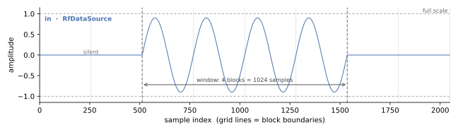

# Building it

Steps 1 to 4. Nothing here needs a toolchain; at the end of step 4 you have a graph that will run.

```bash
python -m examples.rf_loopback.rf_loopback
```

## 1. Create the `Rfdc`

`Rfdc` models a **simplified emulation** of the
[AMD RF Data Converter LogiCORE IP](https://docs.amd.com/r/en-US/pg269-rf-data-converter/Introduction)
— specifically, *the interface your logic would see*. Like the AMD block it exposes two AXI4-Stream
interfaces, one per direction, whose time origins can hold a fixed relation the way multi-tile
synchronisation does; its RF side simulates the signals the physical converter would emit or receive.
[What `Rfdc` is, and what it is not](../../guide/rf/index.md) has the full framing, including what the
model deliberately does not cover.

It is **one module carrying both directions**, not separate ADC and DAC blocks. The reason is
synchronization: the TX and RX sample counters have to hold a fixed relation, and that is a property
*of the converter*, not of two unrelated blocks — it is what lets the two grids' time origins have a
single owner.

```python
rfdc = Rfdc(name="rfdc", sim=sim, nbits=16, samp_per_word=4, full_scale=1.0,
            t0_rx=0.0, t0_tx=blk_period)
```

Four endpoints, in two pairs:

| endpoint | type | direction |
|---|---|---|
| `rx_rf` | `RFSampIFRx` | ADC path — RF blocks in from the environment |
| `rx_stream` | `StreamIFMaster` | ADC path — AXI-Stream words out to the fabric |
| `tx_stream` | `StreamIFSlave` | DAC path — AXI-Stream words in from the fabric |
| `tx_rf` | `RFSampIFTx` | DAC path — RF blocks out to the environment |

The two stream endpoints are the ones that would **cross the [cut](../../guide/flows/modules.md#the-cut)**
in an RTL build; the two RF endpoints stay behavioural on both sides of it.

With the metronome living in the [interface](../../guide/rf/python/sampling.md#the-metronome-lives-in-the-edge),
the converter is **reactive on the RF side**: it has no timer of its own and simply responds to block
arrivals.

### The parameter split

| parameter | binding | why |
|---|---|---|
| `n_rx`, `n_tx`, `nbits`, `iq_mode` | `HwParam` | they set the word layout synthesized logic is built *against* — see [what `iq_mode` means](../../guide/rf/python/axis_side.md#iq-mode) for real vs complex |
| `samp_per_word` | `HwParam`, **integer** | port width is `samp_per_word · nbits`; a sample cannot straddle a slot |
| `full_scale`, `t0_rx`, `t0_tx` | plain init-time fields | one artifact serves every value |

`samp_rate` is deliberately **not** on this list. It lives on the RF interface's clock and the
converter *reads* it at bind; `t0` travels the other way and is *pushed*. Two declarations that can
disagree is the bug both directions exist to avoid.

There is also no `spc`. `samp_per_word` is the structural integer; everything else at this boundary
is a rate ratio — derived, and generally fractional. The Python model needs neither conversion,
because it works in seconds.

> **`full_scale` is *not* a `DynParam`, and the reason is worth knowing.** `DynParam` does not mean
> "binds at init"; it means **emitted as a member assignment** — `<model>.<field> = <expr>;`. This
> value's C++ realization is a *constructor argument*, riding inside the `RfdcFormat` literal the
> generated models take, so tagging it would emit an assignment to a member that does not exist.
> Zero would be doubly wrong — meaningless as an amplitude reference *and* falsy, which
> `discover_dyn_params` skips — so the constructor refuses it either way.

### Bit-exact quantization

"Evaluate the effect of bit widths in Python" only means anything if the Python does what the
hardware will. So quantization is the integer-backed
[`FixedField`](../../guide/schema/) — `ap_fixed<nbits, 1>` over `[-1, 1)`, rounding and
**saturating**, because a converter clips rather than wraps — and sample↔word packing goes through
the [generated array serializers](../../guide/vectorization/), never a hand-rolled `.range()`:

```python
quantized = from_real(samples / full_scale, self.SampType)   # ADC: real -> stored ints
yield from self.rx_stream.write(quantized)                   # packed at the stream's own width
```

At `nbits=16, samp_per_word=4` that is four samples per 64-bit AXI-Stream beat. The gate runs
`(8, 8)`, `(16, 4)`, `(12, 4)` and `(16, 2)` — including a non-power-of-two width — because the bugs
hand-rolled packing produces hide at exactly the awkward widths.

## 2. Create the source and sink

Both are **file-backed**, and that is the discipline rather than a convenience: one on-disk bundle
drives the Python run *and*, later, the RTL run, so the two backends can never start from different
bytes.

```python
self.source = RfDataSource(name="src", sim=sim, in_bundle="vectors/rf_in", start_delay=0.0)
self.sink = RfDataSink(name="sink", sim=sim, out_bundle="vectors/rf_out", depth=2)
```

`write_scenario` is the single scenario writer, and it is the only thing that produces input bytes.

### Two waveforms, because they test different things

`RfLoopbackSim(waveform=...)` takes `"grid"` or `"sine"`, and the difference is not cosmetic.

**`"grid"`** draws random samples **exactly on the converter's quantization grid** —
`m / 2^(nbits-1) · full_scale` for integer `m`. A clean loopback is then *bit*-identical to the
input rather than close, which is what makes the packing check strict: a tolerance would hide a
packing bug, and packing is what this waveform exists to test. What it deliberately does **not**
test is quantization: on-grid samples make `from_real` a no-op, so rounding and saturation are never
exercised at all.

**`"sine"`** is a windowed sinusoid, and it exists to close exactly that gap. A sine does not land on
the grid, so `from_real` really rounds, and at 0.9 of full scale it is near enough the rail to
exercise saturation. The golden stays **exact** — no tolerance — it is just stated against the
*quantized* input:

```python
assert np.array_equal(captured[k + n_lat], to_real(from_real(sent[k])))
```

That is the paragraph worth keeping: two waveforms, because one proves the packing is exact and the
other proves the quantizer is exercised at all, and neither substitutes for the other.
`tests/examples/test_rf_loopback.py` asserts the difference directly — the grid waveform survives a
round trip through `from_real`/`to_real` unchanged, and the sine does not.

The sine is also the one you can *see*. Here is what the source plays, read back out of the bundle
it was written to:



8 blocks of 256 samples, and the burst occupies the middle 4 of them — 1024 samples, silent either
side. Deliberately away from block 0, so that the DAC's startup zero-fill on the next page cannot
be confused with the window simply being closed.

## 3. Wire the graph

Four edges, and only two kinds:

```python
adc_if = RFSampIF(name="adc_if", sim=sim, samp_clk=self.samp_clk,
                  n_ch=1, blksize=256, n_blk=8)
adc_if.bind("tx", self.source.rf_ep)
adc_if.bind("rx", self.rfdc.rx_rf)
```

| edge | type | domain |
|---|---|---|
| source → `rfdc.rx_rf` | `RFSampIF` | RF — blocks of real samples, on the sample clock |
| `rfdc.rx_stream` → DUT | `StreamIF` | fabric — an **ordinary** AXI-Stream |
| DUT → `rfdc.tx_stream` | `StreamIF` | fabric — an ordinary AXI-Stream |
| `rfdc.tx_rf` → sink | `RFSampIF` | RF |

Only the `StreamIF` pair would cross the cut in an RTL build; the `RFSampIF` pair stays behavioural
on both sides of it.

**No `depth=` on the AXIS edges**, and that is a correction rather than an omission. These become the
DUT's top-level ports, and a top-level argument cannot carry a FIFO depth: Vitis ignores the pragma
(`HLS 214-387`) and the RTL gets the default of 2. `composite_top_spec` now refuses the declaration
outright — see [the fidelity boundary](../../guide/rf/python/fidelity.md#the-resolution-limit).

### Graph and procedure are separate objects

The same split as [`mem_copy`](../memcpy/python.md): `RfLoopbackTB.__post_init__` builds **only
structure**, because a component graph is data and can be walked, while a run-and-check function is
code and cannot. `RfLoopbackSim` owns the scenario, the run and the golden.

## 4. The DUT, and why it is two tasks

`RfSampPassThrough` is a [`FreeRunMod`](../../guide/flows/concurrent.md): one burst in, the same
burst out — as **two tasks over an internal channel**.

```
s_in --> [RfSampIngress] --blk_fifo (depth = nwords_blk)--> [RfSampBlockRelay] --> s_out
```

Free-running is the honest kind here — logic sitting between two converter ports has no host to
start it and re-fires on each arriving block. The payload behaviour is trivial so that the loopback
golden is *exact* rather than approximate: any difference between what went in and what came out is
the plumbing, not an algorithm.

The **structure** is not trivial, and it is not decoration. It was one task — read a whole block,
then write it — and that design dropped 72 of 512 samples at RTL. A converter cannot be
back-pressured, so a stage that stops reading its input for 64 cycles at a stretch loses whatever
arrives meanwhile. Splitting the read from the write is what lets block *k+1* arrive while block *k*
is going out:

```python
class RfSampIngress(FreeRunMod):        # never stops reading the boundary port
    def run_iter(self):
        words = yield from self.s_in.get()
        yield from self.w_out.write(words)


class RfSampBlockRelay(FreeRunMod):     # allowed to be busy: it holds a block
    def run_iter(self):
        blk = yield from self.blk_in.get(self.blk_words)
        self.count_burst()
        yield from self.s_out.write(blk)
```

The channel between them is declared one block deep, and **that declaration is honoured because the
channel is internal**: `#pragma HLS STREAM depth=` works inside a top and is ignored on a top-level
argument. That asymmetry is why the elastic buffer has to be a task plus a channel rather than a
bigger number on the port.

### The DUT declares what the loop costs

The DAC grid is a metronome, not a queue: it emits a block every period whether or not the samples
for it have arrived. And DAC block *k* **cannot** carry ADC block *k* — the ADC only delivers block
*k* at the instant the DAC period for it comes due, so the loop costs at least one block *index*
**however fast the fabric is**. A zero-latency fabric would not close it either.

So the pipeline declares what it costs:

```python
class RfSampPassThrough(FreeRunMod):
    blk_latency: HwParam[int] = 1      # >= 1 for any block-processing module
```

and `blk_latency = 0` is **refused at construction** rather than reported later as a symptom — a loop
that claims to be free is not a slow system, it is not a system.

The testbench then sums the path: `loop_blk_latency = 1 + dut.blk_latency`, where the extra term is
the **ADC's own hop** — a converter cannot emit samples it has not collected, so a block exists at
its grid tick and is transmitted across the *following* period. Two blocks in total, and that is the
number the next page checks against.

Two things this deliberately does *not* do. It does not stagger the tile epochs: `t0_rx == t0_tx` is
what MTS gives you, and buying pipeline latency by starting a tile late would model the thing MTS
exists to prevent. And it does not treat the resulting first-block underrun as a fault — a converter
fed by a pipeline **must** underrun until the data reaches it, which is exactly why a real design
primes its buffer before enabling the tile.

## Next

- [Running it](./run.md) — the three claims, and the two faults that make the counters mean
  something.

**Source of truth:** `examples/rf_loopback/rf_loopback.py`, `examples/rf_loopback/rfdc.py`,
`tests/examples/test_rf_loopback.py`.
