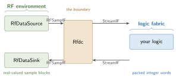

# RF loopback — a design with a data converter

This is the worked example for the [RF converter guide](../../guide/rf/). It is the smallest graph
that has a converter in it:

```
RfDataSource --RFSampIF--> Rfdc.rx_rf | Rfdc.rx_stream --StreamIF--> RfSampPassThrough
                                                                              |
RfDataSink   <--RFSampIF-- Rfdc.tx_rf | Rfdc.tx_stream <--StreamIF------------+
```

Five nodes, four edges, and no signal processing anywhere. That is on purpose. Every other example
in this collection is about what a kernel *computes*; this one is about the **boundary** the samples
cross to reach a kernel at all — a boundary with its own clock, a granularity mismatch, and a failure
mode that no protocol signal reports.

## The two domains



**One `Rfdc`, used in both directions, and it belongs to neither box.** On its left, blocks of
real-valued samples; on its right, packed integer words. The representation changes exactly there,
once in each direction — which is what makes a loopback a real test of it.

## Pages

This example is a walkthrough in seven steps, split across three sittings:

| page | steps | what you get |
|---|---|---|
| [Building it](./build.md) | 1–4 | the `Rfdc`, the source and sink, the four edges, and the DUT |
| [Running it](./run.md) | 5–6 | the three claims the gate makes, and two faults that make the counters mean something |
| [Taking it to RTL](./rtl.md) | 7 | csynth, the XSI run, and the cycle gate |

Everything on the first two pages runs with **no toolchain**:

```bash
python -m examples.rf_loopback.rf_loopback
pytest tests/examples/test_rf_loopback.py tests/hw/test_rf_sample_if.py
```

## Learning objectives

- Model an RF sample channel as an [**interface** that owns a metronome](../../guide/rf/sampling.md)
  — a clock, a block cadence, a buffer, and loss counters living on the edge rather than in a node.
- Model a **data converter** as a module carrying both directions, with `HwParam` structure
  (resolution, samples per word) separated from `DynParam` knobs (the amplitude reference).
- Quantize bit-exactly with the integer-backed `FixedField` and pack samples into stream words
  through the generated array serializers.
- Assert a **byte-identical** loopback (shifted by the loop's declared block latency) *and* that loss
  is exactly what the graph declared, and understand why the first check is not sufficient without
  the second.
- Read `check(mod, "xsi_bfm_model")` as a **finding** about a module rather than a declaration on it.

## Where the pieces live

| | file | role |
|---|---|---|
| the edge | `waveflow/hw/rf_sample_if.py` | `RFSampIF` — framework, generic to any converter |
| the RF environment | `waveflow/simulation/rf_tb.py` | `RfDataSource` / `RfDataSink` — framework, bundle-backed |
| the converter | `examples/rf_loopback/rfdc.py` | `Rfdc` |
| logic + graph | `examples/rf_loopback/rf_loopback.py` | `RfSampPassThrough`, `RfLoopbackTB`, `RfLoopbackSim` |
| the RTL build | `examples/rf_loopback/rf_dut_build.py` | the DUT cut alone, between generic AXI-Stream BFMs |
| the figures | `examples/rf_loopback/rf_loopback_figures.py` | every plot on these pages, rendered from a run |

The digital logic is [synthesized and proved at RTL](./rtl.md) — cut **alone**, between generic
AXI-Stream BFMs. A page for the *converter* at RTL is not written: the models exist but nothing
wires them into a graph yet, so its rate conversions and counter-equivalence gate would be written
from the plan rather than from working code. See `plans/adc_model.md`.

## See also

- [RF converters](../../guide/rf/) — the concepts this example is written from.
- [Free-running memory copy](../memcpy/) — the graph/procedure split and the bundle discipline this
  example reuses.
