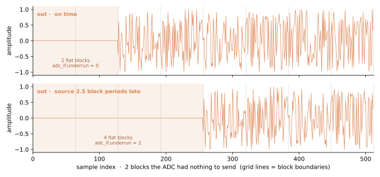

# Running it

Steps 5 and 6. Still no toolchain:

```bash
pytest tests/examples/test_rf_loopback.py
```

## 5. Run it and check

```python
sim = RfLoopbackSim(n_src_blk=8)
sim.run()
sim.check()
```

```
adc  {'blocks_sent': 8, 'blocks_delivered': 8, 'underrun': 0, 'overrun': 0}
dac  {'blocks_sent': 8, 'blocks_delivered': 8, 'underrun': 2, 'overrun': 0}
```

`check()` makes four claims, and the first two are the stage gate.

1. **Byte-identical, once shifted by the declared latency.** The sink's bundle is compared to the
   source's *as bytes on disk*, not as arrays in memory — both participants are bundle-backed, so
   the loopback is a file-to-file comparison. DAC block *k* must equal ADC block
   *k* − `loop_blk_latency`, and the leading `loop_blk_latency` blocks must be exactly the zero-fill.
2. **Loss is exactly what the graph declared.** `underrun == 0` on the ADC edge, which is fed
   straight from the source and entitled to nothing; `underrun == loop_blk_latency` on the DAC edge,
   and at the *start* — `assert_clean(startup_blocks=…)` checks the grid index too, so a
   steady-state fault cannot hide inside a transient's budget. `overrun == 0` everywhere: overrun
   has no transient to hide in.
3. Block counts agree end to end (the DUT relayed as many bursts as the source sent).
4. **Alignment is derived**: with both tiles on one epoch, DAC sample *n* occurs at the same instant
   as ADC sample *n*, for every *n* — arithmetic on `t0` and the rate, not something a particular
   scheduling order made true. Note what this is *not* claiming: aligned grids do not make the loop
   free. Alignment is about when a grid ticks; `blk_latency` is about which block each tick carries.

### The loop costs two blocks, and you can see both


Two panels rather than one overlay, because an overlay occludes: the output drawn over the input
hides the input wherever they coincide. Stacked, the delay is legible and neither trace is lost.

Three things to read off it, each measured by the script that drew it:

- **the output is the input**, bit-identical, not merely close;
- **the shift is 2 whole blocks** — 512 samples at `blksize=256` — which is
  `loop_blk_latency = 1 + dut.blk_latency`;
- **the leading two blocks are flat**, which is the DAC's zero-fill before any samples reach it.

The second term of that latency is the ADC's own hop, and it is the one that surprises: a converter
cannot emit samples it has not collected, so a block exists at its grid tick and is transmitted
across the *following* period. That hop was invisible while the ADC's burst was charged at the fabric
clock rather than at `samp_rate / samp_per_word`, and appeared the moment it was paced honestly. It
is the same quantity the [fidelity contract](../../guide/rf/python/fidelity.md) states as *no dependency
shorter than `2 × blksize` — one block per converter hop*.

## 6. The deliberate faults

### Why claim 2 is not redundant

Because claim 1 passes without it. Both failures below are **silent**: a starved grid emits
well-formed zero blocks and a stalled consumer simply sees fewer of them, and every functional check
downstream still passes on the data that did arrive.

So the counters are driven off zero deliberately, against *predicted* values — a counter that has
never counted is not evidence that it works.

### A late producer underruns

The source starts 2.5 block periods late, so periods 1 and 2 have nothing to send:

```python
sim.tb.source.start_delay = 2.5 * sim.tb.blk_period
```

`adc_if.underrun == 2` — exactly the two missed periods. What that looks like at the far end of the
loopback is two **extra** flat blocks:



Both panels are the sink's capture, and both use the on-grid waveform rather than the sine — every
one of its blocks is full-scale, so a flat block at the sink can *only* be zero-fill.

| run | leading flat blocks at the sink | `adc_if.underrun` |
|---|---|---|
| on time | 2 | 0 |
| source 2.5 block periods late | 4 | 2 |

On time, the capture opens with the structural blocks the loop costs. Late, it opens with those plus
the two periods the ADC zero-filled — and real data then resumes with the source's *first* block.
Nothing was reordered or lost; the grid simply ran while the producer was not ready.

That is the case for the picture. `underrun == 2` is a number you have to trust; four flat blocks
where there were two is a thing you can count.

### A stalled consumer overruns

The sink takes one block and then stops consuming forever. Its queue holds `depth` more, and
everything after that is dropped:

```python
RfLoopbackSim(n_src_blk=8, sink_stall_after=1, sink_depth=2)
```

`dac_if.overrun == 5` — that is `8 − 1 − 2`: eight blocks emitted, one consumed, two queued. At
`sink_depth=4` it is `8 − 1 − 4 = 3`, so the count is a model of the buffer rather than a constant
that happened to match once. `blocks_sent == blocks_delivered + overrun` holds throughout, and the
grid indices the sink *did* receive show the gap.

## Next

- [Taking it to RTL](./rtl.md) — csynth, the XSI run, and the cycle gate.

**Source of truth:** `examples/rf_loopback/rf_loopback.py`,
`examples/rf_loopback/rf_loopback_figures.py`, `tests/examples/test_rf_loopback.py`.
