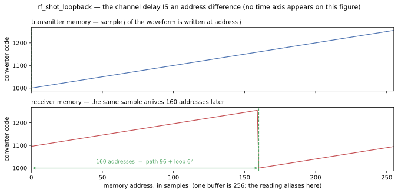

# Measuring a delay with an address

`examples/rf_shot_loopback` closes [`RfShotTx`](../../guide/rf/rfshotbuf/tx.md) and
[`RfShotRx`](../../guide/rf/rfshotbuf/rx.md) through one converter, with a path between them that
delays the samples, and both buffers built with
[`absolute_index = 1`](../../guide/rf/rfshotbuf/tx_options.md#absolute-indexing--absolute_index).

**The result it exists for:**

> A sample sent from `mem[j]` arrives at `mem[(j + D) mod depth]`. **The channel delay is a
> difference of memory addresses** — read off a window header and one sample value, with no
> timestamps, no correlator and no cross-spectrum.

There is no time axis on that figure, and that is the point. Both panels are the *same* address axis,
one buffer wide: the waveform sits at address `a` on top and at `a + 160` on the bottom, and the
`160` is what the gate reads.

## Read this first: it aliases at `depth`

The reading is a difference of *addresses*, so it is only ever known **modulo one buffer**. A path
delay of `D` and one of `D + depth × samp_per_word` produce **the same number**, and there is nothing
in the capture that could warn you.

So the geometry is chosen against the delay being measured. Here one buffer is 64 words = **256
samples** and the demonstrated delay is **96 samples**, comfortably inside it.
`test_the_reading_aliases_at_one_buffer` drives a path of `96 + 256 = 352` and asserts it reads 96 —
the rule's other half, gated rather than left as a caveat.

What the two runs *do* differ in is how much silence arrives before the first sample: a longer path
holds more of it. That is exactly the information an address discards and a timestamp keeps, and the
same gate asserts it, so that the aliasing claim is not comparing a run with itself.

## Why one converter carries both directions

`Rfdc` holds `n_rx` and `n_tx` in one module because *"the TX and RX sample counters must hold a
fixed relation, and that is a property of the converter."* **This is the first thing in the repo to
exercise that.** Two converters would be two epochs, and a difference between addresses on two
unrelated counters would mean nothing at all.

One node sets `t0` on every interface it binds, so the two grids share an origin *structurally* —
not because two testbench fields happen to agree. `RFSampIF.set_t0` refuses a second, different
owner outright.

## The three steps

### 1. Send a waveform and look at what comes out of the converter

The transmitter is loaded with a ramp of exactly one buffer — 256 distinguishable codes — and told
`SHOT_LOOP`, so it plays forever. Because it is built absolute, sample *j* of that waveform is
written at `mem[j]` **and played there**: the read pointer counts every word the design has emitted
since reset, so it is a timestamp rather than a position inside the current shot.

**The waveform starts at a non-zero code (1000), and that is load-bearing.**
[`FILLER`](../../guide/rf/rfshotbuf/tx.md) is zero, so a waveform whose first sample were zero would
make the filler-to-signal transition ambiguous — in the playout log, in the figure, and in the
measurement itself, which skips filler because filler was never sent from an address.

What validates this step is the **playout log**, not a wall-clock: `examples/rf_shot_tx`'s gates
align on each backend's own filler→play transitions rather than demanding the two agree about when
playing started. That is what makes the loosely-timed model usable here — the two backends disagree
about *which pass* a shot lands in and agree exactly about *phase within the pass*, and phase is what
this measurement uses.

### 2. Close the loop with a path that has a delay in it

`Rfdc.tx_rf` → `RFSampIF` → **`RfSampDelay`** → `RFSampIF` → `Rfdc.rx_rf`.

The delay is on a **node**, never on either edge. `rf_sample_if`'s own rule is *"if the edge can only
record a quantity and never apply it, it does not belong on the edge"*, and the reason it matters
here is the next section: a reader has to be able to tell a path delay from an epoch offset, which is
only possible if they are two different things.

It is a **bulk** delay, in whole samples, with no interpolation — a fractional delay is a filter, and
a filter would be a second signal-processing implementation nobody cross-checks. The demonstrated 96
is deliberately awkward: not a multiple of the 64-sample converter block and not a multiple of the
128-sample window, so a reading that came out right could not have come from a block index or a
window index. It *is* a multiple of `samp_per_word`, because an address is a word.

### 3. Capture it, and read the delay off the addresses

The receiver is absolute too, so it writes what arrives at `mem[k mod depth]` where *k* counts every
sample the converter has handed it since reset. Each announced window carries its `base_addr`, and
[`window_abs_index()`](../../guide/rf/rfshotbuf/rx.md#absolute_index--when-a-drop-is-a-hole-rather-than-a-shift)
turns that into the window's absolute position. Then, for every captured sample:

| question | answered by |
|---|---|
| which address was it **sent** from? | its code — the waveform is a ramp filling one buffer, so `code - base` *is* the address |
| which address did it **arrive** at? | `window_abs_index(...) × samp_per_word + offset`, from the header |
| the delay | the difference of the two, modulo one buffer |

**Every one of 4576 captured samples returns the same difference.** Unanimity is the assertion, not a
side effect: a transmitter that slipped a pass, a receiver that mis-addressed one window, or a block
lost anywhere on the loop each produce a capture that still looks like a waveform and still passes
every counter — and each puts a second value in that histogram.

## The number has two terms, and only one is the path

The raw reading is **160**, and the path was configured with **96**. The difference is not a fudge:

| term | samples | what it is |
|---|---|---|
| the path | 96 | `RfSampDelay.delay_samp` — what this example is measuring |
| the loop | 64 | one converter block, **declared** by the graph |
| raw address difference | **160** | what the capture carries |

A converter cannot emit samples it has not yet collected, so a block exists at its grid tick and is
transmitted across the *following* period. `RfShotLoopbackTB.loop_blk_latency` sums that hop with
what the nodes on the path declare — exactly as `examples/rf_loopback` does — and the measurement
subtracts it. It is **declared, not fitted**, and
`test_the_loop_latency_is_declared_rather_than_fitted` shows so by driving the path at zero: the
reading is then exactly 64.

## An address cannot tell you *why* it moved

An RX address offset has two causes:

* a **path** delay — *this path delivers later*;
* an **epoch** offset — `t0` on the converter, *this tile's counter started later*.

`test_an_epoch_offset_moves_the_reading_exactly_as_a_path_delay_does` starts the transmit tile one
block late with the path untouched, and the reading moves by exactly one block: 160 → 224. **The same
move a longer path would have made.**

That is what MTS buys you. `t0_tx ≡ t0_rx` pins the epoch to zero so that what is left in the address
is the path — and `Rfdc` models a non-zero value as *"a tile deliberately started late, or a measured
MTS residual"*. This example sets both epochs explicitly rather than inheriting a default: an
assumption you cannot see in the graph is one you will forget you made.

{: .note }
The gate moves `t0_tx` and not `t0_rx`, and the asymmetry is a property of the model rather than a
preference. Starting the *receive* tile later can only cancel structural latency the loop already
has; past that a block simply waits in a queue. A gate that swept `t0_rx` would be asserting a
saturation curve rather than a correspondence.

## Why the two loads are spaced

Under absolute indexing a playout is deferred to the next buffer boundary, and **a load arriving
inside that window cancels the arm outright** — and is still answered `SHOT_LOADED`. Nothing on the
command path can tell you; only the capture can.

`examples/rf_shot_tx`'s `cmd_loop` scenario is the demonstration: at `absolute_index = 1` it plays
*nothing at all*. So this example separates its two loads with **eight** refused frames whose full
payloads have to drain, which is what buys the transmitter a whole pass of airtime in between. Four
is the measured threshold at this geometry; `test_the_first_waveform_is_lost_when_the_loads_are_too_close`
runs it at zero and two and asserts the first waveform never reaches the air while both commands are
still answered `SHOT_LOADED`.

Both waveforms then play, and the reading is unanimous across *both* of them — which is the part a
single waveform could not show: the correspondence is a property of the addressing, not of one
payload.

## A third example, not a replacement

`examples/rf_shot_tx` and `examples/rf_shot_rx` stay, with their gate sets untouched. **A loopback
cannot isolate a TX defect from an RX one** — a wrong address here could be either end — so those two
remain the per-design contracts and this one adds only the pair's claims:

* the address difference, and that it equals the configured delay;
* that it aliases at one buffer;
* that the two ends agree on one phase;
* that an epoch offset is indistinguishable from a path delay.

## What is not built

**There is no RTL rung.** Both designs in this graph are synthesized and RTL-gated by their own
examples at this very `absolute_index = 1` — 17 gates for the transmitter, 12 for the receiver.
Closing the loop at RTL would need a second locked memory inside one kernel and a C++ twin for the
path's delay, and would re-derive a number two green gate sets already stand behind. The decision and
what it would take to change it are recorded in `plans/rf_shot_absolute.md` S3.

**And a fractional delay is not modelled.** The path shifts by whole samples. Interpolation is signal
processing, and this example is about what an address means.

## Next

- [Running it](./run.md) — the build rungs and what each produces.
- [Options and what is not built](../../guide/rf/rfshotbuf/tx_options.md) — the design space this
  example sits at one point of.
- [Transmit — `RfShotTx`](../../guide/rf/rfshotbuf/tx.md) and
  [Receive — `RfShotRx`](../../guide/rf/rfshotbuf/rx.md) — the two halves.
