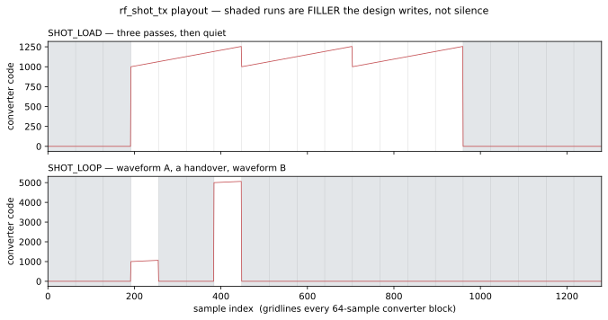

# Playing a stored waveform

`examples/rf_shot_tx` is the worked example for [`RfShotTx`](../../guide/rf/rfshotbuf/tx.md) — the
transmit half of the finite sample buffer. A host hands it a waveform once; it holds it in a BRAM and
plays it at the converter's own rate, answering every command with exactly one verdict.

**This page is about the example.** What the design *is* — the protocol, the two play modes, the five
verdicts, the lock underneath — is [the guide's](../../guide/rf/rfshotbuf/), and this page links
rather than restates.

```
StreamDriver --[ShotTxHdr | dense words … TLAST]--> RfShotTx.s_in
RfShotTx.resp_out --> StreamSink            (one ShotTxResp per header)
RfShotTx.samp_out --> Rfdc.tx_streams[0] | Rfdc.tx_rf --RFSampIF--> RfDataSink
```

## What it plays



The shaded runs are **filler** — the value the design writes when it has nothing to play. They are
not gaps: a converter comes due on a fixed grid, and a design that stopped writing would starve it.
Reading the figure top to bottom is reading the whole design:

* **Above, the finite path.** A `SHOT_LOAD` for three passes. The waveform repeats exactly three
  times and then the design **goes quiet** — it stopped on purpose rather than running out of
  stream. Everything arriving behind it is answered `SHOT_BUSY`.
* **Below, the infinite path.** A `SHOT_LOOP` starts playing; a second load arrives mid-play and
  **preempts** it. The gap between the two waveforms is the handover — how long the converter plays
  filler while the memory changes hands, because this design holds
  [one region](../../guide/rf/rfshotbuf/tx_internal.md#finding-tx-holds-one-region-rx-holds-two).
  The long tail is a `SHOT_SHORT` load that is stored and then never played.

The figure is rendered from the **pysim** run and regenerates with no toolchain; it is a picture of
the RTL because `test_the_two_backends_agree_after_their_own_transients` asserts every played sample
agrees once the two captures are aligned on their own playout logs.

**The leading shaded run is longer here than it is at RTL, and that is the model rather than the
design.** Since [`plans/lt_transient.md`](../../guide/rf/rfshotbuf/tx_options.md#axis-2--how-faithfully-simulation-reproduces-timing)
S2 the pysim player carries no metronome: it is paced by back-pressure alone, which controls how fast
it may go and not how far *ahead of the data* it may get. While it owns nothing to play it writes
filler, so a shot loaded later queues behind whatever filler is already in flight — 448 samples of
it, the sum of the declared depths along the path. Everything after that first transition is
sample-for-sample what the RTL does.

## Two scenarios, and they cannot be one

The example drives **one design** with **two command bundles** — `vectors/cmd` and
`vectors/cmd_loop` — through two hand-written XSI mains that differ only in three bundle names. That
the RTL is the same in both is the claim; a second testbench *graph* would be a second model of one
design.

They cannot be a single stream, and the reason is the design rather than the harness. A file-driven
driver never reads a verdict, so a stream that opens with a **finite** shot has every later frame
answered `SHOT_BUSY` — that *is* what `SHOT_BUSY` is — and a stream that opens with an **infinite**
one can never demonstrate a refusal. One scenario per opcode is the minimum.

| | `vectors/cmd` | `vectors/cmd_loop` |
|---|---|---|
| opens with | `SHOT_LOAD`, `nrepeat = 3` | `SHOT_LOOP` |
| verdicts produced | `LOADED`, `BUSY`, `BAD_OPCODE`, `BAD_OPCODE`, `END`→`LOADED` | `LOADED`, `BAD_OPCODE`, `BAD_OPCODE`, `LOADED`, `SHORT`, `END`→`LOADED` |
| what it proves | a finite shot is not truncated | a load mid-play preempts, and a short shot never plays |

Between them every legal verdict is exercised — asserted by
`test_all_five_verdicts_and_the_fence_appear_across_the_two_streams`.

## The geometry

| | value | what it is |
|---|---|---|
| `depth` | 64 words | the memory, **and therefore one shot** — 256 samples at 4 samples/word |
| `blk_words` | 16 | words per chunk: the lock poll period |
| `samp_rate` | 256 MSa/s | the converter's grid |

**Two numbers, and it was four.** `nword` (64 words, one shot) and `base` (192, placing the region at
the top of the memory) are gone — `plans/rf_shot_geometry.md` made the shot *be* the buffer, so
`depth` is the length as well as the size and there is nowhere else a shot could sit. `depth` is 64
rather than a rounder 256 deliberately: it is what `nword` was, so the played length is unchanged and
every recorded number on these pages stayed comparable across the change.

**The addressing bug class went with `base`, rather than going untested.** `base + offset` was the
shape of the byte-versus-word bug that had every BRAM design in this repo mis-addressed while a
smaller example stayed green, and the region sat at the very top so the arithmetic was exercised.
Without `base` there is no addition: the loader writes `mem[i]`, the player reads `mem[i]`, and the
wrap at `depth` is a mask. So `test_the_write_addresses_reach_the_last_element_and_no_further` now
asserts the writer touches exactly `0..63` — which is what says the counted load pass *fills* the
buffer — and `test_the_player_sweeps_the_whole_buffer_and_wraps` covers the one piece of arithmetic
that still exists.

## Pages

- [**Running it**](./run.md) — the build rungs, and what each produces.
- [**Taking it to RTL**](./rtl.md) — the RTL run and every measured number, with the gate that
  asserts it.

## Related

- [`RfShotTx`](../../guide/rf/rfshotbuf/tx.md) — the design: ports, messages, verdicts, the rules.
- [Internals](../../guide/rf/rfshotbuf/tx_internal.md) — the tasks, the lock protocol, the findings.
- [`examples/rf_shot_rx`](../rf_shot_rx/) — the receive half of the same family.
