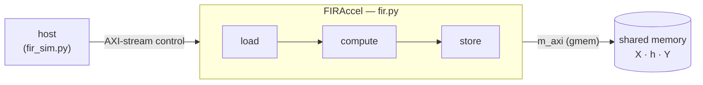

# Rowwise FIR

**Rowwise FIR** is a per-matrix-row FIR filter accelerator — `Y[i,j] = Σ_t h[t]·X[i, j−t]` over every
row of an input matrix. It is the example where Waveflow turns **inward**: it reuses
[`shared_mem`](../shared_mem/)'s **AXI-stream control** (the command on `s_in`, the response on
`m_out`) over AXI-MM data, and instead studies the accelerator's **internal structure** — the
**load-compute-store dataflow** — and how to give it a **physical, cosim-calibrated timing model**. It
adds **no new interface** (control is the stream you already know); its new ideas are all internal.

## The system

A host sends `FIRCmd`s over the control stream (filter taps `h`, the address of `X`, `n_rows`,
`n_cols`); the accelerator reads each row of `X`, computes the FIR, writes `Y` back over a single
full-duplex `m_axi` bundle, and returns a response on `m_out`. Internally it is three concurrent
stages — **load**, **compute**, **store** — overlapping across rows, the
[double-buffered timing model](../../guide/timing_model/double_buffered.md) made concrete.

## What it adds

The earlier examples answer *"are the numbers right?"*. Rowwise FIR is the culmination of the
[timing](../../guide/timing_model/) and [calibration](../../guide/calib/) arc, adding two things:

- **The load-compute-store dataflow** — a sliding window *forces* the input resident and randomly
  addressable, so the design cannot be a pure stream. It must load a row, compute over it, and store
  the result, with the three stages pipelined. This is the canonical
  [dataflow custom hook](../../guide/custom_hooks/dataflow.md).
- **A physical, near-fit-free timing model** — the whole-kernel latency decomposes into *deterministic*
  channel occupancy + an *exact* II=1 compute + a **single** calibrated curve (`row_depth`, the per-row
  pipeline depth), measured from a Vitis cosim sweep. The loosely-timed sim then reproduces the RTL to
  **≤1.3%** across the grid (0.11% on the held-out point). That study is the [fit](./fit.md) page.

## Walkthrough

1. [What we're building](./fir.md) — the per-row FIR function, the `valid` edge, and why FIR forces a
   resident row buffer.
2. [The load-compute-store dataflow](./dataflow.md) — why a sliding window can't stream, and how the
   three stages overlap.
3. [The Python model](./pymodel.md) — `FIRAccel`: three concurrent stage processes, the fictitious
   inter-stage messages, and the one shared golden.
4. [The timing model](./timing_model.md) — what is timed and how: deterministic occupancy, II=1
   compute, the calibrated `row_depth`, the early-anchored store, and where to log events.
5. [Writing the dataflow hook](./kernel_hook.md) — the hand-written `fir_dataflow.tpp`: three HLS
   functions in a `#pragma HLS DATAFLOW` region.
6. [C and RTL simulation](./rtlsim.md) — Vitis csim/cosim, bit-exact against the golden, through the
   build DAG.
7. [Extracting timing from cosim](./cosim_timing.md) — measuring the X-read / Y-write spans from the
   VCD, counting transfer beats, and sweeping sizes into a corpus.
8. [Fitting the model](./fit.md) — the physical decomposition, the one fitted curve, the gates, and the
   result figure.
