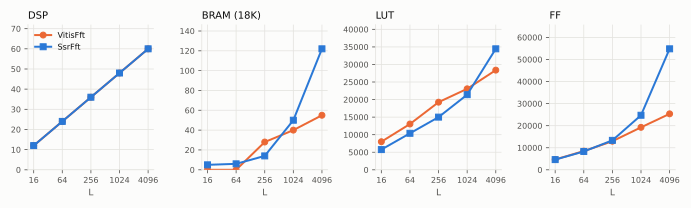

# Resources

The HLS estimates for the whole `SsrFft` top, RFSoC 4x2 at 250 MHz, input `ap_fixed<16, 2>`, twiddles
`<18, 2>`, ping-pong reorder -- read from csynth's XML by `ssr_fft_measure` into `measured.json`. The
vendor core's are its own csynth records on the platform (the `VitisFft` example).

| L | DSP | BRAM (18K) | LUT | FF | `VitisFft` DSP / BRAM / LUT / FF |
|---|---|---|---|---|---|
| 16 | 12 | 5 | 5,936 | 4,887 | 12 / 0 / 7,998 / 4,679 |
| 64 | 24 | 6 | 10,580 | 8,597 | 24 / 0 / 13,044 / 8,469 |
| 256 | 36 | 14 | 15,189 | 13,642 | 36 / 28 / 19,262 / 12,952 |
| 1024 | 48 | 50 | 21,584 | 25,036 | 48 / 40 / 23,069 / 19,237 |
| 4096 | 60 | 122 | 34,642 | 55,154 | 60 / 55 / 28,388 / 25,356 |

## What they say

- **The DSPs are the same, exactly: `12·(S − 1)`.** One twiddle rotation per lane per stage boundary,
  three DSPs per complex multiply -- the arithmetic is the vendor's, so its cost is too. The two lines
  in the DSP panel coincide.
- **LUTs are comparable**, lower up to `L = 1024` and about 20% higher at 4096.
- **The throughput is paid for in memory, from `L = 1024` up.** At 4096, about twice the vendor's BRAM
  and flip-flops. Two things hold more data than the vendor's frame-at-a-time chain does: the
  commutators' delay lines -- each holds `R(R − 1)·D` samples, and the large-`D` ones are in the
  transposer and after the first stage -- and the reorder's two-frame buffer. That is the memory that
  lets frame `k + 1` be inside the FFT while frame `k` still is.
- **Timing is met at every length**, with the least margin at `L = 4096` (estimated clock 2.92 ns
  against the 2.92 ns the 4 ns period leaves after HLS's uncertainty).

Per sample processed, the comparison turns around: at `L = 1024` the vendor core spends its 48 DSPs
on one frame every 2,556 cycles, this one on a frame every 256.

## Where it could shrink

Not attempted yet, and each is a measurable trade:

- **The reorder buffer** can be one frame instead of two, with read and write address patterns that
  alternate frame by frame -- half the memory, the classic trick.
- **The SOB reorder** already uses whole-frame blocks; its cost is the four cycles a frame, not memory.
- **Delay-line mapping**: the long delay lines could be steered to BRAM or SRLs explicitly rather
  than left to HLS.
