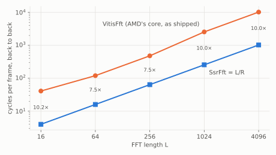

# Timing

All numbers are RTL, XSI, the RFSoC 4x2 target (`xczu48dr`) at 250 MHz, read at the ports from the
BFMs, every frame bit-exact -- from `examples/ssr_fft/measured.json`, written by `ssr_fft_measure`.

## A frame every `L/R` cycles

| L | interval | first frame | isolated frame: first in → last out | isolated frame: last in → last out | `VitisFft` interval |
|---|---|---|---|---|---|
| 16 | 4 | 42 | 42 | 39 | 41 |
| 64 | 16 | 111 | 111 | 96 | 120 |
| 256 | 64 | 352 | 352 | 289 | 480 |
| 1024 | 256 | 1278 | 1278 | 1023 | 2556 |
| 4096 | 1024 | 4940 | 4940 | 3917 | 10240 |

(cycles; ping-pong reorder.  "first frame" is the first of 8 frames back to back; "isolated" is 12
frames each preceded by a random idle gap long enough to empty the pipeline.)

- **The interval is `L/R` exactly**, at every length -- the rate the architecture is built for, and
  7.5 to 10 times the vendor core's on the same platform. Nothing about it is fitted: every task moves
  one word a cycle and never stops between frames.
- **The latency is about `19L/16` cycles plus a few per task**: the commutators' delays, one frame in
  the reorder buffer, and the frame's own transfer ([why](../../guide/dsp/ssr_fft/timing.md#the-latency-is-a-sum)).
- **An isolated frame takes exactly as long as the first frame of a burst** -- one value per length,
  across every gap. A commutator decides each group when its first word arrives, so a frame never
  waits for a free-running window to come round. The vendor core spreads the same "last in → last
  out" measure over a range at every length (105 to 123 at `L = 64`) and needs its mean and spread
  calibrated per length; this one needs neither.

At `L = 16` an isolated frame's processing (39 cycles from its last input word) is the vendor core's
too: the difference there is entirely the interval.

## The pysim against the RTL

The composite pysim -- one process per task, timed cut-through from each frame's first word
([how](../../guide/dsp/ssr_fft/timing.md#the-pysim-one-process-per-task-cut-through)) -- lands within
5 cycles of the RTL's first frame at `L = 16 .. 1024`, with the interval exact; `tests/dsp/ssr_fft/
test_hw.py` pins it. A four-frame pysim costs 0.1 s at `L = 64` and 1.6 s at `L = 1024`; the RTL
measurement of one length cost 1.5-2.3 minutes of csynth and 15-30 s of XSI.

## What the SOB reorder costs

With `reorder="sob"` -- a `stream_of_blocks` between a writer and a reader task -- `L = 64` measures
an interval of **20**, against 16 with the ping-pong buffer; the first frame takes 113 cycles against
111. The reader is re-entered, and its lock re-acquired, once a frame: four cycles a frame, 25% at
`L = 64`, 1.6% at `L = 1024`. Both are bit-exact, and both ran 500 frames back to back without a
stall.
