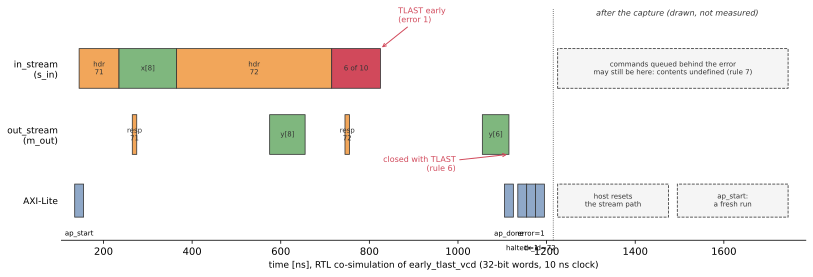

# The error path

What happens on the wire when a command fails?  The figure below is a real waveform: the
synthesized RTL, co-simulated on the scenario `early_tlast_vcd`.  The host sends two `DATA`
commands.  The second announces 10 samples but its burst ends after 6.



Read it left to right.

1. **The host starts the kernel** (AXI-Lite, about 135 ns): one write of `ap_start`.  The kernel clears
   its status (rule 5).
2. **Command 71 goes through normally.**  Its header (with its coefficients) and 8 samples arrive on
   `in_stream`.  Its response header and 8 results leave on `out_stream`, the results about 30
   cycles later: the depth of the multiply-add pipeline.
3. **Command 72's header arrives.**  Its block is long because the kernel takes two words of it, then
   waits for command 71's last results to drain out of the pipeline before taking the rest.  That is
   a stall, not an error.
4. **The sample burst ends early.**  TLAST arrives on the sixth sample word of ten.  The kernel
   writes the six results it has and **puts TLAST on the sixth**: the output burst is closed (rule 6),
   so a DMA receiving `out_stream` sees a complete burst instead of waiting forever for four more
   words.
5. **The kernel returns at once.**  It sets `halted = 1`, `error = 1` (`TLAST_EARLY_SAMP_IN`) and
   `tx_id = 72`, and reads nothing more from `in_stream`.  It does not drain and does not send a
   footer.
6. **The host sees `ap_done`** and reads the three status registers: `halted = 1`, `error = 1`,
   `tx_id = 72`.  (In co-simulation the testbench polls `ap_done`.  A host program waits for the
   `ap_done` interrupt instead.)

The panel on the right is **drawn, not measured**.  This capture deliberately sends nothing after
the bad burst, so the co-simulation has no unread input to replay.  In a real system, and in the
`early_tlast` scenario that C simulation runs, the host has more commands queued:

7. **Commands queued behind the error are still in the FIFO**, and in the DMA engine's buffer behind
   it.  In `early_tlast` that is command 43 and `END`: 17 words that the kernel never reads.  Their
   number depends on timing, so the contract calls the contents of `in_stream` *undefined* after an
   error (rule 7).
8. **The host resets the stream path**: the DMA channel and any FIFO between it and the kernel,
   typically the accelerator's own reset too.
9. **The host starts a fresh run**, beginning with the failed command, `tx_id = 72`, which the status
   told it.  The kernel starts clean, because nothing carries over (rules 4 and 5).

## What the host learns, and from where

| The host learns | From | When |
|---|---|---|
| the results of every command before the failure | `out_stream`, complete bursts | as they arrive |
| how many results the failed command produced | the TLAST that closes its burst | when the burst ends |
| that the run failed, and why | `halted`, `error` | after `ap_done` |
| which command to resume from | `tx_id` | after `ap_done` |

The host never has to guess where the kernel stopped, and the kernel never has to guess where the
next command starts.

## Reproduce the waveform

```bash
python examples/stream_inband/poly_build.py --through error_vcd           # needs Vitis and Vivado's xsim
python examples/stream_inband/poly_build.py --through sync_docs_figures   # redraws the figure
```

`error_vcd` co-simulates `early_tlast_vcd` in its own Vitis project with port tracing, checks the
co-simulated response against the expected one like every other stage, and writes
`vcd/error_path.vcd`.  The figure is drawn from that committed file, so redrawing it needs only
Python.  [Reading the protocol off a waveform](./poly_axi_stream.md) shows how to decode it yourself.

## Check your understanding

1. The host sends three `DATA` commands, and the second one's TLAST comes early.  What does the
   host see on `out_stream`, what does it read from the status registers, and what must it do
   before the next `ap_start`?
2. Why does the kernel put TLAST on the last result it writes, rather than simply stopping?
3. After the error, could the host skip the reset and send command 72 again on the same stream?
   What might the kernel read first?

---

Next: [Decisions your spec must make →](./decisions.md)
