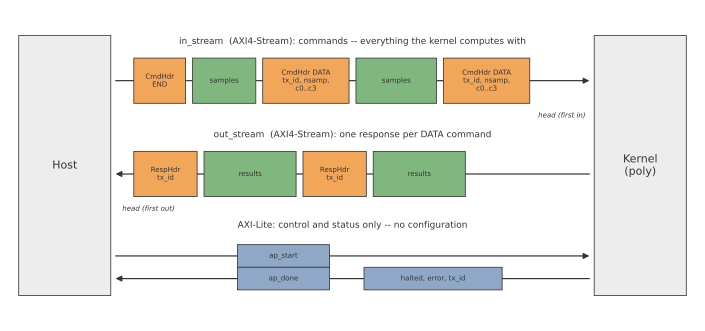

# Streaming polynomial: the command-response contract

What is the contract between a host and a command-driven streaming kernel?  This example
answers it with a small accelerator that evaluates a polynomial

$$y = c_0 + c_1 x + c_2 x^2 + c_3 x^3$$

on bursts of float32 samples.  The arithmetic is deliberately trivial so that everything here is
about the **protocol**: what crosses each interface, who is responsible for what, and what happens
when something goes wrong.  The same contract fits most streaming accelerators you will build.

## The protocol



Control travels **in-band**: each command is a header ahead of its samples on the same stream, and
the kernel runs one loop over the commands until an `END` command (or an error) ends the run.  The
kernel has three interfaces:

- **`in_stream`** (AXI4-Stream, host → kernel) carries **commands**.  A `DATA` command is a header
  -- its `tx_id`, the sample count `nsamp`, and the four coefficients -- followed by a burst of
  `nsamp` samples.  An `END` command is a header alone.
- **`out_stream`** (AXI4-Stream, kernel → host) carries **responses**: for each `DATA`, a response
  header echoing its `tx_id`, then the `nsamp` results.
- **AXI-Lite** carries **control and status only**: the host starts the kernel with `ap_start`, the
  kernel signals `ap_done` when it returns, and the host then reads three status registers --
  `halted`, `error` and `tx_id`.

## The contract

These are the rules the kernel and the host follow.  They are numbered so that you can cite them
("this design breaks rule 4") and check your own design against them.

> **The `stream_inband` contract**
>
> 1. **Two streams.**  `in_stream` carries `CmdHdr | samples`, repeated.  `out_stream` carries
>    `RespHdr | results`, one per `DATA` command -- plus a `RespFtr` if the design needs one: a
>    fixed-length schema, sent as its own burst, holding only values that are known after the data.
>    A footer is response data and is sent only when the command succeeds.  This kernel has none.
> 2. **Everything the kernel computes with travels on `in_stream`.**  Each `DATA` command carries its
>    own coefficients.  The host never writes configuration over AXI-Lite.
> 3. **AXI-Lite carries only control and status.**  The host starts the kernel with `ap_start`.  The
>    kernel processes commands until `END` or an error, then returns (`ap_done`).  The host then reads
>    `halted`, `error` and `tx_id`.
> 4. **Nothing carries over.**  A `DATA` command depends only on its own header and samples: not on an
>    earlier command, and not on an earlier activation.
> 5. **The kernel clears its status at the start of every activation.**
> 6. **On an error, the kernel:**
>    1. sets `halted = 1`, `error` and `tx_id`;
>    2. puts TLAST on the last word it wrote, if it had started an output burst;
>    3. returns at once, reading nothing more from `in_stream`.
>
>    It writes no footer and does not try to recover.
> 7. **An error ends the run.**  After an error the contents of `in_stream` are undefined: commands
>    the host queued behind the failed one may still be there.  The host resets the accelerator and
>    its stream path before the next `ap_start`.  The kernel never drains to the next TLAST.

## Who does what

| When | Host | Kernel | Why |
|---|---|---|---|
| **start** | writes `ap_start` | clears its status | Rule 5: the status describes this run and no other. |
| **per command** | sends `DATA` (a header with its coefficients, then the samples) or `END`; never touches AXI-Lite | `DATA`: writes the response header, then one result per sample.  `END`: returns | Rules 2 and 4: one ordered path, so no race between configuration and data, and every command stands alone. |
| **on error** | waits for `ap_done`; reads `halted`, `error`, `tx_id` | sets the status, closes its output burst with TLAST, returns without reading more | Rule 6: a DMA receiving the output never waits for a TLAST that never comes, and no hardware is spent on recovery. |
| **restart** | resets the accelerator and its stream path; restarts; resends from the failed command | starts clean | Rule 7: the FIFO may still hold commands queued behind the error, so only a reset gives a known state. |

The reasons are argued at length, against the designs a student usually proposes first, in
[Why this contract](./why_not.md).

## A run is a batch

A host-activated kernel like this one runs a **bounded batch** of commands under a host program:
`ap_start`, commands until `END`, `ap_done`.  An error is fatal to the run.  The kernel stops
cleanly, and the host resets and starts over -- simple hardware, and a simple host.

A kernel that must run **continuously** and keep going after a bad packet -- a radio receiver, a
network function -- is a different design: a free-running kernel that resynchronizes on its own.
That is the free-running flow (`FreeRunMod`; see [Design patterns](../../guide/patterns/index.md)),
not this one.

## Reading this example

The first pages are about the contract; the later ones follow the build.

1. [Protocol and interfaces](./protocol.md) -- what crosses each interface, word by word, at
   32 and 64 bits; when to add a footer.
2. [Why this contract](./why_not.md) -- the alternatives, and what goes wrong with each.
3. [The error path](./error_path.md) -- a failing command on the wire, from a co-simulation
   waveform.
4. [Decisions your spec must make](./decisions.md) -- a checklist for adapting the pattern to
   your own accelerator.
5. [Python model](./01_python_golden_model.md) -- how we know the Python model is right.
6. [Code generation](./02_hls_codegen.md) -- what Waveflow writes and what you write.
7. [C simulation](./03_csim_verification.md) -- how C simulation checks the error paths.
8. [C synthesis](./04_csynth_resources.md) -- what was built, and whether every loop reaches II = 1.
9. [RTL co-simulation timing](./05_cosim_timing.md) -- what co-simulation tells us that C
   simulation cannot.

A supplementary page covers [reading the protocol off a waveform](./poly_axi_stream.md).

## The build

[`poly_build.py`](https://github.com/sdrangan/waveflow/blob/main/examples/stream_inband/poly_build.py)
runs the whole flow as one build graph, at both stream widths:

```
   Python model               →  scenarios, py_model, check_model,
                                 py_sim, check_pysim, extract_py_timing_w32/_w64
        │
        ▼
   Code generation            →  gen_include, sources, gen_kernel
        │
        ▼
   C simulation               →  csim, check_csim
        │
        ▼
   C synthesis                →  csynth_w32/_w64, inspect_synth_w32/_w64
        │
        ▼
   RTL co-simulation          →  check_cosim, extract_cosim_timing_w32/_w64,
                                 validate_timing_w32/_w64, error_vcd, summary
```

Every stage -- the pure model, pysim, C simulation, co-simulation -- is checked against the same
**expected responses**, computed from what each scenario *intends* rather than from any
implementation, so two implementations cannot agree by sharing a mistake.

## Files

| File | What it holds | Written by |
| --- | --- | --- |
| [`poly.py`](https://github.com/sdrangan/waveflow/blob/main/examples/stream_inband/poly.py) | Schemas; the pure model (`poly_eval`, `poly_stream_model`); the module `PolyAccel`; the pysim testbench `PolyTB` | you |
| [`scenarios.py`](https://github.com/sdrangan/waveflow/blob/main/examples/stream_inband/scenarios.py) | The scenarios, their stimulus, their expected responses, and the checker | you |
| [`poly_body_impl.tpp`](https://github.com/sdrangan/waveflow/blob/main/examples/stream_inband/poly_body_impl.tpp) | The whole kernel body, in C++ | you |
| [`poly_tb.cpp`](https://github.com/sdrangan/waveflow/blob/main/examples/stream_inband/poly_tb.cpp) | The C++ testbench: one kernel run per scenario, recorded | you |
| [`poly_build.py`](https://github.com/sdrangan/waveflow/blob/main/examples/stream_inband/poly_build.py), [`run.tcl`](https://github.com/sdrangan/waveflow/blob/main/examples/stream_inband/run.tcl) | The build graph and the Vitis driver | you, mostly from stock steps |
| [`poly_figures.py`](https://github.com/sdrangan/waveflow/blob/main/examples/stream_inband/poly_figures.py) | The figures on these pages | you |
| `gen/poly.hpp`, `gen/poly.cpp` | The kernel boundary: tops `poly` (32-bit words) and `poly_bw64` | Waveflow |
| `include/*.h` | Schema headers, serializers, stream and testbench helpers | Waveflow |

`gen/`, `include/`, `data/`, `results/` and the Vitis projects are build output and are not
committed.

```bash
python examples/stream_inband/poly_build.py --through check_pysim   # Python only
python examples/stream_inband/poly_build.py --through summary       # everything, with Vitis
```

## Check your understanding

1. The host sends three `DATA` commands and then `END`, and the second command's TLAST comes early.
   What does the host see on `out_stream` and in the status registers, and what must it do before
   the next `ap_start`?
2. Why does the kernel clear its status at the start of a run, rather than leaving it to the host?
3. Two consecutive `DATA` commands carry different coefficients.  Which coefficients does each use,
   and which rule guarantees it?

---

Next: [Protocol and interfaces →](./protocol.md)
