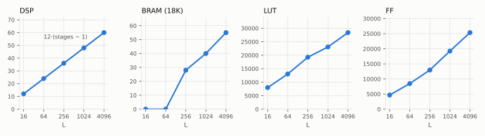

# Resources

Every build the calibration fixture runs is a full csynth, and its report is free once the synthesis
has happened -- so every one is filed onto the platform. These are the HLS estimates for the
`vitis_fft_task` (the core plus its lane pumps), RFSoC 4x2 at 250 MHz, input `ap_fixed<16, 2>`,
twiddles `<18, 2>`:



| L | stages S | DSP | BRAM (18K) | LUT | FF |
|---|---|---|---|---|---|
| 16 | 2 | 12 | 0 | 7,998 | 4,679 |
| 64 | 3 | 24 | 0 | 13,044 | 8,469 |
| 256 | 4 | 36 | 28 | 19,262 | 12,952 |
| 1024 | 5 | 48 | 40 | 23,069 | 19,237 |
| 4096 | 6 | 60 | 55 | 28,388 | 25,356 |

## What they say

- **DSP = 12 · (S − 1), exactly.** One twiddle rotation per stage boundary, on each of the 4 lanes, at
  3 DSPs per complex multiply. That is physics, not a fit -- but the "3 per multiply" holds only while
  the operands fit a DSP48E2 slice (27 x 18), so it is precisely the term that moves with the widths.
- **BRAM appears at `L = 256`**, once the commutator and reorder buffers stop fitting in LUTRAM -- a
  threshold in `L` x width, not a smooth curve.
- **LUT and FF grow roughly linearly in the stage count**, with an irregular step: the counters a
  formula would only estimate.

## Where the records live

`waveflow.vitis_l1.rtl.record_resources` attributes the csynth report to the module
(`waveflow.calib.synth_report`) and files it in the platform's module store:

```
waveflow/calib/platforms/rfsoc4x2_bfm_250mhz/modules/vitis_fft-<key>/
    module.json                     # identity: class + every HwParam (L, R, in_w, in_i, tw_w, tw_i)
    resource/records.jsonl          # the counters, with provenance: part, clock, tool, source
    integration/records.jsonl       # the top's own cost beyond the task (the ap_ctrl_none shell)
```

The key is the module's identity, so each configuration is its own entry and a measurement is never
served to a configuration it does not describe. Read as it stands, the store is already a resource
model: Waveflow's `LookupResourceModel` -- exact for every configuration synthesized, `UNCALIBRATED`
for every other.

## Growing it into a model

The same choice as for timing, and the same rule: measure before you fit, and hold out before you
believe. `waveflow.calib.resource_model` has the kinds:

- a **prior** where the physics is known: DSP as (multiplies, from `L`) x `dsp_per_mult(widths, part)`,
  which `waveflow.calib.device_rules` already encodes for the DSP-slice threshold;
- a **fitted residual** for LUT and FF over stages and widths;
- a **lookup** wherever thresholds make interpolation unsafe, as for BRAM.

That needs width variation, which the shipped calibration does not have (see
[what is calibrated](timing.md#what-is-calibrated-and-how-to-extend-it)). Each `--in-w` / `--tw-w`
configuration the fixture runs adds its records here, so the data for a fit accumulates as a
design-space exploration visits configurations, not in a sweep run in advance.
