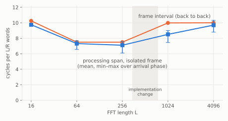
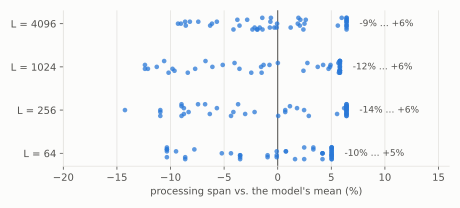

# Timing

All numbers are RTL, XSI, the RFSoC 4x2 target (`xczu48dr`) at 250 MHz, read at the ports.

## The core as `VitisFft` connects it



Normalized per `L/R` -- the words a frame takes on each lane -- a fully pipelined streaming FFT would
sit near 1. This one sits at 7.5 to 10, and its frame interval is about its latency:

| L | frame interval | sustained rate | processing span, isolated frame: mean (min – max) |
|---|---|---|---|
| 16 | 41 | 0.39 samples / cycle | 39 (39 – 39) |
| 64 | 120 | 0.53 | 117.1 (105 – 123) |
| 256 | 480 | 0.53 | 454.8 (390 – 484) |
| 1024 | 2556 | 0.40 | 2177.7 (1908 – 2304) |
| 4096 | 10240 | 0.40 | 9932.9 (9009 – 10571) |

(cycles; the processing span runs from a frame's last input word to its last output word, so it
includes the output transfer.)

**Frames barely overlap -- as this module connects the core.** `VitisFft` calls `fft<>`, the vendor
guide's non-streaming connection, which serializes frames; the library's per-call commutators would
floor even the streaming connection near 2.5 `L/R`
([why](../../guide/vitis_l1/fft/index.md#why-vitisfft-is-far-below-the-architectures-rate)). The same
arithmetic written as free-running tasks, `waveflow.dsp.ssr_fft.SsrFft`, takes a new frame every `L/R`
cycles at every length below -- 256 instead of 2,556 at `L = 1024`, on the same 48 DSPs.

### How this was found

The first version of this page said the core is frame-at-a-time *by the library's construction*, and
explained it: nested dataflow regions, one frame occupying the chain. The explanation fit the internal
FIFO traces and was wrong.

- **It passed everything.** The body was bit-exact with the vendor goldens, synthesized, ran under XSI,
  and its timing model was calibrated to within a cycle of the RTL. None of that checks *rate*.
- **The rate was 10 times the vendor's stated one.** AMD's L1 guide gives II = `L/R` (257 at
  `L = 1024`); this measured 2,556. That gap is the bug report, and it was not read as one: the
  measurement was explained instead of compared.
- **What settled it** was a side-by-side cosim of the guide's two connections -- `fft<>` (what the
  body used, written with AI assistance) against `innerFFT` in a DATAFLOW region -- then patching the
  library's commutators to run until their frame is out: 2,556, then ~1,420, then 878 cycles a frame,
  bit-exact throughout (`plans/witness/vitis_fft_streaming/`).

The lesson is general: for vendor IP, write the stated performance next to the first measurement, and
treat a large gap as a bug in the integration until it is disproved.

**The cost steps across an implementation change.** From 256 to 1024 the per-sample cost rises from
7.5 to 10 cycles per `L/R`, and stays at 10 at 4096: there Vitis moves the twiddles into a ROM and the
core gains a fifth stage. No smooth law in `L` crosses that -- which decides the model below.

## Latency is not one number



Isolated frames spread by up to −14 % / +6 % around their mean. The core's input transposer runs a
commutator on a **free-running internal cycle**, and a frame that arrives out of step with it waits
inside the transposer for the cycle to come round. The pile-up at the top of each row is the frames
that just missed it. The wait is set by the frame's **arrival phase** -- found by dumping the RTL at
full depth and timing every internal FIFO handshake, where the commutator restarts every 40 cycles at
`L = 64` even with no data arriving.

Back to back, the core never idles and frames stay in step: the interval has **no** spread. The first
frame after reset is in step by construction and is the fastest of all (391 cycles at `L = 256`,
below the whole isolated range), so the calibration leaves it out.

## The model, calibrated on the platform

`VitisFft` is framework infrastructure, so its timing lives on the platform
`waveflow/calib/platforms/rfsoc4x2_bfm_250mhz` and any design composing it there reloads it. Two
separately measured delays, two `TimingModel`s:

- **proc**: the delay `run_iter` defers each frame's write by, from isolated frames. An LT model cannot
  know a frame's arrival phase -- its own arrival times are approximations -- so it emits the **mean**
  (the number that minimizes squared error) and the spread is its stated error. Always the mean, never
  a random draw: the error is bounded and unbiased, though a design is not exercised at the extremes.
- **ii**: the frame interval, from back to back. Exact.

Both are **added** to what the channels already charge for the frame's transfers; the fit's residual
(`rtl_span − pysim_span + current_dly`) subtracts that out, so the module never restates a channel's
timing.

**A lookup per length, not a law.** `b0 + b1 L + b2 L log2 L` fits 16, 64 and 256 exactly; fit on
those three, it predicts 1024 14 % low (proc) and 20 % low (ii) -- the implementation change above. So
each model is a `LookupCalibModel`: exact where measured, and an unmeasured `L` is refused with the
command that calibrates it. `--holdout` reproduces the evidence.

**Fit to a fixed point.** The fixture collects RTL and pysim firings and refits until the pysim's span
is the RTL's -- the interval interacts with the in-flight bound its own prediction sizes, so it takes a
few passes. At convergence the pysim reproduces the RTL's mean processing span and interval to
0.0 cycles at every length. Frame by frame, against a sweep it was not fit on:

| L | pysim − RTL, mean | per frame | last of 47 frames |
|---|---|---|---|
| 16 | 0.0 | 0 .. 0 | exact |
| 64 | −0.1 | −6 .. +12 | −0.01 % |
| 256 | +0.2 | −29 .. +65 | −0.07 % |

Unbiased, within the stated spread on every frame, and the error does not accumulate.

## What an XSI run costs, against the pysim

`python -m waveflow.vitis_l1.profile_xsi <build> <L>` times each phase; seconds, on one workstation:

| scenario | simulated cycles | csynth | `xvlog` + `xelab` + `g++` | sim, untraced | tracing (sim + parse) | pysim |
|---|---|---|---|---|---|---|
| L = 16, 6 frames | 1.4 K | 148 | 9.0 | 0.2 | +0.6 | 0.03 |
| L = 256, 6 frames | 7.2 K | 211 | 12.9 | 0.6 | +0.5 | 0.06 |
| L = 1024, 6 frames | 25.6 K | 216 | 13.3 | 3.0 | +0.9 | 0.18 |
| L = 256, 48-frame sweep | 99 K | 211 | 11.3 | 3.7 | +2.0 | 0.30 |
| L = 1024, 48-frame sweep | 375 K | 216 | 12.1 | 30.5 | +13.0 | 0.81 |

- Per configuration, **synthesis dominates**: 2.5 to 3.6 minutes before any simulation.
- Each XSI run then pays a fixed **9 to 13 s** to compile and elaborate, and simulates at about
  **7 to 28 K cycles/s**.
- The comparison is against an **untraced** run, which is what a designer who knows what they need
  would pay; tracing is reported separately. `xelab -debug off` made no measurable difference.
- The **pysim** costs 0.03 to 0.8 s, most of it the bit-exact FFT arithmetic rather than timing: about
  40x faster than the untraced simulation alone on the longest run, and 50 to 300x faster than an XSI
  run with its fixed setup -- before counting the synthesis it does not need.

The calibration is the up-front cost: one synthesis and two XSI runs per configuration on a platform,
after which every design composing that configuration simulates without RTL.

## What is calibrated, and how to extend it

The calibration that ships is deliberately **narrow**, and says so:

| axis | calibrated | outside it |
|---|---|---|
| platform | RFSoC 4x2 (`xczu48dr`), 250 MHz | another part or clock is another platform |
| length `L` | 16, 64, 256, 1024, 4096 | timing refuses; resources report `UNCALIBRATED` |
| widths | input `ap_fixed<16, 2>`, twiddles `<18, 2>` at every L above; input `<12, 2>` at `L = 64` (the worked extension below) | a different configuration: refused until calibrated |
| mode | `NO_SCALING`, natural order, `R = 4` | not modelled |

Timing and resources both move with the widths in ways no formula here captures -- a multiply that
stops fitting one DSP slice, a buffer that spills from LUTRAM into BRAM -- and with `L` across the
implementation change. A sweep of every axis would be days of synthesis for configurations nobody may
need. So **calibration is a recipe you run for the design space you are exploring**, not a table
someone filled in once. Every configuration is one command; it builds, measures, bit-checks, and files
the result beside what is already there:

```bash
# another length at the shipped widths
python -m waveflow.calib.fixtures.vitis_fft --work C:/w --lengths 16384

# another width configuration: its own timing components and resource keys
python -m waveflow.calib.fixtures.vitis_fft --work C:/w --lengths 64 256 --in-w 12 --in-i 2
```

**A worked extension.** The second command above, at `L = 64` alone, is what added the 12-bit configuration: one synthesis and two XSI runs, every frame bit-exact -- the first check of the bit-exact model at a width other than 16. Against the 16-bit build at the same length, timing barely moves (processing span 116.6 against 117.1 cycles, interval 120 both) and LUT / FF fall 5 % / 9 % (DSP and BRAM unchanged). One data point, not a law -- which is the point.

It adds, under the platform: `components/vitis_fft_task_<in_w>_<in_i>_<tw_w>_<tw_i>_0_0.proc/` and
`.ii/` (the RTL firings, the pysim's, the joined corpus and the fitted lookup), and
`modules/vitis_fft-<key>/resource/records.jsonl` (the synthesis report, attributed). Use a short
`--work` path: csynth fails *silently* from a deep one (the Windows path limit).

**How an agent uses it.** In a design-space exploration the refusal is the signal: propose a
configuration, build the pysim, and if `VitisFft` refuses, run the fixture for exactly that point. The
synthesis and two XSI runs are paid once per configuration actually visited; every later pysim of it,
in any design on the platform, is free. The sweep nobody needed is never run.
