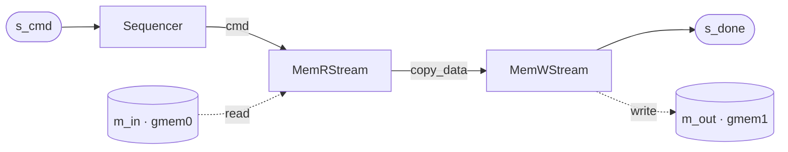

# Free-running composite in HLS

A composite is a [`FreeRunMod`](../flows/concurrent.md) with **sub-components instead of a body**. It
lowers to the same `composite_kernel` target as [a leaf](./freerunning.md) — the difference is only
that the graph has more than one node, so the generated top has more than one `hls::task` in it and
some channels between them.

Nothing new is extracted here. The children's bodies are their own artifacts; this page is about how
the **top** is derived from structure.

## The example

`mem_copy` — copy a run of words from one buffer to another. Three children:



The two labelled arrows in the middle are the **internal** edges — `cmd` and `copy_data`, both
declared with `add_if`. Everything touching the outside (the rounded stream ports, the two cylinders
that are the `m_axi` masters) is a **boundary** port, and the difference between the two categories
is nothing more than whether an endpoint was bound to an internal interface.

That distinction is the whole of what the top generator needs, and the Python declares only the graph
([`examples/mem_copy/mem_copy.py`](../../../examples/mem_copy/mem_copy.py)):

```python
self.seq     = Sequencer(name=..., mem_dwidth=w, clk=self.clk)
self.rstream = MemRStream(name=..., mem_dwidth=w, inband=True, clk=self.clk)
self.wstream = MemWStream(name=..., mem_dwidth=w, emit_done=True, inband=True, clk=self.clk)
for c in (self.seq, self.rstream, self.wstream):
    self.add_comp(c)                                  # insertion order == task emit order

self._cmd_if = StreamIF(name=..., bitwidth=w, framed=True)
self._cmd_if.bind("master", self.seq.cmd_out)
self._cmd_if.bind("slave",  self.rstream.s_cmd)
self.add_if(self._cmd_if)                             # an internal channel
# ... and the reader -> writer data edge
```

And the generated top:

```cpp
void mem_copy(
    hls::stream<ap_uint<64> >& s_cmd,
    const ap_uint<64>* m_in,
    ap_uint<64>* m_out,
    hls::stream<ap_uint<64> >& s_done
) {
#pragma HLS INTERFACE axis port=s_cmd
#pragma HLS INTERFACE m_axi port=m_in offset=slave bundle=gmem0 depth=8192
#pragma HLS stable variable=m_in
#pragma HLS INTERFACE m_axi port=m_out offset=slave bundle=gmem1 depth=8192
#pragma HLS INTERFACE axis port=s_done
#pragma HLS INTERFACE ap_ctrl_none port=return
    hls_thread_local hls::stream<streamutils::framed_word<64> > cmd;
    hls_thread_local hls::stream<streamutils::framed_word<64> > copy_data;
    hls_thread_local hls::task t0(mem_seq_framed_task<64>, s_cmd, cmd);
    hls_thread_local hls::task t1(mem_r_stream_framed_task<64>, cmd, m_in, copy_data);
    hls_thread_local hls::task t2(mem_w_stream_framed_done_task<64, 8>, copy_data, m_out, s_done);
}
```

Four things were derived. None of them was declared twice.

## 1. `add_if` became the channels

Each internal interface became one `hls_thread_local` declaration. The **kind** came from the
interface's type, not from a tag beside it:

| Python interface | C++ channel |
|---|---|
| `StreamIF(framed=True)` | `hls::stream<streamutils::framed_word<W> >` — a FIFO carrying packet boundaries |
| `StreamIF` | `hls::stream<ap_uint<W> >` — a plain word FIFO |
| `StreamOfBlocksIF` | `hls::stream_of_blocks<T[N], depth>` — a ping-pong block channel |

A FIFO's `depth` is a physical property of the `StreamIF`, single-sourced so the pysim queue and the
emitted pragma cannot disagree. A `StreamIF` with `depth=None` is *explicit unbounded* — fine for
pysim exploration, refused at the synthesis boundary, because an unbounded FIFO is not hardware.

**That holds for an internal channel, and only there.** A **boundary port** cannot carry a depth at
all: `#pragma HLS STREAM depth=` on a top-level argument is ignored by Vitis (`HLS 214-387`), which in
one pragma placement it does *silently* — identical RTL, no warning — leaving the port at the HLS
default of 2 while the Python says otherwise. `composite_top_spec` therefore **refuses** a non-default
depth on an interface bound to a boundary port, rather than emitting a number that will not be
honoured. See [the fidelity boundary](../rf/rfdc/fidelity.md#the-resolution-limit), where a declared
`depth=128` that was physically 2 is what a whole debugging session turned on.

## 2. `add_comp` became the tasks

One `hls::task` per child, in `add_comp` insertion order. Each child's `KernelTask` — derived, or [overridden](./freerunning_override.md) when the body is
hand-written — gave the generator an argument order, and it resolved those endpoint names to concrete
call arguments — each one either a boundary port or one of the
channels above.

That resolution is the whole trick. `mem_r_stream_framed_task<64>` is called with `cmd, m_in,
copy_data`: its first argument resolved to an internal channel, its second to a top-level port, its
third to another internal channel — decided by *which interfaces the endpoints were bound to*, not by
anything the child said about itself. The same `MemRStream` drops into a different graph and gets
different arguments.

## 3. The boundary was what was left over

A composite declares only the **names** of its boundary ports:

```python
self.boundary = ["s_cmd", "m_in", "m_out", "s_done"]
```

The endpoints and their order are derived: **a child endpoint not bound to one of the composite's
internal interfaces *is* a boundary port**. Only names need declaring because local names collide —
two children may each call their AXI port `m_mem`.

Direction then comes from the endpoint's *type*. `MMIFReadMaster` became `const ap_uint<64>*`;
`MMIFWriteMaster` became a non-const pointer. A bare `MMIFMaster` is **refused** rather than
defaulted: a read+write `m_axi` is legal hardware, but guessing a direction would emit a `const`
pointer for a port that gets written.

## 4. The m_axi pragmas came from assembler policy

`bundle=gmem0` and `bundle=gmem1` are not in the Python. Bundle assignment is the *assembler's*
policy — how the ports are grouped onto AXI interfaces — kept separate from direction, which is the
endpoint's type. `offset=slave` means the pointer's base address is not a port; it arrives in an
AXI-Lite register the host writes.

Note this top carries `m_axi` **and** is `ap_ctrl_none`. That combination is fine at the top level;
the constraint that bites is one level down, in the [task bodies](./freerunning.md).

## Which task may own what

The children are not interchangeable, and the split is **structural, not stylistic**:

- a task that owns an `m_axi` master should touch streams and tokens only
- a task that holds stream-of-blocks locks should not also own `m_axi`

The interleaver follows exactly this: `il_mem_r` / `il_mem_w` own the `m_axi`, while `il_load` /
`il_compute` / `il_store` own the lock-scoped block work. Mixing the two ownerships in one task is
what the rule exists to prevent.

**Multi-master arbitration is deliberately not implemented.** The generator uses fixed ownership
boundaries — one read owner, one write owner — and explicit wiring, rather than an arbitration policy.
A design needing two masters on one resource has to say so structurally.

## When the composite is not the whole design: the wrapper

Everything above assumes the generated kernel *is* the design. It stops being true the moment a
composite carries an on-chip memory shared by two of its tasks, because
[that memory cannot live inside the kernel](../interface/primitive/bram.md). It is registered with
`add_rtl_mod` instead of `add_comp`, realized as hand-written Verilog, and joined to the tasks by a
generated **wrapper**:

```
bram_access_top.v     the WRAPPER — instantiates the kernel + the memory, and joins them
  bram_access.v       the generated kernel (csynth's own name, kept)
  bram_t2p.v          the hand-written memory
```

Three consequences worth having in mind before you build one:

**The wrapper is the design scope.** From outside it looks like a kernel with only its AXI-Stream
ports — the memory is internal and invisible to any testbench. That is what makes it the first
boundary a resource estimate can be *defined* against.

**`csynth` does not count what is outside the kernel.** The synthesis report for `bram_access`
reports **`BRAM_18K = 0`** while the memory beside it is four RAMB18s, because the memory is not in
it. That is not a rounding error in an estimate; it
is a whole category missing, and it is half the reason to have a wrapper. A structural block can
declare its own footprint instead (`T2pBram` derives BRAM from depth × width by geometry); a logic
block cannot, and needs a run.

**The elaborated top changes, and only that.** The `.f` file list, the `xelab` top and the shared
library are named for the wrapper; the csynth project, its report and its generated Verilog keep the
kernel's name. One artifact keeps the name it has; the new one is visibly the outer layer. Nothing
about the BFM library changes — the testbench still sees only AXI-Stream, because that is genuinely
all the elaborated design exposes.

## The trap worth knowing before you build one

A stage that consumes a job and emits nothing does **not**, on its own, deadlock anything. The stage
downstream simply blocks on an empty stream and idles, which is back-pressure working as intended. A
design where some jobs legitimately produce no output is fine.

It becomes a deadlock when something in the system does **per-job accounting**:

- **a completion token** the testbench counts — N jobs in, N−1 done tokens out, and the run hangs at
  the end waiting for one that is never coming;
- **anything flowing backwards** — a returned buffer index, a free-slot credit, a recycled block. A
  skipped job never returns its credit, and after `depth` skips the *upstream* stage blocks. This one
  is a true deadlock rather than an idle;
- **a second input that must stay in lockstep** — consume the descriptor but not the block on a skip,
  and every later job pairs the wrong two.

The insidious version is when the imbalance is **data-dependent**: conditionally *acquiring* a
stream-of-blocks lock, rather than conditionally forwarding after one. Produce and consume counts then
depend on the data, so it passes C-simulation on one vector and hangs in RTL on another.

The fix, when you need one, is to emit *something* every job — the payload when it passes, a
one-word "skipped" marker when it does not. The count becomes invariant and every accounting scheme
downstream keeps working. This framework has needed it twice: an un-paced pipeline deadlocking at
`done = N+1`, and a relay that read when it had been handed zero bursts to forward (fixed with an
`if (nfwd > 0)` guard).

## See also

- [Free-running kernel in HLS](./freerunning.md) — the 1-task case, and the task body itself.
- [Writing it in Python](../flows/concurrent_python.md) — declaring the graph.
- [XSI testbench](./xsi_tb.md) — how a composite top is verified at RTL.
- [Streaming Memory Kernels](../memory/memstream.md) — the `MemRStream` / `MemWStream` children used
  here.
