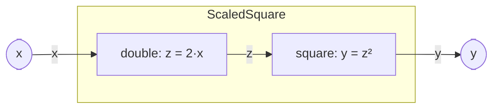

# Composite components

## What it is

A [`CompositeComp`](../../../waveflow/hw/hw_composite.py) builds a **larger block out of smaller ones**.
It has **no body of its own** — no `run_proc`, no `run_iter`; its **sub-components do the work**, each
running as its own concurrent process. You build one in `__post_init__` with two methods:

- **`add_comp(child)`** — register a sub-component (a `HwComponent`; usually a [free-running
  leaf](./freerun.md)).
- **`add_if(iface)`** — wire an internal **edge** between two children by binding one child's *master*
  endpoint and another's *slave* endpoint to a shared [interface](../interface/).

Its C++ is the **composite top** — one `hls::task` per child plus one channel per internal edge, derived
from the graph (not from an extracted body).

## Example — `(2·x)²` in two stages

Two [free-running](./freerun.md) leaves in a line — a doubler feeding a squarer. `x` and `y` are the
composite's boundary ports; `z` is the internal edge:



Each leaf takes **one value per firing** (`get(Float32, count=1)` — a 1-element `DataArray`, so the
edge is a plain FIFO), and its compute is a `@synthesizable` pure function using the array operators:

```python
@dataclass
class Double(FreeRunComp):
    def __post_init__(self) -> None:
        super().__post_init__()
        self.x = StreamIFSlave( name=f"{self.name}_x", sim=self.sim, bitwidth=32, has_tlast=False)
        self.z = StreamIFMaster(name=f"{self.name}_z", sim=self.sim, bitwidth=32, has_tlast=False)
        self.add_endpoint(self.x); self.add_endpoint(self.z)

    def run_iter(self) -> ProcessGen[None]:
        x = yield from self.x.get(Float32, count=1)
        yield from self.z.write(self.dbl(x))

    @synthesizable
    def dbl(self, x): return x + x            # z = 2·x


@dataclass
class Square(FreeRunComp):
    def __post_init__(self) -> None:
        super().__post_init__()
        self.z = StreamIFSlave( name=f"{self.name}_z", sim=self.sim, bitwidth=32, has_tlast=False)
        self.y = StreamIFMaster(name=f"{self.name}_y", sim=self.sim, bitwidth=32, has_tlast=False)
        self.add_endpoint(self.z); self.add_endpoint(self.y)

    def run_iter(self) -> ProcessGen[None]:
        z = yield from self.z.get(Float32, count=1)
        yield from self.y.write(self.sq(z))

    @synthesizable
    def sq(self, z): return z * z             # y = z²
```

The composite just wires them — it declares **no behavior of its own**:

```python
@dataclass
class ScaledSquare(CompositeComp):
    def __post_init__(self) -> None:
        super().__post_init__()
        # 1. sub-components — each runs its own run_iter loop concurrently
        self.double = Double(name=f"{self.name}_double", sim=self.sim)
        self.square = Square(name=f"{self.name}_square", sim=self.sim)
        self.add_comp(self.double)
        self.add_comp(self.square)

        # 2. internal edge — double.z (master) -> square.z (slave)
        z_if = StreamIF(name=f"{self.name}_z", sim=self.sim, bitwidth=32)
        z_if.bind("master", self.double.z)
        z_if.bind("slave", self.square.z)
        self.add_if(z_if)

        # 3. boundary — the composite's ports ARE its children's endpoints
        self.x = self.double.x     # composite input  = doubler's input
        self.y = self.square.y     # composite output = squarer's output
```

Three things to notice:

- **No parent body.** `ScaledSquare` has no `run_proc`/`run_iter` — `double` and `square` each run as an
  independent process, and defining `run_iter` on a composite is rejected at class-definition time.
- **The edge is a real channel** with backpressure: if `square` falls behind, `double` blocks on
  `write`, and the two stages **overlap**.
- **Boundary ports alias, they don't copy.** `self.x = self.double.x` makes the composite's input *the
  very same endpoint* as the child's — the hierarchy adds no runtime hop.

> **Scalar keeps the edge simple.** Passing one value per beat makes each internal edge a plain FIFO.
> Passing a *block* per beat between stages needs a stream-of-blocks interface (`SOBIF`) — that, along
> with longer pipelines and multi-input stages, is the [Concurrency](../concurrency/) section.

## Going deeper

This page is the *shape* of a composite. The deep concurrent semantics — overlap, longer load-compute-store
pipelines, stages with several inputs — are the [Concurrency](../concurrency/) section; how the composite
top is generated and verified is the [realization flows](../flows/).
