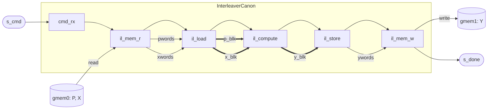

# Load-Compute-Store Network

## Overview

A **load-compute-store (LCS)** network is one of the most common accelerator patterns: read a block of
data from memory, compute on it, and write the result back. Almost any "fetch data, process it, store
it" accelerator has this shape, and structuring it as concurrent stages lets the loads, computes, and
stores of successive blocks **overlap** — so a memory-bound accelerator keeps the bus busy while the
datapath works. The three stages:

- **Load** — read the input block(s) from memory into on-chip buffers.
- **Compute** — transform the resident block(s) into the output block(s).
- **Store** — write the output block back to memory.

An LCS accelerator is driven by a **command** and reports a **response**: read a command descriptor (the
source address(es) of the input and the destination address of the output), load the data, compute the
outputs, store them to the destination, and emit a **response** on an output stream signaling completion.

## Interleaver example

We'll make this concrete with a simple **interleaver** — a gather that permutes a vector:

```
Y[i] = X[P[i]],   i = 0, …, n-1
```

For each output `i` it reads the source `X` at the index `P[i]`. `P` is an index (permutation) array,
`X` the source data, `Y` the output.

It is a good LCS example because the gather addresses `X` at an **arbitrary** index `P[i]`, so `X`
cannot be streamed — it must be **resident and randomly addressable**, i.e. a
[stream-of-blocks](./sob.md). Both `P` and `X` must be fully loaded before the compute can gather.

- **Command** (`InterleaverCmd`): `{p_off, x_off, y_off, n}` — the word offsets of the `P`, `X`, `Y`
  buffers and the element count.
- **Response**: a completion token on `s_done`, emitted *after* `Y` is written (commit-timed).

## Topology

The three logical stages become **six physical tiles**, and the reason is the memory constraint from
[Memory wrappers](./mem_wrap.md): a tile that owns an `m_axi` port cannot also hold a stream-of-blocks
lock. So each memory-touching stage splits into a memory adapter and a block stage:

| Logical stage | Tiles |
|---|---|
| *(command)* | `cmd_rx` — receive the `InterleaverCmd`, emit the per-job token |
| **Load** | `il_mem_r` — read `P`, `X` from `gmem0` → word streams · `il_load` — fill the `p_blk`, `x_blk` SOBs |
| **Compute** | `il_compute` — gather `Y[i] = X[P[i]]` into `y_blk` |
| **Store** | `il_store` — drain `y_blk` → word stream · `il_mem_w` — write `Y` to `gmem1`, emit `s_done` |

Chained: `cmd_rx → il_mem_r → il_load → il_compute → il_store → il_mem_w → s_done`, with 3 data streams
(`pwords`, `xwords`, `ywords`), 3 SOB block channels (`p_blk`, `x_blk`, `y_blk`), and 2 `m_axi` bundles
(`gmem0` read, `gmem1` write).



The horizontal chain is the forwarded per-job **token** (below); the labeled thin arrows are data
streams; the thick arrows are the SOB block channels. Notice the shape: `il_mem_r` / `il_mem_w` are the
[memory wrappers](./mem_wrap.md), and `il_load` / `il_compute` / `il_store` are the [block](./sob.md)
stages — this page is simply where those two pieces compose into a whole accelerator.

(The load/store tiles here are **bespoke** — `il_mem_r` reads *two* buffers and forwards the token —
but they follow the same wrapper pattern; the reusable single-buffer `MemRStream` / `MemWStream` are the
degenerate case of it.)

## Message forwarding

The tiles are **free-running** (`ap_ctrl_none`) — none is "started"; they all loop forever. Left
unbounded, they race ahead of one another and the pipeline fills until it deadlocks (the `nj=8` class,
`done == #tasks + 1`). The fix is a **forwarded token**: `cmd_rx` emits one token per job, and *every*
stage — each a [`FreeRunComp`](../../flows/components.md) — reads it on `cmd_in` and passes it on
`cmd_out` **before** doing its own work. That work is one firing of `run_iter`; the base loops it:

```python
def run_iter(self):
    cmd = yield from self.cmd_in.get(InterleaverCmd)   # wait my turn
    yield from self.cmd_out.write(cmd)                 # release the next stage
    ...                                                # then do this stage's work
```

That paces each tile to **one job in flight** — a stage cannot start job *n+1* until it has passed job
*n*'s token on. `il_mem_w` emits the token on `s_done` *after* the write burst, which doubles as the
commit-timed **response**.

## Implementation

The compute tile is the interesting one: inside the token forward, it acquires both input blocks and the
output block, gathers, then releases — the [SOB](./sob.md) acquire / commit / release contract at work:

```python
@dataclass
class IlCompute(FreeRunComp):
    def run_iter(self):
        cmd = yield from self.cmd_in.get(InterleaverCmd)
        yield from self.cmd_out.write(cmd)             # forward the token

        p = yield from self.p_blk.acquire_read()       # both inputs resident
        x = yield from self.x_blk.acquire_read()
        y = yield from self.y_blk.acquire_write()
        for i in range(n):
            y[i] = x[p[i]]                             # the gather (functional shape)
        yield from self.p_blk.release_read()
        yield from self.x_blk.release_read()
        yield from self.y_blk.commit_write(y)          # hand the output block on
```

(The real `il_compute` is **word-granular** — `p_blk` / `x_blk` hold packed words and the gather unpacks
lanes — so the loop body is bit-shift arithmetic, not `x[p[i]]`. That is a functional detail; the shape
above is the golden. Full source: [`interleaver.py`](../../../../examples/interleaver/interleaver.py).)

The composite instantiates the six tiles and wires them — `StreamIF` for the token and data edges,
`StreamOfBlocksIF` for the three block edges — then exposes `s_cmd` / `m_in` / `m_out` / `s_done` as its
boundary. It is the same `add_comp` / `add_if` pattern from [Sub-components](./subcomponent.md), at
scale:

```python
class InterleaverCanon(HwComponent):
    def __post_init__(self):
        super().__post_init__()
        # 1. the six tiles
        self.rx, self.memr, self.load = CmdRx(...), IlMemR(...), IlLoad(...)
        self.compute, self.store, self.memw = IlCompute(...), IlStore(...), IlMemW(...)
        for c in (self.rx, self.memr, self.load, self.compute, self.store, self.memw):
            self.add_comp(c)

        # 2. edges — StreamIF for token + data, StreamOfBlocksIF for blocks
        self._stream(self.rx.cmd_out,  self.memr.cmd_in)     # token hop 1 (…of 5)
        self._stream(self.memr.pwords, self.load.pwords)     # data
        self._sob(self.load.p_blk,     self.compute.p_blk)   # block (…of 3)
        #   … the other 4 token hops, xwords / ywords, x_blk / y_blk …

        # 3. boundary
        self.s_cmd, self.m_in  = self.rx.s_cmd,   self.memr.m_mem
        self.m_out, self.s_done = self.memw.m_mem, self.memw.s_done
```

## Performance

The generated canonical interleaver runs at a steady-state **~414 cycles/job**. (The 295 cycles/job
figure is the earlier hand-written `sob3` reference; strict per-job token forwarding trades some
load/compute overlap for the deadlock-robustness above, which is the difference.) The timing model that
predicts this is [Timing contract](./timing.md).

## See also

- [`examples/interleaver/interleaver.py`](../../../../examples/interleaver/interleaver.py) — the full six-tile source.
- [Memory wrappers](./mem_wrap.md) and [SOB pattern](./sob.md) — the two pieces this page composes.
- [Custom Hooks: Dataflow](../../custom_hooks/dataflow.md) — the single-kernel `#pragma HLS DATAFLOW` realization of LCS.
