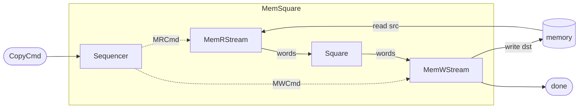

# Memory Wrappers

## Overview

Components often need access to memory. In the Python simulation nothing stops a sub-component from
holding a memory interface directly — but the generated hardware is a free-running `hls::task` network,
and there a single task **cannot** both drive an `m_axi` memory burst *and* hold a `stream_of_blocks`
lock: the two together deadlock in RTL (and free-running tasks carry stream-only interface contracts to
begin with). The full constraint lives in the [HLS section](../hls/synth_types.md).

So in WaveFlow, **memory access is factored out into dedicated adapter components** that own the memory
port and expose only *streams*. Every other stage — including [SOB](./sob.md) stages — then sees memory
as an ordinary stream. WaveFlow provides two such wrappers:

- **`MemRStream`** — the memory **read** owner: on command, bursts a region of memory out as a word stream.
- **`MemWStream`** — the memory **write** owner: on command, drains a word stream into a region of memory.

Each takes a read/write *transaction request* on a command stream, interacts with memory, and streams
the data out of or into it — nothing else touches the `m_axi` port.

## `MemRStream`

| Endpoint | Kind | Role |
|---|---|---|
| `m_mem` | `MMIFMaster` (read) | the `m_axi` memory port it owns |
| `s_cmd` | `StreamIFSlave[MRCmd]` | the read-request command stream |
| `m_out` | `StreamIFMaster` | the words read out of memory |

The command is an `MRCmd` — **element/word coordinates**, not byte addresses:

```python
class MRCmd(DataList):
    elements = {
        "word_index": {"schema": Word32},   # word offset within the bound buffer
        "n_words":    {"schema": Word32},    # number of packed words to read
    }
```

**Operation:** dequeue an `MRCmd`, read the run `[word_index, word_index + n_words)` off `m_mem`, and
burst those words out on `m_out`. (The read and the output overlap, so a burst costs ~`n_words`, not
`2·n_words` — the timing detail is [Timing contract](./timing.md).)

## `MemWStream`

The mirror. It owns a **write** `m_mem`, takes an `MWCmd` (same `{word_index, n_words}` shape) on
`s_cmd`, drains `n_words` off an input stream `s_in`, and writes them to memory. With `emit_done=True`
it also exposes an `s_done` stream and emits one completion token per command — handy as the "job
finished" signal for a sequencer or host.

| Endpoint | Kind | Role |
|---|---|---|
| `m_mem` | `MMIFMaster` (write) | the `m_axi` memory port it owns |
| `s_cmd` | `StreamIFSlave[MWCmd]` | the write-request command stream |
| `s_in` | `StreamIFSlave` | the words to write |
| `s_done` | `StreamIFMaster` *(optional)* | one completion token per command |

## A simple memory copy example

The wrappers turn "touch memory" into "read a stream / write a stream," so a memory-to-memory operation
is just a pipeline between them. Here is a copy that **squares each sample** on the way through — read
`src`, square, write `dst`:

```python
Word32 = IntField.specialize(bitwidth=32, signed=False)
Float32 = FloatField.specialize(bitwidth=32)


class CopyCmd(DataList):
    """App command: copy n_words from src_off to dst_off (all word coordinates)."""
    elements = {
        "src_off": {"schema": Word32},
        "dst_off": {"schema": Word32},
        "n_words": {"schema": Word32},
    }


@dataclass
class Sequencer(HwComponent):
    """Turn one CopyCmd into an MRCmd (read src) and an MWCmd (write dst)."""
    clk: Clock = field(default_factory=lambda: Clock(freq=100e6))

    def __post_init__(self) -> None:
        super().__post_init__()
        self.s_cmd = StreamIFSlave(name=f"{self.name}_s_cmd", sim=self.sim, bitwidth=32, has_tlast=False)
        self.mr_cmd = StreamIFMaster(name=f"{self.name}_mr_cmd", sim=self.sim, bitwidth=32, has_tlast=False)
        self.mw_cmd = StreamIFMaster(name=f"{self.name}_mw_cmd", sim=self.sim, bitwidth=32, has_tlast=False)
        for ep in (self.s_cmd, self.mr_cmd, self.mw_cmd):
            self.add_endpoint(ep)

    def run_proc(self) -> ProcessGen[None]:
        while True:
            cmd = yield from self.s_cmd.get(CopyCmd)
            n = int(cmd.n_words)
            yield from self.mr_cmd.write(MRCmd(word_index=int(cmd.src_off), n_words=n))
            yield from self.mw_cmd.write(MWCmd(word_index=int(cmd.dst_off), n_words=n))


@dataclass
class Square(HwComponent):
    """Element-wise y = x**2 over a Float32 word stream (WORD_BW = 32 ⇒ one sample per word)."""
    clk: Clock = field(default_factory=lambda: Clock(freq=100e6))

    def __post_init__(self) -> None:
        super().__post_init__()
        self.s_in = StreamIFSlave(name=f"{self.name}_s_in", sim=self.sim, bitwidth=32, has_tlast=False)
        self.m_out = StreamIFMaster(name=f"{self.name}_m_out", sim=self.sim, bitwidth=32, has_tlast=False)
        for ep in (self.s_in, self.m_out):
            self.add_endpoint(ep)

    def run_proc(self) -> ProcessGen[None]:
        while True:
            x = yield from self.s_in.get(Float32, count=1)      # one sample
            yield from self.m_out.write(array(Float32, x.val ** 2))
```

The composite wires `Sequencer → MemRStream → Square → MemWStream` — two command edges and two data
edges — and exposes the memory ports as its boundary:

```python
@dataclass
class MemSquare(HwComponent):
    """Read src → square each sample → write dst."""
    clk: Clock = field(default_factory=lambda: Clock(freq=100e6))

    def __post_init__(self) -> None:
        super().__post_init__()

        self.seq = Sequencer(name=f"{self.name}_seq", sim=self.sim, clk=self.clk)
        self.rstream = MemRStream(name=f"{self.name}_r", sim=self.sim, mem_dwidth=32, clk=self.clk)
        self.square = Square(name=f"{self.name}_sq", sim=self.sim, clk=self.clk)
        self.wstream = MemWStream(name=f"{self.name}_w", sim=self.sim, mem_dwidth=32,
                                  emit_done=True, clk=self.clk)
        for c in (self.seq, self.rstream, self.square, self.wstream):
            self.add_comp(c)

        def edge(tag, master, slave):
            e = StreamIF(name=f"{self.name}_{tag}", sim=self.sim, clk=self.clk, bitwidth=32)
            e.bind("master", master)
            e.bind("slave", slave)
            self.add_if(e)

        edge("mr_cmd", self.seq.mr_cmd, self.rstream.s_cmd)     # read-request command
        edge("mw_cmd", self.seq.mw_cmd, self.wstream.s_cmd)     # write-request command
        edge("rdata", self.rstream.m_out, self.square.s_in)     # src words → Square
        edge("wdata", self.square.m_out, self.wstream.s_in)     # squared words → write

        # boundary: the composite's memory ports are the wrappers' m_axi masters
        self.s_cmd = self.seq.s_cmd
        self.m_in = self.rstream.m_mem
        self.m_out = self.wstream.m_mem
        self.s_done = self.wstream.s_done
```



Dotted arrows are the command streams; solid arrows are data. Only `MemRStream` and `MemWStream` touch
memory — everything between them is pure stream.

**This is the simplest use of the wrappers.** The compute here is **element-wise** (`Square` transforms
one sample at a time), so it needs no resident buffer and no [stream-of-blocks](./sob.md). When a
compute must see a *whole block* before it can start — and you want the memory read, the compute, and
the memory write to **overlap** — you combine these wrappers with an SOB stage. That is the
**load-compute-store** pattern, [next](./lcs.md).
