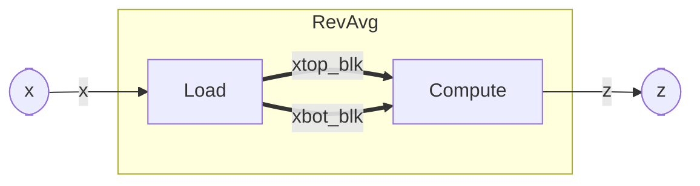

# Stream of Blocks

The [previous page](./subcomponent.md) passed **scalars** between sub-components over ordinary streams.
Often, though, a stage must operate on a whole **block** of data — a vector — and **cannot begin until
the entire block has arrived**. Hardware handles this with a **ping-pong buffer**; WaveFlow models it as
a **stream of blocks (SOB)**.

## Toy example: reverse-add

Consider a block `RevAvg` that reads `2N` samples `x[0], …, x[2N-1]` and produces `N` outputs:

```python
z[i] = x[i] + x[2N-1-i],   i = 0, …, N-1
```

Each output pairs an element from the front with one from the back. The important consequence:

> `z[0] = x[0] + x[2N-1]` needs the **last** input to produce the **first** output.

So you *cannot* stream this — the first result waits on the last sample. The whole block must be
**resident** before compute starts. That is precisely what a stream of blocks is for.

Splitting `x` into a top and bottom half (`xtop = x[0…N-1]`, `xbot = x[N…2N-1]`) makes the math a single
vector expression, `z = xtop + flip(xbot)`, and the design two sub-components:

- **`Load`** — reads the word stream `x` into two resident half-blocks, `xtop_blk` and `xbot_blk`.
- **`Compute`** — takes both full blocks, computes the reverse-add, and streams `z` out.



The thick arrows are the two SOB block channels; the thin `x` / `z` arrows are ordinary streams
crossing the composite boundary.

## What is a stream of blocks?

A **SOB** (`StreamOfBlocksIF`) hands over a **whole block** at a time, where a stream hands over one
element at a time. The producer fills a block and releases it; the consumer takes the entire block and
may **access it in any order** (here, front and back at once).

It is realized as a **ping-pong buffer** — *two* physical buffers behind the channel:

- the producer fills buffer **A**, then releases it;
- the consumer reads buffer **A** while the producer fills buffer **B**;
- the two swap each block.

That depth-2 double-buffering is the whole point (below). You never build it by hand: you declare a
`SobIFMaster` (producer side), a `SobIFSlave` (consumer side), and a `StreamOfBlocksIF` edge between
them, and WaveFlow generates the two buffers, the swap, and the handshake. In Vitis it lowers to
`hls::stream_of_blocks<T[N], 2>`.  The details of the SOB interface, including the control signaling, can be found on the [SOB interface page](../../interface/sob.md).

## Why parallel, not sequential?

Run `Load` and `Compute` **sequentially** and each sits idle half the time: load a block, *then* compute
it, *then* load the next. Per block the cost is `load + compute`.

The depth-2 ping-pong lets them **overlap**: while `Compute` works on block *n* (buffer A), `Load` is
already filling block *n+1* (buffer B). In steady state the throughput is `max(load, compute)` per
block, not the sum — roughly **2× for balanced stages**.

The hand-off itself costs almost nothing — it is a buffer swap, not a data copy. The time lives in
*filling* and *consuming* the blocks, and the second buffer is exactly what lets the producer run one
block ahead of the consumer. (The precise timing model is [Timing contract](./timing.md).)

## Implementation

The guiding convention: **the Python model is the functional golden with interfaces that match the
hardware.** The stream and the blocks are `WORD_BW`-wide **words** — the same granularity the kernel
uses — and `Compute` unpacks a whole word block into a typed vector with
[`read_array`](../../schema/), then does plain NumPy. (The generated kernel reads individual elements
with `elem_read`; the golden does not need to — that is a synthesis concern, see
[Concurrency (HLS) — SOB](../hls/sob.md).)

```python
from dataclasses import dataclass, field

import numpy as np

from waveflow.hw.arrayutils import array, read_array
from waveflow.hw.clock import Clock
from waveflow.hw.dataschema import DataArray, FloatField
from waveflow.hw.hw_component import HwComponent
from waveflow.hw.interface import (SobIFMaster, SobIFSlave, StreamIFMaster,
                                   StreamIFSlave, StreamOfBlocksIF)
from waveflow.simulation.simobj import ProcessGen

N = 4                 # half-vector length
WORD_BW = 64          # stream / block word width (LW = WORD_BW // 32 = 2 samples per word)

Float32 = FloatField.specialize(bitwidth=32)


class HalfVec(DataArray):
    """The typed logical half-vector: N Float32 samples."""
    element_type = Float32
    max_shape = (N,)


NWORDS = HalfVec.nwords_per_inst(WORD_BW)   # packed words per half-block


@dataclass
class Load(HwComponent):
    """Move the word stream x into two resident half-blocks — no unpacking, just words."""
    clk: Clock = field(default_factory=lambda: Clock(freq=100e6))

    def __post_init__(self) -> None:
        super().__post_init__()
        self.x = StreamIFSlave(name=f"{self.name}_x", sim=self.sim, bitwidth=WORD_BW, has_tlast=False)
        self.xtop_blk = SobIFMaster(name=f"{self.name}_xtop", sim=self.sim, bitwidth=WORD_BW, block_n=NWORDS)
        self.xbot_blk = SobIFMaster(name=f"{self.name}_xbot", sim=self.sim, bitwidth=WORD_BW, block_n=NWORDS)
        for ep in (self.x, self.xtop_blk, self.xbot_blk):
            self.add_endpoint(ep)

    def run_proc(self) -> ProcessGen[None]:
        while True:
            top = yield from self.xtop_blk.acquire_write()      # a fresh word buffer
            top[:] = yield from self.x.get(nwords_max=NWORDS)    # first N samples (as words)
            yield from self.xtop_blk.commit_write(top)
            bot = yield from self.xbot_blk.acquire_write()
            bot[:] = yield from self.x.get(nwords_max=NWORDS)    # next N samples
            yield from self.xbot_blk.commit_write(bot)


@dataclass
class Compute(HwComponent):
    """z[i] = x[i] + x[2N-1-i] = (xtop + flip(xbot))[i]."""
    clk: Clock = field(default_factory=lambda: Clock(freq=100e6))

    def __post_init__(self) -> None:
        super().__post_init__()
        self.xtop_blk = SobIFSlave(name=f"{self.name}_xtop", sim=self.sim, bitwidth=WORD_BW, block_n=NWORDS)
        self.xbot_blk = SobIFSlave(name=f"{self.name}_xbot", sim=self.sim, bitwidth=WORD_BW, block_n=NWORDS)
        self.z = StreamIFMaster(name=f"{self.name}_z", sim=self.sim, bitwidth=WORD_BW, has_tlast=False)
        for ep in (self.xtop_blk, self.xbot_blk, self.z):
            self.add_endpoint(ep)

    def run_proc(self) -> ProcessGen[None]:
        while True:
            top = yield from self.xtop_blk.acquire_read()
            bot = yield from self.xbot_blk.acquire_read()
            xtop = read_array(top, elem_type=Float32, word_bw=WORD_BW, shape=N)   # unpack whole block
            xbot = read_array(bot, elem_type=Float32, word_bw=WORD_BW, shape=N)
            z = xtop.val + np.flipud(xbot.val)                  # plain NumPy over the typed vectors
            yield from self.z.write(array(Float32, z))          # pack back to WORD_BW words
            yield from self.xtop_blk.release_read()
            yield from self.xbot_blk.release_read()
```

The composite wires them with **two SOB edges** (`Load` is the master/producer, `Compute` the
slave/consumer) and exposes `x` / `z` as its boundary:

```python
@dataclass
class RevAvg(HwComponent):
    """Composite: z[i] = x[i] + x[2N-1-i], via a Load → SOB → Compute pipeline."""
    clk: Clock = field(default_factory=lambda: Clock(freq=100e6))

    def __post_init__(self) -> None:
        super().__post_init__()

        # 1. sub-components — each runs concurrently
        self.load = Load(name=f"{self.name}_load", sim=self.sim, clk=self.clk)
        self.compute = Compute(name=f"{self.name}_compute", sim=self.sim, clk=self.clk)
        self.add_comp(self.load)
        self.add_comp(self.compute)

        # 2. two block edges (each a depth-2 ping-pong), Load (master) → Compute (slave)
        for tag, master, slave in (
            ("xtop", self.load.xtop_blk, self.compute.xtop_blk),
            ("xbot", self.load.xbot_blk, self.compute.xbot_blk),
        ):
            blk = StreamOfBlocksIF(name=f"{self.name}_{tag}_if", sim=self.sim, clk=self.clk,
                                   bitwidth=WORD_BW, block_n=NWORDS)
            blk.bind("master", master)
            blk.bind("slave", slave)
            self.add_if(blk)

        # 3. boundary
        self.x = self.load.x       # composite input  = Load's input stream
        self.z = self.compute.z    # composite output = Compute's output stream
```

Things to notice:

- **`Load` is a type-agnostic word mover.** It never looks at the samples — it just copies words from
  the stream into the block. All the float semantics live in `Compute`.  
- **`Compute` sees whole blocks.** `acquire_read` returns only after `Load` has committed a *full*
  block, so the reverse-add always has every sample it needs — the property that made this a SOB in the
  first place.
- **Two channels, two ping-pongs.** `xtop_blk` and `xbot_blk` are independent SOB edges, each
  double-buffered, so `Load` can run a block ahead on both.
- **No parent `run_proc`.** `RevAvg` is structural — its behavior is `Load` and `Compute` running
  concurrently, joined by the two block channels.

## Boundaries

This page is the **modeling pattern**. The interface mechanics (the `acquire`/`commit`/`release`
contract, block granularity) are in [Stream-of-Blocks Interface](../../interface/sob.md), and the HLS
synthesis and performance implications — `hls::stream_of_blocks`, `elem_read`, the gather/scatter
throughput asymmetry — are in [Concurrency (HLS) — SOB](../hls/sob.md).
