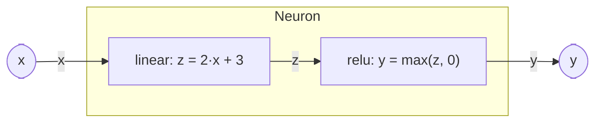

# Sub-components

Synthesizable composite systems in WaveFlow are defined **hierarchically**: a single top-level
`HwComponent` represents the overall composite, and it can hold **sub-components**. Each sub-component
is itself a `HwComponent` and may in turn hold its own sub-components — a tree of **parent** and
**child** components.

The top-level composite usually has **no `run_proc` of its own** — its behavior *is* its children
running concurrently. Two methods build the tree:

- **`add_comp(child)`** — register a sub-component. Each child's `run_proc` runs as its own concurrent
  process in the simulation.
- **`add_if(iface)`** — wire a dataflow **edge** between two children by binding one child's *master*
  endpoint and another's *slave* endpoint to a shared [interface](../../interface/) — here a
  [`StreamIF`](../../interface/stream.md).

A child keeps its own endpoint-ownership contract; the parent only *connects* endpoints, it never
reaches inside a child's behavior.

## Toy example: one neuron, `y = max(2·x + 3, 0)`

The composite `Neuron` holds two leaf stages wired in a line — an affine map (`linear`) feeding a ReLU
(`relu`). The `x` and `y` arrows are the composite's own boundary ports; `z` is the internal edge:



Each leaf is a trivial one-in / one-out stream stage. They **loop forever, one job per iteration**, so
they subclass [`FreeRunComp`](../../components/taxonomy.md) and implement **`run_iter`** — *one firing*
of the loop — rather than writing `run_proc` with a hand-rolled `while True`:

- it **declares** the component free-running (it lowers to a free-running `ap_ctrl_none` `hls::task`), so
  codegen never has to infer that from a `while` loop;
- `run_iter` maps **one-to-one** to the generated `hls::task` body — the runtime re-fires it each job, so
  the infinite loop lives in the base, not your code;
- its base [`SynthComp`](../../components/taxonomy.md) checks at construction that you actually
  implemented `run_iter`.

Keep any persistent state on `self` (it lowers to `static` locals); there is no "before the loop" in an
`hls::task`.

```python
from dataclasses import dataclass, field

import numpy as np

from waveflow.hw.arrayutils import array
from waveflow.hw.clock import Clock
from waveflow.hw.dataschema import FloatField
from waveflow.hw.hw_component import HwComponent
from waveflow.hw.hw_freerun import FreeRunComp
from waveflow.hw.interface import StreamIF, StreamIFMaster, StreamIFSlave
from waveflow.simulation.simobj import ProcessGen

Float32 = FloatField.specialize(bitwidth=32)


@dataclass
class Linear(FreeRunComp):
    """z = 2·x + 3, one value at a time off a Float32 stream."""
    clk: Clock = field(default_factory=lambda: Clock(freq=100e6))

    def __post_init__(self) -> None:
        super().__post_init__()
        self.x = StreamIFSlave(name=f"{self.name}_x", sim=self.sim, bitwidth=32, has_tlast=False)
        self.z = StreamIFMaster(name=f"{self.name}_z", sim=self.sim, bitwidth=32, has_tlast=False)
        for ep in (self.x, self.z):
            self.add_endpoint(ep)

    def run_iter(self) -> ProcessGen[None]:
        x = yield from self.x.get(Float32, count=1)          # a 1-element DataArray
        yield from self.z.write(array(Float32, 2.0 * x.val + 3.0))


@dataclass
class Relu(FreeRunComp):
    """y = max(z, 0)."""
    clk: Clock = field(default_factory=lambda: Clock(freq=100e6))

    def __post_init__(self) -> None:
        super().__post_init__()
        self.z = StreamIFSlave(name=f"{self.name}_z", sim=self.sim, bitwidth=32, has_tlast=False)
        self.y = StreamIFMaster(name=f"{self.name}_y", sim=self.sim, bitwidth=32, has_tlast=False)
        for ep in (self.z, self.y):
            self.add_endpoint(ep)

    def run_iter(self) -> ProcessGen[None]:
        z = yield from self.z.get(Float32, count=1)
        yield from self.y.write(array(Float32, np.maximum(z.val, 0.0)))
```

The composite wires them into the pipeline `x → linear → z → relu → y`:

```python
@dataclass
class Neuron(HwComponent):
    """Composite: y = max(2·x + 3, 0), computed by two concurrent sub-components."""
    clk: Clock = field(default_factory=lambda: Clock(freq=100e6))

    def __post_init__(self) -> None:
        super().__post_init__()

        # 1. sub-components — each runs its own run_iter loop concurrently
        self.linear = Linear(name=f"{self.name}_linear", sim=self.sim, clk=self.clk)
        self.relu = Relu(name=f"{self.name}_relu", sim=self.sim, clk=self.clk)
        self.add_comp(self.linear)
        self.add_comp(self.relu)

        # 2. internal edge — linear.z (master) → relu.z (slave)
        z_if = StreamIF(name=f"{self.name}_z_if", sim=self.sim, clk=self.clk, bitwidth=32)
        z_if.bind("master", self.linear.z)
        z_if.bind("slave", self.relu.z)
        self.add_if(z_if)

        # 3. boundary — the composite's ports ARE its children's endpoints
        self.x = self.linear.x     # composite input  = linear's input
        self.y = self.relu.y       # composite output = relu's output
```

Three things to notice:

- **No parent `run_proc`.** `Neuron` has no behavior of its own — `linear` and `relu` each run as an
  independent process, and the simulator advances them concurrently.
- **The edge is a real channel.** The internal `StreamIF` carries `z` from `linear` to `relu` with
  backpressure: if `relu` falls behind, `linear` blocks on `write`. The two stages **overlap** —
  `linear` can be computing the next value while `relu` consumes the last.
- **Boundary ports alias, they don't copy.** `self.x = self.linear.x` makes the composite's input *the
  very same endpoint* as the child's, so wiring `Neuron` from outside connects straight through to
  `linear` — the hierarchy adds no runtime hop.

## What this leaves out

This page is the **Python model** — the concurrent structure you simulate. It builds out three ways:

- **Longer pipelines and stages with more than one input** — a full load-compute-store graph, and stages
  that consume several streams at once — are [Load-compute-store](./lcs.md) and
  [Multi-input stages](./multiin.md).
- **Turning this tree into a synthesizable `hls::task` network** is the HLS side,
  [Composite codegen](../hls/codegen.md).
