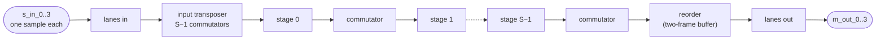

# The full-rate SSR FFT

`SsrFft` is a streaming FFT of length `L` taking `R = 4` complex samples a cycle -- the same
transform, the same bits and the same port group as [`VitisFft`](../vitis_l1/fft/index.md), at the
rate an SSR FFT is built for: **a new frame every `L/R` cycles**, indefinitely.

```python
from waveflow.dsp.ssr_fft.hw import SsrFft

fft = SsrFft(name="fft", sim=sim, L=1024, in_w=16, in_i=2)   # ports s_in_0..3, m_out_0..3
```

Measured in RTL (XSI, RFSoC 4x2 at 250 MHz, frames back to back, every frame bit-exact):

| L | `SsrFft` interval | `VitisFft` interval | DSP (both) | BRAM `SsrFft` / `VitisFft` |
|---|---|---|---|---|
| 16 | **4** | 41 | 12 | 5 / 0 |
| 64 | **16** | 120 | 24 | 0 / 0 |
| 256 | **64** | 480 | 36 | 14 / 28 |
| 1024 | **256** | 2556 | 48 | 50 / 40 |
| 4096 | **1024** | 10240 | 60 | 122 / 55 |

## Why not the vendor core

AMD's library computes exactly the right bits; what it does not do is move them at its own stated
rate (II = `L/R`). Its blocks are written as functions a dataflow region calls once per frame and
which must return: a commutator runs a fixed window -- the frame, then a drain -- the stage loops
refill their pipelines per sub-transform, the reorder fills and then empties. Each pays per frame what
the hardware should overlap with the next frame. [The Vitis FFT page](../vitis_l1/fft/index.md#why-vitisfft-is-far-below-the-architectures-rate)
has the measurements.

So `SsrFft` keeps the arithmetic -- the radix-4 butterfly, the twiddle rotation that truncates into
its first operand's format, the quarter-wave twiddle ROM, every per-stage width -- and replaces only
the data movement. Since the bits depend only on the per-sample arithmetic, the output is bit-exact
with the vendor library, and `waveflow.vitis_l1.fft` remains the reference.

## The pipeline

Every box is an `hls::task` whose body is a `while (1)` loop at II = 1, moving one **`RadixWord`** --
`R` complex samples, one per lane -- per cycle. Frames exist only as a counter, so frame `k+1` follows
frame `k` with no gap.



| block | count | what it is |
|---|---|---|
| input transposer | `S − 1` commutators | lines up each first-stage butterfly's four inputs on one word |
| stage | `S` | one butterfly per word; all but the last rotate by the twiddles |
| stage commutator | `S − 1` | regroups for the next stage's butterflies |
| reorder | a commutator + a frame buffer | the digit reversal into natural order |

**A commutator is an `R × R` block transpose**: cut the stream into groups of `R` slots of `D`
words, and slot `i` lane `j` moves to slot `j` lane `i`. In hardware it is two triangles of delay
lines and a rotating lane switch -- no memory addressing -- with latency `(R − 1)·D`; every
commutator in the FFT is this one body with a different `D`. In Python it is one fancy-index
(`model.commute`); a cycle-by-cycle model of the hardware (`cycle_ref`) is tested against it.

**The digit reversal is not a word permutation**: it puts a word's four lanes on the *same* lane of
four different words. It factors as a whole-frame commutator (`D = L/R²`) followed by a permutation of
whole words (keep the top base-`R` digit of the word index, reverse the rest) through a two-frame
buffer.

## The reorder buffer: two ways

`SsrFft(reorder=...)` builds the frame buffer either way, and both are bit-exact:

- **`"sob"`** (the default): an `hls::stream_of_blocks` between a writer task and a reader task. Its
  reader is a single-firing body, re-entered once a frame, and that costs **4 cycles a frame** in
  RTL: an interval of `L/R + 4` (20 at `L = 64`, 260 at 1024).
- **`"pingpong"`**: one task holding both halves, writing one at the permuted addresses while reading
  the other in order. This is the one that reaches `L/R`; the table above is measured with it.

## Two RTL traps

Both were found at RTL, not before: csim passed in both cases.

- **A blocking read at a `while (1)` head strands the end of a burst.** The stall-style pipeline
  freezes the iterations already in flight whenever the read waits, so the last words of the last
  frame sit in a stage's pipeline registers until more input comes -- 8 frames in, 5 out. Vitis refuses
  `style=flp` on these loops. Every loop head tests `empty()` instead and reads only when a word is
  there; writes stay blocking, which is the back-pressure.
- **A commutator must tick in whole groups.** Its switch is driven by the tick count, so a bubble
  inserted mid-group would put samples of two groups on the switch at once. At each group boundary it
  decides: data if a word is waiting, one bubble group if the last group was data (enough to push its
  tail out), otherwise idle.

## One source, three backends

| | the bits | the structure |
|---|---|---|
| Python model | `model.py`: `fft_general`'s arithmetic, per stage, on the wire order | `Geometry` |
| pysim | each child calls the model's function for its block | `SsrFft`, one child per task |
| C++ | `src/ssr_fft_tasks.h`, generic; formats, ROMs and wrappers generated by `hls.py` | the top, by `composite_top_spec` |

The composite pysim times each child **cut-through** -- output starts a fixed latency after the
frame's first word -- and lands within 5 cycles of the RTL's first frame at every length tested, with
the interval exact. The gates: `tests/dsp/ssr_fft/` (model, csim chain with `-m vitis`, XSI with
`-m xsi`). The plan, with every measurement: `plans/ssr_fft.md`.
